# SVIT - Perfected Notes

**Model**: agnes-2.5-flash
**Pages**: 193

======================================================================


== PERFECTED PAGE 1 / 193 ==

# LECTURE NOTES ON

## SOFTWARE ENGINEERING AND PROJECT MANAGEMENT (BCS501)

**Academic Year:** 2024 – 2025  
**Semester:** B.E V Semester

---

### Authors

- **Madhura N**, Assistant Professor
- **Sowmya H.N**, Assistant Professor

### Department of Computer Science & Engineering

**Sai Vidya Institute of Technology**  
Bengaluru - 560064

---

### Institutional Information

**Web:** [www.saividya.ac.in](https://www.saividya.ac.in)  
**Facebook:** [Sai Vidya Institute of Technology](https://www.facebook.com/SaiVidyaInstituteOfTechnology)

> SVIT is now ranked **3rd in Bangalore**, **6th in Karnataka** and **31st across India**.  
> *(Source: DATAQUEST-CMR 'Best T-School Survey Report March'2020)*

---

**Figure 1.1: SVIT 15th Anniversary Celebration Logo (2008-2023)**

*Celebrating 15 years of academic excellence*

---

**Figure 1.2: NAAC Accreditation Logo**

*Accredited with 'A' Grade by the National Assessment and Accreditation Council (NAAC)*

---

== END OF PAGE 1 ==

== PERFECTED PAGE 2 / 193 ==

# SOFTWARE ENGINEERING & PROJECT MANAGEMENT

| Field | Details |
|---|---|
| **Course Code** | BCS501 |
| **CIE Marks** | 50 |
| **Teaching Hours/Week (L:T:P:S)** | 4:0:0:0 |
| **SEE Marks** | 50 |
| **Total Hours of Pedagogy** | 52 |
| **Total Marks** | 100 |
| **Credits** | 04 |
| **Exam Hours** | 03 |

## Course Objectives

- Outline software engineering principles and activities involved in building large software programs. Identify ethical and professional issues and explain why they are of concern to Software Engineers.
- Describe the process of requirement gathering, requirement classification, requirement specification and requirements validation.
- Recognize the importance of Project Management with its methods and methodologies.
- Identify software quality parameters and quantify software using measurements and metrics. List software quality standards and outline the practices involved.

---

## MODULE - 1 — 10 Hours

### Software and Software Engineering
The nature of Software · The unique nature of WebApps · Software Engineering · The software Process · Software Engineering Practice · Software Myths

### Process Models
A generic process model · Process assessment and improvement · Prescriptive process models: Waterfall model, Incremental process models, Evolutionary process models, Concurrent models, Specialized process models · Unified Process · Personal and Team process models

> **Textbook 1:** Chapter 1: 1.1 to 1.6, Chapter 2: 2.1 to 2.5

---

## MODULE - 2 — 12 Hours

### Understanding Requirements
Requirements Engineering · Establishing the ground work · Eliciting Requirements · Developing use cases · Building the requirements model · Negotiating Requirements · Validating Requirements

### Requirements Modeling Scenarios
Information and Analysis classes · Requirement Analysis · Scenario based modeling · UML models that supplement the Use Case · Data modeling Concepts · Class-Based Modeling

### Requirement Modeling Strategies
Flow oriented Modeling · Behavioral Modeling

> **Textbook 1:** Chapter 5: 5.1 to 5.7, Chapter 6: 6.1 to 6.5, Chapter 7: 7.1 to 7.3

---

## Figure 2.1: Generic Software Process Model

```
┌─────────────────────────────────────────────────────────────────┐
│                    GENERIC SOFTWARE PROCESS MODEL                │
├─────────────┬─────────────┬─────────────┬───────────────────────┤
│   COMMUNICATION    │    PLANNING     │   MODELING      │ CONSTRUCTION   │
│   & REQUIREMENTS   │   & ESTIMATION  │  (Arch/Design)  │  (Build/Test)  │
├─────────────┬─────────────┬─────────────┬───────────────────────┤
│  1. Discover  │  2. Project │  3. Model   │  4. Code/Build        │
│     needs     │  planning  │  architecture│      & Test           │
│             │  & estimate│  & details   │                       │
├─────────────┴─────────────┴─────────────┴───────────────────────┤
│                        DEPLOYMENT & FEEDBACK                     │
│         ───────────────────────────────────────────────────────  │
│         Users provide feedback → Loop back to Communication      │
└─────────────────────────────────────────────────────────────────┘
         ▲                                      │
         │              ┌───────────────────────┘
         └──────────────┘
    (Iterative refinement across all phases)
```

### Key Activities in Each Phase

| Phase | Primary Activities |
|---|---|
| **Communication** | Elicit requirements, establish deadlines, define scope |
| **Planning** | Risk assessment, project estimation, scheduling |
| **Modeling** | Create design models, data architecture, interface specs |
| **Construction** | Code generation, testing, debugging |
| **Deployment** | Deliver software, collect feedback, maintain |

---

## Requirements Engineering Workflow (Module 2 Overview)

```
┌──────────┐    ┌──────────┐    ┌──────────┐    ┌──────────┐    ┌──────────┐
│ ELICIT   │───▶│ ANALYZE  │───▶│ SPECIFY  │───▶│ VALIDATE │───▶│ MANAGE   │
│ REQUIRE- │    │ REQUIRE- │    │ REQUIRE- │    │ REQUIRE- │    │ REQUIRE- │
│ MENTS    │    │ MENTS    │    │ MENTS    │    │ MENTS    │    │ MENTS    │
└──────────┘    └──────────┘    └──────────┘    └──────────┘    └──────────┘
     │               │               │               │               │
  Stakeholders   Requirements    SRS Document   Validation &    Change Control
   interviews     classification   (Use Cases,   Verification    & Traceability
   workshops      & prioritization(UML models)  techniques       System
```

## Figure 2.2: Software Process Model Comparison

| Model | Description | Best Suited For |
|---|---|---|
| **Waterfall** | Sequential, linear phases | Well-defined, stable requirements |
| **Incremental** | Build in small increments | Partial early delivery needed |
| **Evolutionary** | Spiral with risk analysis | High-risk, complex projects |
| **Concurrent** | Overlapping phases | Fast-track development |
| **Unified Process** | Use-case driven, architecture-centric | Object-oriented systems |

---

== END OF PAGE 2 ==

== PERFECTED PAGE 3 / 193 ==

| **MODULE – 3** | **10 Hours** |
| :--- | :--- |
| **AGILE DEVELOPMENT:** What is Agility?, Agility and the cost of change. What is an agile Process?, Extreme Programming (XP), Other Agile Process Models, A tool set for Agile process. |
| **Principles that guide practice:** Software Engineering Knowledge, Core principles, Principles that guide each framework activity. |
| **Textbook 1:** Chapter 3: 3.1 to 3.6, Chapter 4: 4.1 to 4.3 |

<br>

**Figure 3.1: Agile Development Process Flow**

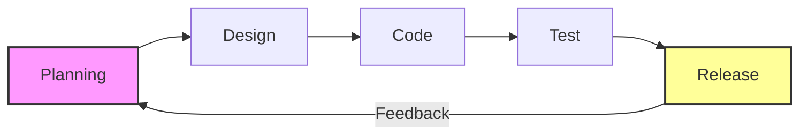

---

| **MODULE – 4** | **10 Hours** |
| :--- | :--- |
| **Introduction to Project Management:** Introduction, Project and Importance of Project Management, Contract Management, Activities Covered by Software Project Management, Plans, Methods and Methodologies, Some ways of categorizing Software Projects, Stakeholders, Setting Objectives, Business Case, Project Success and Failure, Management and Management Control, Project Management life cycle, Traditional versus Modern Project Management Practices. |
| **Project Evaluation:** Evaluation of Individual projects, Cost–benefit Evaluation Techniques, Risk Evaluation. |
| **Textbook 2:** Chapter 1: 1.1 to 1.17, Chapter 2: 2.4 to 2.6 |

<br>

**Figure 4.1: Software Project Management Activities**

| **Planning** | **Monitoring & Control** |
| :--- | :--- |
| * Estimating effort and cost<br> * Scheduling tasks<br> * Resource allocation<br> * Risk planning | * Tracking progress against plan<br> * Quality assurance checks<br> * Change control<br> * Performance measurement |

---

| **MODULE – 5** | **10 Hours** |
| :--- | :--- |
| **Software Quality:** Introduction, The place of software quality in project planning, Importance of software quality, Defining software quality, Software quality models, product versus process quality management. |
| **Project Estimation:** Observations on Estimation, Decomposition Techniques, Empirical Estimation Models. |
| **Textbook 2:** Chapter 13: 13.1 to 13.5, 13.7, 13.8 |
| **Textbook 1:** Chapter 26: 26.5 to 26.7 |

<br>

**Figure 5.1: Estimation Techniques Comparison**

*   **Decomposition Techniques:** Bottom-up, WBS (Work Breakdown Structure), Function Point Analysis.
*   **Empirical Models:** COCOMO II, Function Point based estimation, Delphi Technique.

---

**Textbooks**

1.  Roger S. Pressman: *Software Engineering—A Practitioner's Approach*, 7th Edition, Tata McGraw Hill.
2.  Bob Hughes, Mike Cotterell, Rajib Mall: *Software Project Management*, 6th Edition, McGraw Hill Education, 2018.

**Reference:**
1.  Pankaj Jalote: *An Integrated Approach to Software Engineering*, Wiley India.

== END OF PAGE 3 ==

== PERFECTED PAGE 4 / 193 ==

SOFTWARE ENGINEERING AND PROJECT MANAGEMENT 
 
 
 Dept of CSE, SVIT 
                                                                                                                                                                                        1 
 
MODULE –1 
 
CHAPTER 1 --INTRODUCTION 
 
Software and Software Engineering 
 
Software Engineering is the product of two words, software, and engineering. 
 
Software is more than just a program code. A program is an executable code, which serves some 
computational purpose. Software is considered to be a collection of executable programming code, 
associated libraries and documentations. Software, when made for a specific requirement is called 
a software product. 
 
Engineering on the other hand, is all about developing products, using well-defined, scientific 
principles and methods. 
 
Software Engineering is an engineering branch associated with development of software product 
using well-defined scientific principles, methods and procedures. The outcome of software 
engineering is an efficient and reliable software product. 
 
Definitions 
 
IEEE defines software engineering as:  
 
(1) The application of a systematic, disciplined, quantifiable approach to the development, 
operation and maintenance of software; that is, the application of engineering to software. 
 
(2) The study of approaches as in the above statement.  
 
Fritz Bauer, a German computer scientist, defines software engineering as: Software engineering 
is the establishment and use of sound engineering principles in order to obtain economically 
software that is reliable and work efficiently on real machines. 
 
1.1 The Nature of software 
 
Software takes on a dual role. It is a Product and at the same time a Vehicle (Process) for 
delivering a product. 
 
As a Product, it produces, manages, modifies, acquires and displays the information–It is an 
information transformer that can be a single bit or a complex multimedia presentation delive

== END OF PAGE 4 ==

== PERFECTED PAGE 5 / 193 ==

# SOFTWARE ENGINEERING AND PROJECT MANAGEMENT
**Dept of CSE, SVIT**

*   Creation and control of other programs (Software Tools and Environment)

Software delivers the most important product of our time called information. It transforms personal data (Individual financial transactions), it manages business information, it provides a gateway to worldwide information networks (Internet), and provides the means for acquiring information in all of its forms.

### 1.1.1 Software

**Defining Software:** Software is defined as:

1.  **Instructions:** Programs that when executed provide desired function, features, and performance.
2.  **Data structures:** Enable the programs to adequately manipulate information.
3.  **Documents:** Descriptive information in both hard copy and virtual forms that describes the operation and use of the programs.

**Characteristics of Software**

Software has characteristics that are considerably different than those of hardware:

**1) Software is developed or engineered; it is not manufactured in the Classical Sense.**

*   Although some similarities exist between software development and hardware manufacturing, the two activities are fundamentally different.
*   In both activities, high quality is achieved through good design, but the manufacturing phase for hardware can introduce **quality problems** that are nonexistent or easily corrected for software.
*   Both the activities are dependent on people, but the relationship between people is totally varying. These two activities require the construction of a "product" but the approaches are different.
*   Software costs are concentrated in engineering which means that software projects cannot be managed as if they were manufacturing.

**2) Software doesn’t “Wear Out”**

*   In the early stage of the hardware development process, the failure rate is very high due to manufacturing defects, but after correcting defects, the failure rate gets reduced.
*   Hardware components suffer from the growing effects of many other environmental factors. Stated simply, the hardware begins to **wear out**.
*   Software is not susceptible to the environmental maladies (extreme temperature, dusts, and vibrations) that cause hardware to wear out.

**Figure 1.1: Relationship between Failure Rate and Time (Hardware vs. Software)**

```mermaid
graph LR
    subgraph Hardware_Failure_Rate
    direction TB
    A[High Failure Rate<br/>(Infant Mortality)] --> B[Low/Stable Failure Rate]
    B --> C[Rising Failure Rate<br/>(Wear Out)]
    end
    
    subgraph Software_Failure_Rate
    direction TB
    D[Initial Bugs<br/>(High)] --> E[Stable/Low Failure Rate]
    E -- "Changes/Additions" --> F[Slight Increase]
    end

    style A fill:#f9f,stroke:#333,stroke-width:2px
    style C fill:#f9f,stroke:#333,stroke-width:2px
    style F fill:#ff9,stroke:#333,stroke-width:2px
```

> *Note: Hardware follows a "bathtub curve" where failure rates increase over time due to physical wear. Software does not physically wear out; its failure rate generally stabilizes after initial debugging, though it may rise slightly if modifications are made.*

Dept of CSE, SVIT
2

== END OF PAGE 5 ==

== PERFECTED PAGE 6 / 193 ==

# SOFTWARE ENGINEERING AND PROJECT MANAGEMENT

---

**Figure 1.1: Failure Curve for Hardware**

*[S-shaped bathtub curve showing "Infant mortality" phase at the beginning, followed by a flat failure rate period, and a "Wear out" phase at the end, with axes labeled "Failure rate" (y-axis) and "Time" (x-axis)]*

> - When a hardware component wears out, it is replaced by a spare part. There are no software spare parts.
> - Every software failure indicates an error in design or in the process through which the design was translated into machine-executable code. Therefore, the software maintenance tasks that accommodate requests for change involve considerably more complexity than hardware maintenance. However, the implication is clear—**the software doesn't wear out**. But it does **deteriorate** (frequent changes in requirement) [Fig:1.2].

**Figure 1.2: Failure Curves for Software**

*[Graph showing two curves: an "Idealized curve" declining smoothly over time, and an "Actual curve" that shows periodic spikes upward labeled "Increased failure rate due to side effects" after each "Change" point on the time axis]*

---

### 3) Most Software is custom-built rather than being assembled from components:

> - A software part should be planned and carried out with the goal that it tends to be reused in various projects (algorithms and data structures).
> - Today software industry is trying to make library of reusable components. E.g. Software GUI is built using the reusable components such as message windows, pull down menu and many more such components.
> - In the hardware world, component reuse is a natural part of the engineering process.

---

### 1.1.2 Software Application Domains

---

*Dept of CSE, SVIT* | *Page 3*

== END OF PAGE 6 ==

== PERFECTED PAGE 7 / 193 ==

# SOFTWARE ENGINEERING AND PROJECT MANAGEMENT

Nowadays, **seven broad categories** of computer software present continuing challenges for software engineers:

---

## 1. System Software

- A collection of programs written to service other programs. Some system software (e.g., compilers, editors, and file management utilities). Other system applications (e.g., Operating system components, drivers, networking software, telecommunication processors) process largely indeterminate data.
- In both cases there is heavy interaction with computer hardware, heavy usage by multiple users, scheduling and resource sharing.

## 2. Application Software

- Stand-alone programs that solve a specific business need. **[Help users to perform specific tasks].**
- Application software is used to control business functions in real time (e.g., point-of-sale transaction processing, real-time manufacturing process control).

## 3. Engineering/Scientific Software

- It has been characterized by **"number crunching" algorithms** (Complex numeric computations).
- Applications range from astronomy to volcanology, from automotive stress analysis to space shuttle orbital dynamics, and from molecular biology to automated manufacturing. Computer-aided design, system simulation, and other interactive applications have begun to take a real-time and even system software characteristic.

## 4. Embedded Software

- It resides within a product or system and is used to implement and control features and functions for the end user and for the system itself.
- Embedded software can perform limited and esoteric functions (e.g., keypad control for a microwave oven) or provide significant function and control capability (e.g., digital functions in an automobile such as fuel control dashboard displays, and braking systems).

## 5. Product-line Software

- Designed to provide a specific capability for use by many different customers.
- Product-line software can focus on a limited and esoteric marketplace (e.g., inventory control products) or address mass consumer markets (e.g., word processing, spreadsheets, computer graphics, multimedia, entertainment, database management, and personal and business financial applications).

## 6. Web Applications

- It is a client-server computer program that the client runs on the web browser.
- These applications are called **"WebApps,"** this network-centric software category spans a wide array of applications. In their simplest form, WebApps can be little more than information retrieval tools; at their most complex, WebApps may encompass every aspect of business operations.

## 7. Artificial Intelligence (AI) Software *(continued on next page)*

- AI software typically involves solving a problem by using a mechanism or model that attempts to mimic human reasoning and methods of reaching decisions.
- This includes expert systems, machine learning applications, natural language processing, and robotics.

---

**Figure 7.1: Seven Broad Categories of Computer Software**

```
┌─────────────────────────────────────────────────────────┐
│           SOFTWARE CATEGORIES FOR ENGINEERS             │
├─────────────────────────────────────────────────────────┤
│  ┌──────────────┐  ┌──────────────┐  ┌──────────────┐   │
│  │  SYSTEM      │  │ APPLICATION  │  │ ENGINEERING/ │   │
│  │  SOFTWARE    │  │  SOFTWARE    │  │  SCIENTIFIC  │   │
│  │  (OS, Driv-  │  │  (POS, Real- │  │   SOFTWARE   │   │
│  │   ers, Comp.)│  │  time Mfg.)  │  │ (Number      │   │
│  └──────┬───────┘  └──────┬───────┘  │  Crunching)  │   │
│         │                 │          └──────┬───────┘   │
│         │                 │                 │          │
│         ▼                 ▼                 ▼          │
│  ┌──────────────┐  ┌──────────────┐  ┌──────────────┐   │
│  │  EMBEDDED    │  │  PRODUCT-    │  │   WEB        │   │
│  │  SOFTWARE    │  │  LINE        │  │ APPLICATIONS │   │
│  │  (Auto,      │  │  SOFTWARE    │  │   (WebApps)  │   │
│  │   Microwave) │  │  (Mass       │  │              │   │
│  │              │  │   Consumer)  │  │              │   │
│  └──────┬───────┘  └──────┬───────┘  └──────┬───────┘   │
│         │                 │                 │          │
│         └────────┬────────┘────────┬────────┘          │
│                  ▼                 ▼                   │
│         ┌──────────────────────────────────┐           │
│         │     ARTIFICIAL INTELLIGENCE      │           │
│         │         SOFTWARE                 │           │
│         │  (Expert Systems, ML, NLP,       │           │
│         │         Robotics)                │           │
│         └──────────────────────────────────┘           │
└─────────────────────────────────────────────────────────┘
```

---

**Figure 7.2: Key Characteristics by Software Category**

| Category | Primary Characteristic | Interaction Level | User Base |
|---|---|---|---|
| System Software | Hardware servicing | Heavy hardware | Multiple users |
| Application Software | Business tasks | Moderate | End users |
| Engineering/Scientific | Numeric computation | Low | Specialists |
| Embedded Software | Control & function | Embedded | End users / System |
| Product-line Software | Reusable capability | Varies | Mass market |
| Web Applications | Client-server | Network-based | Web users |
| AI Software | Intelligent reasoning | High | Diverse |

---

*Dept of CSE, SVIT* — *Page 4*

== END OF PAGE 7 ==

== PERFECTED PAGE 8 / 193 ==

**SOFTWARE ENGINEERING AND PROJECT MANAGEMENT**  
*Dept of CSE, SVIT*

---

...more than a set of linked hypertext files that present information using text and limited graphics.

### 7. Artificial Intelligence Software
*   These make use of **non-numerical algorithms** to solve complex problems (e.g., Knowledge-based expert systems).
*   **Applications within this area include:**
    *   Robotics
    *   Expert systems
    *   Pattern recognition (image and voice)
    *   Artificial neural networks
    *   Theorem proving
    *   Game playing

### New Software Challenges
*   **Open-world computing:** Creating software to allow machines of all sizes to communicate with each other across vast networks (Distributed computing—wireless networks).
*   **Net sourcing:** Architecting simple and sophisticated applications that benefit targeted end-user markets worldwide (the Web as a computing engine).
*   **Open Source:** Distributing source code for computing applications so customers can make local modifications easily and reliably ("free" source code open to the computing community).

### 1.1.3 Legacy Software
*   **Legacy software** is **older programs** that are developed decades ago.
*   The quality of legacy software is **poor** because it has:
    *   Inextensible design
    *   Convoluted code
    *   Poor and nonexistent documentation
    *   Test cases and results that are not achieved

**As time passes, legacy systems evolve due to the following reasons:**

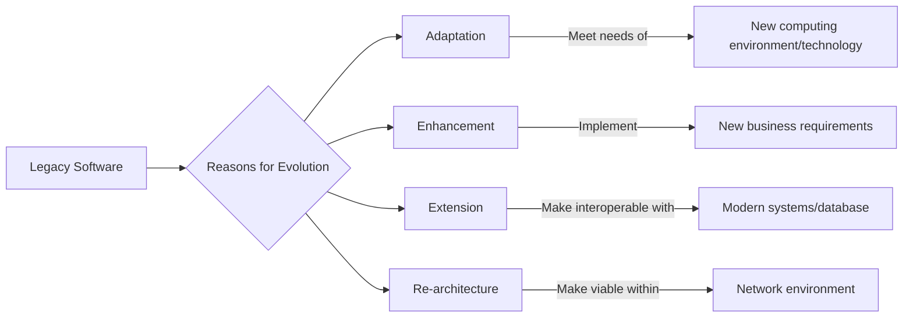

### 1.2 Unique Nature of Web Apps

<br>
<div align="right">Dept of CSE, SVIT &nbsp;&nbsp;&nbsp;&nbsp; 5</div>

== END OF PAGE 8 ==

== PERFECTED PAGE 9 / 193 ==

SOFTWARE ENGINEERING AND PROJECT MANAGEMENT 
 
 
 Dept of CSE, SVIT 
                                                                                                                                                                                        6 
 
In the early days of the World Wide Web (1990-95), websites consisted of little more than a set of 
linked hypertext files (HTML) that presented information using text and limited graphics. As 
time passed, the augmentation of HTML by development tools (e.g., XML, Java) enabled Web 
engineers to provide computing capability along with informational content.  
 
Web-based systems and applications (WebApps) were born. Today, WebApps have evolved into 
sophisticated computing tools that not only provide stand-alone function to the end user, but also 
have been integrated with corporate databases and business applications. 
 
WebApps are one of a number of distinct software categories. Web-based systems and 
applications “involve a mixture between print publishing and software development, between 
marketing and computing, between internal communications and external relations, and between 
art and technology.”  
 
The following attributes are encountered in the vast majority of WebApps.  
 
• Network intensiveness. A WebApp resides on a network and must serve the needs of a 
diverse community of clients. The network may enable worldwide access and 
communication (i.e., the Internet) or more limited access and communication (e.g., a 
corporate Intranet).  
 
• Concurrency. A large number of users may access the WebApp at one time. In many 
cases, the patterns of usage among end users will vary greatly.  
 
• Unpredictable load. The number of users of the WebApp may vary by orders of 
magnitude from day to day. One hundred users may show up on Monday; 10,000 may use 
the system on Thursday.  
 
• Performance. WebApp should work effectively in terms of processing speed. If a WebApp 
user must wait too long (for access,

== END OF PAGE 9 ==

== PERFECTED PAGE 10 / 193 ==

# SOFTWARE ENGINEERING AND PROJECT MANAGEMENT

---

### Web Application Characteristics (Continued)

- **Immediacy.** Although immediacy—the compelling need to get software to market quickly—is a characteristic of many application domains, WebApps often exhibit a time-to-market that can be a matter of a few days or weeks.

- **Security.** Because WebApps are available via network access, it is difficult, if not impossible, to limit the population of end users who may access the application. In order to protect sensitive content and provide secure modes of interaction, security considerations must be built into the application.

- **Aesthetics.** An undeniable part of the appeal of a WebApp is its look and feel. When an application has been designed to market or sell products or ideas, aesthetics may have as much to do with success as technical design.

---

## 1.3 Software Engineering — A Layered Technology

In order to build software that is ready to meet the challenges of the 21st century, you must recognize a few simple realities:

> • Problems should be understood before a software solution is developed.
> • Design is a pivotal Software Engineering activity.
> • Software should exhibit high quality.
> • Software should be maintainable.

These simple realities lead to one conclusion: **software in all of its forms and across all of its application domains should be *engineered*.**

### Software Engineering — Definitions

**Fritz Bauer** defined software engineering as:

> *Software engineering is the establishment and use of sound engineering principles in order to obtain software that is reliable and works efficiently on real machines in an economical manner.*

The **IEEE** has developed a more comprehensive definition:

1. *Software engineering is the application of a systematic, disciplined, quantifiable approach to the development, operation, and maintenance of software.*
2. *The study of the approaches as in (1).*

### Software Engineering Is a Layered Technology

**Software engineering is a *layered technology*.** Software engineering encompasses:

| Layer | Description |
|-------|-------------|
| **Process** | A framework task area that must be enacted to deliver high-quality software |
| **Methods** | Technical approaches for building software (e.g., design, coding, testing) |
| **Tools** | Automation and semi-automation support for process and methods |

Software engineering is a **fully layered technology**. To develop software, we need to go from one layer to another. All the layers are connected, and each layer demands the fulfillment of the previous layer.

```
Figure 1.3: Software Engineering — A Layered Technology

┌─────────────────────────────────────────┐
│           QUALITY FOCUS                  │  ← Foundation: A commitment to
│   (Total Quality Management)              │     excellence at every level
├─────────────────────────────────────────┤
│             PROCESS                     │  ← Framework for delivery
│   (A technological layer that          │     of quality software
│    envelopes all other layers)          │
├─────────────────────────────────────────┤
│             METHODS                     │  ← Technical approaches
│   (How to build the software)           │     for construction, testing,
│                                         │     management, etc.
├─────────────────────────────────────────┤
│             TOOLS                       │  ← Automation support
│   (Computer-based tools to support     │     for process and methods
│    process, methods, and SE itself)    │
└─────────────────────────────────────────┘
         ↑       ↑       ↑       ↑
    Each layer supports and depends
    on the layer(s) below it.
```

> *"Software in all of its forms and across all of its application domains should be **engineered**."*

---

== END OF PAGE 10 ==

== PERFECTED PAGE 11 / 193 ==

SOFTWARE ENGINEERING AND PROJECT MANAGEMENT 
 
 
 Dept of CSE, SVIT 
                                                                                                                                                                                        8 
 
 
 
 
Software engineering is a layered technology. Referring to above Figure, any engineering 
approach must rest on an organizational commitment to quality. 
 
• 
The bedrock that supports software engineering is a quality focus. 
 
• 
The foundation for software engineering is the process layer. The software engineering 
process is the glue that holds the technology layers together and enables rational and timely 
development of computer software. Process defines a framework that must be established 
for effective delivery of software engineering technology. 
 
• 
Software engineering methods provide the technical how-to’s for building software. 
Methods encompass a broad array of tasks that include communication, requirements 
analysis, 
design 
modeling, 
program 
construction, 
testing, 
and 
support. 
 
• 
Software engineering tools provide automated or semi-automated support for the process 
and the methods. When tools are integrated so that information created by one tool can be 
used by another, a system for the support of software development, called computer-aided 
software engineering is established. 
 
1.4 THE SOFTWARE PROCESS  
 
A process is a collection of activities, actions, and tasks that are performed when some 
work product is to be created. 
 
An activity strives to achieve a broad objective (e.g. communication with stakeholders) 
and is applied regardless of the application domain, size of the project, complexity of the effort, or 
degree of rigor with which software engineering is to be applied. 
 
An action encompasses a set of tasks that produce a major work product (e.g., an 
architectural design model). 
 
A task focuses on a small, but well-defined objective (e.g., conducting a unit 

== END OF PAGE 11 ==

== PERFECTED PAGE 12 / 193 ==

# SOFTWARE ENGINEERING AND PROJECT MANAGEMENT

## Process Framework

A **process framework** establishes the foundation for a complete software engineering process by identifying a small number of framework activities that are applicable to all software projects, regardless of their size or complexity. In addition, the process framework encompasses a set of **umbrella activities** that are applicable across the entire software process.

### Generic Process Framework — Five Activities

A generic process framework for software engineering encompasses five activities:

1. **Communication.** Before any technical work can commence, it is critically important to communicate and collaborate with the customer. The intent is to understand stakeholders' objectives for the project and to gather requirements that help define software features and functions.

2. **Planning.** A software project is a complicated journey, and the planning activity creates a *"map"* that helps guide the team as it makes the journey. The map—called a **software project plan**—defines the software engineering work by describing the technical tasks to be conducted, the risks that are likely, the resources that will be required, the work products to be produced, and a work schedule.

3. **Modeling.** Creation of models to help developers and customers understand the requirements and software design.

4. **Construction.** This activity combines **code generation** and the **testing** that is required to uncover errors in the code.

5. **Deployment.** The software is delivered to the customer who evaluates the delivered product and provides feedback based on the evaluation.

```
┌─────────────────────────────────────────────────────────┐
│           GENERIC SOFTWARE ENGINEERING PROCESS          │
│                   FRAMEWORK                             │
├──────────┬──────────┬──────────┬──────────┬─────────────┤
│COMMUNI-  │  PLAN-   │ MODEL-   │ CON-    │ DEPLOY-     │
│   CAT.   │   NING   │   ING    │ STRUC.  │  MENT       │
└──────────┴──────────┴──────────┴──────────┴─────────────┘
```

> These five generic framework activities can be used during the development of small, simple programs, the creation of large Web applications, and for the engineering of large, complex computer-based systems.

---

### Umbrella Activities

Software engineering process framework activities are complemented by a number of **Umbrella Activities**. In general, umbrella activities are applied throughout a software project and help a software team manage and control **progress, quality, change, and risk**.

Typical umbrella activities include:

| Umbrella Activity | Description |
|---|---|
| **Software Project Tracking and Control** | Allows the software team to assess progress against the project plan and take any necessary action to maintain the schedule. |
| **Risk Management** | Assesses risks that may affect the outcome of the project or the quality of the product. |
| **Software Quality Assurance** | Defines and conducts the activities required to ensure software quality. |

**Figure 12.1: Generic Software Engineering Process Framework**

```
        ┌──────────────────────────────────────────────────────┐
        │              UMBRELLA ACTIVITIES                      │
        │  ┌─────────────┬─────────────┬──────────────────┐    │
        │  │ Project     │ Risk        │ Software Quality │    │
        │  │ Tracking &  │ Management  │ Assurance        │    │
        │  │   Control   │             │                  │    │
        │  └─────────────┴─────────────┴──────────────────┘    │
        └──────────────────────────────────────────────────────┘
                              │贯穿贯穿贯穿
        ┌─────────────────────┼─────────────────────┐
        │                     ▼                     │
┌───────────────┐ ┌───────────────┐ ┌───────────────┐
│  Communication│ │    Planning   │ │   Modeling    │
└───────┬───────┘ └───────┬───────┘ └───────┬───────┘
        │                │                │
┌───────────────┐ ┌───────────────┐ ┌───────────────┐
│  Construction │ │  Deployment   │ │   Feedback    │
└───────────────┘ └───────────────┘ └───────────────┘
```

> *Source: Dept of CSE, SVIT — Software Engineering and Project Management*

== END OF PAGE 12 ==

== PERFECTED PAGE 13 / 193 ==

# SOFTWARE ENGINEERING AND PROJECT MANAGEMENT

*   **Technical reviews**—assesses software engineering work products in an effort to uncover and remove errors before they are propagated to the next activity.
*   **Measurement**—defines and collects process, project, and product measures that assist the team in delivering software that meets stakeholders needs; can be used in conjunction with all other framework and umbrella activities.
*   **Software configuration management**—manages the effects of change throughout the software process.
*   **Reusability management**—defines criteria for work product reuse and establishes mechanisms to achieve reusable components.
*   **Work product preparation and production**—encompasses the activities required to create work products such as models, documents, logs, forms, and lists.

The Software Engineering process is not rigid---It should be agile and adaptable. Therefore, a process adopted for one project might be significantly different than a process adopted for another project.

Among the differences are:

*   Overall flow and level of interdependencies among tasks
*   Degree to which work tasks are defined within each framework activity
*   Degree to which work products are identified and required
*   Manner in which quality assurance activities are applied
*   Manner in which project tracking and control activities are applied
*   Overall degree of detail and rigor of process description
*   Degree to which stakeholders are involved in the project
*   Level of autonomy given to project team
*   Degree to which team organization and roles are prescribed

## 1.5 THE SOFTWARE ENGINEERING PRACTICE

**Generic concepts and principles that apply to framework activities:**

*No diagram available for this specific content excerpt.*

Dept of CSE, SVIT
10

== END OF PAGE 13 ==

== PERFECTED PAGE 14 / 193 ==

SOFTWARE ENGINEERING AND PROJECT MANAGEMENT 
 
 
 Dept of CSE, SVIT 
                                                                                                                                                                                        11 
 
1.5.1 The Essence of Practice  
 
• Understand the problem (communication and analysis)  
• Plan a solution (software design)  
• Carry out the plan (code generation)  
• Examine the result for accuracy (testing and quality assurance). 
 
These steps lead to series of questions: 
 
Understand the Problem  
• Who are the stakeholders?  
•  What are the Unknowns? What functions and features are required to solve the problem?  
•  Is it possible to create smaller problems that are easier to understand?  
• Can a graphic analysis model be created? 
 
 Plan the Solution  
• Have you seen similar problems before? Is there existing software that implements these 
features. 
• Has a similar problem been solved? ‘ 
• Can readily solvable sub problems be defined?  
• Can a design model be created? –Effective implementation. 
 
Carry Out the Plan  
•  Does solution conform to the plan? Is source code traceable to the design model? 
•  Is each solution component provably, correct? Have design and code be reviewed? 
 
Examine the Result  
• Is it possible to test each component part of the solution?  
• Does the solution produce results that conform to the data, functions, and features 
required? 
 
 
1.5.2 Software General Principles  
 
The dictionary defines the word principle as “an important underlying law or 
assumption required in a system of thought.” David Hooker has Proposed seven principles that 
focus on software Engineering practice.  
 
The First Principle: The Reason It All Exists  
A software system exists for one reason: to provide value to its users.  
 
The Second Principle: KISS (Keep It Simple, Stupid!)  
Software design is not a haphazard process. There are many factors to consider in any 
design effort

== END OF PAGE 14 ==

== PERFECTED PAGE 15 / 193 ==

# SOFTWARE ENGINEERING AND PROJECT MANAGEMENT

**Dept of CSE, SVIT**  
**Page 12**

---

### The Third Principle: Maintain the Vision
A clear vision is essential to the success of a software project. Without one, a project almost unfailingly ends up being “of two [or more] minds” about itself.

### The Fourth Principle: What You Produce, Others Will Consume
Always specify, design, and implement knowing someone else will have to understand what you are doing.

### The Fifth Principle: Be Open to the Future
A system with a long lifetime has more value. Never design yourself into a corner. Before beginning a software project, be sure the software has a business purpose and that users perceive value in it.

### The Sixth Principle: Plan Ahead for Reuse
Reuse saves time and effort. Planning ahead for reuse reduces the cost and increases the value of both the reusable components and the systems into which they are incorporated.

### The Seventh Principle: Think!
Placing clear, complete thought before action almost always produces better results. When you think about something, you are more likely to do it right.

---

## 1.6 SOFTWARE MYTHS

*Software Myths* – beliefs about software and the process used to build it – can be traced to the earliest days of computing. Myths have a number of attributes that have made them insidious. For instance, myths appear to be reasonable statements of fact, they have an intuitive feel, and they are often promulgated by experienced practitioners who “know the score”.

**Figure 1.6: The Lifecycle of Software Myths**  
*(Conceptual Diagram: Origin → Appearance of Reasonableness → Promulgation by Experts → Adoption by Managers → Reality Check)*

### Management Myths:

Managers with software responsibility, like managers in most disciplines, are often under pressure to maintain budgets, keep schedules from slipping, and improve quality. Like a drowning person who grasps at a straw, a software manager often grasps at belief in a software myth.

**Myth:**  
We already have a book that’s full of standards and procedures for building software. Won’t that provide my people with everything they need to know?

**Reality:**
*   The book of standards may very well exist, but is it used?
*   Are software practitioners aware of its existence?
*   Does it reflect modern software engineering practice?
*   Is it complete?
*   Is it adaptable?
*   Is it streamlined to improve time to delivery while still maintaining a focus on Quality?

**In many cases, the answer to this entire question is NO.**

---

Dept of CSE, SVIT  
12

== END OF PAGE 15 ==

== PERFECTED PAGE 16 / 193 ==

SOFTWARE ENGINEERING AND PROJECT MANAGEMENT 
 
 
 Dept of CSE, SVIT 
                                                                                                                                                                                        13 
 
Myth: If we get behind schedule, we can add more programmers and catch up  
 
Reality: Software development is not a mechanistic process like manufacturing. “Adding people 
to a late software project makes it later.” At first, this statement may seem counterintuitive. 
However, as new people are added, people who were working must spend time educating the 
newcomers, thereby reducing the amount of time spent on productive development effort.  
 
People can be added but only in a planned and well-coordinated manner. 
 
Myth: If we decide to outsource the software project to a third party, I can just relax and let that 
firm build it. 
 
Reality: If an organization does not understand how to manage and control software project 
internally, it will invariably struggle when it out sources’ software project. 
 
Customer Myths: 
 
A customer who requests computer software may be a person at the next desk, a technical group 
down the hall, the marketing /sales department, or an outside company that has requested software 
under contract. In many cases, the customer believes myths about software because software 
managers and practitioners do little to correct misinformation. Myths led to false expectations and 
ultimately, dissatisfaction with the developers. 
 
Myth: A general statement of objectives is sufficient to begin writing programs - we can fill in 
details later.  
 
Reality: Although a comprehensive and stable statement of requirements is not always possible, an 
ambiguous statement of objectives is a recipe for disaster. Unambiguous requirements are 
developed only through effective and continuous communication between customer and developer. 
 
Myth: Project requirements continually change, but change can 

== END OF PAGE 16 ==

== PERFECTED PAGE 17 / 193 ==

SOFTWARE ENGINEERING AND PROJECT MANAGEMENT 
 
 
 Dept of CSE, SVIT 
                                                                                                                                                                                        14 
 
Myth: Once we write the program and get it to work, our job is done.  
 
Reality: Someone once said that "the sooner you begin 'writing code', the longer it'll take you to 
get done.” Industry data indicate that between 60 and 80 percent of all effort consumed on 
software will be consumed after it is delivered to the customer for the first time.  
 
Myth: Until I get the program "running" I have no way of assessing its quality.  
 
Reality: One of the most effective software quality assurance mechanisms can be applied from the 
inception of a project—the formal technical review. Software reviews are a "quality filter" that 
have been found to be more effective than testing for finding certain classes of software defects. 
 
Myth: The only deliverable work product for a successful project is the working program.  
 
Reality: A working program is only one part of a software configuration that includes many 
elements. Documentation provides a foundation for successful engineering and, more important, 
guidance for software support.  
 
Myth: Software engineering will make us create voluminous and unnecessary documentation and 
will invariably slow us down.  
 
Reality: Software engineering is not about creating documents. It is about creating quality. Better 
quality leads to reduced rework. And reduced rework results in faster delivery times. Many 
software professionals recognize the fallacy of the myths just described. Regrettably, habitual 
attitudes and methods foster poor management and technical practices, even when reality dictates a 
better approach. Recognition of software realities is the first step toward formulation of practical 
solutions for software engineering. 
 
 
MODULE 1 
 
CHAPTER 2-- PROCESS

== END OF PAGE 17 ==

== PERFECTED PAGE 18 / 193 ==
# SOFTWARE ENGINEERING AND PROJECT MANAGEMENT

produced, the quality assurance points that will be required, and the milestones that will be used to indicate progress.

**Figure 2.1: Software Process (Process Framework)**

```
┌─────────────────────────────────────────────────────────────────┐
│                      Software Process Framework                  │
│  ┌───────────────────────────────────────────────────────────┐  │
│  │                     Umbrella Activities                    │  │
│  │  ┌─────────────────────────────────────────────────────┐  │  │
│  │  │            framework activity # 1                     │  │  │
│  │  │  software engineering action #1.1                     │  │  │
│  │  │    Task sets    ┌─────────────────────────────────┐   │  │  │
│  │  │                 │  work tasks                      │   │  │  │
│  │  │                 │  work products                   │   │  │  │
│  │  │                 │  quality assurance points        │   │  │  │
│  │  │                 │  project milestones              │   │  │  │
│  │  │                 └─────────────────────────────────┘   │  │  │
│  │  │    :                                                   │  │  │
│  │  │  software engineering action #1.k                     │  │  │
│  │  │    Task sets    ┌─────────────────────────────────┐   │  │  │
│  │  │                 │  work tasks                      │   │  │  │
│  │  │                 │  work products                   │   │  │  │
│  │  │                 │  quality assurance points        │   │  │  │
│  │  │                 │  project milestones              │   │  │  │
│  │  │                 └─────────────────────────────────┘   │  │  │
│  │  │    :                                                   │  │  │
│  │  │  ┌─────────────────────────────────────────────────┐  │  │  │
│  │  │  │         framework activity # n                   │  │  │  │
│  │  │  │  software engineering action #n.1                │  │  │  │
│  │  │  │    Task sets    ┌─────────────────────────────┐  │  │  │  │
│  │  │  │                 │  work tasks                  │  │  │  │  │
│  │  │  │                 │  work products               │  │  │  │  │
│  │  │  │                 │  quality assurance points    │  │  │  │  │
│  │  │  │                 │  project milestones          │  │  │  │  │
│  │  │  │                 └─────────────────────────────┘  │  │  │  │
│  │  │  │    :                                               │  │  │  │
│  │  │  │  software engineering action #n.m                 │  │  │  │
│  │  │  │    Task sets    ┌─────────────────────────────┐  │  │  │  │
│  │  │  │                 │  work tasks                  │  │  │  │  │
│  │  │  │                 │  work products               │  │  │  │  │
│  │  │  │                 │  quality assurance points    │  │  │  │  │
│  │  │  │                 │  project milestones          │  │  │  │  │
│  │  │  │                 └─────────────────────────────┘  │  │  │  │
│  │  │  └─────────────────────────────────────────────────┘  │  │  │
│  │  └───────────────────────────────────────────────────────────┘  │
│  └─────────────────────────────────────────────────────────────────┘
└─────────────────────────────────────────────────────────────────┘
```

As I discussed in Chapter 1, a generic process framework for software engineering defines five framework activities—**communication**, **planning**, **modeling**, **construction**, and **deployment**. In addition, a set of umbrella activities—**project tracking and control**, **risk management**, **quality assurance**, **configuration management**, **technical reviews**, and others—are applied throughout the process.

The important aspect of software process is **"Process Flow"** which describes how the framework activities and the actions and tasks that occur within each framework activity are organized with respect to sequence and time and is illustrated in Figure 2.2.

**Figure 2.2: Process Flow**

```
(a) Linear Process Flow

┌─────────────┐   ┌─────────────┐   ┌─────────────┐   ┌─────────────┐   ┌─────────────┐
│ Communication │→→│   Planning  │→→│  Modeling   │→→│ Construction │→→│  Deployment │
└─────────────┘   └─────────────┘   └─────────────┘   └─────────────┘   └─────────────┘


(b) Iterative Process Flow

┌─────────────┐   ┌─────────────┐   ┌─────────────┐   ┌─────────────┐   ┌─────────────┐
│ Communication │→→│   Planning  │→→│  Modeling   │→→│ Construction │→→│  Deployment │
└──────┬──────┘   └──────┬──────┘   └──────┬──────┘   └──────┬──────┘   └──────┬──────┘
       │                 │                 │                 │                 │
       └─────────────────┴─────────────────┴─────────────────┴─────────────────┘
                              (Iterative feedback loops)
```

---
Dept of CSE, SVIT | 15

== END OF PAGE 18 ==

== PERFECTED PAGE 19 / 193 ==

# SOFTWARE ENGINEERING AND PROJECT MANAGEMENT

**Dept of CSE, SVIT**

---

### Process Flows

**Figure 2.2: Process Flow Variations**

*(Diagram depicting four process flow models)*

*   **(a) Linear Process Flow:** A linear process [Fig:2.2(a)] flow executes each of the five framework activities in sequence, beginning with communication and culminating with deployment.
*   **(b) Iterative Process Flow:** An iterative process flow [Fig:2.2(b)] repeats one or more of the activities before proceeding to the next.
*   **(c) Evolutionary Process Flow:** An evolutionary process flow [Fig:2.2(c)] executes the activities in a "circular" manner. Each circuit through the five activities leads to a more complete version of the software.
*   **(d) Parallel Process Flow:** A parallel process flow [Fig:2.2(d)] executes one or more activities in parallel with other activities (e.g., modeling for one aspect of the software might be executed in parallel with construction of another aspect of the software).

### 2.1.1 Defining a Framework Activity

There are five framework activities:

1.  Communication
2.  Planning
3.  Modeling
4.  Construction
5.  Deployment

These five framework activities provide a basic definition of Software Process. These Framework activities provide basic information like *What actions are appropriate for a framework activity, given the nature of the problem to be solved, the characteristics of the people doing the work, and the stakeholders who are sponsoring the project?*

**Example Actions:**

1.  Make contact with stakeholder via telephone.
2.  Discuss requirements and take notes.
3.  Organize notes into a brief written statement of requirements.

---

**Dept of CSE, SVIT**
**16**

== END OF PAGE 19 ==

== PERFECTED PAGE 20 / 193 ==

# SOFTWARE ENGINEERING AND PROJECT MANAGEMENT

**Dept of CSE, SVIT** | Page 17

---

### 4. E-mail to Stakeholder for Review and Approval

If the project was considerably more complex with many stakeholders, each with a different set of requirements, the communication activity might have six distinct actions: *inception, elicitation, elaboration, negotiation, specification,* and *validation*. Each of these software engineering actions would have many work tasks and a number of distinct work products.

---

## 2.1.2 Identifying a Task Set

- Each software engineering action can be represented by a number of different task sets
- Each a collection of software engineering:
  - work tasks
  - related work products
  - quality assurance points
  - project milestones
- Choose a task set that best accommodates the needs of the project and the characteristics of the software team
- This implies that a software engineering action can be adapted to the specific needs of the software project and the characteristics of the project team

---

## 2.1.3 Process Patterns

A **process pattern** describes a process-related problem that is encountered during software engineering work, identifies the environment in which the problem has been encountered, and suggests one or more proven solutions to the problem. Stated in more general terms, a process pattern provides you with a **template** — a consistent method for describing problem solutions within the context of the software process.

**Patterns can be defined at any level of abstraction.** A pattern might be used to describe a problem (and solution) associated with a complete process model (e.g., prototyping). In other situations, patterns can be used to describe a problem (and solution) associated with a framework activity (e.g., planning) or an action within a framework activity (e.g., project estimating).

> Ambler has proposed a template for describing a process pattern:

### 1. Pattern Name
The pattern is given a meaningful name describing it within the context of the software process (e.g., *Technical Reviews*).

### 2. Forces
The environment in which the pattern is encountered and the issues that make the problem visible and may affect its solution.

### 3. Type
The pattern type is specified. Ambler suggests three types:

**Figure 2.1: Process Pattern Template Structure**

```
┌─────────────────────────────────────────────────────────┐
│              PROCESS PATTERN TEMPLATE                    │
├─────────────────────────────────────────────────────────┤
│  1. Pattern Name    → Meaningful descriptive name       │
│  2. Forces          → Environment & problem issues      │
│  3. Type            → Pattern classification            │
│  4. Solution        → Proven resolution approach        │
│  5. Consequences    → Results of applying pattern       │
└─────────────────────────────────────────────────────────┘
```

---

**Figure 2.2: Abstraction Levels for Process Patterns**

```
                    ┌──────────────────────┐
                    │  Complete Process    │
                    │  Model (e.g.,        │
                    │  Prototyping)        │
                    └──────────┬───────────┘
                               │
                    ┌──────────▼───────────┐
                    │  Framework Activity  │
                    │  (e.g., Planning)    │
                    └──────────┬───────────┘
                               │
                    ┌──────────▼───────────┐
                    │  Action within       │
                    │  Activity            │
                    │  (e.g., Project      │
                    │  Estimating)         │
                    └──────────────────────┘
```

---

*Dept of CSE, SVIT* | 17

== END OF PAGE 20 ==

== PERFECTED PAGE 21 / 193 ==
[content]
# SOFTWARE ENGINEERING AND PROJECT MANAGEMENT
Dept of CSE, SVIT | 18

---

### Pattern Classification

**I. Stage pattern** — Defines a problem associated with a framework activity for the process. Since a framework activity encompasses multiple actions and work tasks, a stage pattern incorporates multiple task patterns that are relevant to the stage (framework activity).
&nbsp;&nbsp;&nbsp;&nbsp;*E.g.: Establishing Communication.*
&nbsp;&nbsp;&nbsp;&nbsp;This pattern would incorporate the task pattern **RequirementsGathering** and others.

**II. Task pattern** — Defines a problem associated with a software engineering action or work task and relevant to successful software engineering practice (e.g., *Requirements Gathering*).

**III. Phase pattern** — Defines the sequence of framework activities that occurs within the process, even when the overall flow of activities is iterative in nature. *E.g.: SpiralModel or Prototyping.*

---

### Pattern Structure

**4. Initial context.** Describes the conditions under which the pattern applies. Prior to the initiation of the pattern:
&nbsp;&nbsp;&nbsp;&nbsp;(1) What organizational or team-related activities have already occurred?
&nbsp;&nbsp;&nbsp;&nbsp;(2) What is the entry state for the process?
&nbsp;&nbsp;&nbsp;&nbsp;(3) What software engineering information or project information already exists?

**5. Problem.** The specific problem to be solved by the pattern.

**6. Solution.** Describes how to implement the pattern successfully. It also describes how software engineering information or project information that is available before the initiation of the pattern is transformed as a consequence of the successful execution of the pattern.

**7. Resulting Context.** Describes the conditions that will result once the pattern has been successfully implemented. Upon completion of the pattern:
&nbsp;&nbsp;&nbsp;&nbsp;(1) What organizational or team-related activities must have occurred?
&nbsp;&nbsp;&nbsp;&nbsp;(2) What is the exit state for the process?
&nbsp;&nbsp;&nbsp;&nbsp;(3) What software engineering information or project information has been developed?

**8. Related Patterns.** Provide a list of all process patterns that are directly related to this one. This may be represented as a hierarchy or in some other diagrammatic form.

**9. Known Uses and Examples.** Indicate the specific instances in which the pattern is applicable.

---

### Conclusion on Process patterns

*   Provide an effective mechanism for addressing problems associated with any software process.
*   The patterns enable you to develop a hierarchical process description that begins at a high level of abstraction (a phase pattern).
*   The description is then refined into a set of stage patterns that describe framework activities.
*   Once process patterns have been developed, they can be reused for the definition of process variants.

<div align="right">Dept of CSE, SVIT &nbsp;&nbsp;&nbsp;&nbsp; 18</div>

**Figure 4.1: Hierarchy of Process Patterns**

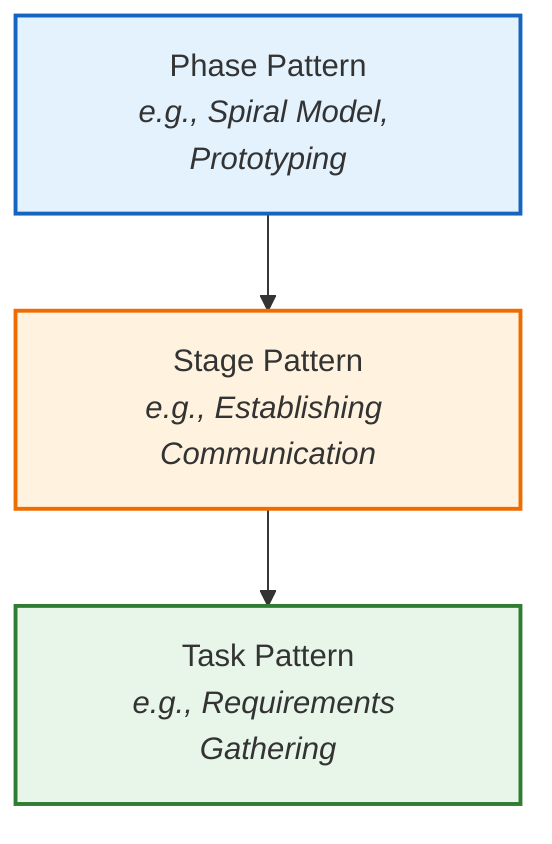

*Figure 4.1 illustrates the hierarchical decomposition from abstract phase patterns down to specific task patterns.*

== END OF PAGE 21 ==

== PERFECTED PAGE 22 / 193 ==
# SOFTWARE ENGINEERING AND PROJECT MANAGEMENT

## 2.2 PROCESS ASSESSMENT AND IMPROVEMENT

The existence of a software process is no guarantee that software will be delivered on time, that it will meet the customer's needs.

Process patterns must be coupled with solid software engineering practice.

Assessment attempts to understand the current state of the software process with the intent on improving it.

A number of different approaches to software process assessment and improvement have been proposed over the past few decades.

**Standard CMMI Assessment Method for Process Improvement (SCAMPI)**- Provides a five step process assessment model that incorporates five phases: initiating, diagnosing, establishing, acting, and learning. The SCAMPI method uses the SEI CMMI as the basis for assessment.

**CMM-Based Appraisal for Internal Process Improvement (CBA IPI)**-Provides a diagnostic technique for assessing the relative maturity of a software organization; uses the SEI CMM as the basis for the assessment.

**SPICE (ISO/IEC15504)**—a standard that defines a set of requirements for software process assessment. The intent of the standard is to assist organizations in developing an objective evaluation of the efficacy of any defined software process.

**ISO 9001:2000 for Software**—a generic standard that applies to any organization that wants to improve the overall quality of the products, systems, or services that it provides. Therefore, the standard is directly applicable to software organizations and companies.

**Figure 2.1: Elements of SPI (Software Process Improvement) framework.**

[Diagram Description: A cyclical diagram showing four main elements:]
- **Software process** (Top)
- **Assessment** (Center)
- **Capability determination** (Bottom Right)
- **Improvement strategy** (Bottom Left)

**Relationships:**
- **Software process** is examined by **Assessment**.
- **Assessment** leads to **Capability determination** and **Improvement strategy**.
- **Assessment** identifies capabilities, strengths, weaknesses, and maturity of the **Software process**.
- **Capability determination** is a foundation for **Improvement strategy**.
- **Improvement strategy** suggests an improvement approach for the **Software process**.

Dept of CSE, SVIT
19

== END OF PAGE 22 ==

== PERFECTED PAGE 23 / 193 ==

# SOFTWARE ENGINEERING AND PROJECT MANAGEMENT

Dept of CSE, SVIT

## 2.3 PRESCRIPTIVE PROCESS MODELS

Prescriptive process models were originally proposed to bring order to the chaos (disorder) of software development.

- These models have brought a certain amount of useful structure to software engineering work and have provided a reasonably effective road map for software teams.
- The **edge of chaos** is defined as *"a natural state between order and chaos, a grand compromise between structure and surprise."*
- The edge of chaos can be visualized as an unstable, partially structured state.
- It is unstable because it is constantly attracted to chaos or to absolute order.
- The prescriptive process approach in which order and project consistency are dominant issues.
- **"Prescriptive"** means prescribe a set of process elements:
  - framework activities,
  - software engineering actions,
  - tasks,
  - work products,
  - quality assurance, and
  - change control mechanisms for each project.
- Each process model also prescribes a **process flow** (also called a **work flow**)—that is, the manner in which the process elements are interrelated to one another.
- All software process models can accommodate the generic framework activities, but each applies a different emphasis to these activities and defines a process flow that invokes each framework activity in a different manner.

### 2.3.1 THE WATERFALL MODEL

The waterfall model, Fig [2.3] sometimes called the *classic life cycle*, suggests a systematic, sequential approach to software development that begins with customer specification of requirements and progresses through **planning**, **modeling**, **construction**, and **deployment**.

```
Figure 2.3: The Waterfall Model
```

```
┌─────────────────────────┐
│   Communication         │
│   project initiation    │
│   requirements gathering│
└───────────┬─────────────┘
            │
            ▼
┌─────────────────────────┐
│   Planning              │
│   estimating            │
│   scheduling            │
│   tracking              │
└───────────┬─────────────┘
            │
            ▼
┌─────────────────────────┐
│   Modeling              │
│   analysis              │
│   design                │
└───────────┬─────────────┘
            │
            ▼
┌─────────────────────────┐
│   Construction          │
│   code                  │
│   test                  │
└───────────┬─────────────┘
            │
            ▼
┌─────────────────────────┐
│   Deployment            │
│   delivery              │
│   support               │
│   feedback              │
└─────────────────────────┘
```

Dept of CSE, SVIT &nbsp;&nbsp;&nbsp;&nbsp;&nbsp;&nbsp;&nbsp;&nbsp;&nbsp;&nbsp;&nbsp;&nbsp;&nbsp;&nbsp;&nbsp;&nbsp;&nbsp;&nbsp;&nbsp;&nbsp;&nbsp;&nbsp;&nbsp;&nbsp;&nbsp;&nbsp;&nbsp;&nbsp;&nbsp;&nbsp;&nbsp;&nbsp;&nbsp;&nbsp;&nbsp;&nbsp;&nbsp;&nbsp;&nbsp;&nbsp;&nbsp;&nbsp;&nbsp;&nbsp;&nbsp;&nbsp;&nbsp;&nbsp;&nbsp;&nbsp;&nbsp;&nbsp;&nbsp;&nbsp;&nbsp;&nbsp;&nbsp;&nbsp;&nbsp;&nbsp;&nbsp;&nbsp;&nbsp;&nbsp;&nbsp;&nbsp;&nbsp;&nbsp;&nbsp;&nbsp;&nbsp;&nbsp;&nbsp;&nbsp;&nbsp;&nbsp;&nbsp;&nbsp;&nbsp;&nbsp;&nbsp;&nbsp;&nbsp;&nbsp;&nbsp;&nbsp;&nbsp;&nbsp;&nbsp;&nbsp;&nbsp;&nbsp;&nbsp;&nbsp;&nbsp;&nbsp;&nbsp;&nbsp;&nbsp;&nbsp;&nbsp;&nbsp;&nbsp;&nbsp;&nbsp;&nbsp;&nbsp;&nbsp;&nbsp;&nbsp;&nbsp;&nbsp;&nbsp;&nbsp;&nbsp;&nbsp;&nbsp;&nbsp;&nbsp;&nbsp;&nbsp;&nbsp;&nbsp;&nbsp;&nbsp;&nbsp;&nbsp;&nbsp;&nbsp;&nbsp;&nbsp;&nbsp;&nbsp;&nbsp;&nbsp;&nbsp;&nbsp;&nbsp;&nbsp;&nbsp;&nbsp;&nbsp;&nbsp;&nbsp;&nbsp;&nbsp;&nbsp;&nbsp;&nbsp;&nbsp;&nbsp;&nbsp;&nbsp;&nbsp;&nbsp;&nbsp;&nbsp;&nbsp;&nbsp;&nbsp;&nbsp;&nbsp;&nbsp;&nbsp;&nbsp;&nbsp;&nbsp;&nbsp;&nbsp;&nbsp;&nbsp;&nbsp;&nbsp;&nbsp;&nbsp;&nbsp;&nbsp;&nbsp;&nbsp;20

== END OF PAGE 23 ==

== PERFECTED PAGE 24 / 193 ==

# SOFTWARE ENGINEERING AND PROJECT MANAGEMENT

## V-model

A variation in the representation of the waterfall model is called the **V-model**. Represented in the following **Fig 2.4**. The V-model depicts the relationship of quality assurance actions to the actions associated with communication, modeling, and early construction activities.

**Figure 2.4: V-model Diagram**

```
    Requirements modeling ────────────────────────► Acceptance testing
           │                                                │
           │                                                │
    Architectural design ─────────────────────────► System testing
           │                                                │
           │                                                │
    Component design ────────────────────────────► Integration testing
           │                                                │
           │                                                │
    Code generation ─────────────────────────────► Unit testing
           │                                                │
           ▼                                                ▼
                    Executable software
```

As a software team moves down the left side of the V, basic problem requirements are refined into progressively more detailed and technical representations of the problem and its solution. Once code has been generated, the team moves up the right side of the V, essentially performing a series of tests that validate each of the models created as the team moved down the left side. The V-model provides a way of visualizing how verification and validation actions are applied to earlier engineering work.

### Problems with the Waterfall Model

The waterfall model is the oldest paradigm for software engineering. The problems that are sometimes encountered when the waterfall model is applied are:

1. **Real projects rarely follow the sequential flow** that the model proposes. Although a linear model can accommodate iteration, it does so indirectly. As a result, changes can cause confusion as the project team proceeds.

2. **It is often difficult for the customer to state all requirements explicitly.** The waterfall model requires this and has difficulty accommodating the natural uncertainty that exists at the beginning of many projects.

3. **The customer must have patience.** A working version of the program(s) will not be available until late in the project time span.

> This model is suitable whenever limited number of new development efforts and when requirements are well defined and reasonably stable.

---

Dept of CSE, SVIT · Page 21

== END OF PAGE 24 ==

== PERFECTED PAGE 25 / 193 ==
### 2.3.2 INCREMENTAL PROCESS MODEL

The **incremental model** delivers a series of releases, called **increments**, that provide progressively more functionality for the customer as each increment is delivered.

The incremental model combines elements of linear and parallel process flows. Referring to Fig 2.5, the incremental model applies linear sequences in a staggered fashion as calendar time progresses. Each linear sequence produces deliverable "increments" of the software in a manner that is similar to the increments produced by an evolutionary process flow.

**Figure 2.5: Incremental Process Model**

For example, word-processing software developed using the incremental paradigm might deliver basic file management, editing, and document production functions in the first increment; more sophisticated editing and document production capabilities in the second increment; spelling and grammar checking in the third increment; and advanced page layout capability in the fourth increment.

*   When an incremental model is used, the first increment is often a **core product**. That is, basic requirements are addressed but many extra features remain undelivered. The core product is used by the customer. As a result of use and/or evaluation, a plan is developed for the next increment.
*   The plan addresses the modification of the core product to better meet the needs of the customer and the delivery of additional features and functionality. This process is repeated following the delivery of each increment, until the complete product is produced.
*   Incremental development is particularly useful when **staffing is unavailable** for a complete implementation by the business deadline that has been established for the project. Early increments can be implemented with fewer people. If the core product is well received, then additional staff (if required) can be added to implement the next increment. In addition, increments can be planned to manage **technical risks**.

Dept of CSE, SVIT
22
== END OF PAGE 25 ==

== PERFECTED PAGE 26 / 193 ==

# SOFTWARE ENGINEERING AND PROJECT MANAGEMENT

**Figure 2.5: The Incremental Model**

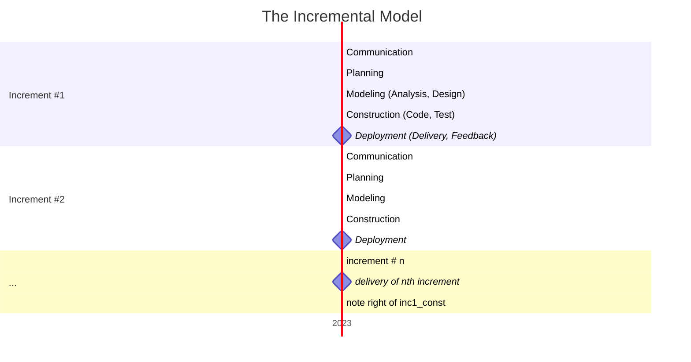

*(Note: The diagram above represents the staircase progression of the Incremental Model as shown in Figure 2.5, where each increment adds functionality and moves through communication, planning, modeling, construction, and deployment phases.)*

## 2.3.3 EVOLUTIONARY PROCESS MODELS

Evolutionary models are iterative. They are characterized in a manner that enables you to develop increasingly more complete versions of the software with each iteration. There are two common evolutionary process models.

### a) Prototyping Model

Often, a customer defines a set of general objectives for software, but does not identify detailed requirements for functions and features. In other cases, the developer may be unsure of the efficiency of an algorithm, the adaptability of an operating system, or the form that human-machine interaction should take. In these, and many other situations, a prototyping paradigm may offer the best approach.

Although prototyping can be used as a stand-alone process model, it is more commonly used as a technique that can be implemented within the context of any one of the process models.

The prototyping paradigm **FIG:2.6** begins with **communication**. You meet with other stakeholders to define the overall objectives for the software, identify whatever requirements are known, and outline areas where further definition is mandatory. A prototyping iteration is planned quickly, and modeling (in the form of a "quick design") occurs. A quick design focuses on a representation of those aspects of the software that will be visible to end users.

<br>
<br>

Dept of CSE, SVIT \hfill 23

== END OF PAGE 26 ==

== PERFECTED PAGE 27 / 193 ==

**SOFTWARE ENGINEERING AND PROJECT MANAGEMENT (BCS501)**
Dept. of CSE, SVIT
27

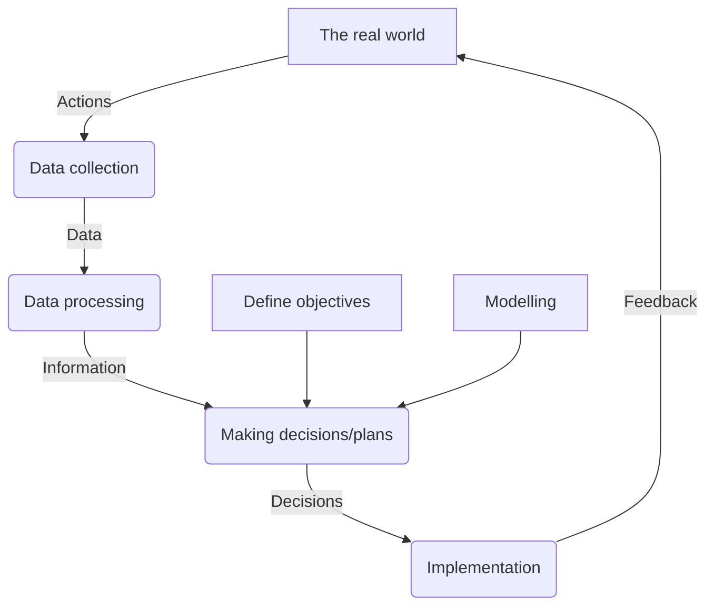

**Figure 1.X: The Project control cycle**

*   In the above Fig, local managers are involved in data collection. Bare details such as “location X has processed 2000 documents” may not be useful to higher management.
*   Data processing is required to transform this raw data into useful information. This might be in such forms as “Percentage of records Processed”, “average documents per day per person”, and “estimated completion date”.
*   In this example, the project management might examine the “estimated completion date” for completing data transfer for each branch. They are comparing actual performance with overall project objectives.
*   They might find that one or two branches will fail to complete the transfer of details in time.
*   It can be seen that a project plan is dynamic and will need constant adjustment during the execution of the project. A good plan provides a foundation for a good project, but is nothing without intelligent execution.

### 1.13 PROJECT MANAGEMENT LIFE CYCLE

Software development life cycle denotes (SDLC) the stages through which a software is developed. In contrast to SDLC, the project management life cycle typically starts well before the software development activities start and continues for the entire duration of SDLC. (Fig 1.7)

In Project Management process, the project manager carries out project initiation, planning, execution, monitoring, controlling and closing.

Dept. of CSE, SVIT
27

== END OF PAGE 27 ==

== PERFECTED PAGE 28 / 193 ==

## The Spiral Development Model

The **spiral development model** is a risk-driven process model generator used to guide multi-stakeholder concurrent engineering of software-intensive systems. It has two main distinguishing features:

1.  **Cyclic Approach:** It incrementally grows a system’s degree of definition and implementation while decreasing its degree of risk.
2.  **Anchor Point Milestones:** These ensure stakeholder commitment to feasible and mutually satisfactory system solutions.

Using the spiral model, software is developed in a series of **evolutionary releases**. During early iterations, the release might be a model or prototype. During later iterations, increasingly more complete versions of the engineered system are produced.

### Framework Activities

A spiral model is divided into a set of framework activities defined by the software engineering team. As this evolutionary process begins, the software team performs activities implied by a circuit around the spiral in a **clockwise direction**, beginning at the center.

**Figure 2.7: A typical spiral model**

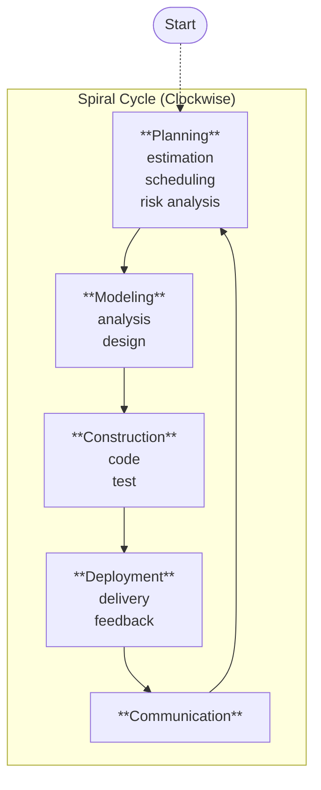

**Key Concepts:**

*   **Risk Consideration:** Risk is considered as each revolution is made.
*   **Anchor Points:** Anchor point milestones—combinations of work products and conditions attained along the path of the spiral—are noted for each evolutionary pass.

### Evolutionary Progression

*   The first circuit around the spiral might result in the development of a **product specification**.
*   Subsequent passes around the spiral might be used to develop a **prototype** and then progressively more sophisticated versions of the software.
*   Each pass through the **planning region** results in adjustments to the project plan.

The spiral model can be adapted to apply throughout the life of the computer software. Therefore, the first circuit around the spiral might represent a **"concept development project."**

== END OF PAGE 28 ==

== PERFECTED PAGE 29 / 193 ==
# SOFTWARE ENGINEERING AND PROJECT MANAGEMENT
### Dept of CSE, SVIT — 26

that starts at the core of the spiral and continues for multiple iterations until concept development is complete. The new product will evolve through a number of iterations around the spiral. Later, a circuit around the spiral might be used to represent a **"product enhancement project."**

The spiral model is a realistic approach to the development of large-scale systems and software. Because software evolves as the process progresses, the developer and customer better understand and react to risks at each evolutionary level. It maintains the systematic stepwise approach suggested by the classic life cycle but incorporates it into an iterative framework that more realistically reflects the real world.

---

## 2.3.4 CONCURRENT MODELS

The concurrent development model, sometimes called **concurrent engineering**, can be represented schematically as a series of framework activities, actions, tasks and their associated rules.

Figure 2.8 represents a Software Engineering activity within the modelling activity using a concurrent model approach.

**Figure 2.8: One Element of the Concurrent Process Model**

```
                    ┌─────────────┐
                    │  Inactive   │
                    └──────┬──────┘
                           │
                           ▼
              ┌────────────────────────┐
              │     Modeling Activity  │
              │                        │
              │   ┌──────────────┐     │
              │   │Under dev't   │     │
              │   └──────┬───────┘     │
              │          │             │
              │          ▼             │
              │   ┌──────────────┐     │
              │   │ Under review │─────┼──► Represents the state
              │   └──────┬───────┘     │    of a software eng.
              │          │             │    activity or task
              │          ▼             │
              │   ┌──────────────┐     │
              │   │ Baseline d   │     │
              │   └──────┬───────┘     │
              │          │             │
              │          ▼             │
              │   ┌──────────────┐     │
              │   │    Done      │     │
              │   └──────┬───────┘     │
              │          │             │
              │          ▼             │
              │   ┌──────────────┐     │
              │   │Awaiting      │     │
              │   │ changes      │     │
              │   └──────┬───────┘     │
              │          │             │
              │          ▼             │
              │   ┌──────────────┐     │
              │   │Under revision│     │
              │   └──────┬───────┘     │
              │          │             │
              │          └─────────────┘
              └────────────────────────┘
```

The activity modelling may be in any one of the states noted at any given time; similarly other activities, actions or tasks (Communication, Construction) can be represented in an analogous manner.

<br>
<div style="text-align: center;">Dept of CSE, SVIT <span style="float: right;">26</span></div>
== END OF PAGE 29 ==

== PERFECTED PAGE 30 / 193 ==

SOFTWARE ENGINEERING AND PROJECT MANAGEMENT 
 
 
 Dept of CSE, SVIT 
                                                                                                                                                                                        27 
 
All Software Engineering activities exist concurrently but reside in different states. E.g. 
Early in a project the communication activity has completed its 1st iteration and exists in the 
awaiting changes state. 
The modelling activity (which existed in inactive state) while initial communication was 
completed now make a transition into the under-development state. 
If however, the customer indicates that changes in requirement must be made, the 
modelling activity moves from under-development state to awaiting changes state. 
Concurrent modelling defines a series of events that will trigger transitions from state to 
state for each of the software engineering activities, actions or tasks. 
Concurrent modelling is applicable for all types of software development and provides an 
accurate picture of the current state of the project. 
2.4 SPECIALIZED PROCESS MODELS 
  2.4.1 Component-Based Development 
 
• 
The component-based development model incorporates many of the characteristics of the 
spiral model. It is evolutionary in nature, demanding an iterative approach to the creation of 
software. However, the component-based development model constructs applications from 
prepackaged software components. 
 
• 
Modeling and construction activities begin with the identification of candidate components. 
These components can be designed as either conventional software modules or object-
oriented classes or packages of classes. Regardless of the technology that is used to create 
the components. 
 
• 
The component-based development model incorporates the following steps 
1. Available component-based products are researched and evaluated for the application 
    domain in question. 
2. Component integration issues 

== END OF PAGE 30 ==

== PERFECTED PAGE 31 / 193 ==

# SOFTWARE ENGINEERING AND PROJECT MANGEMENT(BCS501)

**Figure 3.1: A CRC model index card**

| Class: FloorPlan | |
| :--- | :--- |
| **Description** | |
| **Responsibility:** | **Collaborator:** |
| Defines floor plan name/type | |
| Manages floor plan positioning | |
| Scales floor plan for display | |
| Scales floor plan for display | |
| Incorporates walls, doors, and windows | Wall |
| Shows position of video cameras | Camera |

---

### Classes
The taxonomy of class types can be extended by considering the following categories:

*   **Entity classes**, also called model or business classes, are extracted directly from the statement of the problem. These classes typically represent things that are to be stored in a database and persist throughout the duration of the application.
*   **Boundary classes** are used to create the interface that the user sees and interacts with as the software is used. Boundary classes are designed with the responsibility of managing the way entity objects are represented to users.
*   **Controller classes** manage a "unit of work" from start to finish. That is, controller classes can be designed to manage (1) the creation or update of entity objects, (2) the instantiation of boundary objects as they obtain information from entity objects, (3) complex communication between sets of objects, (4) validation of data communicated between objects or between the user and the application. In general, controller classes are not considered until the design activity has begun.

### Responsibilities
Wirfs-Brock and her colleagues suggest five guidelines for allocating responsibilities to classes:

1.  **System intelligence should be distributed across classes to best address the needs of the problem.** Every application encompasses a certain degree of intelligence; that is, what the system knows and what it can do.
2.  **Each responsibility should be stated as generally as possible.** This guideline implies that general responsibilities should reside high in the class hierarchy.

Prof. Madhura N, Assistant Professor, Dept of CSE, SVIT

== END OF PAGE 31 ==

== PERFECTED PAGE 32 / 193 ==

**SOFTWARE ENGINEERING AND PROJECT MANAGEMENT**

Dept of CSE, SVIT

*   The unified process related to “use case driven, architecture-centric, iterative and incremental” software process.
*   The Unified Process is an attempt to draw on the best features and characteristics of traditional software process models.
*   The Unified Process recognizes the importance of customer communication and streamlined methods for describing the customer’s view of a system.
*   It emphasizes the important role of software architecture and “helps the architect focus on the right goals.
*   It suggests a process flow that is iterative and incremental.
*   During the early 1990s James Rumbaugh, Grady Booch, and Ivar Jacobson began working on a “unified method”.
*   Combines the best features of OO models and adopts additional features proposed by other experts. Resulted in Unified Modeling Language (UML).

**PHASES OF UNIFIED PROCESS**

*   INCEPTION PHASE
*   ELABORATION PHASE
*   CONSTRUCTION PHASE
*   TRANSITION PHASE

The Unified Process is with five basic framework activities depicted in figure 2.9.

**Figure 2.9: The Unified Process**
[Diagram showing a cycle with phases: Inception, Elaboration, Construction, Transition, and Activities: Communication, Planning, Modeling, Construction, Deployment, Production]

1)  **Inception phase:** It involves both customer communication and planning activities.

    *   By collaborating with stakeholders, business requirements for the software are identified;
    *   A rough architecture for the system is proposed;
    *   A plan for the iterative, incremental nature of the ensuing project is developed.
    *   Fundamental business requirements are described.
    *   The architecture will be refined.
    *   Planning identifies resources, assesses major risks, defines a schedule, and establishes a basis for the phases.

Dept of CSE, SVIT
29
== END OF PAGE 32 ==

== PERFECTED PAGE 33 / 193 ==
# SOFTWARE ENGINEERING AND PROJECT MANAGEMENT

Dept of CSE, SVIT

## 2) Elaboration Phase

It involves the **communication** and **modeling** activities of the generic process model.

> Elaboration refines and expands the preliminary use cases that were developed as part of the inception phase and expands the architectural representation to include **five different views** of the software — the use case model, the requirements model, the design model, the implementation model, and the deployment model.

> In some cases, elaboration creates an **"executable architectural baseline"** that represents a *"first cut"* executable system.

> The architectural baseline demonstrates the viability of the architecture but does **not** provide all features and functions required to use the system.

> In addition, the plan is carefully reviewed.

> Modifications to the plan are often made at this time.

```
┌─────────────────────────────────────────────────────────┐
│              ELABORATION PHASE                          │
├─────────────────────────────────────────────────────────┤
│  • Refines preliminary use cases (from Inception)       │
│  • Expands architecture into 5 views:                   │
│      1. Use Case Model                                  │
│      2. Requirements Model                              │
│      3. Design Model                                    │
│      4. Implementation Model                            │
│      5. Deployment Model                                │
│  • Creates executable architectural baseline            │
│  • Demonstrates architectural viability                 │
│  • Plan is carefully reviewed & modified                │
└─────────────────────────────────────────────────────────┘
```

**Figure 2.1: Elaboration Phase – Key Activities & Outputs**

---

## 3) Construction Phase

It is identical to the **construction activity** defined for the generic software process.

> Using the architectural model as input, the construction phase develops or acquires the software components that will make each use case operational for end users.

> The elaboration phase reflects the final version of the software increment.

> All necessary and required features and functions for the software increment are then implemented in source code.

> As components are being implemented, **unit tests** are designed and executed for each.

> In addition, **integration activities** are conducted.

> Use cases are used to derive a suite of **acceptance tests** that are executed prior to the initiation of the next UP phase.

```
┌─────────────────────────────────────────────────────────┐
│              CONSTRUCTION PHASE                         │
├─────────────────────────────────────────────────────────┤
│  Input: Architectural Model                             │
│                                                          │
│  Activities:                                            │
│  ├─ Develop/Acquire software components                 │
│  ├─ Implement features & functions in source code       │
│  ├─ Design & execute unit tests per component           │
│  ├─ Conduct integration activities                      │
│  └─ Derive & execute acceptance tests                   │
│          (from use cases)                               │
│                                                          │
│  Output: Complete software increment ready for          │
│          Transition phase                               │
└─────────────────────────────────────────────────────────┘
```

**Figure 2.2: Construction Phase – Process Flow & Testing Strategy**

---

## 4) Transition Phase

It involves the **latter stages** of the generic construction activity and the **first part** of the generic deployment (delivery and feedback) activity.

> Software is given to end users for **beta testing** and user feedback reports both defects and necessary changes.

> In addition, the software team creates the necessary **support information** (e.g., user manuals, troubleshooting guides, installation procedures) that is required for the release.

> At the conclusion of the transition phase, the software increment becomes a **usable software release**.

```
┌─────────────────────────────────────────────────────────┐
│              TRANSITION PHASE                           │
├─────────────────────────────────────────────────────────┤
│  Key Activities:                                        │
│                                                          │
│  ① Beta Testing                                         │
│     └─ Software given to end users                      │
│     └─ Feedback collected (defects + changes)           │
│                                                          │
│  ② Support Documentation                                │
│     └─ User manuals                                     │
│     └─ Troubleshooting guides                           │
│     └─ Installation procedures                          │
│                                                          │
│  ③ Refinement & Fixes                                   │
│     └─ Address feedback & defect reports                │
│                                                          │
│  Outcome: Usable software release                       │
└─────────────────────────────────────────────────────────┘
```

**Figure 2.3: Transition Phase – Beta Testing & Support Delivery**

---

## 5) Production Phase

It coincides with the **deployment activity** of the generic process.

```
┌─────────────────────────────────────────────────────────┐
│              PRODUCTION PHASE                           │
├─────────────────────────────────────────────────────────┤
│  • Coincides with generic deployment activity           │
│  • Focuses on ongoing maintenance & updates             │
│  • Ensures software operates effectively in             │
│    production environment                               │
│  • Handles version upgrades & continuous delivery       │
└─────────────────────────────────────────────────────────┘
```

**Figure 2.4: Production Phase – Deployment & Maintenance**

---

## Unified Process Lifecycle Overview

```
╔══════════════════════════════════════════════════════════════════╗
║            UNIFIED PROCESS (UP) LIFECYCLE                       ║
╠══════════════════════════════════════════════════════════════════╣
║                                                                  ║
║   ┌──────────┐    ┌────────────┐    ┌───────────┐    ┌────────┐ ║
║   │  INCEPTION │───→│ ELABORATION │───→│CONSTRUCTION│───→│TRANSITION│║
║   │  (Phase 1) │    │  (Phase 2)  │    │ (Phase 3) │    │(Phase 4) │║
║   └──────────┘    └────────────┘    └───────────┘    └───┬────┘ ║
║                                                        ║        ║
║                                                        ▼        ║
║                                               ┌──────────┐    ║
║                                               │ PRODUCTION │   ║
║                                               │  (Phase 5) │   ║
║                                               └──────────┘    ║
║                                                        ▲        ║
║                                                        │        ║
║  ──────────────────────────────────────────────────────┘        ║
║                     (Iterative Cycles)                          ║
║                                                                  ║
╠══════════════════════════════════════════════════════════════════╣
║  KEY CHARACTERISTICS:                                            ║
║  • Iterative & Incremental                                       ║
║  • Use-case driven                                               ║
║  • Architecture-centric                                          ║
║  • Risk-focused                                                  ║
╚══════════════════════════════════════════════════════════════════╝
```

**Figure 2.5: Unified Process (UP) – Complete Phase Lifecycle**

---

### Phase Summary Table

| Phase | Focus | Key Deliverables |
|-------|-------|-----------------|
| **Inception** | Establish scope & feasibility | Initial use cases, business case |
| **Elaboration** | Define architecture & refine use cases | Architectural baseline, 5 software views |
| **Construction** | Build complete system | Fully implemented increment, tested components |
| **Transition** | Beta testing & deployment | User feedback, support documentation |
| **Production** | Maintenance & evolution | Ongoing releases, updates |

---

Dept of CSE, SVIT
30

== END OF PAGE 33 ==

== PERFECTED PAGE 34 / 193 ==

# SOFTWARE ENGINEERING AND PROJECT MANAGEMENT

- During this phase, the ongoing use of the software is monitored, support for the operating environment (infrastructure) is provided, and defect reports and requests for changes are submitted and evaluated.
- It is likely that at the same time the construction, transition, and production phases are being conducted.
- Work may have already begun on the next software increment. This means that the five UP phases do not occur in a sequence, but rather with staggered concurrency.

- A software engineering workflow is distributed across all UP phases.
- In the context of UP, a workflow is a task set.
- That is, a workflow identifies the tasks required to accomplish an important software engineering action and the work products that are produced as a consequence of successfully completing the tasks.
- It should be noted that not every task identified for a UP workflow is conducted for every software project.
- The team adapts the process (actions, tasks, subtasks, and work products) to meet its needs.

### Figure 2.1: Unified Process Workflow Distribution
*(Diagram illustrating how workflows are distributed across the Initial, Elaboration, Construction, Transition, and Production phases)*

## 2.6 PERSONAL AND TEAM PROCESS MODELS

The best software process is one that is close to the people who will be doing the work.

Watts Humphrey proposed two process models: **"Personal Software Process (PSP)"** and **"Team Software Process (TSP)."** Both require hard work, training, and coordination, but both are achievable.

### 2.6.1 Personal Software Process (PSP)

The Personal Software Process (PSP) emphasizes personal measurement of both the work product that is produced and the resultant quality of the work product. In addition, PSP makes the practitioner responsible for project planning and empowers the practitioner to control the quality of all software work products that are developed.

The PSP model defines five framework activities:

- **Planning.** This activity isolates requirements and develops both size and resource estimates. In addition, defects estimate (the number of defects projected for the work) is made. All metrics are recorded on worksheets or templates. Finally, development tasks are identified and a project schedule is created.

---
Dept of CSE, SVIT \hfill 31
== END OF PAGE 34 ==

== PERFECTED PAGE 35 / 193 ==
# SOFTWARE ENGINEERING AND PROJECT MANAGEMENT

## Personal Software Process (PSP)

**Figure 2.6.1: PSP Development Lifecycle Stages**

| Stage | Description |
|-------|-------------|
| **High-Level Design** | External specifications for each component to be constructed are developed and a component design is created. Prototypes are built when uncertainty exists. All issues are recorded and tracked. |
| **High-Level Design Review** | Formal verification methods are applied to uncover errors in the design. Metrics are maintained for all important tasks and work results. |
| **Development** | The component-level design is refined and reviewed. Code is generated, reviewed, compiled, and tested. Metrics are maintained for all important tasks and work results. |
| **Postmortem** | Using the measures and metrics collected, the effectiveness of the process is determined. Measures and metrics should provide guidance for modifying the process to improve its effectiveness. |

**PSP Emphasis:** PSP emphasizes identifying errors in the early stage of software development. Using the systematic approach of PSP, every work product is assessed with great care.

---

## 2.6.2 Team Software Process (TSP)

**Figure 2.6.2: TSP Framework by Watts Humphrey**

Watts Humphrey extended the lessons learned from the introduction of PSP and proposed a **Team Software Process (TSP)**. The goal of TSP is to build a *"self-directed"* project team that organizes itself to produce high-quality software.

### TSP Objectives

Humphrey defines the following objectives for TSP:

- **Build self-directed teams** that plan and track their work, establish goals, and own their processes and plans. These can be pure software teams or integrated product teams (IPTs) of 3 to about 20 engineers.
- **Show managers** how to coach and motivate their teams and how to help them sustain peak performance.
- **Accelerate software process improvement** by making CMM Level 5 behavior normal and expected.
- **Provide improvement guidance** to high-maturity organizations.
- **Facilitate university teaching** of industrial-grade team skills.

### Self-Directed Team Characteristics

A self-directed team has a consistent understanding of its overall goals and objectives; defines roles and responsibilities for each team member; tracks quantitative project data (about productivity and quality); identifies a team process that is appropriate for the project and a strategy for implementing the process; defines local standards that are applicable to the team's software engineering work; continually assesses risk and reacts to it; and tracks, manages, and reports project status.

---
Dept of CSE, SVIT | 32
== END OF PAGE 35 ==

== PERFECTED PAGE 36 / 193 ==
# SOFTWARE ENGINEERING AND PROJECT MANAGEMENT

**Dept of CSE, SVIT**

TSP defines the following framework activities: **project launch**, **high-level design**, **implementation**, **integration and test**, and **postmortem**. 

TSP makes use of a wide variety of scripts, forms, and standards that serve to guide team members in their work. 

*   **Scripts** define specific process activities (i.e., project launch, design, implementation, integration and system testing, postmortem) and other more detailed work functions (e.g., development planning, requirements development, software configuration management, unit test) that are part of the team process.

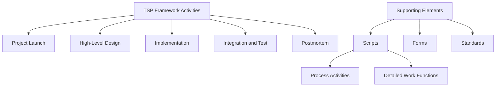

**Figure 36.1: TSP Framework Activities and Supporting Elements**

== END OF PAGE 36 ==

== PERFECTED PAGE 37 / 193 ==

# SOFTWARE ENGINEERING AND PROJECT MANAGEMENT (BCS501)

## Guidelines for the Derivation of a Data Flow Diagram

- The **level 0 data flow diagram** should depict the software/system as a single bubble;
- Primary input and output should be carefully noted;
- Refinement should begin by **isolating candidate processes, data objects, and data stores** to be represented at the next level;
- All arrows and bubbles should be labeled with meaningful names.
- Information flow continuity must be maintained from level to level; and
- One bubble at a time should be refined. There is a natural tendency to over-complicate the data flow diagram.

## Construction of the DFD — Level 0

1. Review the data models to isolate the data objects and use the grammatical parse to determine "operations".
2. Determine **External entities** [boxes] (Producers and Consumers of data).
3. Create Level 0 DFD.

**Figure 37.1: Context-level DFD for the Safe Home security function**

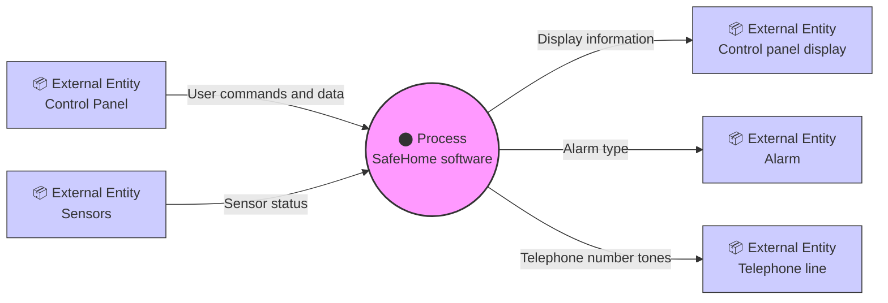

## Converting Level 0 DFD to Level 1 DFD

For converting level 0 DFD to level 1 DFD, we need to follow the following rules:

1. Apply a **"grammatical parse"** to the use case narrative that describes the context-level bubble.
2. Isolate all **nouns** (and noun phrases) and **verbs** (and verb phrases).
3. **Verbs** are processes which are represented as bubbles in a subsequent DFD.
4. **Nouns** are external entities / data objects / control objects / data store.

Information flow should be maintained from level 0 to level 1.

---

**Prof. Madhura N, Assistant Professor, Dept of CSE, SVIT** | 36

== END OF PAGE 37 ==

== PERFECTED PAGE 38 / 193 ==

# SOFTWARE ENGINEERING AND PROJECT MANAGEMENT (BCS501)

**Prof. Madhura N,** Assistant Professor, Dept of CSE, SVIT

---

### Level 1 Data Flow Diagram (DFD)

A **Level 1 Data Flow Diagram (DFD)** provides a more detailed view of the processes and data flows identified in the Level 0 DFD. It breaks down the high-level processes into smaller sub-processes and shows how they interact with each other via data flows.

In a Level 1 DFD, each process represented in the Level 0 DFD is further decomposed into its sub-processes or activities. The data flows between these processes are shown using arrows, indicating the direction of data movement.


**Figure 3.1: Level 1 DFD for SafeHome security function**

---

### Level 2 Data Flow Diagram (DFD)

The **Level 2 DFD** refines a specific process from the Level 1 diagram. In this example, it breaks down the "Monitor sensors" process into detailed sub-processes.


**Figure 3.2: Level 2 DFD that refines the monitor sensors process**

---

Prof. Madhura N, Assistant Professor, Dept of CSE, SVIT | 37
== END OF PAGE 38 ==

== PERFECTED PAGE 39 / 193 ==

SOFTWARE ENGINEERING AND PROJECT MANGEMENT(BCS501) 
Prof. Madhura N, Assistant Professor, Dept of CSE, SVIT                                                                                  38  
 
Control Flow Model 
➢ Application that contains collection of classes are dependent on the event rather than data, 
produce control information rather than reports or displays. 
➢ They require the use of control flow modeling in addition to data flow modeling. 
➢ An event or Control item is implemented as Boolean Value e.g. True or False , On or Off. 
 
Guideline for Control Flow: 
▪ List all processes(bubbles)  that are performed by the software. 
▪ List all the interrupt conditions. 
▪ List all activities that are performed by operator or actor. 
▪ List all data conditions. 
▪ Review all the “ Control items” as possible for control flow inputs/outputs. 
▪ Describe the behavior of a system by identifying its states; identify how each state is 
reached; define the transitions between states. 
▪ Focus on possible omission – a very common error in specifying control. 
▪ In SafeHome software sensor events(a sensor has been tripped), blink flag (a signal to blink 
the display) and start/stop switch(a signal to turn the system on or off) are events or control 
items. 
The Control Specification 
A Control Specification( CSPEC) represents behavior of the system in two different ways. The 
CSPEC contains. 
  -- A State diagram that is a sequential specification of behavior. 
  -- A program activation table—a combinatorial specification of behavior. 
By reviewing the state diagram, a software engineer can determine the behaviour of the system 
and can discover whether there are “holes” in specified behaviour. 
Figure 7.4 depicts a preliminary state diagram for the level 1 control flow model for SafeHome. 
The transitions from the Idle state can occur if the system is reset, activated, or powered off. 
If the system is activated (i.e., alarm system is turned on), a transition to the 

== END OF PAGE 39 ==

== PERFECTED PAGE 40 / 193 ==

SOFTWARE ENGINEERING AND PROJECT MANGEMENT(BCS501) 
Prof. Madhura N, Assistant Professor, Dept of CSE, SVIT                                                                                  39  
 
Two transitions occur out of the MonitoringSystemStatus state—(1) when the system is 
deactivated, a transition occurs back to the Idle state; (2) when a sensor is triggered into the 
ActingOnAlarm state. 
 
 
 
 
 
 
 
 


== END OF PAGE 40 ==

== PERFECTED PAGE 41 / 193 ==

SOFTWARE ENGINEERING AND PROJECT MANGEMENT(BCS501) 
Prof. Madhura N, Assistant Professor, Dept of CSE, SVIT                                                                                  40  
 
Process Specification (PSEPC) 
▪ Process Specification is created for each of the bubble in the Data Flow Model as a mini-
spec for design and implementation. 
It includes: 
 --- Textual narration 
 ---  Algorithms 
 --- Mathematical equations, tables 
 --- Rules, Decision Tree and Decision table 
 --- Diagrams or Charts 
▪ A Program design language  (PDL) description may be included, but this is normally 
done during design. 
  
BEHAVIORAL MODEL 
Behavioral Model indicates how software will respond to external events or stimuli. 
To create model, we should follow below steps— 
▪ Evaluate all use cases to understand the sequence of interaction within the system. 
▪ Identify Events that driven the interaction sequence and understand how these events 
relate to specific objects. 
▪ Create sequence for each use-case. 
▪ Build a state diagram for the system. 
▪ Review the behavioral model to verify accuracy or consistency. 
 
Identifying events with the use cases 
▪ Use-case represents a sequence of activities that involves actors and the system. 
▪ An event occurs whenever the system and an actor exchange information. 
▪ An event is not the information that has been exchanged, but rather the fact that 
information has been exchanged. 
The homeowner uses the keypad to key in a four-digit password. The password is compared with 
the valid password stored in the system. If the password is incorrect, the control panel will beep 


== END OF PAGE 41 ==

== PERFECTED PAGE 42 / 193 ==

# SOFTWARE ENGINEERING AND PROJECT MANAGEMENT (BCS501)
**Prof. Madhura N, Assistant Professor, Dept of CSE, SVIT**

---

once and reset itself for additional input. If the password is correct, the control panel awaits further action.

> ***Note:*** Underlined portions of the use case scenario indicate events.

*   An actor should be identified for each event.
*   Information that is exchanged should be noted.
*   Any conditions or constraints should be listed.
*   A state is represented by a rounded rectangle.
*   A transition (i.e., event) is represented by a labeled arrow leading from one state to another.

## BEHAVIORAL MODELING — State Representation

*   **Passive State** is simply the current status of all of an object’s attributes.
    *   *Example:* Player class
    *   *Attributes:* Current position and orientation.
*   **Active State** is the current state of the object as it undergoes a continuing transformation or processing.
    *   *Example:* Player class
    *   *Active states:* Moving, injured, trapped, lost, etc.
*   An event must occur to force an object to make a transition from one active state to another.

## BEHAVIORAL MODELING — State Diagrams for Analysis Classes

*   Each arrow shown in Figure 7.6 represents a transition from one active state of an object to another.
*   The labels shown for each arrow represent the event that triggers the transition.

**Figure 7.6: State diagram for the ControlPanel class**

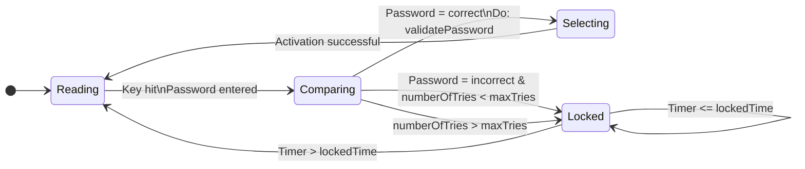

<br>

Prof. Madhura N, Assistant Professor, Dept of CSE, SVIT
41

== END OF PAGE 42 ==

== PERFECTED PAGE 43 / 193 ==

# BEHAVIORAL MODELING - Sequence Diagram

The second type of behavioral representation, called a **Sequence diagram** in UML, indicates how events cause flow from one object to another as a function of time.

**Figure 7.7: Sequence diagram (partial) for the SafeHome security function**

[Diagram: Sequence diagram showing interactions between Homeowner, Control panel, System, and Sensors objects with states Reading, Comparing, Locked, Selecting and message flows including System ready, Password entered, Request lookup, Result/Password = correct, Request activation, and Activation successful]

- The first event, **system ready**, is derived from the external environment and channels behavior to the **Homeowner** object.
- The homeowner enters a password. A **Request lookup** event is passed to **System**, which looks up the password in a simple database and returns a result (found or not found) to **ControlPanel** (now in the *comparing* state).
- A valid password results in a **password = correct** event to **System**, which activates **Sensors** with a request activation event.
- Control is passed back to the homeowner with the **activation successful** event.

**Prof. Madhura N, Assistant Professor, Dept of CSE, SVIT**

== END OF PAGE 43 ==

== PERFECTED PAGE 44 / 193 ==
# LECTURE NOTES ON
## SOFTWARE ENGINEERING AND PROJECT MANAGEMENT (BCS501)

**2024 – 2025**

**B. E V Semester**

Madhura N, Assistant Professor  
Sowmya H.N, Assistant Professor

Department of Computer Science & Engineering  
**Sai Vidya Institute of Technology**  
Bengaluru - 560064

[Figure 0.1: Sai Vidya Institute of Technology Logo and 15th Anniversary Emblem]

**Web:** www.saividya.ac.in  
**Facebook:** https://www.facebook.com/SaiVidyaInstituteOfTechnology

SVIT is now ranked 3rd in Bangalore, 6th in Karnataka and 31st across India.  
*(Source: DATAQUEST-CMR 'Best T-School Survey Report March'2020)*

== END OF PAGE 44 ==

== PERFECTED PAGE 45 / 193 ==

# SOFTWARE ENGINEERING AND PROJECT MANAGEMENT(BCS501) 
**DEPT OF CSE, SVIT**

## Module-3

**AGILE DEVELOPMENT:** What is Agility? Agility and the cost of change. What is an agile Process? Extreme Programming (XP), Other Agile Process Models, A tool set for Agile process

**PRINCIPLES THAT GUIDE PRACTICE:** Software Engineering Knowledge, Core principles, Principles that guide each framework activity

**Textbook 1: Chater 3: 3.1 to 3.6, Chapter 4: 4.1 to 4.4**

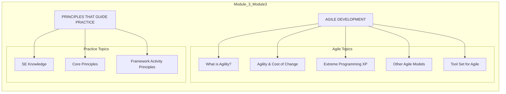

**Figure 3.1: Module-3 Topic Breakdown**

== END OF PAGE 45 ==

== PERFECTED PAGE 46 / 193 ==

**SOFTWARE ENGINEERING AND PROJECT MANAGEMENT (BCS501)**

### MODULE 3
### CHAPTER 1---AGILE DEVELOPMENT

#### 1.1 WHAT IS AGILITY?

*   Agile is a software development methodology to build software incrementally using short iterations of 1 to 4 weeks so that the development process is aligned with the changing business needs.
*   An agile team is a nimble team able to appropriately respond to changes. Change is what software development is very much about. Changes in the software being built, changes to the team members, changes because of new technology, changes of all kinds that may have an impact on the product they build or the project that creates the product. Support for changes should be built-in everything we do in software, something we embrace because it is the heart and soul of software.
*   An agile team recognizes that software is developed by individuals working in teams and that the skills of these people, their ability to collaborate is at the core for the success of the project.
*   The aim of agile process is to deliver the working model of software quickly to the customer. For example: Extreme programming is the best known of agile process.

#### 1.2 AGILITY AND THE COST OF CHANGE

**Figure 1.1: Cost of Change in Conventional Development**
*(Diagram showing the cost of change increasing non-linearly as the project progresses)*

*   In conventional software development, the cost of change increases non-linearly as a project progresses (Fig Solid Black curve).
*   An agile process reduces the cost of change because software is released in increments and change can be better controlled within an increment.
*   Agility argues that a well-designed agile process “flattens” the cost of change curve shown in the following figure (shaded, solid curve), allowing a software team to accommodate changes late in a software project without dramatic cost and time impact.

**Figure 1.2: Flattening the Cost of Change Curve**
*(Diagram showing the cost of change curve flattened by agile practices)*

*   When incremental delivery is coupled with other agile practices such as continuous unit testing and pair programming, the cost of making a change is attenuated (reduced). Although debate about the degree to which the cost curve flattens is ongoing, there is evidence to suggest that a significant reduction in the cost of change can be achieved: application, design, architecture, etc. The verification process involves activities like reviews, walk-throughs, and inspection.

Prof. Madhura N, Asst. Professor, Dept of CSE, SVIT

== END OF PAGE 46 ==

== PERFECTED PAGE 47 / 193 ==

# SOFTWARE ENGINEERING AND PROJECT MANAGEMENT (BCS501)

**Prof. Madhura N, Asst. Professor, Dept of CSE, SVIT**

---

## Figure 1.3: Cost of Change Comparison — Conventional vs. Agile Processes

```
Development cost
    │
    │                          Cost of change
    │                          using conventional
    │                          software processes
    │                                  ╱
    │                                 ╱
    │                                ╱
    │                               ╱
    │              Cost of change  ╱
    │              using agile    ╱
    │              processes     ╱
    │              ─────────────╱───────────
    │              ─────────────╲
    │         Idealized cost of  ╲
    │         change using agile ╲
    │         process            ╲
    │
    └──────────────────────────────────────────
                    Development schedule progress
```

---

## 1.3 WHAT IS AN AGILE PROCESS?

Any agile software process is characterized in a manner that addresses a number of key assumptions about the majority of software projects:

1. It is difficult to predict in advance which software requirements will persist and which will change. It is equally difficult to predict how customer priorities will change as the project proceeds.

2. For many types of software, design and construction are interleaved. That is, both activities should be performed in tandem so that design models are proven as they are created. It is difficult to predict how much design is necessary before construction is used to prove the design.

3. Analysis, design, construction, and testing are not as predictable.

Given these three assumptions, an important question arises:

> **1) How do we create a process that can manage unpredictability?**

It lies in **process adaptability**. An **agile process**, therefore, **must be adaptable**. But continual adaptation without forward progress accomplishes little. Therefore, an agile software process must adapt **incrementally**.

To accomplish incremental adaptation, an agile team requires customer feedback. An effective catalyst for customer feedback is an operational prototype or a portion of an operational system. Hence, an **incremental development strategy** should be instituted. Software increments must be delivered in **short time periods** so that adaptation keeps pace with change.

This iterative approach enables the customer to evaluate the software increment regularly, provide necessary feedback to the software team, and influence the process adaptations that are made to accommodate the feedback.

---

*Prof. Madhura N, Asst. Professor, Dept of CSE, SVIT*

== END OF PAGE 47 ==

== PERFECTED PAGE 48 / 193 ==
# SOFTWARE ENGINEERING AND PROJECT MANAGEMENT(BCS501)

## 1.3.1 Agility Principles

Agility principles for those who want to achieve agility:

1. Our highest priority is to **satisfy the customer** through early and continuous delivery of valuable software.
2. **Welcome changing requirements**, even late in development. Agile processes harness change for the customer’s competitive advantage.
3. **Deliver working software frequently**, from a couple of weeks to a couple of months, with a preference to the shorter timescale.
4. Business people and developers **must work together** daily throughout the project.
5. Build projects around **motivated individuals**. Give them the environment and support they need, and trust them to get the job done.
6. The most efficient and effective method of conveying information to and within a development team is **face-to-face conversation**.
7. **Working software** is the primary measure of progress.
8. Agile processes promote **sustainable development**. The sponsors, developers, and users should be able to maintain a constant pace indefinitely.
9. Continuous attention to **technical excellence and good design** enhances agility.
10. **Simplicity**—the art of maximizing the amount of work not done—is essential.
11. The best architectures, requirements, and designs emerge from **self-organizing teams**.
12. At regular intervals, the team reflects on how to become more **effective**, then tunes and adjusts its behavior accordingly.

Not every agile process model applies these 12 principles with equal weight, and some models choose to ignore (or at least downplay) the importance of one or more of the principles.

## 1.3.2 The Politics of Agile Development

- There is debate about the benefits and applicability of agile software development as opposed to more conventional software engineering processes (produces documents rather than working product).
- Even within the agile, there are many proposed process models each with a different approach to the agility.

## 1.3.3 Human Factors

Agile development focuses on the talents and skills of individuals, molding the process to specific people and teams. The key point in this statement is that *the process molds to the needs of the people and team*.

Prof. Madhura N, Asst.Professor, Dept of CSE, SVIT
5

== END OF PAGE 48 ==

== PERFECTED PAGE 49 / 193 ==

# Agile Team Competence Characteristics

> *Software Engineering and Project Management (BCS501)*  
> Prof. Madhura N, Asst. Professor, Dept of CSE, SVIT

---

## 1. Competence

In an **agile development context**, *"competence"* encompasses **innate talent**, **specific software-related skills**, and **overall knowledge of the process** that the team has chosen to apply. Skill and knowledge of process can and should be taught to all people who serve as agile team members.

---

## 2. Common Focus

Although members of the agile team may perform different tasks and bring different skills to the project, **all should be focused on one goal**—to deliver a working software increment to the customer within the time promised. To achieve this goal, the team will also focus on **continual adaptations** (small and large) that will make the process fit the needs of the team.

---

## 3. Collaboration

Software engineering (regardless of process) is about:

- Assessing, analyzing, and using information that is communicated to the software team
- Creating information that will help all stakeholders understand the work of the team
- Building information (computer software and relevant databases) that provides business value for the customer

To accomplish these tasks, **team members must collaborate**—with one another and all other stakeholders.

---

## 4. Decision-Making Ability

Any good software team (including agile teams) must be allowed the **freedom to control its own destiny**. This implies that the team is given **autonomy**—decision-making authority for both technical and project issues.

---

## 5. Fuzzy Problem-Solving Ability

Software managers must recognize that the agile team will **continually have to deal with ambiguity** and will continually be buffeted by change.

---

## 6. Mutual Trust and Respect

The agile team must become what **DeMarco and Lister** call a **"jelled" team**. A jelled team exhibits the trust and respect that are necessary to make them *"so strongly knit that the whole is greater than the sum of the parts."*

---

## 7. Self-Organization

In the context of agile development, **self-organization** implies three things:

1. The agile team organizes itself for the work to be done
2. The team organizes the process to best accommodate its local environment
3. The team organizes the work schedule to best achieve delivery of the software increment

Self-organization has a number of technical benefits, but more importantly, it serves to **improve collaboration** and **boost team morale**.

---

**Figure 4.1: Seven Competencies of an Agile Team**

```
    ┌─────────────────────────────────────┐
    │           AGILE TEAM               │
    │         COMPETENCE MODEL            │
    └─────────────────────────────────────┘
                  ╱  ╲
                 ╱    ╲
        ┌───────┐    ┌───────┐
        │ 1.    │    │ 2.    │
        │Compe- │    │Common │
        │tence  │    │ Focus │
        └───┬───┘    └───┬───┘
            │            │
      ┌─────┴────┐  ┌────┴─────┐
      │  3.      │  │  4.      │
      │Collabor- │  │Decision- │
      │ation     │  │Making   │
      └─────┬────┘  └────┬─────┘
            │            │
         ┌──┴──┐    ┌──┴──┐
         │ 5.  │    │ 6.  │
         │Fuzzy │    │Mu-  │
         │Prob. │    │tually│
         │Solv.│    │Trust │
         └──┬──┘    └──┬──┘
            │            │
         ┌──┴────────────┴──┐
         │     7.          │
         │  Self-         │
         │  Organization  │
         └────────────────┘
```

*All seven characteristics are interconnected and mutually reinforcing in forming an effective agile team.*

---

## Summary Table

| # | Competency | Key Description |
|---|-----------|-----------------|
| 1 | **Competence** | Innate talent + skills + process knowledge (can be taught) |
| 2 | **Common Focus** | Unified goal: deliver working software within time promised |
| 3 | **Collaboration** | Work with team members and all stakeholders |
| 4 | **Decision-Making** | Team autonomy over technical and project issues |
| 5 | **Fuzzy Problem-Solving** | Comfort with ambiguity and constant change |
| 6 | **Mutual Trust & Respect** | "Jelled" team — whole greater than sum of parts |
| 7 | **Self-Organization** | Organize work, process, and schedule independently |

---

== END OF PAGE 49 ==

== PERFECTED PAGE 50 / 193 ==

# SOFTWARE ENGINEERING AND PROJECT MANAGEMENT (BCS501)

## 1.4 EXTREME PROGRAMMING (XP)

**Extreme Programming (XP)**, the most widely used approach to agile software development, emphasizes business results first and takes an incremental, get-something-started approach to building the product, using continual testing and revision. XP was proposed by **Kent Beck** during the late 1980s.

### 1.4.1 XP Values

Beck defines a set of **five values** that establish a foundation for all work performed as part of XP—**communication, simplicity, feedback, courage, and respect**. Each of these values is used as a driver for specific XP activities, actions, and tasks.

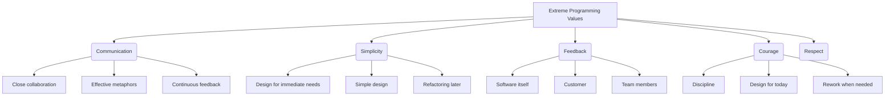

**Figure 1.1: Extreme Programming Values Framework**

In order to achieve effective **communication** between software engineers and other stakeholders, XP emphasizes close, yet informal collaboration between customers and developers, the establishment of effective metaphors for communicating important concepts, continuous feedback, and the avoidance of voluminous documentation as a communication medium.

To achieve **simplicity**, XP restricts developers to design only for immediate needs, rather than consider future needs. The intent is to create a simple design that can be easily implemented in code. If the design must be improved, it can be refactored at a later time.

**Feedback** is derived from three sources: the implemented software itself, the customer, and other software team members. By designing and implementing an effective testing strategy, the software provides the agile team with feedback. XP makes use of the **unit test** as its primary testing tactic. As each class is developed, the team develops a unit test to exercise each operation according to its specified functionality.

Beck argues that strict adherence to certain XP practices demands **courage**. A better word might be **discipline**. An agile XP team must have the discipline (courage) to design for today, recognizing that future requirements may change dramatically, thereby demanding substantial rework of the design and implemented code.

By following each of these values, the agile team inculcates **respect** among its members, between other stakeholders and team members, and indirectly, for the software itself. As they achieve successful delivery of software increments, the team develops growing respect for the XP process.

---
Prof. Madhura N, Asst. Professor, Dept of CSE, SVIT

== END OF PAGE 50 ==

== PERFECTED PAGE 51 / 193 ==

**SOFTWARE ENGINEERING AND PROJECT MANAGEMENT(BCS501)**

### 1.4.2 The XP Process

Extreme Programming uses an object-oriented approach as its preferred development paradigm and encompasses a set of rules and practices that occur within the context of **four framework activities: planning, design, coding, and testing.** Following figure illustrates the XP process and notes some of the key ideas and tasks that are associated with each framework activity.

**Figure 3.2: The Extreme Programming process**

*(Diagram Description: A cyclical flow chart showing four main stages: Planning, Design, Coding, and Test.)*
*   **Planning** inputs: user stories, values, acceptance test criteria, iteration plan.
*   **Design** inputs: simple design, CRC cards, spike solutions, prototypes.
*   **Coding** inputs: refactoring, pair programming.
*   **Test** inputs: unit test, continuous integration, acceptance testing.
*   **Output/Release:** software increment, project velocity computed.

Key XP activities are

**1) Planning.** The planning activity begins with listening—a requirements gathering activity.

*   **Listening** leads to the creation of a set of "stories" (also called user stories) that describe required output, features, and functionality for software to be built.
*   Each story is written by the customer and is placed on an index card. The customer assigns a value (i.e., a priority) to the story based on the overall business value of the feature or function.
*   Members of the XP team then assess each story and assign a cost— measured in development weeks—to it.
*   If the story is estimated to require more than three development weeks, the story into smaller stories and the assignment of value and cost occurs again. It is important to note that new stories can be written at any time.

Prof. Madhura N, Asst.Professor, Dept of CSE, SVIT
8

== END OF PAGE 51 ==

== PERFECTED PAGE 52 / 193 ==
SOFTWARE ENGINEERING AND PROJECT MANAGEMENT(BCS501)

Prof. Madhura N, Asst.Professor, Dept of CSE, SVIT

• The stories with highest value will be moved up in the schedule and implemented first

**2) Design.** XP design rigorously follows the KIS (keep it simple) principle.

• If a difficult design problem is encountered as part of the design of a story, XP recommends the immediate creation of an operational prototype of that portion of the design. **Called a spike solution.**

• XP encourages **refactoring**—a construction technique that is also a method for design optimization.

• Refactoring is the process of changing a software system in a way that it does not change the external behavior of the code and improves the internal structure.

**3) Coding.** After stories are developed and preliminary design work is done, the team does not move to code; develops a series of unit tests for each of the stories that is to be included in the current release (software increment).

• Once the unit test has been created, the developer is better able to focus on what must be implemented to pass the test.

• Once the code is complete, it can be unit-tested immediately, and providing feedback to the developers.

• A key concept during the coding activity is **pair programming**. i.e., two people work together at one computer workstation to create code for a story.

• As pair programmers complete their work, the code they develop is integrated with the work of others.

**4) Testing.** The creation of unit tests before coding commences is a key element of the XP approach. The unit tests that are created should be implemented using a framework that enables them to be automated. This encourages a regression testing strategy whenever code is modified.

• As the individual unit tests are organized into a "universal testing suite" integration and validation testing of the system can occur on a daily basis. This provides the XP team with a continual indication of progress and also can raise warning flags early if things go awry. Wells states: "Fixing small problems every few hours takes less time than fixing huge problems just before the deadline."

Figure 5.2: Extreme Programming (XP) Practices - Design, Coding, and Testing

Prof. Madhura N, Asst.Professor, Dept of CSE, SVIT

9
== END OF PAGE 52 ==

== PERFECTED PAGE 53 / 193 ==

# SOFTWARE ENGINEERING AND PROJECT MANAGEMENT (BCS501)

---

## XP Acceptance Tests

- **XP acceptance tests**, also called **customer tests**, are specified by the customer and focus on overall system features and functionality that are visible and reviewable by the customer.
- Acceptance tests are derived from **user stories** that have been implemented as part of a software release.

---

## 1.4.3 Industrial XP

> **"IXP is an organic evolution of XP. It is imbued with XP's minimalist, customer-centric, test-driven spirit. IXP differs most from the original XP in its greater inclusion of management, its expanded role for customers, and its upgraded technical practices."**
>
> — *Joshua Kerievsky*

IXP incorporates **six new practices** designed to help ensure that an XP project works successfully for significant projects within a large organization.

```
┌─────────────────────────────────────────────────────────────────┐
│            Industrial Extreme Programming (IXP)                 │
│                     Six New Practices                           │
├─────────────────────────────────────────────────────────────────┤
│  ① Readiness Assessment          ④ Test-Driven Management       │
│  ② Project Community             ⑤ Retrospective                │
│  ③ Project Chartering            ⑥ Program Manager              │
└─────────────────────────────────────────────────────────────────┘
```

**Figure 1.4: Industrial XP – Six New Practices**

---

### 1. Readiness Assessment

Prior to the initiation of an IXP project, the organization should conduct a **readiness assessment**. The assessment ascertains whether:

| # | Criterion | Description |
|---|-----------|-------------|
| 1 | **Development Environment** | An appropriate environment exists to support IXP |
| 2 | **Stakeholder Population** | The team will be populated by the proper set of stakeholders |
| 3 | **Quality Program** | The organization has a distinct quality program and supports continuous improvement |
| 4 | **Organizational Culture** | The culture will support the new values of an agile team |
| 5 | **Project Community** | The broader project community will be populated appropriately |

---

### 2. Project Community

Classic XP suggests that the right people be used to populate the agile team to ensure success. The implication is that people on the team must be:

- Well-trained
- Adaptable and skilled
- Possessing the proper temperament to contribute to a **self-organizing team**

When XP is applied for a significant project in a large organization, the concept of the **"team"** should morph into that of a **community**.

```
                    ┌──────────────────┐
                    │   IXP Community   │
                    └────────┬─────────┘
         ┌───────────────────┼───────────────────┐
         ▼                   ▼                   ▼
┌─────────────────┐ ┌─────────────────┐ ┌─────────────────┐
│   Core Members   │ │   Peripheral    │ │   Stakeholders   │
│  Technologist   │ │    Roles        │ │   (Legal, QA,    │
│     & Customers │ │ • Manufacturing  │ │   Sales, etc.)  │
│                 │ │ • Quality Auditors│ │                 │
│ Central to the  │ │ • Sales Types    │ │ Important roles  │
│   success of    │ │                 │ │ at the periphery │
│     the project │ │ May play important│ │   of the project │
│                 │ │ roles on project  │ │                 │
└─────────────────┘ └─────────────────┘ └─────────────────┘
```

**Figure 1.5: IXP Project Community Structure**

In IXP, the community members and their roles should be **explicitly defined**, and mechanisms for **communication and coordination** between community members should be established.

---

### 3. Project Chartering

The IXP team assesses the project itself to determine:

1. Whether an appropriate **business justification** for the project exists
2. Whether the project will further the **overall goals and objectives** of the organization
3. How the project **complements, extends, or replaces** existing systems or processes

---

### 4. Test-Driven Management

An IXP project requires **measurable criteria** for assessing the state of the project and the progress that has been made to date.

**Test-driven management** establishes a series of measurable **"destinations"** and then defines mechanisms for determining whether or not these destinations have been reached.

```
┌──────────────────────────────────────────────────────────────┐
│                   Test-Driven Management                      │
├──────────────────────────────────────────────────────────────┤
│                                                              │
│   ┌──────────┐    ┌──────────┐    ┌──────────┐              │
│   │ Dest. 1  │ →  │ Dest. 2  │ →  │ Dest. 3  │    ...       │
│   └────┬─────┘    └────┬─────┘    └────┬─────┘              │
│        │               │               │                    │
│   Measure                   Measure                Measure  │
│   Progress                Progress               Progress   │
│                                                              │
└──────────────────────────────────────────────────────────────┘
```

**Figure 1.6: Test-Driven Management – Measurable Destinations**

---

| | |
|---|---|
| **Prof. Madhura N, Asst. Professor** | **Page 10** |
| Dept of CSE, SVIT | |

== END OF PAGE 53 ==

== PERFECTED PAGE 54 / 193 ==

# SOFTWARE ENGINEERING AND PROJECT MANAGEMENT (BCS501)

**Prof. Madhura N, Asst. Professor, Dept of CSE, SVIT**

---

### Retrospectives

An IXP team conducts a specialized technical review after a software increment is delivered. Called a **retrospective**, the review examines *"issues, events, and lessons-learned"* across a software increment and/or the entire software release. The intent is to improve the IXP process.

### Continuous Learning

Because learning is a vital part of continuous process improvement, members of the XP team are encouraged (and possibly, incented) to learn new methods and techniques that can lead to a higher quality product.

---

### 1.4.4 The XP Debate

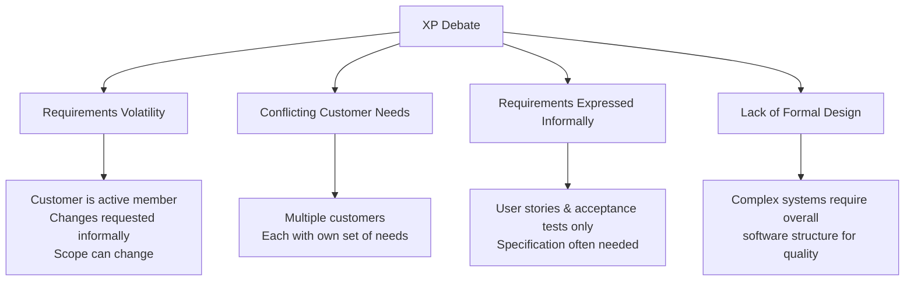

**Figure 1.1: The XP Debate – Key Concerns and Implications**

| Concern | Description |
|---------|-------------|
| **Requirements Volatility** | The customer is an active member of the XP team; changes to requirements are requested informally. As a consequence, the scope of the project can change, and earlier work may have to be modified to accommodate current needs. |
| **Conflicting Customer Needs** | Many projects have multiple customers, each with his own set of needs. |
| **Requirements Are Expressed Informally** | User stories and acceptance tests are the only explicit manifestation of requirements in XP. A specification is often needed to remove inconsistencies and errors before the system is built. |
| **Lack of Formal Design** | When complex systems are built, design must have the overall structure of the software, then it will exhibit quality. |

---

### 1.5 OTHER AGILE PROCESS MODELS

Other agile process models have been proposed and are in use across the industry. Among the most common are:

```mermaid
graph LR
    subgraph "Established Agile Models"
        A[Adaptive Software Development<br/>(ASD)]
        B[Scrum]
        C[Dynamic Systems Development Method<br/>(DSDM)]
    end
    
    subgraph "Specialized Approaches"
        D[Crystal]
        E[Feature-Driven Development<br/>(FDD)]
        F[Lean Software Development<br/>(LSD)]
    end
    
    subgraph "Modeling & Process"
        G[Agile Modeling<br/>(AM)]
        H[Agile Unified Process<br/>(AUP)]
    end
```

**Figure 1.2: Classification of Other Agile Process Models**

| Category | Models |
|----------|--------|
| **Established Frameworks** | Adaptive Software Development (ASD), Scrum, Dynamic Systems Development Method (DSDM) |
| **Specialized Approaches** | Crystal, Feature-Driven Development (FDD), Lean Software Development (LSD) |
| **Modeling & Process** | Agile Modeling (AM), Agile Unified Process (AUP) |

---

*Prof. Madhura N, Asst. Professor, Dept of CSE, SVIT* | *Page 11*

== END OF PAGE 54 ==

== PERFECTED PAGE 55 / 193 ==

# SOFTWARE ENGINEERING AND PROJECT MANAGEMENT (BCS501)

**Prof. Madhura N**, Asst. Professor, Dept of CSE, SVIT

---

## Adaptive Software Development (ASD)

Adaptive Software Development (ASD) has been proposed by **Jim Highsmith** as a technique for building complex software and systems. The philosophical underpinnings of ASD focus on **human collaboration** and **team self-organization**.

Highsmith argues that an agile, adaptive development approach based on collaboration is *"as much a source of order in our complex interactions as discipline and engineering."* He defines an ASD **"life cycle"** that incorporates three phases: **speculation**, **collaboration**, and **learning**.

**Figure 5.1: Adaptive Software Development Lifecycle**

```
┌─────────────────────────────────────────────────────────────────┐
│                         SPECULATION                              │
│  ────────────────────────────────────────────────────────────    │
│  • Project initiation & adaptive cycle planning                  │
│  • Inputs: customer mission statement                            │
│            project constraints (delivery dates, user descriptions)│
│            basic requirements                                    │
│  • Output: release cycles (software increments) plan             │
└─────────────────────────────┬───────────────────────────────────┘
                              ▼
┌─────────────────────────────────────────────────────────────────┐
│                        COLLABORATION                             │
│  ────────────────────────────────────────────────────────────    │
│  • Requirements gathering (JAD sessions, mini-specs)            │
│  • Emphasis on communication, teamwork, AND individualism        │
│  • Trust is paramount:                                         │
│    1. Criticize without animosity                               │
│    2. Assist without resentment                                 │
│    3. Work as hard as or harder than others                       │
│    4. Have skill set to contribute                              │
│    5. Communicate problems leading to effective action          │
└─────────────────────────────┬───────────────────────────────────┘
                              ▼
┌─────────────────────────────────────────────────────────────────┐
│                          LEARNING                                │
│  ────────────────────────────────────────────────────────────    │
│  • Components implemented/tested                                │
│  • Focus groups for feedback                                     │
│  • Formal technical reviews                                      │
│  • Postmortems                                                    │
│  • Output: release (software increment + adjustments)           │
└─────────────────────────────┬───────────────────────────────────┘
                              ▼
                    (iterates back to Speculation)
```

### The Three Phases in Detail

#### 1. Speculation
During **speculation**, the project is initiated and **adaptive cycle planning** is conducted. Adaptive cycle planning uses project initiation information—the customer's mission statement, project constraints (e.g., delivery dates or user descriptions), and basic requirements—to define the set of release cycles (software increments) that will be required for the project.

#### 2. Collaboration
Motivated people use **collaboration** in a way that multiplies their talent and creative output beyond their absolute numbers. This approach is a recurring theme in all agile methods. But collaboration is not easy. It encompasses communication and teamwork, but it also emphasizes **individualism**, because individual creativity plays an important role in collaborative thinking. It is, above all, a matter of **trust**.

People working together must trust one another to:
1. Criticize without animosity
2. Assist without resentment
3. Work as hard as or harder than they do
4. Have the skill set to contribute to the work at hand
5. Communicate problems or concerns in a way that leads to effective action

#### 3. Learning
As members of an ASD team begin to develop the components that are part of an adaptive cycle, the emphasis is on **"learning"** as much as it is on progress toward a completed cycle.

---

**Page 12** | Prof. Madhura N, Asst. Professor, Dept of CSE, SVIT

== END OF PAGE 55 ==

== PERFECTED PAGE 56 / 193 ==

**SOFTWARE ENGINEERING AND PROJECT MANAGEMENT(BCS501)**

ASD teams learn in three ways: **focus groups**, **technical reviews**, and **project postmortems**. ASD’s overall emphasis on the dynamics of self-organizing teams, interpersonal collaboration, and individual and team learning yield software project teams that have a much higher likelihood of success.

### Scrum

Scrum is an agile software development method that was conceived by Jeff Sutherland and his development team in the early 1990s. Scrum principles are consistent with the agile manifesto and are used to guide development activities within a process that incorporates the following framework activities: requirements, analysis, design, evolution, and delivery. Within each framework activity, work tasks occur within a process pattern called a sprint. The work conducted within a sprint is adapted to the problem at hand and is defined and often modified in real time by the Scrum team. The overall flow of the Scrum process is illustrated in following figure.

**Figure 3.4: Scrum process flow**


Scrum emphasizes the use of a set of software process patterns that have proven effective for projects with tight timelines, changing requirements, and business criticality. Each of these process patterns defines a set of development actions:

**Backlog**—a prioritized list of project requirements or features that provide business value for the customer. Items can be added to the backlog at any time. The product manager assesses the backlog and updates priorities as required.

---
Prof. Madhura N, Asst.Professor, Dept of CSE, SVIT \hfill 13

== END OF PAGE 56 ==

== PERFECTED PAGE 57 / 193 ==

# SOFTWARE ENGINEERING AND PROJECT MANAGEMENT (BCS501)

**Page 14** | Prof. Madhura N, Asst. Professor, Dept of CSE, SVIT

---

## Sprints

Sprints consist of work units that are required to achieve a requirement defined in the backlog. They must be fit into a **predefined time-box** (typically **30 days**). Changes (e.g., backlog work items) are **not introduced** during the sprint. Hence, the sprint allows team members to work in a **short-term, but stable environment**.

---

## Scrum Meetings

Scrum meetings are short (**typically 15 minutes**) meetings held **daily** by the Scrum team. Three key questions are asked and answered by all team members:

1. **What did you do since the last team meeting?**
2. **What obstacles are you encountering?**
3. **What do you plan to accomplish by the next team meeting?**

A team leader, called a **Scrum Master**, leads the meeting and assesses the responses from each person. The Scrum meeting helps the team to uncover potential problems as early as possible. Also, these daily meetings lead to **"knowledge socialization."**

> **Figure 4.1: Daily Scrum Meeting Structure**
> ```
>     ┌─────────────────────────────────────┐
>     │        Daily Scrum Meeting          │
>     │         (15 minutes)                │
>     ├─────────────────────────────────────┤
>     │  Team Members                      │
>     │  ┌─────────────────────────────┐   │
>     │  │  1. What did you do?       │   │
>     │  │  2. What obstacles?        │   │
>     │  │  3. What do you plan?      │   │
>     │  └─────────────────────────────┘   │
>     ├─────────────────────────────────────┤
>     │  Scrum Master (Leads & Assesses)   │
>     └─────────────────────────────────────┘
> ```

---

## Demos

Demos deliver the **software increment** to the customer so that functionality that has been implemented can be demonstrated and evaluated by the customer. It is important to note that the demo may not contain all planned functionality, but rather those functions that can be delivered within the time-box that was established.

---

## Dynamic Systems Development Method (DSDM)

**The Dynamic Systems Development Method (DSDM)** is an agile software development approach that *"provides a framework for building and maintaining systems which meet tight time constraints through the use of incremental prototyping in a controlled project environment."*

The DSDM philosophy is borrowed from a modified version of the **Pareto Principle**:

> **80 percent of an application can be delivered in 20 percent of the time.** It would take significantly longer to deliver the **complete (100 percent)** application.

DSDM is an **iterative software process** in which each iteration follows the **80 percent rule**. That is, only enough work is required for each increment to facilitate movement to the next increment. The remaining detail can be completed later when more business requirements are known or changes have been requested and accommodated.

### The DSDM Life Cycle

The DSDM life cycle defines **three different iterative cycles**, preceded by two additional life cycle activities:

- **Feasibility Study** — establishes the basic business requirements and constraints associated with the application to be built and then assesses whether the application is a viable candidate for the DSDM process.

> **Figure 4.2: DSDM Life Cycle Overview**
> ```
>     ┌─────────────────────────────────────────────────────┐
>     │              DSDM Life Cycle                        │
>     ├─────────────────────────────────────────────────────┤
>     │                                                     │
>     │   ┌──────────────┐    ┌──────────────────────────┐  │
>     │   │  Feasibility │───▶│     Iterative            │  │
>     │   │    Study     │    │     Cycles               │  │
>     │   └──────────────┘    │   (x3)                   │  │
>     │        │              │  ┌────────────────────┐  │  │
>     │        ▼              │  │ Increment 1 (80%)  │  │  │
>     │   ┌──────────────┐    │  │ Increment 2 (80%)  │  │  │
>     │   │  Pre-Study   │    │  │ Increment 3 (80%)  │  │  │
>     │   └──────────────┘    │  └────────────────────┘  │  │
>     │                       │           │              │  │
>     │                       └───────────▼──────────────┘  │
>     │                        Refinement & Detail          │
>     │                        (100% delivery)              │
>     │                                                     │
>     └─────────────────────────────────────────────────────┘
> ```

---

**Figure 4.3: Pareto Principle in DSDM**

```
    Delivery %
        │
    100%┤                          ●
        │                       ●
     80%┤                  ●
        │              ●
     60%┤         ●
        │     ●
     40%┤ ●
        │
     20%┤
        └───────────────────────────────── Time
           20%              100%
        (80% functionality  (100% functionality)
         delivered)
```

---

== END OF PAGE 57 ==

== PERFECTED PAGE 58 / 193 ==

# SOFTWARE ENGINEERING AND PROJECT MANAGEMENT (BCS501)

*Prof. Madhura N, Asst. Professor, Dept of CSE, SVIT*

---

## DSDM Phases

### Business Study
Establishes the functional and information requirements that will allow the application to provide business value; also defines the basic application architecture and identifies the maintainability requirements for the application.

### Functional Model Iteration
Produces a set of incremental prototypes that demonstrate functionality for the customer. The intent during this iterative cycle is to gather additional requirements by eliciting feedback from users as they exercise the prototype.

### Design and Build Iteration
Revisits prototypes built during functional model iteration to ensure that each has been engineered in a manner that will enable it to provide operational business value for end users. In some cases, functional model iteration and design and build iteration occur concurrently.

### Implementation
Places the latest software increment into the operational environment. It should be noted that:
1. The increment may not be 100% complete, or
2. Changes may be requested as the increment is put into place.

In either case, DSDM development work continues by returning to the functional model iteration activity.

**Figure 1.1: DSDM Iterative Development Cycle**

```
┌─────────────────────────────────────────────────────────────┐
│                     DSDM Development                        │
│                                                             │
│   ┌──────────────┐         ┌──────────────┐                │
│   │  Business    │────────▶│ Functional   │                │
│   │    Study     │         │  Model       │                │
│   └──────────────┘         │  Iteration   │                │
│                            └──────┬───────┘                │
│                                   │                        │
│                            ┌──────▼───────┐                │
│                            │Design and    │                │
│                            │Build         │◀───────────────┤
│                            │Iteration     │                │
│                            └──────┬───────┘                │
│                                   │                        │
│                            ┌──────▼───────┐                │
│                            │ Implementation│               │
│                            └──────┬───────┘                │
│                                   │                        │
│                            (Feedback Loop)                  │
└─────────────────────────────────────────────────────────────┘
```

---

## Crystal

Alistair Cockburn and Jim Highsmith created the *Crystal family of agile methods* in order to achieve a software development approach that puts a premium on **"maneuverability"** during what Cockburn characterizes as:

> *"a resource limited, cooperative game of invention and communication, with a primary goal of delivering useful, working software and a secondary goal of setting up for the next game."*

The Crystal family is actually a set of example agile processes that have been proven effective for different types of projects. The intent is to allow agile teams to select the member of the Crystal family that is most appropriate for their project and environment.

**Figure 1.2: Crystal Family of Agile Methods**

```
┌─────────────────────────────────────────────────────────────┐
│              Crystal Family of Agile Methods                │
│                                                             │
│    Crystal Clear    ◄────── Smallest projects             │
│    Crystal Orange   ◄────── Small teams                   │
│    Crystal Yellow   ◄────── Medium projects               │
│    Crystal Green    ◄────── Larger teams                  │
│    Crystal Red      ◄────── Large scale projects          │
│    Crystal Purple   ◄────── Very large/complex            │
│    Crystal Gem      ◄────── Extreme size                  │
│                                                             │
│    Key Principle: Select the appropriate Crystal           │
│    method based on project size and team environment        │
└─────────────────────────────────────────────────────────────┘
```

---

## Feature Driven Development (FDD)

Feature Driven Development (FDD) was originally conceived by **Peter Coad** and his colleagues as a practical process model for object-oriented software engineering. **Stephen Palmer** and **John Felsing** have extended and improved Coad's work, describing an adaptive, agile process that can be applied to moderately sized and larger software projects.

Like other agile approaches, FDD adopts a philosophy that:

1. **Emphasizes collaboration** among people on an FDD team
2. **Manages problem and project complexity** using feature-based decomposition followed by the integration of software increments
3. **Communicates technical detail** using verbal, graphical, and text-based means

**Figure 1.3: FDD Core Philosophy**

```
┌─────────────────────────────────────────────────────────────┐
│              Feature Driven Development (FDD)               │
│                                                             │
│                    ┌─────────────────┐                      │
│                    │  Feature-Based  │                      │
│                    │  Decomposition  │                      │
│                    └────────┬────────┘                      │
│                             │                               │
│              ┌──────────────┼──────────────┐                │
│              │              │              │                │
│        ┌─────▼─────┐  ┌─────▼─────┐  ┌─────▼─────┐        │
│        │Collaboration│ │ Complexity │ │Communication│       │
│        │   Team    │ │  Management│ │  (Verbal,  │       │
│        │           │ │   via      │ │Graphical, │       │
│        │Team Work  │ │Features    │ │Text-based)│       │
│        │           │ │            │ │           │       │
│        └─────┬─────┘  └─────┬─────┘  └─────┬─────┘        │
│              │              │              │                │
│              └──────────────┼──────────────┘                │
│                             │                               │
│                    ┌────────▼────────┐                      │
│                    │Software         │                      │
│                    │Incremental       │                      │
│                    │Integration       │                      │
│                    └─────────────────┘                      │
└─────────────────────────────────────────────────────────────┘
```

---

## Key Contributors

| Method | Key Figures | Description |
|--------|-------------|-------------|
| **Crystal** | Alistair Cockburn, Jim Highsmith | Family of agile methods emphasizing maneuverability |
| **FDD** | Peter Coad, Stephen Palmer, John Felsing | Object-oriented, feature-based agile process |

---

== END OF PAGE 58 ==

== PERFECTED PAGE 59 / 193 ==

## SOFTWARE ENGINEERING AND PROJECT MANAGEMENT (BCS501)

**Prof. Madhura N, Asst. Professor, Dept of CSE, SVIT**

---

FDD emphasizes software quality assurance activities by encouraging an incremental development strategy, the use of design and code inspections, the application of software quality assurance audits, the collection of metrics, and the use of patterns (for analysis, design, and construction).

In the context of FDD, a **feature** "is a client-valued function that can be implemented in two weeks or less." The emphasis on the definition of features provides the following benefits:

- Because features are small blocks of deliverable functionality, users can describe them more easily; understand how they relate to one another more readily; and better review them for ambiguity, error, or omissions.
- Features can be organized into a hierarchical business-related grouping.
- Since a feature is the FDD deliverable software increment, the team develops operational features every two weeks.
- Because features are small, their design and code representations are easier to inspect effectively.
- Project planning, scheduling, and tracking are driven by the feature hierarchy, rather than an arbitrarily adopted software engineering task set.

Coad and his colleagues suggest the following template for defining a feature:

> **\<action\>** the **\<result\>** \<by/for/of/to\> a(n) **\<object\>**

Where an **\<object\>** is "a person, place or thing."

**Figure 5.1: Feature Driven Development (FDD)**

```
┌─────────────────────┐     ┌─────────────────────┐     ┌─────────────────────┐     ┌─────────────────────┐     ┌─────────────────────┐
│  Develop an         │────▶│  Build a Features   │────▶│  Plan By Feature    │────▶│  Design             │────▶│  Build              │
│  Overall Model      │     │  List               │     │                     │     │  By Feature         │     │  By Feature         │
└─────────────────────┘     └─────────────────────┘     └─────────────────────┘     └─────────────────────┘     └─────────────────────┘
        │                          │                          │                          │                          │
        ▼                          ▼                          ▼                          ▼                          ▼
  (more shape                 A list of features          A development plan       A design package        Completed client-value
   than content)              grouped into sets           Class owners             (sequences)               function
                            and subject areas           Feature Set Owners
```

---

**Prof. Madhura N, Asst. Professor, Dept of CSE, SVIT** | 16

== END OF PAGE 59 ==

== PERFECTED PAGE 60 / 193 ==

# SOFTWARE ENGINEERING AND PROJECT MANAGEMENT (BCS501)
**Prof. Madhura N, Asst. Professor, Dept of CSE, SVIT**

### Feature Driven Development (FDD) — Continued
FDD provides greater emphasis on project management guidelines and techniques than many other agile methods. FDD defines six milestones during the design and implementation of a feature:

> *"design walkthrough, design, design inspection, code, code inspection, promote to build"*

**Figure 1.1: FDD Feature Implementation Milestones**
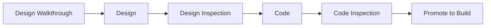

---

### Lean Software Development (LSD)

Lean Software Development (LSD) has adapted the principles of lean manufacturing to the world of software engineering. The lean principles that inspire the LSD process can be summarized as:

1.  **Eliminate waste**
2.  **Build quality in**
3.  **Create knowledge**
4.  **Defer commitment**
5.  **Deliver fast**
6.  **Respect people**
7.  **Optimize the whole**

Each of these principles can be adapted to the software process.

**Example: Eliminate Waste**
Within the context of an agile software project, this involves:
1.  Adding no extraneous features or functions.
2.  Assessing the cost and schedule impact of any newly requested requirement.
3.  Removing any superfluous process steps.
4.  Establishing mechanisms to improve the way team members find information.
5.  Ensuring the testing finds as many errors as possible.

**Figure 1.2: The Seven Principles of Lean Software Development**
| # | Principle |
| :--- | :--- |
| 1 | **Eliminate Waste** |
| 2 | **Build Quality In** |
| 3 | **Create Knowledge** |
| 4 | **Defer Commitment** |
| 5 | **Deliver Fast** |
| 6 | **Respect People** |
| 7 | **Optimize the Whole** |

---

### Agile Modeling (AM)

Agile Modeling (AM) is a practice-based methodology for effective modeling and documentation of software-based systems. Simply put, Agile Modeling (AM) is a collection of values, principles, and practices for modeling software that can be applied on a software development project in an effective and light-weight manner. Agile models are more effective than traditional models because they are *just barely good*; they don't have to be perfect.

Agile modeling adopts all of the values that are consistent with the agile manifesto. The agile modeling philosophy recognizes that an agile team must have the courage to make decisions that may cause it to reject a design and refactor. The team must also have the **humility** to recognize that technologists do not have all the answers and that business experts and other stakeholders should be respected and embraced.

Agile Modeling suggests a wide array of "core" and "supplementary" modeling principles. Those that make AM unique include:

*   **Model with a purpose:** A developer who uses AM should have a specific goal in mind before creating the model. Once the goal for the model is identified, the type of notation to be used and level of detail required will be more obvious.

== END OF PAGE 60 ==

== PERFECTED PAGE 61 / 193 ==

**SOFTWARE ENGINEERING AND PROJECT MANAGEMENT (BCS501)**

*   **Use multiple models.** There are many different models and notations that can be used to describe software. Only a small subset is essential for most projects. AM suggests that to provide needed insight, each model should present a different aspect of the system and only those models that provide value to their intended audience should be used.
*   **Travel light.** As software engineering work proceeds, keep only those models that will provide long-term value and jettison the rest. Every work product that is kept must be maintained as changes occur. This represents work that slows the team down. Ambler notes that “Every time you decide to keep a model you trade-off agility for the convenience of having that information available to your team in an abstract manner.”
*   **Content is more important than representation.** Modeling should impart information to its intended audience. A syntactically perfect model that imparts little useful content is not as valuable as a model with flawed notation that nevertheless provides valuable content for its audience.
*   **Know the models and the tools you use to create them.** Understand the strengths and weaknesses of each model and the tools that are used to create it.
*   **Adapt locally.** The modeling approach should be adapted to the needs of the agile team.

## Agile Unified Process (AUP)

The Agile Unified Process (AUP) adopts a "serial in the large" and "iterative in the small" philosophy for building computer-based systems. By adopting the classic UP phased activities—inception, elaboration, construction, and transition—AUP provides a serial overlay that enables a team to visualize the overall process flow for a software project. However, within each of the activities, the team iterates to achieve agility and to deliver meaningful software increments to end users as rapidly as possible. Each AUP iteration addresses the following activities:

*   **Modeling.** UML representations of the business and problem domains are created.
*   **Implementation.** Models are translated into source code.
*   **Testing.** Like XP, the team designs and executes a series of tests to uncover errors and ensure that the source code meets its requirements.
*   **Deployment.** Like the generic process activity deployment, in this context focuses on the delivery of a software increment and the acquisition of feedback from end users.
*   **Configuration and project management.** In the context of AUP, configuration management addresses change management, risk management, and the control of any persistent work products.

**Figure 6.1: Agile Unified Process (AUP) Activities**

| Activity | Description |
| :--- | :--- |
| **Modeling** | Create UML representations of the business and problem domains. |
| **Implementation** | Translate models into source code. |
| **Testing** | Design and execute tests to uncover errors and ensure requirements are met. |
| **Deployment** | Deliver software increments and acquire end-user feedback. |
| **Configuration & Project Management** | Address change management, risk management, and control of work products. |

== END OF PAGE 61 ==

== PERFECTED PAGE 62 / 193 ==

**SOFTWARE ENGINEERING AND PROJECT MANAGEMENT(BCS501)**

that are produced by the team. Project management tracks and controls the progress of the team and coordinates team activities.

*   **Environment management.** Environment management coordinates a process infrastructure that includes standards, tools, and other support technology available to the team.

### 1.6 A TOOL SET FOR AGILE PROCESS

Some proponents of the agile philosophy argue that automated software tools (e.g., design tools) should be viewed as a minor supplement to the team’s activities, and not at all pivotal to the success of the team.

However, Alistair Cockburn [Coc04] suggests that tools can have a benefit and that “agile teams stress using tools that permit the rapid flow of understanding. Some of those tools are social, starting even at the hiring stage. Some tools are technological, helping distributed teams simulate being physically present.”

Many tools are physical, allowing people to manipulate them in workshops.” Because acquiring the right people (hiring), team collaboration, stakeholder communication, and indirect management are key elements in virtually all agile process models, Cockburn argues that “tools” that address these issues are critical success factors for agility.

For example, a hiring “tool” might be the requirement to have a prospective team member spend a few hours pair programming with an existing member of the team. The “fit” can be assessed immediately.

Collaborative and communication “tools” are generally low tech and incorporate any mechanism (“physical proximity, whiteboards, poster sheets, index cards, and sticky notes” [Coc04]) that provides information and coordination among agile developers

Active communication is achieved via the team dynamics (e.g., pair programming), while passive communication is achieved by “information radiators” (e.g., a flat panel display that presents the overall status of different components of an increment).

Project management tools deemphasize the Gantt chart and replace it with earned value charts or “graphs of tests created versus passed . . . other agile tools are used to optimize the environment in which the agile team works (e.g., more efficient meeting areas), improve the team culture by nurturing social interactions (e.g., collocated teams), physical devices (e.g., electronic whiteboards), and process enhancement (e.g., pair programming or time-boxing)” [Coc04].

<br>
Prof. Madhura N, Asst.Professor, Dept of CSE, SVIT
<div align="right">19</div>

== END OF PAGE 62 ==

== PERFECTED PAGE 63 / 193 ==

# SOFTWARE ENGINEERING AND PROJECT MANAGEMENT(BCS501)

## CHAPTER 2
## PRINCIPLES THAT GUIDE THE PRACTICE

Practice is a collection of concepts, principles, methods, and tools that a software engineer calls upon on a daily basis.

Practice allows managers to manage software projects and software engineers to build computer programs.

Practice populates a software process model with the necessary technical and management how-to's to get the job done.

**Figure 2.1: Software Practice Framework**

```
┌─────────────────────────────────────────┐
│           SOFTWARE PRACTICE             │
├─────────────────────────────────────────┤
│  ┌─────────────┐   ┌─────────────┐     │
│  │  CONCEPTS   │   │  PRINCIPLES │     │
│  └─────────────┘   └─────────────┘     │
│  ┌─────────────┐   ┌─────────────┐     │
│  │   METHODS   │   │    TOOLS    │     │
│  └─────────────┘   └─────────────┘     │
├─────────────────────────────────────────┤
│  Managers: Manage Projects              │
│  Engineers: Build Programs              │
├─────────────────────────────────────────┤
│  Populates Process Model with         │
│  Technical & Management How-to's      │
└─────────────────────────────────────────┘
```

### 1.1 SOFTWARE ENGINEERING KNOWLEDGE

In an editorial published in IEEE Software a decade ago, Steve McConnell [McC99] made the following comment:

> Many software practitioners think of software engineering knowledge almost exclusively as knowledge of specific technologies: Java, Perl, html, C++ Linux, Windows NT, and so on.

Knowledge of specific technology details is necessary to perform computer programming. If someone assigns you to write a program in C++, you have to know something about C++ to get your program to work.

You often hear people say that software development knowledge has a 3-year half-life: half of what you need to know today will be obsolete within 3 years. In the domain of technology-related knowledge, that's probably about right. But there is another kind of software development knowledge—a kind that I think of as "software engineering principles"—that does not have a three-year half-life. These software engineering principles are likely to serve a professional programmer throughout his or her career.

**Figure 2.2: Knowledge Half-Life Comparison**

```
Knowledge Type          │  3-Year Half-Life │  Career-Long Value
─────────────────────────────────────────────────────────────
Technology Details      │        HIGH       │        LOW
Software Engineering    │         LOW       │       HIGH
Principles              │                 │
```

McConnell goes on to argue that the body of software engineering knowledge (circa the year 2000) had evolved to a "stable core" that he estimated represented about "75 percent of the knowledge needed to develop a complex system." But what resides within this stable core? As McConnell indicates, core principles—the elemental ideas that guide software engineers in the work that they do—now provide a foundation from which software engineering models, methods, and tools can be applied and evaluated.

**Figure 2.3: Stable Core of Software Engineering Knowledge**

```
                    ┌─────────────────┐
                    │   STABLE CORE   │
                    │   (75% of       │
                    │  Knowledge)     │
                    └────────┬────────┘
                             │
        ┌────────────────────┼────────────────────┐
        │                    │                    │
        ▼                    ▼                    ▼
┌───────────────┐   ┌───────────────┐   ┌───────────────┐
│   Principles  │   │     Models    │   │     Methods   │
│  (Elemental   │   │  (Process     │   │  (Technical   │
│   Ideas)      │   │   Frameworks) │   │   Procedures) │
└───────────────┘   └───────────────┘   └───────────────┘
        │                    │                    │
        └────────────────────┼────────────────────┘
                             │
                             ▼
                    ┌─────────────────┐
                    │      Tools      │
                    │  (Applied &     │
                    │  Evaluated)     │
                    └─────────────────┘
```

Prof. Madhura N, Asst.Professor, Dept of CSE, SVIT 20

== END OF PAGE 63 ==

== PERFECTED PAGE 64 / 193 ==

# SOFTWARE ENGINEERING AND PROJECT MANAGEMENT (BCS501)

## 1.8 CORE PRINCIPLES

Software engineering is guided by a collection of core principles that help in the application of a meaningful software process and the execution of effective software engineering methods. At the process level, core principles establish a philosophical foundation that guides a software team as it performs framework and umbrella activities, navigates the process flow, and produces a set of software engineering work products.

At the level of practice, core principles establish a collection of values and rules that serve as a guide as you analyze a problem, design a solution, implement and test the solution, and ultimately deploy the software in the user community.

A set of general principles that span software engineering process and practice:

| # | Principle |
|---|-----------|
| (1) | **Provide value to end users** |
| (2) | **Keep it simple** |
| (3) | **Maintain the vision** (of the product and the project) |
| (4) | **Recognize that others consume** (and must understand) what you produce |
| (5) | **Be open to the future** |
| (6) | **Plan ahead for reuse** |
| (7) | **Think!** |

> Although these general principles are important, they are characterized at such a high level of abstraction that they are sometimes difficult to translate into day-to-day software engineering practice.

---

### 1.8.1 Principles that Guide Process

The following set of core principles can be applied to the framework, and by extension, to every software process.

**Figure 1.8: Core Principles Hierarchy**

```
┌─────────────────────────────────────────┐
│         CORE PRINCIPLES                │
├─────────────────────────────────────────┤
│  ┌─ PROCESS LEVEL ──────────────────┐  │
│  │ • Be agile                       │  │
│  │ • Focus on quality               │  │
│  │ • Be ready to adapt              │  │
│  │ • Build an effective team        │  │
│  └──────────────────────────────────┘  │
├─────────────────────────────────────────┤
│  ┌─ PRACTICE LEVEL ───────────────────┐ │
│  │ (1) Provide value to end users     │ │
│  │ (2) Keep it simple                 │ │
│  │ (3) Maintain the vision            │ │
│  │ (4) Recognize others consume       │ │
│  │ (5) Be open to the future          │ │
│  │ (6) Plan ahead for reuse           │ │
│  │ (7) Think!                         │ │
│  └────────────────────────────────────┘ │
└─────────────────────────────────────────┘
```

---

#### Principle 1: Be Agile

Whether the process model you choose is prescriptive or agile:

1. Keep your technical approach as **simple** as possible
2. Keep the work products you produce as **concise (short)** as possible
3. **Make decisions locally** whenever possible

#### Principle 2: Focus on Quality at Every Step

For every process activity, action, and task should focus on the quality of the work product that has been produced.

#### Principle 3: Be Ready to Adapt

Adapt your approach to conditions imposed by the problem, the people, and the project itself.

#### Principle 4: Build an Effective Team

Build a self-organizing team that has mutual trust and respect.

---

**Figure 1.9: Agile Principles in Practice**

```
Principle 1: Be Agile
├── Simple technical approach
├── Concise work products
└── Local decisions

Principle 2: Quality Focus
├── Activity-level quality
├── Action-level quality
└── Task-level quality

Principle 3: Adaptability
├── Problem conditions
├── People factors
└── Project constraints

Principle 4: Effective Team
├── Self-organizing
├── Mutual trust
└── Respect
```

---

Prof. Madhura N, Asst. Professor, Dept of CSE, SVIT

== END OF PAGE 64 ==

== PERFECTED PAGE 65 / 193 ==

SOFTWARE ENGINEERING AND PROJECT MANAGEMENT(BCS501) 
 
22 
Prof. Madhura N, Asst.Professor, Dept of CSE, SVIT 
Principle 5. Establish mechanisms for communication and coordination. Projects fail because 
stakeholders fail to coordinate their efforts to create a successful end product.  
 
Principle 6. Manage change. The methods must be established to manage the way changes are 
requested, approved, and implemented.  
 
Principle 7. Assess risk. Lots of things can go wrong as software is being developed.  
 
Principle 8. Create work products that provide value for others. Create only those work products 
that provide value for other process activities, actions and tasks. 
 
1.8.2 Principles That Guide Practice 
 
▪ Software engineering practice has a single goal i.e.., to deliver on-time, high quality, 
operational software that contains functions and features that meet the needs of all 
stakeholders. 
  
▪ To achieve this goal, should adopt a set of core principles that guide the technical work.  
 
▪ The following set of core principles are fundamental to the practice of software 
engineering: 
 
Principle 1. Divide and conquer. A large problem is easier to solve if it is subdivided into a 
collection of elements (or modules or components).  Ideally, each element delivers distinct 
functionality that can be developed.  
 
Principle 2. Understand the use of abstraction. At its core, an abstraction(overview) is a 
simplification of some complex element of a system used to communicate meaning in a single phrase.  
 
Principle 3. Strive for consistency. Whether it’s creating a requirements model, developing a 
software design, generating source code, or creating test cases. All these are consistent so that the 
software is easier to develop. 
 
Principle 4. Focus on the transfer of information. Software is about information transfer—from a 
database to an end user, from an operating system to an application,  
 
Principle 5. Build software that exhibits effective modul

== END OF PAGE 65 ==

== PERFECTED PAGE 66 / 193 ==
# SOFTWARE ENGINEERING AND PROJECT MANAGEMENT (BCS501)

## Principles 7–8: Foundational Mindsets

**Principle 7.** *When possible, represent the problem and its solution from a number of different perspectives.* When a problem and its solution are examined from a number of different perspectives (ways), the quality and robustness of the outcome improves significantly.

**Principle 8.** *Remember that someone will maintain the software.* Software will be corrected as defects are removed, adapted as its environment changes, and enhanced as stakeholders request more capabilities.

---

## 1.9 Principles That Guide Each Framework Activity

### 1.9.1 Communication Principles

Customer requirements must be gathered through the **communication activity**. Communication has begun.

> **Figure 1.9: The Communication Cycle in Software Engineering**
>
> ```
> ┌─────────────┐     ┌─────────────┐     ┌─────────────┐
> │   Listen    │ ──▶ │  Understand │ ──▶ │ Collaborate │
> │  (Principle │     │  (Principle │     │  (Principle │
> │     1)      │     │     2)      │     │     6)      │
> └─────────────┘     └─────────────┘     └──────┬──────┘
        ▲                                       │
        │              ┌─────────────┐          │
        └──────────────│   Document  │◀─────────┘
                       │  (Principle │
                       │     5)      │
                       └──────┬──────┘
                              │
                       ┌──────▼──────┐
                       │  Facilitate │
                       │  (Principle │
                       │     3)      │
                       └──────┬──────┘
                              │
                       ┌──────▼──────┐
                       │  Face-to-   │
                       │  Face Best  │
                       │  (Principle │
                       │     4)      │
                       └─────────────┘
> ```
> *The communication cycle integrates all six principles into a continuous feedback loop.*

---

**Principle 1. Listen.**

Try to focus on the speaker's words, rather than formulating your response to those words. Ask for clarification if something is unclear, but avoid constant interruptions. Never become contentious in your words or actions (e.g., rolling your eyes or shaking your head) as a person is talking.

| ❌ Bad Practice | ✅ Good Practice |
|---|---|
| Interrupting constantly | Let the speaker finish |
| Planning your response | Actively absorbing their words |
| Showing dismissive body language | Maintaining respectful engagement |
| Rolling eyes, shaking head | Nodding, taking notes |

---

**Principle 2. Prepare before you communicate.** Spend the time to understand the problem before you meet with others. If necessary, do some research to understand business domain jargon. If you have responsibility for conducting a meeting, prepare an agenda in advance of the meeting.

---

**Principle 3. Someone should facilitate the activity.** Every communication meeting should have a leader (a facilitator) to keep the conversation moving in a productive direction, (2) to mediate any conflict that does occur, and (3) to ensure than other principles are followed.

> **Figure 1.10: The Facilitator's Role**
>
> ```
>                    ┌──────────────────┐
>                    │   Facilitator    │
>                    │  (Meeting Leader)│
>                    └────────┬─────────┘
>                             │
>         ┌───────────────────┼───────────────────┐
>         │                   │                   │
>         ▼                   ▼                   ▼
> ┌───────────────┐  ┌───────────────┐  ┌───────────────┐
> │  Keep          │  │  Mediate      │  │  Ensure       │
> │  conversation   │  │  any          │  │  principles   │
> │  on track      │  │  conflict     │  │  are followed │
> └───────────────┘  └───────────────┘  └───────────────┘
> ```

---

**Principle 4. Face-to-face communication is best.** But it usually works better when some other representation of the relevant information is present. For example, a participant may create a drawing or a *"strawman"* document that serves as a focus for discussion.

> **Figure 1.11: Enhancing Face-to-Face Communication with Artifacts**
>
> ```
>        Person A                Person B
>          │                       │
>          │  ◀═══ Verbal Dialogue ═══▶  │
>          │                       │
>          │    ┌───────────┐      │
>          │    │  Drawing  │      │
>          │    │ Strawman  │      │
>          │    │ Document  │      │
>          │    └─────┬─────┘      │
>          │          │            │
>          └──────────┼────────────┘
>                     │
>              Shared Understanding
>                     │
>                     ▼
>              Clearer Decisions
> ```
> *Visual artifacts ground the conversation and create shared context.*

---

**Principle 5. Take notes and document decisions.** Things have a way of falling into the cracks. Someone participating in the communication should serve as a *"recorder"* and write down all important points and decisions.

| What to Document | Why It Matters |
|---|---|
| Key requirements discussed | Prevents scope drift |
| Decisions made and rationale | Creates institutional memory |
| Action items and owners | Ensures accountability |
| Open questions | Tracks unresolved issues |
| Assumptions | Makes implicit knowledge explicit |

---

**Principle 6. Strive for collaboration.** Collaboration and consensus occur when the collective knowledge of members of the team is used to describe product or system functions or features. Each small collaboration serves to build trust among team members and creates a common goal for the team.

> **Figure 1.12: The Collaboration Trust Loop**
>
> ```
>     ┌─────────────────────────────────────┐
>     │                                     │
>     │        ┌──────────────┐             │
>     │        │  Collect     │             │
>     │        │  Knowledge   │             │
>     │        └──────┬───────┘             │
>     │               │                    │
>     │               ▼                    │
>     │        ┌──────────────┐             │
>     │        │  Describe    │             │
>     │        │  Functions/  │             │
>     │        │  Features    │             │
>     │        └──────┬───────┘             │
>     │               │                    │
>     │               ▼                    │
>     │        ┌──────────────┐             │
>     │        │  Build Trust │             │
>     │        └──────┬───────┘             │
>     │               │                    │
>     │               ▼                    │
>     │        ┌──────────────┐             │
>     │        │ Shared Goal  │             │
>     │        └──────────────┘             │
>     │                                     │
>     │         ◀══════════════════════▶    │
>     │            (Continuous Loop)        │
>     └─────────────────────────────────────┘
> ```

---

### Summary: Six Communication Principles

| # | Principle | Key Takeaway |
|---|---|---|
| 1 | **Listen** | Focus on understanding, not responding |
| 2 | **Prepare** | Research and agenda before meetings |
| 3 | **Facilitate** | Every meeting needs a leader |
| 4 | **Face-to-Face** | Best with visual artifacts |
| 5 | **Document** | Capture decisions and action items |
| 6 | **Collaborate** | Collective knowledge builds trust |

> **Figure 1.13: Communication Principles at a Glance**
>
> ```
>         ┌─────────────────────────────────────┐
>         │         COMMUNICATION               │
>         │           PRINCIPLES                 │
>         ├───────┬───────┬───────┬───────┬───────┤
>         │   1   │   2   │   3   │   4   │   5   │   6  │
>         │Listen │Prepare│Facil.│Face-2-F│Docum.│Collab│
>         └───┬───┴───┬───┴───┬───┴───┬───┴───┬───┴───┬──┘
>             │       │       │       │       │       │
>             ▼       ▼       ▼       ▼       ▼       ▼
>         Understand Prepped Oriented Visual Noted   Trusted
> ```

---

Prof. Madhura N, Asst. Professor, Dept of CSE, SVIT

== END OF PAGE 66 ==

== PERFECTED PAGE 67 / 193 ==

# SOFTWARE ENGINEERING AND PROJECT MANAGEMENT (BCS501)

**Prof. Madhura N, Asst. Professor, Dept of CSE, SVIT**

---

### Communication Principles

**Principle 7. Stay focused; modularize your discussion.** The more people involved in any communication, the more likely that discussion will bounce from one topic to the next. The facilitator should keep the conversation modular, leaving one topic only after it has been resolved.

**Principle 8. If something is unclear, draw a picture.** Verbal communication goes only so far. A sketch or drawing can often provide clarity when words fail to do the job.

**Principle 9.** (a) Once you agree to something, move on. (b) If you can't agree to something, move on. (c) If a feature or function is unclear and cannot be clarified at the moment, move on. Communication, like any software engineering activity, takes time. Rather than iterating endlessly, the people who participate should recognize that many topics require discussion (see Principle 2) and that "moving on" is sometimes the best way to achieve communication agility.

**Principle 10. Negotiation is not a contest or a game.** It works best when both parties win. There are many instances in which you and other stakeholders must negotiate functions and features, priorities, and delivery dates. If the team has collaborated well, all parties have a common goal. Still, negotiation will demand compromise from all parties.

---

### 1.9.2 Planning Principles

- The communication activity helps you to define your overall goals and objectives.
- The planning activity encompasses a set of management and technical practices that enable the software team to define a road map as it travels toward the objectives.

The following principles always apply:

**Principle 1. Understand the scope of the project.** It's impossible to use a road map if you don't know where you're going. Scope provides the software team with a destination.

**Principle 2. Involve stakeholders in the planning activity.** Stakeholders define priorities and establish project constraints. To accommodate these realities, software engineers must often negotiate order of delivery, time lines, and other project-related issues.

**Principle 3. Recognize that planning is iterative.** A project plan is never engraved in stone. As work begins, it is very likely that things will change. As a consequence, the plan must be adjusted to accommodate these changes. In addition, iterative, incremental process models dictate replanning after the delivery of each software increment based on feedback received from users.

**Principle 4. Estimate based on what you know.** The intent of estimation is to provide an indication of effort, cost, and task duration, based on the team's current understanding of the work to be done. If information is vague or unreliable, estimates will be equally unreliable.

---

**Figure 1.9: Software Engineering Planning Principles**

| Principle | Description |
|-----------|-------------|
| 1 | Understand the scope of the project |
| 2 | Involve stakeholders in the planning activity |
| 3 | Recognize that planning is iterative |
| 4 | Estimate based on what you know |

---

*Prof. Madhura N, Asst. Professor, Dept of CSE, SVIT*
Page 24

== END OF PAGE 67 ==

== PERFECTED PAGE 68 / 193 ==

**SOFTWARE ENGINEERING AND PROJECT MANAGEMENT (BCS501)**

**Principle 5. Consider risk as you define the plan.** If you have identified risks that have high impact and high probability, contingency planning is necessary. In addition, the project plan (including the schedule) should be adjusted to accommodate the likelihood that one or more of these risks will occur.

**Principle 6. Be realistic.** People don’t work 100 percent of every day. Noise always enters into any human communication. Omissions and ambiguity are facts of life. Change will occur. Even the best software engineers make mistakes. These and other realities should be considered as a project plan is established.

**Principle 7. Adjust granularity as you define the plan.** Granularity refers to the level of detail that is introduced as a project plan is developed. A “high-granularity” plan provides significant work task detail that is planned over relatively short time increments (so that tracking and control occur frequently). A “low-granularity” plan provides broader work tasks that are planned over longer time periods. In general, granularity moves from high to low as the project time line moves away from the current date. Over the next few weeks or months, the project can be planned in significant detail. Activities that won’t occur for many months do not require high granularity (too much can change).

**Figure 1.1: Project Planning Granularity vs. Time Horizon**
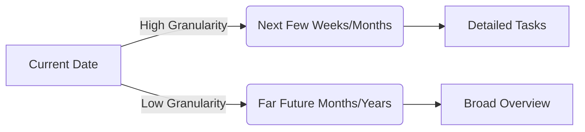

**Principle 8. Define how you intend to ensure quality.** The plan should identify how the software team intends to ensure quality. If technical reviews are to be conducted, they should be scheduled. If pair programming is to be used during construction, it should be explicitly defined within the plan.

**Principle 9. Describe how you intend to accommodate change.** Even the best planning can be obviated by uncontrolled change. You should identify how changes are to be accommodated as software engineering work proceeds. For example, can the customer request a change at any time? If a change is requested, is the team obliged to implement it immediately? How is the impact and cost of the change assessed?

**Principle 10. Track the plan frequently and make adjustments as required.** Software projects fall behind schedule one day at a time. Therefore, it makes sense to track progress on a daily basis, looking for problem areas and situations in which scheduled work does not conform to actual work conducted. When slippage is encountered, the plan is adjusted accordingly.

### 1.9.3 Modeling Principles

Create models to gain a better understanding of the actual entity to be built. The modeling principles are:

**Principle 1. The primary goal of the software team is to build software, not create models.** Agility means getting software to the customer in the fastest possible time. Models that make this goal achievable are useful; those that are expensive and time-consuming are not.

Prof. Madhura N, Asst. Professor, Dept of CSE, SVIT

25
== END OF PAGE 68 ==

== PERFECTED PAGE 69 / 193 ==

# SOFTWARE ENGINEERING AND PROJECT MANAGEMENT (BCS501)

**Prof. Madhura N, Asst. Professor, Dept of CSE, SVIT**

---

## Principles of Modeling (Continued)

**Principle 2. Travel light**—don’t create more models than you need. Every model that is created must be kept up-to-date as changes occur. More importantly, every new model takes time that might otherwise be spent on construction (coding and testing). Therefore, create only those models that make it easier and faster to construct the software.

**Principle 3. Strive to produce the simplest model** that will describe the problem or the software. Don’t overbuild the software [Amb02b]. By keeping models simple, the resultant software will also be simple. The result is software that is easier to integrate, easier to test, and easier to maintain (to change). In addition, simple models are easier for members of the software team to understand and critique, resulting in an ongoing form of feedback that optimizes the end result.

**Principle 4. Build models in a way that makes them amenable to change.** Assume that your models will change, but in making this assumption don’t get sloppy. For example, since requirements will change, there is a tendency to give requirements models short shrift. Why? Because you know that they’ll change anyway. The problem with this attitude is that without a reasonably complete requirements model, you’ll create a design (design model) that will invariably miss important functions and features.

**Principle 5. Be able to state an explicit purpose for each model that is created.** Every time you create a model, ask yourself why you’re doing so. If you can’t provide solid justification for the existence of the model, don’t spend time on it.

**Principle 6. Adapt the models you develop to the system at hand.** It may be necessary to adapt model notation or rules to the application; for example, a video game application might require a different modeling technique than real-time, embedded software that controls an automobile engine.

**Principle 7. Try to build useful models, but forget about building perfect models.** When building requirements and design models, a software engineer reaches a point of diminishing returns. That is, the effort required to make the model absolutely complete and internally consistent is not worth the benefits of these properties. Am I suggesting that modeling should be sloppy or low quality? The answer is “no.” But modeling should be conducted with an eye to the next software engineering steps. Iterating endlessly to make a model “perfect” does not serve the need for agility.

**Principle 8. Don’t become dogmatic about the syntax of the model.** If it communicates content successfully, representation is secondary. Although everyone on a software team should try to use consistent notation during modeling, the most important characteristic of the model is to communicate information that enables the next software engineering task. If a model does this successfully, incorrect syntax can be forgiven.

---

**Figure 6.1: Principles of Effective Modeling**

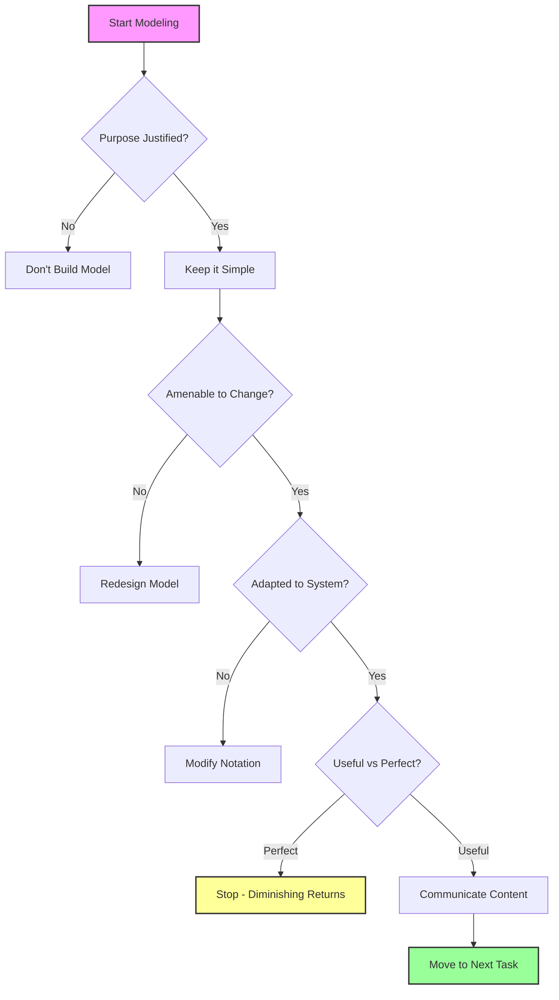

---

*Page 26 | Prof. Madhura N, Asst. Professor, Dept of CSE, SVIT*

== END OF PAGE 69 ==

== PERFECTED PAGE 70 / 193 ==

# SOFTWARE ENGINEERING AND PROJECT MANAGEMENT (BCS501)

### General Modeling Principles

**Principle 9.** If your instincts tell you a model isn’t right even though it seems okay on paper, you probably have reason to be concerned. If you are an experienced software engineer, trust your instincts. Software work teaches many lessons—some of them on a subconscious level. If something tells you that a design model is doomed to fail (even though you can’t prove it explicitly), you have reason to spend additional time examining the model or developing a different one.

**Principle 10.** Get feedback as soon as you can. Every model should be reviewed by members of the software team. The intent of these reviews is to provide feedback that can be used to correct modeling mistakes, change misinterpretations, and add features or functions that were inadvertently omitted.

---

### Requirements Modeling Principles

**Principle 1. The information domain of a problem must be represented and understood.**
The information domain encompasses the data that flow into the system (from end users, other systems, or external devices), the data that flow out of the system (via the user interface, network interfaces, reports, graphics, and other means), and the data stores that collect and organize persistent data objects (i.e., data that are maintained permanently).

**Principle 2. The functions that the software performs must be defined.**
Software functions provide direct benefit to end users and also provide internal support for those features that are user visible. Some functions transform data that flow into the system. In other cases, functions effect some level of control over internal software processing or external system elements. Functions can be described at many different levels of abstraction, ranging from a general statement of purpose to a detailed description of the processing elements that must be invoked.

**Principle 3. The behavior of the software (as a consequence of external events) must be represented.**
The behavior of computer software is driven by its interaction with the external environment. Input provided by end users, control data provided by an external system, or monitoring data collected over a network all cause the software to behave in a specific way.

**Principle 4. The models that depict information, function, and behavior must be partitioned in a manner that uncovers detail in a layered (or hierarchical) fashion.**
Requirements modeling is the first step in software engineering problem solving. It allows you to better understand the problem and establishes a basis for the solution (design). Complex problems are difficult to solve in their entirety. For this reason, you should use a divide-and-conquer strategy. A large, complex problem is divided into subproblems until each subproblem is relatively easy to understand. This concept is called partitioning or separation of concerns, and it is a key strategy in requirements modeling.

**Principle 5. The analysis task should move from essential information toward implementation detail.**
Requirements modeling begins by describing the problem from the end-user’s perspective. The “essence” of the problem is described without any consideration of how a solution will be implemented.

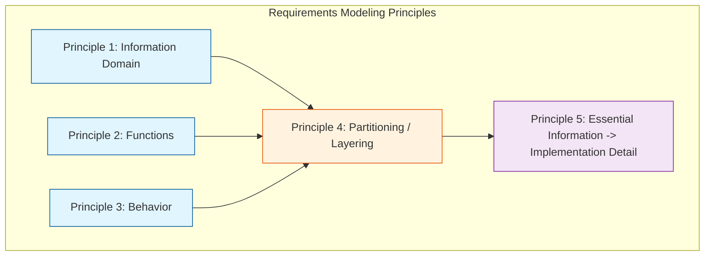

**Figure 70.1: Requirements Modeling Principles Flow**

== END OF PAGE 70 ==

== PERFECTED PAGE 71 / 193 ==

# SOFTWARE ENGINEERING AND PROJECT MANAGEMENT (BCS501)

...implemented. For example, a video game requires that the player "instruct" its protagonist on what direction to proceed as she moves into a dangerous maze. That is the essence of the problem. Implementation detail (normally described as part of the design model) indicates how the essence will be implemented. For the video game, voice input might be used. Alternatively,

### Design Modeling Principles

**Principle 1. Design should be traceable to the requirements model.**
The requirements model describes the information domain of the problem, user-visible functions, system behavior, and a set of requirements classes that package business objects with the methods that service them. The design model translates this information into an architecture, a set of subsystems that implement major functions, and a set of components that are the realization of requirements classes. The elements of the design model should be traceable to the requirements model.

**Principle 2. Always consider the architecture of the system to be built.**
Software architecture is the skeleton of the system to be built. It affects interfaces, data structures, program control flow and behavior, the manner in which testing can be conducted, the maintainability of the resultant system, and much more. For all of these reasons, design should start with architectural considerations. Only after the architecture has been established should component-level issues be considered.

**Principle 3. Design of data is as important as design of processing functions.**
Data design is an essential element of architectural design. The manner in which data objects are realized within the design cannot be left to chance. A well-structured data design helps to simplify program flow, makes the design and implementation of software components easier, and makes overall processing more efficient.

**Principle 4. Interfaces (both internal and external) must be designed with care.**
The manner in which data flows between the components of a system has much to do with processing efficiency, error propagation, and design simplicity. A well-designed interface makes integration easier and assists the tester in validating component functions.

**Principle 5. User interface design should be tuned to the needs of the end user.**
However, in every case, it should stress ease of use. The user interface is the visible manifestation of the software. No matter how sophisticated its internal functions, no matter how comprehensive its data structures, no matter how well designed its architecture, a poor interface design often leads to the perception that the software is "bad."

**Principle 6. Component-level design should be functionally independent.**
Functional independence is a measure of the "single-mindedness" of a software component. The functionality that is delivered by a component should be cohesive—that is, it should focus on one and only one function or subfunction.

**Figure 7.1: Hierarchy of Design Models**

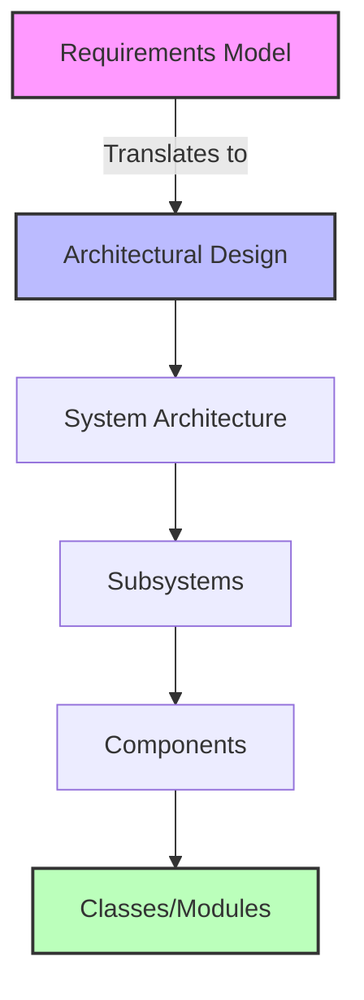

***

*Prof. Madhura N, Asst. Professor, Dept of CSE, SVIT*
*Page 28*

== END OF PAGE 71 ==

== PERFECTED PAGE 72 / 193 ==

# SOFTWARE ENGINEERING AND PROJECT MANAGEMENT(BCS501)

## 1.9.3 Design Principles (continued)

*   **Principle 7.** Components should be **loosely coupled** to one another and to the external environment. Coupling is achieved in many ways—via a component interface, by messaging, through global data. As the level of coupling increases, the likelihood of error propagation also increases and the overall maintainability of the software decreases. Therefore, component coupling should be kept as low as is reasonable.
*   **Principle 8.** Design representations (models) should be **easily understandable**. The purpose of design is to communicate information to practitioners who will generate code, to those who will test the software, and to others who may maintain the software in the future. If the design is difficult to understand, it will not serve as an effective communication medium.
*   **Principle 9.** The design should be **developed iteratively**. With each iteration, the designer should strive for greater simplicity. Like almost all creative activities, design occurs iteratively. The first iterations work to refine the design and correct errors.

## 1.9.4 Construction Principles

The construction activity encompasses a set of coding and testing tasks that lead to operational software that is ready for delivery to the customer or end user. Coding may be:

1.  The direct creation of programming language source code (e.g., Java).
2.  The automatic generation of source code using an intermediate design-like representation of the component to be built.

The initial focus of testing is at the component level, often called **unit testing**. Other levels of testing include:

*   i) **Integration testing** (conducted as the system is constructed).
*   ii) **Validation testing** that assesses whether requirements have been met for the complete system (or software increment).
*   iii) **Acceptance testing** that is conducted by the customer in an effort to exercise all required features and functions.

### Coding Principles
The principles that guide the coding task are closely aligned with programming style, programming languages, and programming methods. However, there are a number of fundamental principles that can be stated:


**Figure 7.1: Hierarchy of Construction and Testing Levels**
> **Diagram:** A flowchart illustrating the progression from **Component/Unit Testing** $\rightarrow$ **Integration Testing** $\rightarrow$ **Validation Testing** $\rightarrow$ **Acceptance Testing**.

---
Prof. Madhura N, Asst. Professor, Dept of CSE, SVIT | 29

== END OF PAGE 72 ==

== PERFECTED PAGE 73 / 193 ==
# SOFTWARE ENGINEERING AND PROJECT MANAGEMENT(BCS501)
**Prof. Madhura N, Asst.Professor, Dept of CSE, SVIT**

## Preparation principles: Before you write one line of code, be sure you
- Understand the problem you’re trying to solve.
- Understand basic design principles and concepts.
- Pick a programming language that meets the needs of the software to be built and the environment in which it will operate.
- Select a programming environment that provides tools that will make your work easier.
- Create a set of unit tests that will be applied once the component you code is completed.

## Programming principles: As you begin writing code, be sure you
- Constrain your algorithms by following structured programming practice.
- Consider the use of pair programming.
- Select data structures that will meet the needs of the design.
- Understand the software architecture and create interfaces that are consistent with it.
- Keep conditional logic as simple as possible.
- Create nested loops in a way that makes them easily testable.
- Select meaningful variable names and follow other local coding standards.
- Write code that is self-documenting.
- Create a visual layout (e.g., indentation and blank lines) that aids understanding.

## Validation Principles: After you’ve completed your first coding pass, be sure you
- Conduct a code walkthrough when appropriate.
- Perform unit tests and correct errors you’ve uncovered.
- Refactor the code.

---
*30*

== END OF PAGE 73 ==

== PERFECTED PAGE 74 / 193 ==

**SOFTWARE ENGINEERING AND PROJECT MANAGEMENT (BCS501)**

**Testing Principles:** Glen Myers states a number of rules that can serve well as testing objectives:

*   **Testing** is a process of executing a program with the intent of finding an error.
*   A **good test case** is one that has a high probability of finding an as-yet undiscovered error.
*   A **successful test** is one that uncovers an as-yet-undiscovered error.

Davis suggests a set of testing principles that have been adapted for use.

**Principle 1. All tests should be traceable to customer requirements.**
The objective of software testing is to uncover errors. It follows that the most severe defects (from the customer’s point of view) are those that cause the program to fail to meet its requirements.

**Principle 2. Tests should be planned long before testing begins.**
Test planning can begin as soon as the requirements model is complete. Detailed definition of test cases can begin as soon as the design model has been solidified. Therefore, all tests can be planned and designed before any code has been generated.

**Principle 3. The Pareto principle applies to software testing.**
In this context, the Pareto principle implies that 80 percent of all errors uncovered during testing will likely be traceable to 20 percent of all program components. The problem, of course, is to isolate these suspect components and to thoroughly test them.

> **Figure 3.1: The Pareto Distribution in Software Testing**
>
> ```mermaid
> graph LR
>     A[Errors Found] --> B(80% of Errors)
>     B --> C{Traceable to}
>     C --> D[20% of Components]
>     C --> E[80% of Components]
>     E --> F[20% of Errors]
>     style D fill:#f9f,stroke:#333,stroke-width:2px
> ```

**Principle 4. Testing should begin “in the small” and progress toward testing “in the large.”**
The first tests planned and executed generally focus on individual components. As testing progresses, focus shifts in an attempt to find errors in integrated clusters of components and ultimately in the entire system.

> **Figure 3.2: Progression from Unit to System Testing**
>
> ```mermaid
> flowchart LR
>     A[Unit Testing\n'In the Small'] --> B[Integration Testing]
>     B --> C[System Testing\n'In the Large']
>     C --> D[Validation Testing]
> ```

**Principle 5. Exhaustive testing is not possible.**
The number of path permutations for even a moderately sized program is exceptionally large. For this reason, it is impossible to execute every combination of paths during testing. It is possible, however, to adequately cover program logic and to ensure that all conditions in the component-level design have been exercised.

<br>

Prof. Madhura N, Asst. Professor, Dept of CSE, SVIT
31

== END OF PAGE 74 ==

== PERFECTED PAGE 75 / 193 ==

# Software Engineering and Project Management (BCS501)

## Deployment Principles

### Principle 1. Customer expectations for the software must be managed.
Too often, the customer expects more than the team has promised to deliver, and disappointment occurs immediately. This results in feedback that is not productive and ruins team morale. In her book on managing expectations, Naomi Karten states: *"The starting point for managing expectations is to become more conscientious about what you communicate and how."* She suggests that a software engineer must be careful about sending the customer conflicting messages (e.g., promising more than you can reasonably deliver in the time frame provided or delivering more than you promise for one software increment and then less than promised for the next).

### Principle 2. A complete delivery package should be assembled and tested.
A CD-ROM or other media (including Web-based downloads) containing all executable software, support data files, support documents, and other relevant information should be assembled and thoroughly beta-tested with actual users. All installation scripts and other operational features should be thoroughly exercised in as many different computing configurations (i.e., hardware, operating systems, peripheral devices, networking arrangements) as possible.

### Principle 3. A support regime must be established before the software is delivered.
An end user expects responsiveness and accurate information when a question or problem arises. If support is ad hoc, or worse, nonexistent, the customer will become dissatisfied immediately. Support should be planned, support materials should be prepared, and appropriate recordkeeping mechanisms should be established so that the software team can conduct a categorical assessment of the kinds of support requested.

### Principle 4. Appropriate instructional materials must be provided to end users.
The software team delivers more than the software itself. Appropriate training aids (if required) should be developed; troubleshooting guidelines should be provided, and when necessary, a "what's different about this software increment" description should be published.

### Principle 5. Buggy software should be fixed first, delivered later.
Under time pressure, some software organizations deliver low-quality increments with a warning to the customer those bugs "will be fixed in the next release." This is a mistake. There's a saying in the software business: *"Customers will forget you delivered a high-quality product a few days late, but they will never forget the problems that a low-quality product caused them. The software reminds them every day."*

**Figure 7.1: The Five Deployment Principles**

```
┌─────────────────────────────────────────────────────────┐
│                   DEPLOYMENT PRINCIPLES                 │
├─────────────────────────────────────────────────────────┤
│                                                         │
│   1. Manage Customer Expectations                       │
│      └── Communicate clearly; avoid conflicting messages │
│                                                         │
│   2. Assemble & Test Complete Delivery Package          │
│      └── Beta-test with actual users across configs     │
│                                                         │
│   3. Establish Support Regime Before Delivery           │
│      └── Plan support; prepare materials; track records  │
│                                                         │
│   4. Provide Instructional Materials to End Users       │
│      └── Training aids; troubleshooting guides          │
│                                                         │
│   5. Fix Buggy Software First, Deliver Later            │
│      └── Never ship low-quality increments knowingly    │
│                                                         │
└─────────────────────────────────────────────────────────┘
```

Prof. Madhura N, Asst. Professor, Dept of CSE, SVIT
32

== END OF PAGE 75 ==

== PERFECTED PAGE 76 / 193 ==

                                                                                                                             SOFTWARE PROJECT MANAGEMENT(BCS501) 
25 
MADHURA N, Asst.Professor, DEPT Of CSE, SVIT 
• 
Design 
• 
Coding 
• 
Testing 
• 
Deployment 
 
Each activity is further subdivided into specific tasks (e.g., requirements analysis, user interface design, 
module coding, unit testing). 
For the CAD software example, a table (Figure 26.4) details the effort estimates (in person-months) for 
each software function under each activity. 
The front-end engineering tasks (requirements analysis and design) account for 53% of the total effort, 
[45%+8%] emphasizing their importance in the overall project.  
Using a burdened labor rate of $8000 per month:  
Total Cost=Total Effort (person-months) ×Labor Rate 
• 
For 46 person-months: 
Total Cost=46×8000=368,000 USD 
 
1.3.6 Estimation with Use Cases 
Developing an estimation approach with use cases is problematic for the following reasons: 
• Use cases are described using many different formats and styles—there is no standard form.  
• Use cases represent an external view (the user’s view) of the software and can therefore be 
written at many different levels of abstraction.  
• Use cases do not address the complexity of the functions and features that are described.  
• Use cases can describe complex behavior (e.g., interactions) that involve many functions and 
features. 
Use case-based estimation leverages the information in use cases to predict the Lines of Code (LOC) or 
effort required for development. However, this approach requires several adjustments and considerations 
due to the variability and abstraction levels of use cases. 
The formula to estimate LOC from use cases is: 
῿⇿᯿⣿㏿㓿⳿⻿⛿㓿⣿= ⃿× ῿⇿᯿⛿㛿⫿+ [(⓿⯿
⓿⟿
−㣿) + (⋿⯿
⋿⟿
−㣿)] × ῿⇿᯿⛿⟿ⷿ㗿㏿㓿 


== END OF PAGE 76 ==

== PERFECTED PAGE 77 / 193 ==

**SOFTWARE PROJECT MANAGEMENT (BCS501)**

**MADHURA N, Asst. Professor, DEPT Of CSE, SVIT**

**Variables:**

*   **N**: Actual number of use cases.
*   **$LOC_{avg}$**: Historical average LOC per use case for a given subsystem.
*   **$LOC_{adjust}$**: Adjustment based on n% of $LOC_{avg}$, representing the difference between this project and historical projects.
*   **$S_d$**: Actual scenarios per use case.
*   **$S_h$**: Average scenarios per use case for this subsystem type.
*   **$P_d$**: Actual pages per use case.
*   **$P_h$**: Average pages per use case for this subsystem type.

**Assume:**

*   **N = 50** (50 use cases in the project)
*   **$LOC_{avg}$ = 500** (historical average LOC per use case)
*   **$LOC_{adjust}$ = 50** (adjustment factor)
*   **$S_d$ = 12**, **$S_h$ = 10** (actual vs. historical average scenarios)
*   **$P_d$ = 8**, **$P_h$ = 6** (actual vs. historical average pages)

**Step 1: Compute adjustments:**

$$ \frac{S_h}{S_d} - 1 = \frac{12}{10} - 1 = 0.2 $$

$$ \frac{P_h}{P_d} - 1 = \frac{8}{6} - 1 = 0.33 $$

$$ LOC_{estimate} = 50 \times 500 + [0.2 + 0.33] \times 50 $$

$$ LOC_{estimate} = 25,000 + 27 \times 50 = 25,000 + 1,350 = \mathbf{26,350 \text{ LOC}} $$

Use case-based estimation is a valuable supplementary method when detailed use cases are available. It accounts for the variability in use case complexity by incorporating adjustments based on scenarios and page lengths.

**Figure 7.1: Use Case Based Estimation Calculation**

== END OF PAGE 77 ==

== PERFECTED PAGE 78 / 193 ==

**SOFTWARE PROJECT MANAGEMENT (BCS501)**

| | use cases | scenarios | pages | scenarios | pages | LOC | LOC estimate |
| :--- | :---: | :---: | :---: | :---: | :---: | :---: | :---: |
| **Use-case estimation** | | | | | | | |
| User interface subsystem | 6 | 10 | 6 | 12 | 5 | 560 | 3,366 |
| Engineering subsystem group | 10 | 20 | 8 | 16 | 8 | 3,100 | 31,233 |
| Infrastructure subsystem group | 5 | 6 | 5 | 10 | 6 | 1,650 | 7,970 |
| **Total LOC estimate** | | | | | | | **42,568** |

**Figure 26.5: Use-case estimation**

### 1. Use Case Characteristics

*   **User Interface Subsystem:**
    *   6 use cases, each with no more than 10 scenarios and 6 pages.
    *   Historical average LOC per use case: 560.
    *   LOC estimate: 3,366.

*   **Engineering Subsystem Group:**
    *   10 use cases, each with no more than 20 scenarios and 8 pages.
    *   Historical average LOC per use case: 3,100.
    *   LOC estimate: 31,233.

*   **Infrastructure Subsystem Group:**
    *   5 use cases, each with no more than 6 scenarios and 5 pages.
    *   Historical average LOC per use case: 1,650.
    *   LOC estimate: 7,970.

*   The total estimated LOC for the CAD software system is the sum of the estimates for all three subsystems:

$$ \text{Total LOC} = 3{,}366 + 31{,}233 + 7{,}970 = 42{,}568 $$

**Productivity:** 620 LOC/person-month.
**Labor Rate:** $8,000 per month
**Cost per LOC:** $13.

**Effort:**

$$ \text{Effort} = \frac{\text{Total LOC}}{\text{Productivity}} = \frac{42{,}568}{620} \approx 68.66 \text{ person-months} $$

**Total Cost:**

$$ \text{Cost} = \text{Total LOC} \times \text{Cost per LOC} = 42{,}568 \times 13 = \$552{,}000 $$

---
MADHURA N, Asst. Professor, DEPT OF CSE, SVIT
27
== END OF PAGE 78 ==

== PERFECTED PAGE 79 / 193 ==

# SOFTWARE PROJECT MANAGEMENT(BCS501)

### 1.3.8 Reconciling Estimates

*   The results gathered from the various estimation techniques must be reconciled to produce a single estimate of effort, project duration, and cost.
*   If widely **divergent estimates** occur, investigate the following causes:
    *   The scope of the project is not adequately understood or has been misinterpreted by the planner.
    *   **Productivity data** used for problem-based estimation techniques is **inappropriate** for the application, obsolete (i.e., outdated for the current organization), or has been misapplied.
*   The planner must **determine the cause** of divergence and then **reconcile** the estimates.

---

### 1.4 EMPIRICAL ESTIMATION MODELS

*   Estimation models for computer software use empirically **derived formulas** to predict effort as a function of **LOC** (line of code) or **FP** (function point).
*   Resultant values computed for LOC or FP are entered into an estimation model.
*   The empirical data for these models are derived from a limited **sample of projects**.
    *   Consequently, the models should be **calibrated** to reflect local software development conditions.

---

### 1.4.1 The Structure of Estimation Models

A typical estimation model is derived using regression analysis on data collected from past software projects. The basic structure of these model:

$$E = A + B \times (e_V)^C$$

**Where:**

*   **E**: Effort in person-months.
*   **$e_V$**: Estimation variable (e.g., LOC or FP).
*   **A, B, C**: Empirically derived constants.

In addition to the relationship noted in the above equation, the majority of estimation models have some form of project adjustment component that enables E to be adjusted by other project characteristics (e.g. problem-complexity, staff experience, development environment). Among the many **LOC-oriented estimation models** proposed are:

**Figure 1.4.1: LOC-Oriented Estimation Models**

| Equation | Model Name |
| :--- | :--- |
| $E = 5.2 \times (KLOC)^{0.91}$ | Walston-Felix model |
| $E = 5.5 + 0.73 \times (KLOC)^{1.16}$ | Bailey-Basili model |
| $E = 3.2 \times (KLOC)^{1.05}$ | Boehm simple model |
| $E = 5.288 \times (KLOC)^{1.047}$ | Doty model for KLOC > 9 |

---

MADHURA N, Asst.Professor, DEPT Of CSE, SVIT 
28
== END OF PAGE 79 ==

== PERFECTED PAGE 80 / 193 ==
# SOFTWARE PROJECT MANAGEMENT (BCS501)
**29 | MADHURA N, Asst. Professor, DEPT Of CSE, SVIT**

### FP-Based Estimation Models have also been proposed: For Function Point (FP)-based estimation:

| Model | Formula |
| :--- | :--- |
| Albrecht and Gaffney model | $E = -91.4 + 0.355 \text{ FP}$ |
| Kemerer model | $E = -37 + 0.96 \text{ FP}$ |
| Small project regression model | $E = -12.88 + 0.405 \text{ FP}$ |

---

## 1.4.2 The COCOMO II model:

*   Stands for **Constructive Cost Model**.
*   Introduced by **Barry Boehm** in 1981 in his book *"Software Engineering Economics"*.
*   Became one of the well-known and widely used estimation models in the industry.
*   It has evolved into a more comprehensive estimation model called **COCOMO II**.
*   COCOMO II is a hierarchy of three estimation models.

### COCOMO II Models

*   **Application composition model** – Used during the early stages of software engineering when the following are important:
    *   Prototyping of user interfaces
    *   Consideration of software and system interaction
    *   Assessment of performance
    *   Evaluation of technology maturity
*   **Early design stage model** – Used once requirements have been stabilized and basic software architecture has been established.
*   **Post-architecture stage model** – Used during the construction of the software.

Like all the estimation models of the software, it requires **sizing information** and accepts it in three forms: *object points, function points, and lines of source code*.

The COCOMO II application composition model uses object points and is illustrated in the Fig 26.6

**Figure 26.6: Complexity weighting for object types**

| Object type | Simple | Medium | Difficult |
| :--- | :---: | :---: | :---: |
| Screen | 1 | 2 | 3 |
| Report | 2 | 5 | 8 |
| 3GL component | – | – | 10 |

*Source: [Boe96]*

---
MADHURA N, Asst. Professor, DEPT OF CSE, SVIT
29
== END OF PAGE 80 ==

== PERFECTED PAGE 81 / 193 ==

**SOFTWARE PROJECT MANAGEMENT (BCS501)**

*   Like function points, the object point is an indirect software measure that is computed using counts of the number of (1) screens (at the user interface), (2) reports, and (3) components likely to be required to build the application.
*   Each object instance (e.g., a screen or report) is classified into one of three complexity levels (i.e., simple, medium, or difficult).
*   Once complexity is determined, the number of screens, reports, and components are weighted according to the table illustrated in Figure 26.6.
*   The object point count is then determined by multiplying the original number of object instances by the weighting factor in the figure and summing to obtain a total object point count.
*   When component-based development or general software reuse is to be applied, the percent of reuse (%reuse) is estimated, and the object point count is adjusted.

$$NOP = (\text{object point}) \times \left[\frac{(100 - \% \text{reuse})}{100}\right]$$

where NOP is defined as new object points.

*   To derive an **estimate of effort based on the computed NOP value**, a “productivity rate” must be derived. Figure 26.7 presents the productivity rate for different levels of developer experience and development environment maturity.

$$PROD = \frac{NOP}{\text{person-month}}$$

**Figure 26.6: Object point weightings.**  
*Source: [Boo96].*

| | Simple | Medium | Difficult |
| :--- | :---: | :---: | :---: |
| **Screens** | 3 | 5 | 10 |
| **Reports** | 4 | 7 | 14 |
| **Components** | 8 | 13 | 23 |

**Figure 26.7: Productivity rate for object points.**  
*Source: [Boo96].*

| Developer’s experience/capability | Very low | Low | Nominal | High | Very high |
| :--- | :---: | :---: | :---: | :---: | :---: |
| **Environment maturity/capability** | Very low | Low | Nominal | High | Very high |
| **PROD** | 4 | 7 | 13 | 25 | 50 |

30  
MADHURA N, Asst. Professor, DEPT OF CSE, SVIT

== END OF PAGE 81 ==

== PERFECTED PAGE 82 / 193 ==
**SOFTWARE PROJECT MANAGEMENT(BCS501)**

*   Once the productivity rate has been determined, an estimate of project effort is computed using

$$ Estimated\ Effort = \frac{NOP}{PROD} $$

### 1.4.3 The Software Equation

The **software equation** is a dynamic multivariable model proposed by Putnam and Myers to estimate effort based on productivity data. The equations used are:

$$ E = \frac{LOC \times B^{0.333}}{P^3} \times \frac{1}{t^{4.1}} $$

**Figure 1.1: Variable Definitions**
*   **E** = effort in person-months or person-years
*   **t** = project duration in months or years
*   **B** = "special skills factor"
*   **P** = "productivity parameter"

> **Typical values might be:**
> *   **P=2,000** for development of real-time embedded software
> *   **P=10,000** for telecommunication and systems software
> *   **P=28,000** for business systems applications

The software equation has two different parameters:
1) An estimate of size (in LOC) and
2) An indication of project duration in calendar months or years.

To simplify the estimation process and use a more common form for their estimation model, Putnam and Myers [Put92] suggest a set of equations derived from the software equation. Minimum development time is defined as:

$$ t_{min} = 8.14 \frac{LOC}{P^{0.43}} \quad \text{in months for } t_{min} > 6 \text{ months} \quad (26.5a) $$

$$ E = 180 B t^3 \quad \text{in person-months for } E \ge 20 \text{ person-months} \quad (26.5b) $$

*Note that $t$ in Equation (26.5b) is represented in years.*

Using Equation (26.5) with **P = 12,000** (the recommended value for scientific software) for the CAD software discussed earlier in this chapter:

$$ t_{min} = 8.14 \times \frac{33,200}{12,000^{0.43}} = 12.6 \text{ calendar months} $$

$$ E = 180 \times 0.28 \times (1.05)^3 = 58 \text{ person-months} $$

COCOMO II is a robust estimation framework that combines object points, function points, and LOC based sizing methods. It uses complexity weighting, reuse factors, and productivity data to provide accurate cost, effort, and schedule estimates. Combined with the **Software Equation**, it ensures a dynamic, data-driven approach to project estimation.

<br>

**MADHURA N, Asst.Professor, DEPT Of CSE, SVIT** | **31**

== END OF PAGE 82 ==

== PERFECTED PAGE 83 / 193 ==
SOFTWARE ENGINEERING AND PROJECT MANAGEMENT(BCS501)

**Figure 1.3: Cost of Change Over Time (Agile vs. Conventional)**

[Graph Description: A line chart showing Development cost on the Y-axis and Development schedule progress on the X-axis. The black curve represents "Cost of change using conventional software processes," showing an exponential increase. The pink curve represents "Cost of change using agile processes," showing a linear increase. A dashed line represents "Idealized cost of change using agile process." The conventional cost curve intersects and rises significantly above the agile cost curve as development progresses.]

### 1.3 WHAT IS AN AGILE PROCESS?

Any agile software process is characterized in a manner that addresses a number of key assumptions about the majority of software projects:

1.  It is difficult to predict in advance which software requirements will persist and which will change. It is equally difficult to predict how customer priorities will change as the project proceeds.
2.  For many types of software, design and construction are interleaved. That is, both activities should be performed in tandem so that design models are proven as they are created. It is difficult to predict how much design is necessary before construction is used to prove the design.
3.  Analysis, design, construction, and testing are not as predictable.

Given these three assumptions, an important question arises:

1.  How do we create a process that can manage unpredictability?

It lies in process **adaptability**. An agile process, therefore, must be adaptable. But continual adaptation without forward progress accomplishes little. Therefore, an agile software process must adapt incrementally.

To accomplish incremental adaptation, an agile team requires customer feedback. An effective catalyst for customer feedback is an operational prototype or a portion of an operational system. Hence, an incremental development strategy should be instituted. Software increments must be delivered in short time periods so that adaptation keeps pace with change.

This iterative approach enables the customer to evaluate the software increment regularly, provide necessary feedback to the software team, and influence the process adaptations that are made to accommodate the feedback.

Prof. Madhura N, Asst. Professor, Dept of CSE, SVIT

== END OF PAGE 83 ==

== PERFECTED PAGE 84 / 193 ==

**SOFTWARE ENGINEERING AND PROJECT MANAGEMENT(BCS501)**

### 1.3.1 Agility Principles

Agility principles for those who want to achieve agility:

1.  Our highest priority is to **satisfy the customer** through early and continuous delivery of valuable software.
2.  **Welcome changing requirements**, even late in development. Agile processes harness change for the customer’s competitive advantage.
3.  **Deliver working software frequently**, from a couple of weeks to a couple of months, with a preference to the shorter timescale.
4.  Business people and developers **must work together** daily throughout the project.
5.  Build projects around **motivated individuals**. Give them the environment and support they need, and trust them to get the job done.
6.  The most efficient and effective method of conveying information to and within a development team is **face-to-face conversation**.
7.  **Working software** is the primary measure of progress.
8.  Agile processes promote **sustainable development**. The sponsors, developers, and users should be able to maintain a constant pace indefinitely.
9.  Continuous attention to **technical excellence and good design** enhances agility.
10. **Simplicity**—the art of maximizing the amount of work not done—is essential.
11. The best architectures, requirements, and designs emerge from **self–organizing teams**.
12. At regular intervals, the team reflects on how to become more **effective**, then tunes and adjusts its behavior accordingly.

Not every agile process model applies these **12 principles** with equal weight, and some models choose to ignore (or at least downplay) the importance of one or more of the principles.

### 1.3.2 The Politics of Agile Development

*   There is debate about the benefits and applicability of agile software development as opposed to more conventional software engineering processes (produces documents rather than working product).
*   Even within the agile, there are many proposed process models each with a different approach to the agility.

### 1.3.3 Human Factors

Agile development focuses on the talents and skills of individuals, molding the process to specific people and teams." The key point in this statement is that **the process molds to the needs of the people and team.**

Prof. Madhura N, Asst.Professor, Dept of CSE, SVIT

== END OF PAGE 84 ==

== PERFECTED PAGE 85 / 193 ==

**SOFTWARE ENGINEERING AND PROJECT MANAGEMENT (BCS501)**

**Agile Team Competencies and Characteristics**

1. **Competence.** In an agile development context, "competence" encompasses innate talent, specific software-related skills, and overall knowledge of the process that the team has chosen to apply. Skill and knowledge of process can and should be taught to all people who serve as agile team members.

2. **Common focus.** Although members of the agile team may perform different tasks and bring different skills to the project, all should be focused on one goal—to deliver a working software increment to the customer within the time promised. To achieve this goal, the team will also focus on continual adaptations (small and large) that will make the process fit the needs of the team.

3. **Collaboration.** Software engineering (regardless of process) is about assessing, analyzing, and using information that is communicated to the software team; creating information that will help all stakeholders understand the work of the team; and building information (computer software and relevant databases) that provides business value for the customer. To accomplish these tasks, team members must collaborate—with one another and all other stakeholders.

4. **Decision-making ability.** Any good software team (including agile teams) must be allowed the freedom to control its own destiny. This implies that the team is given autonomy—decision-making authority for both technical and project issues.

5. **Fuzzy problem-solving ability.** Software managers must recognize that the agile team will continually have to deal with ambiguity and will continually be buffeted by change.

6. **Mutual trust and respect.** The agile team must become what DeMarco and Lister call a "jelled" team. A jelled team exhibits the trust and respect that are necessary to make them "so strongly knit that the whole is greater than the sum of the parts."

7. **Self-organization.** In the context of

**Figure 6.1: Agile Team Core Competencies**

```
                    ┌─────────────────────────┐
                    │     AGILE TEAM          │
                    │    COMPETENCIES         │
                    └───────────┬─────────────┘
                                │
        ┌───────────┬───────────┼───────────┬───────────┐
        ▼           ▼           ▼           ▼           ▼
   ┌─────────┐ ┌─────────┐ ┌─────────┐ ┌─────────┐ ┌─────────┐
   │Competence│ │Common   │ │Collab.  │ │Decision-│ │Fuzzy Prob│
   │         │ │Focus    │ │         │ │Making   │ │Solving  │
   └────┬────┘ └────┬────┘ └────┬────┘ └────┬────┘ └────┬────┘
        │           │           │           │           │
        └───────────┴─────┬─────┴───────────┴───────────┘
                          ▼
              ┌─────────────────────┐
              │  Mutual Trust &     │
              │      Respect        │
              │    ("Jelled Team")  │
              └──────────┬──────────┘
                         │
                         ▼
              ┌─────────────────────┐
              │   Self-Organization │
              └─────────────────────┘
```

> *Prof. Madhura N, Asst. Professor, Dept of CSE, SVIT*

== END OF PAGE 85 ==

== PERFECTED PAGE 86 / 193 ==
# SOFTWARE ENGINEERING AND PROJECT MANAGEMENT (BCS501)

## 1.4 EXTREME PROGRAMMING (XP)

*Extreme Programming (XP)*, the most widely used approach to agile software development, emphasizes business results first and takes an incremental, get-something-started approach to building the product, using continual testing and revision. XP was proposed by **Kent Beck** during the late 1980’s.

### 1.4.1 XP Values

Beck defines a set of **five values** that establish a foundation for all work performed as part of XP—**communication, simplicity, feedback, courage, and respect**. Each of these values is used as a driver for specific XP activities, actions, and tasks.

**Communication**  
In order to achieve effective communication between software engineers and other stakeholders, XP emphasizes close, yet informal collaboration between customers and developers, the establishment of effective metaphors for communicating important concepts, continuous feedback, and the avoidance of voluminous documentation as a communication medium.

**Simplicity**  
To achieve simplicity, XP restricts developers to design only for immediate needs, rather than consider future needs. The intent is to create a simple design that can be easily implemented in code. If the design must be improved, it can be refactored at a later time.

**Feedback**  
Feedback is derived from three sources: the implemented software itself, the customer, and other software team members. By designing and implementing an effective testing strategy the software provides the agile team with feedback. XP makes use of the **unit test** as its primary testing tactic. As each class is developed, the team develops a unit test to exercise each operation according to its specified functionality.

**Courage**  
Beck argues that strict adherence to certain XP practices demands **courage**. A better word might be **discipline**. An agile XP team must have the discipline (courage) to design for today, recognizing that future requirements may change dramatically, thereby demanding substantial rework of the design and implemented code.

**Respect**  
By following each of these values, the agile team inculcates **respect** among its members, between other stakeholders and team members, and indirectly, for the software itself. As they achieve successful delivery of software increments, the team develops growing respect for the XP process.

---
Prof. Madhura N, Asst. Professor, Dept of CSE, SVIT
== END OF PAGE 86 ==

== PERFECTED PAGE 87 / 193 ==
SOFTWARE ENGINEERING AND PROJECT MANAGEMENT(BCS501)

1.4.2 The XP Process

Extreme Programming uses an object-oriented approach as its preferred development paradigm and encompasses a set of rules and practices that occur within the context of **four framework activities: planning, design, coding, and testing**. Following figure illustrates the XP process and notes some of the key ideas and tasks that are associated with each framework activity.

**Figure 1.4.2: The Extreme Programming process**
[Diagram: The Extreme Programming process]
- planning -> user stories, values, acceptance test criteria, iteration plan
- design -> simple design, CRC cards, spike solutions, prototypes
- coding -> refactoring, pair programming
- test -> unit test, continuous integration, acceptance testing
- Release -> software increment, project velocity computed

Key XP activities are

1) Planning. The planning activity begins with listening—a requirements gathering activity.

• Listening leads to the creation of a set of "stories" (also called user stories) that describe required output, features, and functionality for software to be built.

• Each story is written by the customer and is placed on an index card. The customer assigns a value (i.e., a priority) to the story based on the overall business value of the feature or function.

• Members of the XP team then assess each story and assign a cost— measured in development weeks—to it.

• If the story is estimated to require more than three development weeks, the story into smaller stories and the assignment of value and cost occurs again. It is important to note that new stories can be written at any time.

Prof. Madhura N, Asst.Professor, Dept of CSE, SVIT
8
== END OF PAGE 87 ==

== PERFECTED PAGE 88 / 193 ==

# SOFTWARE ENGINEERING AND PROJECT MANAGEMENT (BCS501)
*Prof. Madhura N, Asst. Professor, Dept of CSE, SVIT*

---

### Value-Driven Scheduling

- The stories with highest value will be moved up in the schedule and implemented first.

---

### 2) Design

XP design rigorously follows the **KIS (Keep It Simple)** principle.

**Figure 2.1: Spike Solution Creation Process**

```
┌─────────────────────────────────────────────┐
│           DIFFICULT DESIGN PROBLEM          │
│              encountered during            │
│                story design                │
└──────────────────┬──────────────────────────┘
                   │
                   ▼
┌─────────────────────────────────────────────┐
│     Immediate Creation of Operational       │
│            Prototype                       │
│            (SPIKE SOLUTION)                │
└──────────────────┬──────────────────────────┘
                   │
                   ▼
┌─────────────────────────────────────────────┐
│    Prototype validates design approach      │
│    before full implementation              │
└─────────────────────────────────────────────┘
```

- **Spike Solution:** If a difficult design problem is encountered as part of the design of a story, XP recommends the immediate creation of an operational prototype of that portion of the design. Called a **spike solution**.

- **Refactoring:** XP encourages **refactoring**—a construction technique that is also a method for design optimization.

- Refactoring is the process of changing a software system in a way that it does not change the external behavior of the code and improves the internal structure.

**Figure 2.2: Refactoring Concept**

```
┌──────────────────────────────────────────────────┐
│              REFACTORING                         │
│                                                  │
│   ┌─────────────┐        ┌─────────────┐        │
│   │  BEFORE     │        │  AFTER      │        │
│   │             │        │             │        │
│   │  Messy      │───►    │  Clean      │        │
│   │  Code       │        │  Structure  │        │
│   │             │        │             │        │
│   └──────┬──────┘        └──────┬──────┘        │
│          │                       │               │
│          └───────────────────────┘               │
│                  SAME EXTERNAL                    │
│                 BEHAVIOR PRESERVED                │
└──────────────────────────────────────────────────┘
```

---

### 3) Coding

After stories are developed and preliminary design work is done, the team does not move to code directly. Instead, the team develops a series of **unit tests** for each of the stories that is to be included in the current release (software increment).

**Figure 3.1: Test-Driven Development Cycle**

```
┌─────────────────────────────────────────────────────┐
│              UNIT TEST CREATION CYCLE               │
│                                                     │
│   ┌─────────┐    ┌─────────┐    ┌─────────┐       │
│   │  Write   │───►│  Run    │───►│  Code   │       │
│   │  Unit    │    │  Test   │    │  Passes │       │
│   │  Test    │    │  FAILS  │    │  ✓      │       │
│   └─────────┘    └─────────┘    └────┬────┘       │
│         ▲                             │            │
│         └─────────────────────────────┘            │
│                Code Complete                       │
└─────────────────────────────────────────────────────┘
```

- Once the unit test has been created, the developer is better able to focus on what must be implemented to pass the test.
- Once the code is complete, it can be unit-tested immediately, providing feedback to the developers.
- A key concept during the coding activity is **pair programming** — i.e., two people work together at one computer workstation to create code for a story.
- As pair programmers complete their work, the code they develop is integrated with the work of others.

**Figure 3.2: Pair Programming Model**

```
┌─────────────────────────────────────────────────────┐
│              PAIR PROGRAMMING                       │
│                                                     │
│    ┌─────────────────────────────────────────┐     │
│    │          SINGLE WORKSTATION             │     │
│    │                                         │     │
│    │      ┌─────────┐     ┌─────────┐       │     │
│    │      │  DRIVER   │     │  NAVIGATOR │      │
│    │      │  (codes)  │     │ (reviews)  │      │
│    │      └────┬────┘     └────┬────┘       │     │
│    │           │               │             │     │
│    │           └───────┬───────┘             │     │
│    │                   ▼                     │     │
│    │           Rotates Regularly             │     │
│    └─────────────────────────────────────────┘     │
│                                                     │
│   Benefits: Quality, Knowledge Sharing,            │
│             Continuous Code Review                 │
└─────────────────────────────────────────────────────┘
```

---

### 4) Testing

The creation of unit tests before coding commences is a key element of the XP approach. The unit tests that are created should be implemented using a framework that enables them to be automated. This encourages a regression testing strategy whenever code is modified.

**Figure 4.1: Automated Testing Framework**

```
┌─────────────────────────────────────────────────────┐
│         AUTOMATED TESTING STRATEGY                 │
│                                                     │
│   Individual Unit Tests                             │
│          │                                          │
│          ▼                                          │
│   ┌─────────────────┐                              │
│   │  "Universal     │                              │
│   │  Testing Suite" │                              │
│   └────────┬────────┘                              │
│            │                                        │
│            ▼                                        │
│   ┌─────────────────────────────────┐              │
│   │    Integration Testing          │              │
│   │    + Validation Testing         │              │
│   │    (DAILY EXECUTION)            │              │
│   └─────────────────────────────────┘              │
│            │                                        │
│            ▼                                        │
│   Continuous Progress Indication                  │
│   Early Warning Flags                             │
└─────────────────────────────────────────────────────┘
```

- As the individual unit tests are organized into a **"universal testing suite"**, integration and validation testing of the system can occur on a daily basis.
- This provides the XP team with a continual indication of progress and also can raise warning flags early if things go awry.
- Wells states: *"Fixing small problems every few hours takes less time than fixing huge problems just before the deadline."*

---

*Prof. Madhura N, Asst. Professor, Dept of CSE, SVIT* | Page 9
== END OF PAGE 88 ==

== PERFECTED PAGE 89 / 193 ==
# SOFTWARE ENGINEERING AND PROJECT MANAGEMENT (BCS501)

*   **XP acceptance tests**, also called **customer tests**, are specified by the customer and focus on overall system features and functionality that are visible and reviewable by the customer. Acceptance tests are derived from user stories that have been implemented as part of a software release.

## 1.4.3 Industrial XP

Joshua Kerievsky describes Industrial Extreme Programming (IXP) in the following manner:

> "IXP is an organic evolution of XP. It is imbued with XP’s minimalist, customer-centric, test-driven spirit. IXP differs most from the original XP in its greater inclusion of management, its expanded role for customers, and its upgraded technical practices."

IXP incorporates six new practices that are designed to help ensure that an XP project works successfully for significant projects within a large organization.

**Figure 1.1: Industrial XP Practices Overview**
| Practice | Description |
| :--- | :--- |
| Readiness Assessment | Evaluates environment, stakeholders, quality programs, culture, and project community. |
| Project Community | Expands the concept of a "team" to include broader stakeholders in large organizations. |
| Project Chartering | Assesses business justification and project context. |
| Test-Driven Management | Establishes measurable criteria ("destinations") to track progress. |

### Readiness Assessment
Prior to the initiation of an IXP project, the organization should conduct a readiness assessment. The assessment ascertains whether:
1.  An appropriate development environment exists to support IXP.
2.  The team will be populated by the proper set of stakeholders.
3.  The organization has a distinct quality program and supports continuous improvement.
4.  The organizational culture will support the new values of an agile team.
5.  The broader project community will be populated appropriately.

### Project Community
Classic XP suggests that the right people be used to populate the agile team to ensure success. The implication is that people on the team must be well-trained, adaptable and skilled, and have the proper temperament to contribute to a self-organizing team. When XP is to be applied for a significant project in a large organization, the concept of the "team" should morph into that of a community. A community may have a technologist and customers who are central to the success of a project as well as many other stakeholders (e.g., legal staff, quality auditors, manufacturing or sales types) who "are often at the periphery of an IXP project yet they may play important roles on the project". In IXP, the community members and their roles should be explicitly defined and mechanisms for communication and coordination between community members should be established.

### Project Chartering
The IXP team assesses the project itself to determine whether an appropriate business justification for the project exists and whether the project will further the overall goals and objectives of the organization. Chartering also examines the context of the project to determine how it complements, extends, or replaces existing systems or processes.

### Test-Driven Management
An IXP project requires measurable criteria for assessing the state of the project and the progress that has been made to date. Test-driven management establishes a series of measurable "destinations" and then defines mechanisms for determining whether or not these destinations have been reached.

Prof. Madhura N, Asst. Professor, Dept of CSE, SVIT
10

== END OF PAGE 89 ==

== PERFECTED PAGE 90 / 193 ==

SOFTWARE ENGINEERING AND PROJECT MANAGEMENT(BCS501) 
 
11 
Prof. Madhura N, Asst.Professor, Dept of CSE, SVIT 
Retrospectives. An IXP team conducts a specialized technical review after a software increment is 
delivered. Called a retrospective, the review examines “issues, events, and lessons-learned” across a 
software increment and/or the entire software release. The intent is to improve the IXP process.  
 
Continuous learning. Because learning is a vital part of continuous process improvement, members 
of the XP team are encouraged (and possibly, incented) to learn new methods and techniques that can 
lead to a higher quality product. 
 
1.4.4 The XP Debate 
  
• Requirements volatility. The customer is an active member of the XP team, changes to 
requirements are requested informally. As a consequence, the scope of the project can change 
and earlier work may have to be modified to accommodate current needs.  
 
• Conflicting customer needs. Many projects have multiple customers, each with his own set 
of needs. 
 
• Requirements are expressed informally. User stories and acceptance tests are the only 
explicit manifestation of requirements in XP. specification is often needed to remove 
inconsistencies, and errors before the system is built.  
 
• Lack of formal design: when complex systems are built, design must have the overall 
structure of the software then it will exhibit quality. 
 
1.5 OTHER AGILE PROCESS MODELS  
              
            Other agile process models have been proposed and are in use across the industry. Among the 
most common are:  
 
• Adaptive Software Development (ASD)  
• Scrum  
• Dynamic Systems Development Method (DSDM)  
• Crystal  
• Feature Drive Development (FDD)  
• Lean Software Development (LSD)  
• Agile Modeling (AM)  
• Agile Unified Process (AUP)  
 
 
 


== END OF PAGE 90 ==

== PERFECTED PAGE 91 / 193 ==
# SOFTWARE ENGINEERING AND PROJECT MANAGEMENT(BCS501)
## Adaptive Software Development (ASD)

Adaptive Software Development (ASD) has been proposed by Jim Highsmith as a technique for building complex software and systems. The philosophical underpinnings of ASD focus on human collaboration and team self-organization.

Highsmith argues that an agile, adaptive development approach based on collaboration is “as much a source of order in our complex interactions as discipline and engineering.” He defines an ASD “life cycle” that incorporates three phases: speculation, collaboration, and learning.

**Figure 12.1: Adaptive software development**


During **speculation**, the project is initiated and **adaptive cycle planning** is conducted. Adaptive cycle planning uses project initiation information—the customer’s mission statement, project constraints (e.g., delivery dates or user descriptions), and basic requirements—to define the set of release cycles (software increments) that will be required for the project.

Motivated people use **collaboration** in a way that multiplies their talent and creative output beyond their absolute numbers. This approach is a recurring theme in all agile methods. But collaboration is not easy. It encompasses communication and teamwork, but it also emphasizes individualism, because individual creativity plays an important role in collaborative thinking. It is, above all, a matter of trust. People working together must trust one another to:
1. Criticize without animosity,
2. Assist without resentment,
3. Work as hard as or harder than they do,
4. Have the skill set to contribute to the work at hand, and
5. Communicate problems or concerns in a way that leads to effective action.

As members of an ASD team begin to develop the components that are part of an adaptive cycle, the emphasis is on **“learning”** as much as it is on progress toward a completed cycle.

----------------------------------------------------------------------
**Footer:** Prof. Madhura N, Asst.Professor, Dept of CSE, SVIT | Page 12
== END OF PAGE 91 ==

== PERFECTED PAGE 92 / 193 ==
```markdown
SOFTWARE ENGINEERING AND PROJECT MANAGEMENT (BCS501)

---

ASD teams learn in three ways: **focus groups**, **technical reviews**, and **project postmortems**. ASD's overall emphasis on the dynamics of self-organizing teams, interpersonal collaboration, and individual and team learning yield software project teams that have a much higher likelihood of success.

## Scrum

Scrum is an agile software development method that was conceived by Jeff Sutherland and his development team in the early 1990s. Scrum principles are consistent with the agile manifesto and are used to guide development activities within a process that incorporates the following framework activities: **requirements**, **analysis**, **design**, **evolution**, and **delivery**.

Within each framework activity, work tasks occur within a process pattern called a **sprint**. The work conducted within a sprint is adapted to the problem at hand and is defined and often modified in real time by the Scrum team. The overall flow of the Scrum process is illustrated in the following figure.

**Figure 3.4: Scrum Process Flow**

```
┌─────────────────────────────────────────────────────────────────────────┐
│                         SCRUM PROCESS FLOW                              │
│                                                                         │
│   Product Backlog                    Sprint                            │
│   Prioritized product features        ┌───────────────────┐            │
│   desired by the customer             │                   │            │
│          │                            │   every 24 hours  │            │
│          ▼                            │     (daily        │            │
│   ┌──────────────┐                    │      standup)     │            │
│   │  Sprint      │◄──────────────────┤                   │            │
│   │  Backlog     │   Backlog items   └───────────────────┘            │
│   │ Feature(s)   │   expanded by team            │                    │
│   │ assigned to  │                             ▼                    │
│   │ sprint       │                    ┌───────────────────┐            │
│   └──────────────┘                    │      30 days      │            │
│          │                            │      (sprint)     │            │
│          ▼                            └───────────────────┘            │
│   ┌─────────────────────────────────────────────────────┐              │
│   │ Scrum: 15 minute daily meeting                       │              │
│   │ Team members respond to basics:                      │              │
│   │   1) What did you do since last Scrum meeting?       │              │
│   │   2) Do you have any obstacles?                      │              │
│   │   3) What will you do before next meeting?           │              │
│   └─────────────────────────────────────────────────────┘              │
│                              │                                         │
│                              ▼                                         │
│                    ┌─────────────────┐                                 │
│                    │ New functionality│                                │
│                    │ is demonstrated  │                                │
│                    │ at end of sprint │                                │
│                    └─────────────────┘                                 │
└─────────────────────────────────────────────────────────────────────────┘
```

Scrum emphasizes the use of a set of software process patterns that have proven effective for projects with **tight timelines**, **changing requirements**, and **business criticality**. Each of these process patterns defines a set of development actions:

### Backlog

A prioritized list of project requirements or features that provide business value for the customer. Items can be added to the backlog at any time. The product manager assesses the backlog and updates priorities as required.

---

*Prof. Madhura N, Asst. Professor, Dept of CSE, SVIT*
```

== END OF PAGE 92 ==

== PERFECTED PAGE 93 / 193 ==

SOFTWARE ENGINEERING AND PROJECT MANAGEMENT(BCS501) 
 
14 
Prof. Madhura N, Asst.Professor, Dept of CSE, SVIT 
Sprints—consist of work units that are required to achieve a requirement defined in the backlog that 
must be fit into a predefined time-box (typically 30 days). Changes (e.g., backlog work items) are not 
introduced during the sprint. Hence, the sprint allows team members to work in a short-term, but 
stable environment.  
 
Scrum meetings—are short (typically 15 minutes) meetings held daily by the Scrum team. Three key 
questions are asked and answered by all team members  
o What did you do since the last team meeting?  
o  What obstacles are you encountering?  
o What do you plan to accomplish by the next team meeting?  
 
A team leader, called a Scrum master, leads the meeting and assesses the responses from each 
person. The Scrum meeting helps the team to uncover potential problems as early as possible. Also, 
these daily meetings lead to “knowledge socialization”  
 
Demos—deliver the software increment to the customer so that functionality that has been 
implemented can be demonstrated and evaluated by the customer. It is important to note that the 
demo may not contain all planned functionality, but rather those functions that can be delivered 
within the time-box that was established.  
 
Dynamic Systems Development Method (DSDM)  
 
         The Dynamic Systems Development Method (DSDM) is an agile software development 
approach that “provides a framework for building and maintaining systems which meet tight time 
constraints through the use of incremental prototyping in a controlled project environment” The 
DSDM philosophy is borrowed from a modified version of the Pareto principle—80 percent of an 
application can be delivered in 20 percent of the time. It would take to deliver the complete (100 
percent) application. DSDM is an iterative software process in which each iteration follows the 80 
percent rule. That is, only enough work is requi

== END OF PAGE 93 ==

== PERFECTED PAGE 94 / 193 ==

# SOFTWARE ENGINEERING AND PROJECT MANAGEMENT (BCS501)

*Prof. Madhura N, Asst. Professor, Dept of CSE, SVIT*

---

## Dynamic Systems Development Method (DSDM)

- **Business study** — establishes the functional and information requirements that will allow the application to provide business value; also defines the basic application architecture and identifies the maintainability requirements for the application.

- **Functional model iteration** — produces a set of incremental prototypes that demonstrate functionality for the customer. The intent during this iterative cycle is to gather additional requirements by eliciting feedback from users as they exercise the prototype.

- **Design and build iteration** — revisits prototypes built during functional model iteration to ensure that each has been engineered in a manner that will enable it to provide operational business value for end users. In some cases, functional model iteration and design and build iteration occur concurrently.

- **Implementation** — places the latest software increment into the operational environment. It should be noted that (1) the increment may not be 100 percent complete or (2) changes may be requested as the increment is put into place. In either case, DSDM development work continues by returning to the functional model iteration activity.

**Figure 4.1: DSDM Lifecycle Iterations**
```
┌─────────────────┐
│  Business Study  │
└────────┬────────┘
         ▼
┌─────────────────────┐
│ Functional Model     │
│    Iteration         │
└────────┬────────────┘
         ▼
┌─────────────────────┐
│ Design and Build     │
│    Iteration         │
└────────┬────────────┘
         ▼
┌─────────────────┐
│  Implementation  │
└────────┬────────┘
         ▼
   (feedback loop)
```

---

## Crystal

Alistair Cockburn and Jim Highsmith created the *Crystal family of agile methods* in order to achieve a software development approach that puts a premium on **"maneuverability"** during what Cockburn characterizes as *"a resource limited, cooperative game of invention and communication, with a primary goal of delivering useful, working software and a secondary goal of setting up for the next game."*

The Crystal family is actually a set of example agile processes that have been proven effective for different types of projects. The intent is to allow agile teams to select the member of the Crystal family that is most appropriate for their project and environment.

**Figure 4.2: Crystal Family of Agile Methods**
```
              Crystal Family
                   │
      ┌────────────┼────────────┐
      ▼            ▼            ▼
  Crystal Clear  Crystal Orange Crystal Red
   (small team)   (medium team)  (large team)
      │            │            │
      ▼            ▼            ▼
  ≤8 members    8-30 members  30+ members
```

---

## Feature Driven Development (FDD)

Feature Driven Development (FDD) was originally conceived by **Peter Coad** and his colleagues as a practical process model for object-oriented software engineering. **Stephen Palmer** and **John Felsing** have extended and improved Coad's work, describing an adaptive, agile process that can be applied to moderately sized and larger software projects.

Like other agile approaches, FDD adopts a philosophy that:
1. Emphasizes **collaboration** among people on an FDD team;
2. Manages problem and project complexity using **feature-based decomposition** followed by the integration of software increments; and
3. Communication of technical detail using **verbal, graphical, and text-based** means.

---

*Page 15 of 193*
*Prof. Madhura N, Asst. Professor, Dept of CSE, SVIT*

== END OF PAGE 94 ==

== PERFECTED PAGE 95 / 193 ==

**SOFTWARE ENGINEERING AND PROJECT MANAGEMENT (BCS501)**
Prof. Madhura N, Asst. Professor, Dept of CSE, SVIT

FDD emphasizes software quality assurance activities by encouraging an incremental development strategy, the use of design and code inspections, the application of software quality assurance audits, the collection of metrics, and the use of patterns (for analysis, design, and construction).

In the context of FDD, a **feature** “is a client-valued function that can be implemented in two weeks or less.” The emphasis on the definition of features provides the following benefits:

*   Because features are small blocks of deliverable functionality, users can describe them more easily; understand how they relate to one another more readily; and better review them for ambiguity, error, or omissions.
*   Features can be organized into a hierarchical business-related grouping.
*   Since a feature is the FDD deliverable software increment, the team develops operational features every two weeks.
*   Because features are small, their design and code representations are easier to inspect effectively.
*   Project planning, scheduling, and tracking are driven by the feature hierarchy, rather than an arbitrarily adopted software engineering task set.

Coad and his colleagues suggest the following template for defining a feature:

$$ \langle \text{action} \rangle \quad \text{the} \quad \langle \text{result} \rangle \quad \langle \text{by|for|of|to} \rangle \quad \text{a(n)} \quad \langle \text{object} \rangle $$

Where an $\langle \text{object} \rangle$ is “a person, place or thing.”

**Figure 9.1: Feature Driven Development (FDD)**

```mermaid
graph LR
    A[Develop an\nOverall Model] --> B[Build a\nFeatures List]
    B --> C[Plan By\nFeature]
    C --> D[Design By\nFeature]
    D --> E[Build By\nFeature]
    
    subgraph Outputs
    A -.->|more shape<br/>than content| A_out
    B -.->|A list of features<br/>grouped into sets<br/>and subject areas| B_out
    C -.->|A development plan<br/>Class owners<br/>Feature Set Owners| C_out
    D -.->|A design package<br/>(sequences)| D_out
    E -.->|Completed<br/>client-value<br/>function| E_out
    end
    
    A_out:::hidden
    B_out:::hidden
    C_out:::hidden
    D_out:::hidden
    E_out:::hidden

    classDef hidden display:none;
```

*(Note: The diagram above represents the flow described in the source image: Develop an Overall Model $\rightarrow$ Build a Features List $\rightarrow$ Plan By Feature $\rightarrow$ Design By Feature $\rightarrow$ Build By Feature, with their respective outputs listed below each step in the original figure.)*

Prof. Madhura N, Asst. Professor, Dept of CSE, SVIT \hfill 16

== END OF PAGE 95 ==

== PERFECTED PAGE 96 / 193 ==

SOFTWARE ENGINEERING AND PROJECT MANAGEMENT(BCS501) 
 
17 
Prof. Madhura N, Asst.Professor, Dept of CSE, SVIT 
 
FDD provides greater emphasis on project management guidelines and techniques than many other 
agile methods. FDD defines six milestones during the design and implementation of a feature: 
“design walkthrough, design, design inspection, code, code inspection, promote to build”  
 
Lean Software Development (LSD)  
 
            Lean Software Development (LSD) has adapted the principles of lean manufacturing to the 
world of software engineering. The lean principles that inspire the LSD process can be summarized 
as eliminate waste, build quality in, create knowledge, defer commitment, deliver fast, respect people, 
and optimize the whole. Each of these principles can be adapted to the software process.  
 
For example, eliminate waste within the context of an agile software project as 
 
1)adding no extraneous features or functions 
(2) assessing the cost and schedule impact of any newly requested requirement,  
(3) removing any superfluous process steps,  
(4) establishing mechanisms to improve the way team members find information,  
(5) ensuring the testing finds as many errors as possible, 
 
 
Agile Modeling (AM)  
 
            Agile Modeling (AM) is a practice-based methodology for effective modeling and 
documentation of software-based systems. Simply put, Agile Modeling (AM) is a collection of 
values, principles, and practices for modeling software that can be applied on a software development 
project in an effective and light-weight manner. Agile models are more effective than traditional 
models because they are just barely good, they don’t have to be perfect.  
 
          Agile modeling adopts all of the values that are consistent with the agile manifesto. The agile 
modeling philosophy recognizes that an agile team must have the courage to make decisions that may 
cause it to reject a design and refactor. The team must also have the humili

== END OF PAGE 96 ==

== PERFECTED PAGE 97 / 193 ==

SOFTWARE ENGINEERING AND PROJECT MANAGEMENT(BCS501) 
 
18 
Prof. Madhura N, Asst.Professor, Dept of CSE, SVIT 
 
• Use multiple models. There are many different models and notations that can be used to describe 
software. Only a small subset is essential for most projects. AM suggests that to provide needed 
insight, each model should present a different aspect of the system and only those models that 
provide value to their intended audience should be used.  
 
•  Travel light. As software engineering work proceeds, keep only those models that will provide 
long-term value and jettison the rest. Every work product that is kept must be maintained as 
changes occur. This represents work that slows the team down. Ambler notes that “Every time 
you decide to keep a model you trade-off agility for the convenience of having that information 
available to your team in an abstract manner  
 
•  Content is more important than representation. Modeling should impart information to its 
intended audience. A syntactically perfect model that imparts little useful content is not as 
valuable as a model with flawed notation that nevertheless provides valuable content for its 
audience. • Know the models and the tools you use to create them. Understand the strengths and 
weaknesses of each model and the tools that are used to create it.  
 
• Adapt locally. The modeling approach should be adapted to the needs of the agile team. 
 
Agile Unified Process (AUP)  
 
          The Agile Unified Process (AUP) adopts a “serial in the large” and “iterative in the small” 
philosophy for building computer-based systems. By adopting the classic UP phased activities— 
inception, elaboration, construction, and transition—AUP provides a serial overlay that enables a 
team to visualize the overall process flow for a software project. However, within each of the 
activities, the team iterates to achieve agility and to deliver meaningful software increments to end 
users as rapidly as possible. Eac

== END OF PAGE 97 ==

== PERFECTED PAGE 98 / 193 ==

SOFTWARE ENGINEERING AND PROJECT MANAGEMENT(BCS501) 
 
19 
Prof. Madhura N, Asst.Professor, Dept of CSE, SVIT 
that are produced by the team. Project management tracks and controls the progress of the team 
and coordinates team activities.  
 
• Environment management. Environment management coordinates a process infrastructure that 
includes standards, tools, and other support technology available to the team. 
 
1.6 A TOOL SET FOR AGILE PROCESS 
 
Some proponents of the agile philosophy argue that automated software tools (e.g., design tools) 
should be viewed as a minor supplement to the team’s activities, and not at all pivotal to the success 
of the team.  
 
However, Alistair Cockburn [Coc04] suggests that tools can have a benefit and that “agile teams 
stress using tools that permit the rapid flow of understanding. Some of those tools are social, starting 
even at the hiring stage. Some tools are technological, helping distributed teams simulate being 
physically present.  
 
Many tools are physical, allowing people to manipulate them in workshops.” Because acquiring the 
right people (hiring), team collaboration, stakeholder communication, and indirect management are 
key elements in virtually all agile process models, Cockburn argues that “tools” that address these 
issues are critical success factors for agility. 
 
For example, a hiring “tool” might be the requirement to have a prospective team member spend a 
few hours pair programming with an existing member of the team. The “fit” can be assessed 
immediately.  
 
Collaborative and communication “tools” are generally low tech and incorporate any mechanism 
(“physical proximity, whiteboards, poster sheets, index cards, and sticky notes” [Coc04]) that 
provides information and coordination among agile developers  
 
Active communication is achieved via the team dynamics (e.g., pair programming), while passive 
communication is achieved by “information radiators” (e.g., a flat panel display that presents t

== END OF PAGE 98 ==

== PERFECTED PAGE 99 / 193 ==

SOFTWARE ENGINEERING AND PROJECT MANAGEMENT(BCS501) 
 
20 
Prof. Madhura N, Asst.Professor, Dept of CSE, SVIT 
CHAPTER 2 
PRINCIPLES THAT GUIDE THE PRACTICE 
 
Practice is a collection of concepts, principles, methods, and tools that a software engineer calls upon 
on a daily basis.  
 
Practice allows managers to manage software projects and software engineers to build computer 
programs.  
 
Practice populates a software process model with the necessary technical and management how-to’s 
to get the job done. 
 
1.1 SOFTWARE ENGINEERING KNOWLEDGE 
 
 In an editorial published in IEEE Software a decade ago, Steve McConnell [McC99] made the 
following comment:  
 
         Many software practitioners think of software engineering knowledge almost exclusively as 
knowledge of specific technologies: Java, Perl, html, C++ Linux, Windows NT, and so on.  
 
        Knowledge of specific technology details is necessary to perform computer programming. If 
someone assigns you to write a program in C++, you have to know something about C++ to get your 
program to work.  
 
You often hear people say that software development knowledge has a 3-year half-life: half of what 
you need to know today will be obsolete within 3 years. In the domain of technology-related 
knowledge, that’s probably about right. But there is another kind of software development 
knowledge—a kind that I think of as “software engineering principles”—that does not have a three-
year half-life. These software engineering principles are likely to serve a professional programmer 
throughout his or her career.  
 
McConnell goes on to argue that the body of software engineering knowledge (circa the year 2000) 
had evolved to a “stable core” that he estimated represented about “75 percent of the knowledge 
needed to develop a complex system.” But what resides within this stable core? As McConnell 
indicates, core principles—the elemental ideas that guide software engineers in the work that they 
do—now provide

== END OF PAGE 99 ==

== PERFECTED PAGE 100 / 193 ==

SOFTWARE ENGINEERING AND PROJECT MANAGEMENT(BCS501) 
 
21 
Prof. Madhura N, Asst.Professor, Dept of CSE, SVIT 
1.8 CORE PRINCIPLES 
 
Software engineering is guided by a collection of core principles that help in the application of a 
meaningful software process and the execution of effective software engineering methods. At the 
process level, core principles establish a philosophical foundation that guides a software team as it 
performs framework and umbrella activities, navigates the process flow, and produces a set of 
software engineering work products.  
 
At the level of practice, core principles establish a collection of values and rules that serve as a guide 
as you analyze a problem, design a solution, implement and test the solution, and ultimately deploy 
the software in the user community identified a set of general principles that span software 
engineering process and practice:  
 
(1) provide value to end users, 
(2) keep it simple,  
(3) maintain the vision (of the product and the project),  
(4) recognize that others consume (and must understand) what you produce,  
(5) be open to the future,  
(6) plan ahead for reuse, and  
(7) think!  
Although these general principles are important, they are characterized at such a high level of 
abstraction that they are sometimes difficult to translate into day-to-day software engineering 
practice. 
 
1.8.1 Principles that Guide Process 
 
The following set of core principles can be applied to the framework, and by extension, to every 
software process.  
 
Principle 1: Be agile. Whether the process model you choose is prescriptive or agile.  
1.  keep your technical approach as simple as possible  
2.  keep the work products you produce as concise(short) as possible  
3. Make decisions locally whenever possible.  
 
Principle 2. Focus on quality at every step. For every process activity, action, and task should focus 
on the quality of the work product that has been produced.  
 
Principle 3. Be ready to a

== END OF PAGE 100 ==

== PERFECTED PAGE 101 / 193 ==

**SOFTWARE ENGINEERING AND PROJECT MANAGEMENT (BCS501)**

**Prof. Madhura N, Asst. Professor, Dept of CSE, SVIT**
Page 22

### 1.8.2 Principles That Guide Practice

*   Software engineering practice has a single goal, i.e., to deliver on-time, high-quality, operational software that contains functions and features that meet the needs of all stakeholders.
*   To achieve this goal, one should adopt a set of core principles that guide the technical work.
*   The following set of core principles are fundamental to the practice of software engineering:

| **Figure 1.1: Core Principles of Software Engineering** |
| :---: |
| **[Diagram: A flowchart or mind map illustrating the 8 core principles guiding software practice]** |
| *Divide and Conquer | Abstraction | Consistency | Information Transfer | Modularity | Patterns | Communication | Risk Management* |

**Principle 1. Divide and conquer.** A large problem is easier to solve if it is subdivided into a collection of elements (or modules or components). Ideally, each element delivers distinct functionality that can be developed.

**Principle 2. Understand the use of abstraction.** At its core, an abstraction (overview) is a simplification of some complex element of a system used to communicate meaning in a single phrase.

**Principle 3. Strive for consistency.** Whether it’s creating a requirements model, developing a software design, generating source code, or creating test cases. All these are consistent so that the software is easier to develop.

**Principle 4. Focus on the transfer of information.** Software is about information transfer—from a database to an end user, from an operating system to an application.

**Principle 5. Build software that exhibits effective modularity.** Modularity provides a mechanism for any complex system to be divided into modules (components).

**Principle 6. Look for patterns.** Brad Appleton suggests that: The goal of patterns within the software community is to create a body of literature to help software developers resolve recurring problems encountered throughout all of software development process.

**Principle 7. Assess risk.** Lots of things can go wrong as software is being developed.

**Principle 8. Create work products that provide value for others.** Create only those work products that provide value for other process activities, actions, and tasks.

---
Prof. Madhura N, Asst. Professor, Dept of CSE, SVIT | 22
== END OF PAGE 101 ==

== PERFECTED PAGE 102 / 193 ==

# SOFTWARE ENGINEERING AND PROJECT MANAGEMENT (BCS501)

**Principle 7.** When possible, represent the problem and its solution from a number of different perspectives. When a problem and its solution are examined from a number of different perspectives (ways).

**Principle 8.** Remember that someone will maintain the software. Software will be corrected as defects are removed, adapted as its environment changes, and enhanced as stakeholders request more capabilities.

---

## 1.9 PRINCIPLES THAT GUIDE EACH FRAMEWORK ACTIVITY

### 1.9.1 Communication Principles

Customer requirements must be gathered through the **communication** activity. Communication has begun.

**Principle 1. Listen.**
> Try to focus on the speaker’s words, rather than formulating your response to those words. Ask for clarification if something is unclear, but avoid constant interruptions. Never become contentious in your words or actions (e.g., rolling your eyes or shaking your head) as a person is talking.

**Principle 2. Prepare before you communicate.**
> Spend the time to understand the problem before you meet with others. If necessary, do some research to understand business domain jargon. If you have responsibility for conducting a meeting, prepare an agenda in advance of the meeting.

**Principle 3. Someone should facilitate the activity.**
> Every communication meeting should have a leader (a facilitator) to:
> 1. Keep the conversation moving in a productive direction.
> 2. Mediate any conflict that does occur.
> 3. Ensure that other principles are followed.

**Principle 4. Face-to-face communication is best.**
> But it usually works better when some other representation of the relevant information is present. For example, a participant may create a drawing or a "strawman" document that serves as a focus for discussion.

**Principle 5. Take notes and document decisions.**
> Things have a way of falling into the cracks. Someone participating in the communication should serve as a "recorder" and write down all important points and decisions.

**Principle 6. Strive for collaboration.**
> Collaboration and consensus occur when the collective knowledge of members of the team is used to describe product or system functions or features. Each small collaboration serves to build trust among team members and creates a common goal for the team.

---

**Prof. Madhura N, Asst. Professor, Dept of CSE, SVIT**  
23

== END OF PAGE 102 ==

== PERFECTED PAGE 103 / 193 ==

# SOFTWARE ENGINEERING AND PROJECT MANAGEMENT (BCS501)

## 1.9.1 Communication Principles

**Principle 7. Stay focused; modularize your discussion.**  
The more people involved in any communication, the more likely that discussion will bounce from one topic to the next. The facilitator should keep the conversation modular, leaving one topic only after it has been resolved.

**Principle 8. If something is unclear, draw a picture.**  
Verbal communication goes only so far. A sketch or drawing can often provide clarity when words fail to do the job.

**Principle 9. (a) Once you agree to something, move on. (b) If you can't agree to something, move on. (c) If a feature or function is unclear and cannot be clarified at the moment, move on.**  
Communication, like any software engineering activity, takes time. Rather than iterating endlessly, the people who participate should recognize that many topics require discussion (see Principle 2) and that "moving on" is sometimes the best way to achieve communication agility.

**Principle 10. Negotiation is not a contest or a game.**  
It works best when both parties win. There are many instances in which you and other stakeholders must negotiate functions and features, priorities, and delivery dates. If the team has collaborated well, all parties have a common goal. Still, negotiation will demand compromise from all parties.

```mermaid
flowchart LR
    A[Stakeholder A] <-->|Negotiate Features| B[Stakeholder B]
    A & B <-->|Compromise| C[Win-Win Solution]
    C --> D[Common Goal]
```

**Figure 1.9.1: Negotiation as a Collaborative Process**

---

## 1.9.2 Planning Principles

*   The **communication activity** helps you to define your overall goals and objectives.
*   The **planning activity** encompasses a set of management and technical practices that enable the software team to define a road map as it travels toward the objectives.

The following principles always apply:

**Principle 1. Understand the scope of the project.**  
It's impossible to use a road map if you don't know where you're going. Scope provides the software team with a destination.

**Principle 2. Involve stakeholders in the planning activity.**  
Stakeholders define priorities and establish project constraints. To accommodate these realities, software engineers must often negotiate order of delivery, time lines, and other project-related issues.

**Principle 3. Recognize that planning is iterative.**  
A project plan is never engraved in stone. As work begins, it is very likely that things will change. As a consequence, the plan must be adjusted to accommodate these changes. In addition, iterative, incremental process models dictate replanning after the delivery of each software increment based on feedback received from users.

**Principle 4. Estimate based on what you know.**  
The intent of estimation is to provide an indication of effort, cost, and task duration, based on the team's current understanding of the work to be done. If information is vague or unreliable, estimates will be equally unreliable.

```mermaid
flowchart TD
    A[Project Scope\nDestination] --> B[Involve Stakeholders]
    B --> C[Define Priorities & Constraints]
    C --> D[Create Initial Plan]
    D --> E{Work Begins?\nChanges Occur?}
    E -- Yes --> F[Adjust Plan\nIterative Replanning]
    F --> G[Deliver Increment]
    G --> H[Receive User Feedback]
    H --> F
    E -- No --> I[Estimate Effort/Cost\nBased on Known Info]
    I --> J[Final Delivery]
```

**Figure 1.9.2: Iterative Planning Cycle**

---

24  
Prof. Madhura N, Asst. Professor, Dept of CSE, SVIT

== END OF PAGE 103 ==

== PERFECTED PAGE 104 / 193 ==
# SOFTWARE ENGINEERING AND PROJECT MANAGEMENT(BCS501)

**Principle 5. Consider risk as you define the plan.** If you have identified risks that have high impact and high probability, contingency planning is necessary. In addition, the project plan (including the schedule) should be adjusted to accommodate the likelihood that one or more of these risks will occur.

**Principle 6. Be realistic.** People don’t work 100 percent of every day. Noise always enters into any human communication. Omissions and ambiguity are facts of life. Change will occur. Even the best software engineers make mistakes. These and other realities should be considered as a project plan is established.

**Principle 7. Adjust granularity as you define the plan.** Granularity refers to the level of detail that is introduced as a project plan is developed. A “high-granularity” plan provides significant work task detail that is planned over relatively short time increments (so that tracking and control occur frequently). A “low-granularity” plan provides broader work tasks that are planned over longer time periods. In general, granularity moves from high to low as the project time line moves away from the current date. Over the next few weeks or months, the project can be planned in significant detail. Activities that won’t occur for many months do not require high granularity (too much can change).

**Principle 8. Define how you intend to ensure quality.** The plan should identify how the software team intends to ensure quality. If technical reviews$^3$ are to be conducted, they should be scheduled. If pair programming (Chapter 3) is to be used during construction, it should be explicitly defined within the plan.

**Principle 9. Describe how you intend to accommodate change.** Even the best planning can be obviated by uncontrolled change. You should identify how changes are to be accommodated as software engineering work proceeds. For example, can the customer request a change at any time? If a change is requested, is the team obliged to implement it immediately? How is the impact and cost of the change assessed?

**Principle 10. Track the plan frequently and make adjustments as required.** Software projects fall behind schedule one day at a time. Therefore, it makes sense to track progress on a daily basis, looking for problem areas and situations in which scheduled work does not conform to actual work conducted. When slippage is encountered, the plan is adjusted accordingly.

## 1.9.3 Modeling Principles

Create models to gain a better understanding of the actual entity to be built. The modeling principles are:

**Principle 1. The primary goal of the software team is to build software, not create models.** Agility means getting software to the customer in the fastest possible time. Models that make this

Prof. Madhura N, Asst Professor, Dept of CSE, SVIT
25

== END OF PAGE 104 ==

== PERFECTED PAGE 105 / 193 ==

**SOFTWARE ENGINEERING AND PROJECT MANAGEMENT (BCS501)**

…happen are worth creating, but models that slow the process down or provide little new insight should be avoided.

**Principle 2. Travel light**—don’t create more models than you need. Every model that is created must be kept up-to-date as changes occur. More importantly, every new model takes time that might otherwise be spent on construction (coding and testing). Therefore, create only those models that make it easier and faster to construct the software.

**Principle 3. Strive to produce the simplest model that will describe the problem or the software.** Don’t overbuild the software [Amb02b]. By keeping models simple, the resultant software will also be simple. The result is software that is easier to integrate, easier to test, and easier to maintain (to change). In addition, simple models are easier for members of the software team to understand and critique, resulting in an ongoing form of feedback that optimizes the end result.

**Principle 4. Build models in a way that makes them amenable to change.** Assume that your models will change, but in making this assumption don’t get sloppy. For example, since requirements will change, there is a tendency to give requirements models short shrift. Why? Because you know that they’ll change anyway. The problem with this attitude is that without a reasonably complete requirements model, you’ll create a design (design model) that will invariably miss important functions and features.

**Principle 5. Be able to state an explicit purpose for each model that is created.** Every time you create a model, ask yourself why you’re doing so. If you can’t provide solid justification for the existence of the model, don’t spend time on it.

**Principle 6. Adapt the models you develop to the system at hand.** It may be necessary to adapt model notation or rules to the application; for example, a video game application might require a different modeling technique than real-time, embedded software that controls an automobile engine.

**Principle 7. Try to build useful models, but forget about building perfect models.** When building requirements and design models, a software engineer reaches a point of diminishing returns. That is, the effort required to make the model absolutely complete and internally consistent is not worth the benefits of these properties. Am I suggesting that modeling should be sloppy or low quality? The answer is “no.” But modeling should be conducted with an eye to the next software engineering steps. Iterating endlessly to make a model “perfect” does not serve the need for agility.

**Principle 8. Don’t become dogmatic about the syntax of the model.** If it communicates content successfully, representation is secondary. Although everyone on a software team should try to use consistent notation during modeling, the most important characteristic of the model is to communicate information that enables the next software engineering task. If a model does this successfully, incorrect syntax can be forgiven.

<br>

Prof. Madhura N, Asst.Professor, Dept of CSE, SVIT \hfill 26

== END OF PAGE 105 ==

== PERFECTED PAGE 106 / 193 ==

**SOFTWARE ENGINEERING AND PROJECT MANAGEMENT (BCS501)**

**Principle 9.** If your instincts tell you a model isn’t right even though it seems okay on paper, **you probably have reason to be concerned**. If you are an experienced software engineer, trust your instincts. Software work teaches many lessons—some of them on a subconscious level. If something tells you that a design model is doomed to fail (even though you can’t prove it explicitly), you have reason to spend additional time examining the model or developing a different one.

**Principle 10.** **Get feedback as soon as you can.** Every model should be reviewed by members of the software team. The intent of these reviews is to provide feedback that can be used to correct modeling mistakes, change misinterpretations, and add features or functions that were inadvertently omitted.

### Requirements modeling principles.

**Principle 1.** **The information domain of a problem must be represented and understood.** The information domain encompasses the data that flow into the system (from end users, other systems, or external devices), the data that flow out of the system (via the user interface, network interfaces, reports, graphics, and other means), and the data stores that collect and organize persistent data objects (i.e., data that are maintained permanently).

**Principle 2.** **The functions that the software performs must be defined.** Software functions provide direct benefit to end users and also provide internal support for those features that are user visible. Some functions transform data that flow into the system. In other cases, functions effect some level of control over internal software processing or external system elements. Functions can be described at many different levels of abstraction, ranging from a general statement of purpose to a detailed description of the processing elements that must be invoked.

**Principle 3.** **The behavior of the software (as a consequence of external events) must be represented.** The behavior of computer software is driven by its interaction with the external environment. Input provided by end users, control data provided by an external system, or monitoring data collected over a network all cause the software to behave in a specific way.

```mermaid
graph TD
    A[External Environment] -->|Input/Control Data| B[Software System]
    B -->|Response/Output| A
    C[User Interaction] --> B
    D[Network Monitoring] --> B
    style B fill:#f9f,stroke:#333,stroke-width:2px
```

**Principle 4.** **The models that depict information, function, and behavior must be partitioned in a manner that uncovers detail in a layered (or hierarchical) fashion.** Requirements modeling is the first step in software engineering problem solving. It allows you to better understand the problem and establishes a basis for the solution (design). Complex problems are difficult to solve in their entirety. For this reason, you should use a divide-and-conquer strategy. A large, complex problem is divided into subproblems until each subproblem is relatively easy to understand. This concept is called partitioning or separation of concerns, and it is a key strategy in requirements modeling.

**Principle 5.** **The analysis task should move from essential information toward implementation detail.** Requirements modeling begins by describing the problem from the end-user’s perspective. The “essence” of the problem is described without any consideration of how a solution will be implemented. This essential view of the system provides a sound foundation for the design work that follows.

<div align="right">27</div>
<div align="center">Prof. Madhura N, Asst.Professor, Dept of CSE, SVIT</div>

== END OF PAGE 106 ==

== PERFECTED PAGE 107 / 193 ==

**SOFTWARE ENGINEERING AND PROJECT MANAGEMENT(BCS501)**

implemented. For example, a video game requires that the player “instruct” its protagonist on what direction to proceed as she moves into a dangerous maze. That is the essence of the problem. Implementation detail (normally described as part of the design model) indicates how the essence will be implemented. For the video game, voice input might be used. Alternatively,

### Design Modeling Principles

**Principle 1. Design should be traceable to the requirements model.** The requirements model describes the information domain of the problem, user-visible functions, system behavior, and a set of requirements classes that package business objects with the methods that service them. The design model translates this information into an architecture, a set of subsystems that implement major functions, and a set of components that are the realization of requirements classes. The elements of the design model should be traceable to the requirements model.

**Figure 1.1: Traceability Between Requirements and Design Models**
```mermaid
graph LR
    A[Requirements Model] -->|Describes| B[Information Domain]
    A -->|Describes| C[User-Visible Functions]
    A -->|Describes| D[System Behavior]
    A -->|Describes| E[Requirements Classes]
    
    F[Design Model] -->|Translates into| G[Architecture]
    F -->|Translates into| H[Subsystems]
    F -->|Translates into| I[Components]
    
    B -.->|Traceable to| G
    C -.->|Traceable to| H
    D -.->|Traceable to| H
    E -.->|Traceable to| I
```

**Principle 2. Always consider the architecture of the system to be built.** Software architecture is the skeleton of the system to be built. It affects interfaces, data structures, program control flow and behavior, the manner in which testing can be conducted, the maintainability of the resultant system, and much more. For all of these reasons, design should start with architectural considerations. Only after the architecture has been established should component-level issues be considered.

**Principle 3. Design of data is as important as design of processing functions.** Data design is an essential element of architectural design. The manner in which data objects are realized within the design cannot be left to chance. A well-structured data design helps to simplify program flow, makes the design and implementation of software components easier, and makes overall processing more efficient.

**Principle 4. Interfaces (both internal and external) must be designed with care.** The manner in which data flows between the components of a system has much to do with processing efficiency, error propagation, and design simplicity. A well-designed interface makes integration easier and assists the tester in validating component functions.

**Principle 5. User interface design should be tuned to the needs of the end user.** However, in every case, it should stress ease of use. The user interface is the visible manifestation of the software. No matter how sophisticated its internal functions, no matter how comprehensive its data structures, no matter how well designed its architecture, a poor interface design often leads to the perception that the software is “bad.”

**Principle 6. Component-level design should be functionally independent.** Functional independence is a measure of the “single-mindedness” of a software component. The functionality that is delivered by a component should be cohesive—that is, it should focus on one and only one function or subfunction.

Prof. Madhura N, Asst. Professor, Dept of CSE, SVIT
28

== END OF PAGE 107 ==

== PERFECTED PAGE 108 / 193 ==

# SOFTWARE ENGINEERING AND PROJECT MANAGEMENT (BCS501)

---

## Design Principles (Continued)

### **Principle 7: Loose Coupling**

**Components should be loosely coupled to one another and to the external environment.**

Coupling is achieved in many ways—via a component interface, by messaging, through global data.

```
LOW COUPLING                          HIGH COUPLING
─────────────────                     ─────────────────
┌──────────┐    ┌──────────┐          ┌──────────┐
│ Component │◄──►│ Component │          │ Component │
│    A     │    │    B     │          │    A     │
└──────────┘    └──────────┘          └────┬─────┘
    ↑               ↑                      │
    │    Interface   │              ┌───────┼───────┐
    └───────────────┘              │ Global │      │
     ✓ Easy to maintain            │ Data   │      │
     ✓ Low error propagation       └───┬────┘      │
                                       │           │
                              ┌────────┴────────┐  │
                              │ Component B      │  │
                              └─────────────────┘  │
                                               ┌───┴───┐
                                               │Component│
                                               │   C     │
                                               └────────┘
     ✓ Maintainability decreases
     ✗ Error propagation increases
```

> **Key Insight:** As coupling increases, likelihood of error propagation increases and overall maintainability decreases. Therefore, component coupling should be kept as low as reasonable.

---

### **Principle 8: Understandable Design Representations**

**Design representations (models) should be easily understandable.**

The purpose of design is to communicate information to:
- Practitioners who will generate code
- Those who will test the software
- Others who may maintain the software in the future

```
                    DESIGN COMMUNICATION
                    ════════════════════

                          ┌─────────────┐
                          │   DESIGN    │
                          │   (MODEL)   │
                          └──────┬──────┘
                                 │
            ┌────────────────────┼────────────────────┐
            │                    │                    │
            ▼                    ▼                    ▼
    ┌───────────────┐  ┌───────────────┐  ┌───────────────┐
    │   CODE        │  │     TEST      │  │   MAINTAIN    │
    │   GENERATORS  │  │   PRACTITIONERS│  │   PERSONNEL   │
    └───────────────┘  └───────────────┘  └───────────────┘

    ✗ If design is difficult to understand → NOT an effective communication medium
    ✓ Clear, simple designs → Effective knowledge transfer
```

---

### **Principle 9: Iterative Design Development**

**The design should be developed iteratively.**

With each iteration, the designer should strive for greater simplicity.

```
           ITERATIVE DESIGN PROCESS
           ═══════════════════════

    ┌─────────┐    ┌─────────┐    ┌─────────┐    ┌─────────┐
    │  Iter.  │───►│  Iter.  │───►│  Iter.  │───►│  Final  │
    │   1     │    │   2     │    │   3     │    │  Design │
    └─────────┘    └─────────┘    └─────────┘    └─────────┘
         │              │              │              │
         ▼              ▼              ▼              ▼
    ┌─────────┐    ┌─────────┐    ┌─────────┐    ┌─────────┐
    │  Refine │    │ Correct │    │  Polish │    │  Simplify│
    │ Design  │    │ Errors  │    │ & Test  │    │Further  │
    └─────────┘    └─────────┘    └─────────┘    └─────────┘

    "Like almost all creative activities, design occurs iteratively."
```

---

## 1.9.4 Construction Principles

The construction activity encompasses a set of coding and testing tasks that lead to operational software ready for delivery to the customer or end user.

### Coding Approaches

| Approach | Description | Example |
|----------|-------------|---------|
| **(1) Direct Creation** | Manual writing of programming language source code | Java, Python, C++ |
| **(2) Automatic Generation** | Source code generated from intermediate design representations | Code generators, model-driven engineering |

---

### Testing Levels Hierarchy

```
                    TESTING LEVELS
                    ═════════════════

    ┌─────────────────────────────────────────┐
    │           ACCEPTANCE TESTING            │
    │        (Conducted by Customer)          │
    │   Exercise all required features       │
    └─────────────────────────────────────────┘
                        ▲
                        │
    ┌─────────────────────────────────────────┐
    │            VALIDATION TESTING           │
    │   Assess requirements for complete      │
    │   system/software increment             │
    └─────────────────────────────────────────┘
                        ▲
                        │
    ┌─────────────────────────────────────────┐
    │          INTEGRATION TESTING            │
    │     (Conducted as system constructed)   │
    └─────────────────────────────────────────┘
                        ▲
                        │
    ┌─────────────────────────────────────────┐
    │            UNIT TESTING                 │
    │      (Component-level focus)            │
    │     Initial testing focus               │
    └─────────────────────────────────────────┘
```

---

## Coding Principles

The following set of fundamental principles and concepts are applicable to coding and testing:

> **Coding Principles:** The principles that guide the coding task are closely aligned with programming style, programming languages, and programming methods. However, there are a number of fundamental principles that can be stated.

---

**Figure 10.1: Coupling Levels and Maintainability**
*Illustration showing low coupling vs high coupling in software components*

**Figure 10.2: Design Communication Flow**
*Diagram depicting how design representations serve different stakeholders*

**Figure 10.3: Iterative Design Process**
*Flowchart showing progressive refinement through design iterations*

**Figure 10.4: Testing Level Hierarchy**
*Pyramid/layered diagram showing unit → integration → validation → acceptance testing*

---

*Prof. Madhura N, Asst. Professor, Dept of CSE, SVIT*

== END OF PAGE 108 ==

== PERFECTED PAGE 109 / 193 ==

# SOFTWARE ENGINEERING AND PROJECT MANAGEMENT (BCS501)

*Prof. Madhura N, Asst. Professor, Dept of CSE, SVIT*

---

## The Three Phases of Software Construction

```
┌─────────────────┐      ┌─────────────────┐      ┌─────────────────┐
│   PREPARATION   │ ───► │    PROGRAMMING   │ ───► │    VALIDATION   │
│   PRINCIPLES    │      │    PRINCIPLES    │      │    PRINCIPLES   │
│                 │      │                  │      │                 │
│ Before writing  │      │ As you begin     │      │ After your      │
│ one line of     │      │ writing code,    │      │ first coding    │
│ code, be sure   │      │ be sure you      │      │ pass, be sure   │
│ you             │      │                  │      │ you             │
└─────────────────┘      └─────────────────┘      └─────────────────┘

Figure 10.1: The Three Phases of Software Construction
```

---

### Preparation Principles

**Before you write one line of code, be sure you:**

| # | Principle | Description |
|---|-----------|-------------|
| 1 | Understand the problem | Grasp the problem you're trying to solve |
| 2 | Understand design concepts | Master basic design principles and concepts |
| 3 | Pick a programming language | Choose a language that meets the needs of the software and its operating environment |
| 4 | Select a programming environment | Use an environment that provides tools to make your work easier |
| 5 | Create unit tests | Develop a set of unit tests to be applied once the component you code is completed |

---

### Programming Principles

**As you begin writing code, be sure you:**

| # | Principle | Description |
|---|-----------|-------------|
| 1 | Structured programming | Constrain your algorithms by following structured programming practice |
| 2 | Pair programming | Consider the use of pair programming |
| 3 | Data structures | Select data structures that will meet the needs of the design |
| 4 | Software architecture | Understand the software architecture and create interfaces consistent with it |
| 5 | Simple conditional logic | Keep conditional logic as simple as possible |
| 6 | Testable nested loops | Create nested loops in a way that makes them easily testable |
| 7 | Meaningful names | Select meaningful variable names and follow other local coding standards |
| 8 | Self-documenting code | Write code that is self-documenting |
| 9 | Visual layout | Create a visual layout (e.g., indentation and blank lines) that aids understanding |

---

### Validation Principles

**After you've completed your first coding pass, be sure you:**

| # | Principle | Description |
|---|-----------|-------------|
| 1 | Code walkthrough | Conduct a code walkthrough when appropriate |
| 2 | Unit testing | Perform unit tests and correct errors you've uncovered |
| 3 | Refactoring | Refactor the code |

---

*Page 30*

== END OF PAGE 109 ==

== PERFECTED PAGE 110 / 193 ==
**SOFTWARE ENGINEERING AND PROJECT MANAGEMENT (BCS501)**

**Testing Principles:** Glen Myers states a number of rules that can serve well as testing objectives:

*   Testing is a process of executing a program with the intent of finding an error.
*   A good test case is one that has a high probability of finding an as-yet undiscovered error.
*   A successful test is one that uncovers an as-yet-undiscovered error.

Davis suggests a set of testing principles that have been adapted for use.

**Principle 1. All tests should be traceable to customer requirements.** The objective of software testing is to uncover errors. It follows that the most severe defects (from the customer’s point of view) are those that cause the program to fail to meet its requirements.

**Principle 2. Tests should be planned long before testing begins.** Test planning can begin as soon as the requirements model is complete. Detailed definition of test cases can begin as soon as the design model has been solidified. Therefore, all tests can be planned and designed before any code has been generated.

**Principle 3. The Pareto principle applies to software testing.** In this context the Pareto principle implies that 80 percent of all errors uncovered during testing will likely be traceable to 20 percent of all program components. The problem, of course, is to isolate these suspect components and to thoroughly test them.

**Principle 4. Testing should begin “in the small” and progress toward testing “in the large.”** The first tests planned and executed generally focus on individual components. As testing progresses, focus shifts in an attempt to find errors in integrated clusters of components and ultimately in the entire system.

**Principle 5. Exhaustive testing is not possible.** The number of path permutations for even a moderately sized program is exceptionally large. For this reason, it is impossible to execute every combination of paths during testing. It is possible, however, to adequately cover program logic and to ensure that all conditions in the component-level design have been exercised.

Figure 11.1: Myers and Davis Testing Principles

Prof. Madhura N, Asst.Professor, Dept of CSE, SVIT \hfill 31
== END OF PAGE 110 ==

== PERFECTED PAGE 111 / 193 ==
**SOFTWARE ENGINEERING AND PROJECT MANAGEMENT (BCS501)**

# Deployment Principles

```
┌─────────────────────────────────────────────────────────────────┐
│                    DEPLOYMENT PRINCIPLES                        │
├─────────────────────────────────────────────────────────────────┤
│                                                                 │
│   ① Customer Expectations    ② Complete Delivery Package       │
│      Must Be Managed                  Assembled & Tested        │
│                                                                 │
│   ③ Support Regime          ④ Instructional Materials          │
│      Established Before              Provided to Users          │
│      Delivery                                                       │
│                                                                 │
│   ⑤ Buggy Software           │                              │
│      Fixed First,             │  DEPLOYMENT PHASE            │
│      Delivered Later          │                              │
│                                      ──────────────────         │
│                                                                 │
└─────────────────────────────────────────────────────────────────┘
```

**Figure 3.1: Overview of Deployment Principles**

---

**Principle 1. Customer expectations for the software must be managed.** Too often, the customer expects more than the team has promised to deliver, and disappointment occurs immediately. This results in feedback that is not productive and ruins team morale. In her book on managing expectations, Naomi Karten states: *"The starting point for managing expectations is to become more conscientious about what you communicate and how."* She suggests that a software engineer must be careful about sending the customer conflicting messages (e.g., promising more than you can reasonably deliver in the time frame provided or delivering more than you promise for one software increment and then less than promised for the next).

---

**Principle 2. A complete delivery package should be assembled and tested.** A CD-ROM or other media (including Web-based downloads) containing all executable software, support data files, support documents, and other relevant information should be assembled and thoroughly beta-tested with actual users. All installation scripts and other operational features should be thoroughly exercised in as many different computing configurations (i.e., hardware, operating systems, peripheral devices, networking arrangements) as possible.

```
┌──────────────────────┐
│   DELIVERY PACKAGE   │
├──────────────────────┤
│  ✓ Executable        │
│    Software          │
│  ✓ Support Data      │
│    Files             │
│  ✓ Support           │
│    Documents         │
│  ✓ Installation      │
│    Scripts           │
│  ✓ Beta Tests        │
│    with Users        │
└──────────────────────┘
```

**Figure 3.2: Components of a Complete Delivery Package**

---

**Principle 3. A support regime must be established before the software is delivered.** An end user expects responsiveness and accurate information when a question or problem arises. If support is ad hoc, or worse, nonexistent, the customer will become dissatisfied immediately. Support should be planned, support materials should be prepared, and appropriate recordkeeping mechanisms should be established so that the software team can conduct a categorical assessment of the kinds of support requested.

---

**Principle 4. Appropriate instructional materials must be provided to end users.** The software team delivers more than the software itself. Appropriate training aids (if required) should be developed; troubleshooting guidelines should be provided, and when necessary, a *"what's different about this software increment"* description should be published.

```
┌────────────────────────────────────────────┐
│         INSTRUCTIONAL MATERIALS            │
├────────────────────────────────────────────┤
│                                            │
│   ┌─────────────┐  ┌─────────────┐        │
│   │  Training   │  │ Troubleshooting│       │
│   │    Aids     │  │   Guidelines  │       │
│   └─────────────┘  └─────────────┘        │
│                                            │
│   ┌──────────────────────────────┐        │
│   │  "What's Different"          │        │
│   │  Release Description         │        │
│   └──────────────────────────────┘        │
│                                            │
└────────────────────────────────────────────┘
```

**Figure 3.3: Types of Instructional Materials for End Users**

---

**Principle 5. Buggy software should be fixed first, delivered later.** Under time pressure, some software organizations deliver low-quality increments with a warning to the customer those bugs *"will be fixed in the next release."* This is a mistake. There's a saying in the software business: *"Customers will forget you delivered a high-quality product a few days late, but they will never forget the problems that a low-quality product caused them. The software reminds them every day."*

```
┌─────────────────────────────────────────────────┐
│           PRINCIPLE 5: QUALITY FIRST            │
├─────────────────────────────────────────────────┤
│                                                 │
│      Fix Bugs First     →    Deliver Later      │
│           ✓                         ✓           │
│                                                 │
│   ❌ LOW QUALITY + WARNING = DISSATISFACTION    │
│   ✓ HIGH QUALITY + LATE = ACCEPTABLE           │
│                                                 │
│   "Customers forget delay, not quality issues"  │
│                                                 │
└─────────────────────────────────────────────────┘
```

**Figure 3.4: Quality vs. Timeliness Trade-off**

---

| **Page** | **32** |
|----------|--------|
| **Course** | SOFTWARE ENGINEERING AND PROJECT MANAGEMENT (BCS501) |
| **Author** | Prof. Madhura N, Asst. Professor, Dept of CSE, SVIT |

== END OF PAGE 111 ==

== PERFECTED PAGE 112 / 193 ==
# LECTURE NOTES

## ON SOFTWARE ENGINEERING AND PROJECT MANAGEMENT (BCS501)

**2024 – 2025**

**B. E V Semester**

**Madhura N**, Assistant Professor  
**Sowmya H.N**, Assistant Professor

---

### Department of Computer Science & Engineering

**Sai Vidya Institute of Technology**  
Bengaluru - 560064

---

**Web:** [www.saividya.ac.in](http://www.saividya.ac.in)  
**Facebook:** [Sai Vidya Institute of Technology](https://www.facebook.com/SaiVidyaInstituteOfTechnology)

> SVIT is now ranked **3rd** in Bangalore, **6th** in Karnataka and **31st** across India.
> (Source: DATAQUEST-CMR 'Best T-School Survey Report March'2020)

**Figure 1.1: 15 Years Celebration of SVIT**  
*(Logo celebrating 15 years of academic excellence)*

**Figure 1.2: NAAC Accreditation**  
*(NAAC Logo)*

== END OF PAGE 112 ==

== PERFECTED PAGE 113 / 193 ==

# MODULE 4

## Introduction to Project Management

**Introduction, Project and Importance of Project Management, Contract Management, Activities Covered by Software Project Management, Plans, Methods and Methodologies, Some ways of categorizing Software Projects, Stakeholders, Setting Objectives, Business Case, Project Success and Failure, Management and Management Control, Project Management life cycle, Traditional versus Modern Project Management Practices.**

<!-- Diagram: Software Project Lifecycle -->
```
┌─────────────────────────────────────────────────────────────┐
│             SOFTWARE PROJECT MANAGEMENT                    │
│                         LIFECYCLE                          │
├───────────┬───────────┬───────────┬───────────┬────────────┤
│  Initiate │  Plan     │  Execute  │  Monitor  │  Close     │
│           │           │           │           │            │
│ • Business│ • Scope   │ • Develop │ • Track   │ • Deliver  │
│   Case    │ • Timeline│ • Build   │ • Report  │ • Archive  │
│ • Stake-  │ • Budget  │ • Test    │ • Adjust  │ • Review   │
│   holders │ • Risks   │ • Deploy  │ • Control │ • Learn    │
└─────┬─────┴─────┬─────┴─────┬─────┴─────┬─────┴───────┬────┘
      │           │           │           │             │
      └───────────┴───────────┴───────────┴─────────────┘
                       ▲
                       │ Feedback Loop
```

**Figure 4.1: Software Project Management Lifecycle**

---

## Project Evaluation

**Evaluation of Individual projects, Cost–benefit Evaluation Techniques, Risk Evaluation**

<!-- Diagram: Cost-Benefit Evaluation Framework -->
```
┌──────────────────────────────────────────────────────────────────────┐
│                    COST–BENEFIT EVALUATION TECHNIQUES               │
├──────────────────────────────────────────────────────────────────────┤
│                                                                      │
│   BENEFITS                              COSTS                       │
│   ────────                              ─────                       │
│                                                                      │
│   ✓ Revenue Growth          ▸ Development Costs                    │
│   ✓ Market Share            ▸ Infrastructure                     │
│   ✓ Efficiency Gains        ▸ Training & Migration               │
│   ✓ Strategic Value         ▸ Maintenance & Support              │
│   ✓ Risk Reduction          ▸ Opportunity Cost                   │
│                                                                      │
├──────────────────────────────────────────────────────────────────────┤
│                                                                      │
│              ANALYSIS METHODS                                       │
│   ┌─────────────┐  ┌─────────────┐  ┌─────────────┐               │
│   │  NPV        │  │  ROI        │  │  Payback    │               │
│   │  (Net       │  │  (Return    │  │  Period     │               │
│   │  Present    │  │  on         │  │             │               │
│   │  Value)     │  │  Investment)│  │  Time to    │               │
│   └──────┬──────┘  └──────┬──────┘  └──────┬──────┘               │
│          │                │                │                        │
│          └────────────────┼────────────────┘                        │
│                           ▼                                         │
│                  ┌─────────────────┐                                │
│                  │  DECISION       │                                │
│                  │  GATE           │                                │
│                  └────────┬────────┘                                │
│                           │                                         │
│              ┌────────────┼────────────┐                            │
│              ▼            ▼            ▼                            │
│         GO / NO-GO   CONDITIONAL   REJECT                           │
│                                                                      │
└──────────────────────────────────────────────────────────────────────┘
```

**Figure 4.2: Cost–Benefit Evaluation Framework**

---

<!-- Diagram: Risk Evaluation Matrix -->
```
┌──────────────────────────────────────────────────────────────────────┐
│                        RISK EVALUATION MATRIX                       │
├──────────────────────────────────────────────────────────────────────┤
│                                                                      │
│   LIKELIHOOD ↑                                                      │
│              │                                                        │
│     HIGH ────┼──────────┬──────────┬──────────┐                      │
│              │   🔴     │   🟠     │   🟡    │                      │
│              │  Critical│  High    │  Medium │                      │
│              ├──────────┼──────────┼──────────┤                      │
│    MED ──────┼   🟠     │   🟡     │   🟢    │                      │
│              │  High    │  Medium  │  Low    │                      │
│              ├──────────┼──────────┼──────────┤                      │
│     LOW  ────┼   🟡     │   🟢     │   🟢    │                      │
│              │  Medium  │  Low     │  Low    │                      │
│              └──────────┴──────────┴──────────┘                      │
│              Low        Medium       High                           │
│                      IMPACT →                                       │
│                                                                      │
├──────────────────────────────────────────────────────────────────────┤
│  MITIGATION STRATEGIES:                                              │
│  🔴 Avoid  │  🟠 Transfer  │  🟡 Mitigate  │  🟢 Accept             │
└──────────────────────────────────────────────────────────────────────┘
```

**Figure 4.3: Risk Evaluation Matrix**

---

## Textbook Reference

**Textbook 2:** Chapter 1: **1.1 to 1.17**, Chapter 2: **2.4 to 2.6**

== END OF PAGE 113 ==

== PERFECTED PAGE 114 / 193 ==

**SOFTWARE ENGINEERING AND PROJECT MANAGEMENT (BCS501)**
Dept. of CSE, SVIT

# CHAPTER 1

## 1.1 INTRODUCTION TO SOFTWARE PROJECT MANAGEMENT

1.  **Software Project Management** is an art & Science of planning & leading software Projects from *ideas to reality*.
2.  A **Software Project** is the complete procedure of software development from requirement gathering to testing and maintenance, carried out according to the execution methodologies, in a specified period of time to achieve the intended software product.
3.  **Project management** is the discipline of defining and achieving targets while optimizing the new resources (time, money, people, materials, energy, space, etc.) over the course of a project (a set of activities of finite duration).
4.  Project management involves the planning, monitoring, and control of people, process, and events that occur during software development.

Everyone manages, but the scope of each person’s management activities varies according to his or her role in the project.

Software needs to be managed because it is a complex undertaking with a long duration time.

Managers must focus on the **four P’s** to be successful: **People**, **Product**, **Process**, and **Project**.

A **project plan** is a document that defines the four P’s in such a way as to ensure a cost-effective, high-quality software product.

The only way to be sure that a project plan worked correctly is by observing that a high-quality product was delivered on time and under budget.

**Figure 1.1: The Four P's of Software Project Management**

```mermaid
graph TD
    SPM[Software Project Management] --> P1
    SPM --> P2
    SPM --> P3
    SPM --> P4
    
    P1["<b>People</b><br/>The team and stakeholders"]
    P2["<b>Product</b><br/>The software being built"]
    P3["<b>Process</b><br/>The methodology used"]
    P4["<b>Project</b><br/>The constraints and goals"]
    
    style SPM fill:#f9f,stroke:#333,stroke-width:2px
```

## 1.2 WHY IS SOFTWARE PROJECT MANAGEMENT IMPORTANT?

*   **Large amounts of money are spent on ICT** (information and communication technology).
    *   *Example:* The UK government in 2002-03 spent €2.3 billions on contracts for ICT and only €1.4 billion on road building. (Note: 1 billion = 100 crore).
*   **Projects often fail.** The Standish Group claims only a third of ICT projects are successful.
    *   **82%** were late.
    *   **43%** exceeded their budget.
    *   Poor project management is a major factor in these failures.
*   Although the methodology used by the Standish Group to arrive at their findings has been criticized, the general perception of the prevalence of ICT project failure is still clear.

**Figure 1.2: Software Project Lifecycle**

```mermaid
flowchart LR
    Idea[Ideas] --> Req[Requirement Gathering]
    Req --> Dev[Development]
    Dev --> Test[Test & Maintenance]
    Test --> Reality[Reality]
    
    style Idea fill:#e1f5fe,stroke:#01579b
    style Reality fill:#e8f5e9,stroke:#2e7d32
```

== END OF PAGE 114 ==

== PERFECTED PAGE 115 / 193 ==

# Software Development Life Cycle

The **Software Development Life Cycle** is a methodology that also forms the framework for planning and controlling the creation, testing, and delivery of an information system.

The software development life cycle concept acts as the foundation for multiple different development and delivery methodologies, such as the **Hardware Development Life Cycle** and **Software Development Life Cycle**. While Hardware Development Life Cycle deals specially with hardware and Software Development Life Cycle deals with software, a **Systems Development Life Cycle** differs from each in that it can deal with any combination of hardware and software, as a system can be composed of hardware only, software only, or a combination of both.

## Four Project Dimensions

- People
- Process
- Product
- Technology

## The 5 Variables of Project Control

1. **Time:** Amount of time required to complete the project.
2. **Cost:** Calculated from the time variable.
3. **Quality:** The amount of time put into individual tasks determines the overall quality of the project.
4. **Scope:** Requirements specified for the end result.
5. **Risk:** Potential points of failure.

## Trade-off Triangle

**Figure 4.1: Trade-off Triangle**

```
        TIME
         ↗
        ╱  \
       ╱    \
      ╱ COST  \
     ╱    ↑    \
    ╱  QUALITY  \
   ╱     ↓      \
  ───────────────
     SCOPE
```

> The triangle illustrates the interdependency of **Time**, **Cost**, **Scope**, and **Quality** — adjusting one variable inevitably affects the others.

— Dept. of CSE, SVIT | Page 4

== END OF PAGE 115 ==

== PERFECTED PAGE 116 / 193 ==

# SOFTWARE ENGINEERING AND PROJECT MANAGEMENT (BCS501)

The triangle illustrates the relationship between three **primary** forces in a project. **Time** is the available time to deliver the project. **Cost** represents the amount of money or resources available, and **Quality** represents the fit-to-purpose that the project must achieve to be a **success**.

The normal situation is that one of **these** factors is fixed and the other two will vary in inverse proportion to each other. For example, time is often fixed and the quality of the end product will depend on the cost and resources available. Similarly, if you are working to a fixed level of quality, then the cost of the project will largely be **dependent** upon the time available (if you have longer, you can do it with fewer people).

**Figure 5.1: Importance of Software Project Management**

| Why Efficient Project Management Is Important | |
|---|---|
| **32%** of projects fail due to poor management | **68%** of projects fail to meet deadlines, budgets, and quality targets |
| **97%** of businesses believe that project management is essential for success | **80%** of high-performing projects are led by a project manager with qualifications |
| **45%** — On average, a large IT project runs over budget | |

> **Software project management is particularly important due to the unique challenges and complexities associated with software development.**

1. **Complexity Management**
   - Software projects often involve intricate systems and interdependencies. Effective management of this complexity ensures that the project remains coherent and manageable.

2. **Requirement Management**
   - Clear and precise requirement management is essential to ensure that the final product meets user needs and expectations. Mismanagement here can lead to scope creep and project failure.

3. **Time and Budget Control**
   - Monitoring and controlling the project timeline and budget is vital. This includes planning, estimating, and adhering to schedules and financial constraints to prevent overruns.

4. **Risk Management**

---

*Dept. of CSE, SVIT* &nbsp;&nbsp;&nbsp;&nbsp;&nbsp;&nbsp;&nbsp;&nbsp;&nbsp;&nbsp;&nbsp;&nbsp;&nbsp;&nbsp;&nbsp;&nbsp;&nbsp;&nbsp;&nbsp;&nbsp;&nbsp;&nbsp;&nbsp;&nbsp;&nbsp;&nbsp;&nbsp;&nbsp;&nbsp;&nbsp;&nbsp;&nbsp;&nbsp;&nbsp;&nbsp;&nbsp;&nbsp;&nbsp;&nbsp;&nbsp;&nbsp;&nbsp;&nbsp;&nbsp;&nbsp;&nbsp;&nbsp;&nbsp;&nbsp;&nbsp;&nbsp;&nbsp;&nbsp;&nbsp;&nbsp;&nbsp;&nbsp;&nbsp;&nbsp;&nbsp;&nbsp;&nbsp;&nbsp;&nbsp;&nbsp;&nbsp;&nbsp;&nbsp;&nbsp;&nbsp;&nbsp;&nbsp;&nbsp;&nbsp;&nbsp;&nbsp;&nbsp;&nbsp;&nbsp;&nbsp;&nbsp;&nbsp;&nbsp;&nbsp;&nbsp;&nbsp;&nbsp;&nbsp;&nbsp;&nbsp;&nbsp;&nbsp;&nbsp;&nbsp;&nbsp;&nbsp;&nbsp;&nbsp;&nbsp;&nbsp;&nbsp;&nbsp;&nbsp;&nbsp;&nbsp;&nbsp;&nbsp;&nbsp;&nbsp;&nbsp;&nbsp;&nbsp;&nbsp;&nbsp;&nbsp;&nbsp;&nbsp;&nbsp;&nbsp;&nbsp;&nbsp;&nbsp;&nbsp;&nbsp;&nbsp;&nbsp;&nbsp;&nbsp;&nbsp;&nbsp;&nbsp;&nbsp; **5**

== END OF PAGE 116 ==

== PERFECTED PAGE 117 / 193 ==

### 5. Quality Assurance
- Ensuring that the project meets quality standards is crucial for user satisfaction and reducing post-release defects. Continuous testing and validation are key practices.

### 6. Team Coordination
- Effective communication and coordination among team members are essential for collaboration and timely problem-solving, ensuring that everyone is aligned with project goals.

### 7. Stakeholder Management
- Engaging and managing stakeholders helps in gaining their support and addressing their concerns, which is critical for project acceptance and success.

### 8. Scope Management
- Defining and controlling what is included in the project prevents scope creep, ensures that all necessary features are delivered, and avoids unnecessary work.

### 9. Process Improvement
- Continuously improving processes ensures that the project is using the most efficient methods and practices, leading to better performance and outcomes.

### 10. Resource Allocation
- Efficient allocation and management of resources (human, financial, and material) ensure that the project has what it needs to succeed without wastage.

**Figure 6.1: Key Factors in Effective Project Management**
```mermaid
graph TD
    A[Effective Project Management] --> B[Quality Assurance]
    A --> C[Team Coordination]
    A --> D[Stakeholder Management]
    A --> E[Scope Management]
    A --> F[Process Improvement]
    A --> G[Resource Allocation]
    
    B --> H[Satisfaction]
    C --> I[Collaboration]
    D --> J[Support]
    E --> K[Control]
    F --> L[Efficiency]
    G --> M[Optimization]
```

## Statistics Highlighting the Importance of Efficient Project Management

1. **32% of Projects Fail Due to Poor Management**
   - This statistic underscores the critical impact of project management on the overall success of software projects. Poor management can lead to project failures, highlighting the need for skilled project managers.

2. **68% of Projects Fail to Meet Deadlines, Budgets, and Quality Targets**
   - This indicates that a significant majority of projects struggle with time, budget, and quality control. Effective project management practices in these areas can significantly improve success rates.

3. **97% of Businesses Believe Project Management is Essential for Success**
   - This near-unanimous belief among businesses highlights the recognized value of project management. It underscores that investing in good project management practices is seen as crucial for achieving business objectives.

4. **80% of High-Performing Projects are Led by a Project Manager with Qualifications**
   - This shows a clear correlation between the qualifications of the project manager and the performance of the project. Qualified project managers bring skills and knowledge that drive project success.

5. **On Average, a Large IT Project Runs 45% Over Budget**
   - This statistic highlights the common challenge of budget management in IT projects. It emphasizes the need for accurate estimation and strict budget control to avoid cost overruns.

**Figure 6.2: Impact of Project Management on Success Metrics**
```mermaid
pie title Project Outcomes based on Management Quality
    "Failed due to Poor Management (32%)" : 32
    "Met Targets with Effective Management (68%)" : 68
```

== END OF PAGE 117 ==

== PERFECTED PAGE 118 / 193 ==

# SOFTWARE ENGINEERING AND PROJECT MANAGEMENT (BCS501)
### Dept. of CSE, SVIT

---

This statistic points to common budget overruns in large IT projects, emphasizing the need for rigorous budget control and efficient resource management to prevent financial overshooting.

## Conclusion

Effective software project management is essential due to the inherent complexities and challenges of software development. The key areas outlined require diligent attention and management to ensure project success. The statistics provided illustrate the high stakes involved and the substantial impact that good project management can have on the success rates of software projects. By focusing on these areas, businesses can significantly improve their chances of delivering successful projects that meet deadlines, stay within budget, and satisfy quality standards.

---

## 1.3 WHAT IS A PROJECT?

The definition of a **project** as being planned assumes that to a large extent we can determine how we are going to carry out a task before we start. There may be some projects of an exploratory nature where this might be quite hard. Planning is in essence thinking carefully about something before you do it, and even in the case of uncertain projects this is worth doing as long as it is accepted that the resulting plans will have provisional and speculative elements.

Other activities, concerning—for example—routine maintenance, might have been performed so many times that everyone involved knows exactly what needs to be done. In these cases, planning hardly seems necessary, although procedures might need to be documented to ensure consistency and to help newcomers to the job.

### Dictionary Definitions of "Project"

Dictionary definitions of *project* include:

- A specific plan or design
- A planned undertaking
- A large undertaking (e.g., a public works scheme)

**Key points above are planning and size of task.**

Here are some definitions of *project*. No doubt there are other ones; for example:

> **"Unique process, consisting of a set of coordinated and controlled activities with start and finish dates, undertaken to achieve an objective conforming to specific requirements, including constraints of time, cost and resources."**

---

**Figure 1.1: Comparison — Project vs. Routine Operations**

```
┌─────────────────────────────────────────────────────────┐
│                    PROJECT CHARACTERISTICS               │
│                                                         │
│   ┌──────────────┐      ┌──────────────┐                │
│   │   UNIQUE     │      │   TEMPORARY  │                │
│   │   (Novel)    │      │ (Start &     │                │
│   │              │      │  End Dates)  │                │
│   └──────┬───────┘      └──────┬───────┘                │
│          │                     │                        │
│   ┌──────▼───────┐      ┌──────▼───────┐                │
│   │  SPECIFIC    │      │   LIMITED    │                │
│   │ REQUIREMENTS │      │  RESOURCES   │                │
│   └──────────────┘      └──────────────┘                │
└─────────────────────────────────────────────────────────┘
                          │
              ════════════╪════════════
                          │
┌─────────────────────────────────────────────────────────┐
│                 ROUTINE OPERATIONS                       │
│                                                         │
│   ┌──────────────┐      ┌──────────────┐                │
│   │   REPEATING  │      │   ONGOING    │                │
│   │  (Ongoing)   │      │ (No Fixed    │                │
│   │              │      │  End Date)   │                │
│   └──────────────┘      └──────────────┘                │
│                                                         │
└─────────────────────────────────────────────────────────┘
```

---

**Figure 1.2: Planning Continuum — Projects Across Different Contexts**

```
┌─────────────────────────────────────────────────────────────────┐
│                                                                 │
│   LOW PLANNING NEED                                     HIGH PLANNING NEED    │
│        │                                                          │
│        ▼                                                          ▼
│  ┌─────────────┐                                        ┌─────────────┐
│  │  Routine    │                                        │  Exploratory│
│  │ Maintenance │                                        │   Research  │
│  │             │                                        │             │
│  │· Well-known │                                        │· Uncertain  │
│  │· Repeated   │                                        │  outcomes   │
│  │· Standard   │                                        │· Novel      │
│  │  procedures │                                        │  techniques │
│  └──────┬──────┘                                        └──────▲──────┘
│         │                                                    │
│         │         PLANNING IS ALWAYS WORTHWHILE              │
│         │                  (with varying depth)              │
│         └──────────────────────┬─────────────────────────────┘
│                                ▼
│              ┌─────────────────────────────┐
│              │   Provisional & Speculative │
│              │      Elements Accepted      │
│              └─────────────────────────────┘
│                                                                 │
└─────────────────────────────────────────────────────────────────┘
```

---

**Figure 1.3: Triple Constraint — Key Project Limitations**

```
                    CONSTRAINTS OF A PROJECT
                           │
              ┌────────────┼────────────┐
              │            │            │
              ▼            ▼            ▼
        ┌──────────┐ ┌──────────┐ ┌──────────┐
        │   TIME   │ │  COST    │ │ RESOURCES│
        │ (Schedule)│ │ (Budget)  │ │ (People, │
        │          │ │          │ │ Equipment)│
        └────┬─────┘ └────┬─────┘ └────┬─────┘
             │            │            │
             └────────────┼────────────┘
                          ▼
                  ┌───────────────┐
                  │   SCOPE /     │
                  │  REQUIREMENTS │
                  │   (Objective) │
                  └───────────────┘
                          │
                          ▼
                  ┌───────────────┐
                  │    QUALITY    │
                  │  (Standards)  │
                  └───────────────┘
```

---

**Key Takeaways from the Definitions:**

| Aspect | Description |
|--------|-------------|
| **Planned Undertaking** | A project requires thoughtful preparation before execution begins |
| **Uniqueness** | Each project has distinct characteristics and objectives |
| **Temporary Nature** | Projects have a definite start and end date |
| **Resource Constraints** | Limited by time, cost, and available resources |
| **Specific Objectives** | Undertaken to achieve defined goals and requirements |

---

> **Note:** While exploratory projects may resist rigid planning, even speculative planning is valuable when its provisional nature is acknowledged. Procedures should always be documented to ensure consistency and support team onboarding.

---

Dept. of CSE, SVIT &nbsp;&nbsp;&nbsp;&nbsp;&nbsp;&nbsp;&nbsp;&nbsp;&nbsp;&nbsp;&nbsp;&nbsp;&nbsp;&nbsp;&nbsp;&nbsp;&nbsp;&nbsp;&nbsp;&nbsp;&nbsp;&nbsp;&nbsp;&nbsp;&nbsp;&nbsp;&nbsp;&nbsp;&nbsp;&nbsp;&nbsp;&nbsp;&nbsp;&nbsp;&nbsp;&nbsp;&nbsp;&nbsp;&nbsp;&nbsp;&nbsp;&nbsp;&nbsp;&nbsp;&nbsp;&nbsp;&nbsp;&nbsp;&nbsp;&nbsp;&nbsp;&nbsp;&nbsp;&nbsp;&nbsp;&nbsp;&nbsp;&nbsp;&nbsp;&nbsp;&nbsp;&nbsp;&nbsp;&nbsp;&nbsp;&nbsp;&nbsp;&nbsp;&nbsp;&nbsp;&nbsp;&nbsp;&nbsp;&nbsp;&nbsp;&nbsp;&nbsp;&nbsp;&nbsp;&nbsp;&nbsp;&nbsp;&nbsp;&nbsp;&nbsp;&nbsp;&nbsp;&nbsp;&nbsp;&nbsp;&nbsp;&nbsp;&nbsp;&nbsp;&nbsp;&nbsp;&nbsp;&nbsp;&nbsp;&nbsp;&nbsp;&nbsp;&nbsp;&nbsp;&nbsp;&nbsp;&nbsp;&nbsp;&nbsp;&nbsp;&nbsp;&nbsp;&nbsp;&nbsp;&nbsp;&nbsp;&nbsp;&nbsp;&nbsp;&nbsp;&nbsp;&nbsp;&nbsp;&nbsp;&nbsp;&nbsp;&nbsp;&nbsp;&nbsp;&nbsp;&nbsp;&nbsp;&nbsp;&nbsp;&nbsp;&nbsp;&nbsp;&nbsp;&nbsp;&nbsp;&nbsp;&nbsp;&nbsp;&nbsp;&nbsp;&nbsp;&nbsp;&nbsp;&nbsp;&nbsp;&nbsp;&nbsp;&nbsp;&nbsp;&nbsp;&nbsp;&nbsp;&nbsp;&nbsp;&nbsp;&nbsp;&nbsp;&nbsp;&nbsp;&nbsp;&nbsp;&nbsp;&nbsp;&nbsp;&nbsp;&nbsp;&nbsp;&nbsp;&nbsp;&nbsp;&nbsp;&nbsp;&nbsp;&nbsp;&nbsp;&nbsp;&nbsp;&nbsp;&nbsp;&nbsp;&nbsp;&nbsp;&nbsp;&nbsp;&nbsp;&nbsp;&nbsp;&nbsp;&nbsp;&nbsp;&nbsp;&nbsp;&nbsp;&nbsp;&nbsp;&nbsp;&nbsp;&nbsp;&nbsp;7

== END OF PAGE 118 ==

== PERFECTED PAGE 119 / 193 ==

# SOFTWARE ENGINEERING AND PROJECT MANAGEMENT (BCS501)
*Dept. of CSE, SVIT*

---

There is a **hazy boundary** between the non-routine project and the routine job. The first time you do a routine task, it will be like a project. On the other hand, a project to develop a system similar to previous ones you have developed will have a large element of the routine.

```
┌─────────────────────────────────────────────────────────────────────┐
│                     JOBS VERSUS PROJECTS                            │
│                                                                     │
│   ┌───────────┐                                                    │
│   │  ROUTINE  │                                                    │
│   └─────┬─────┘                                                    │
│         ▼                                                          │
│   ▶▶▶▶▶▶▶▶▶▶▶▶▶▶▶▶▶▶▶▶▶▶▶▶▶▶▶▶▶▶▶▶▶▶▶▶▶▶▶▶▶▶▶▶▶                   │
│         ▲                                                          │
│   ┌─────┴─────┐          ┌───────────┐          ┌───────────────┐  │
│   │   JOBS    │   ····   │ PROJECTS  │   ····   │  EXPLORATION  │  │
│   └───────────┘          └───────────┘          │  UNCERTAINTY  │  │
│                                                │   OF OUTCOME  │  │
│                                                └───────────────┘  │
└─────────────────────────────────────────────────────────────────────┘
```

**Figure 1.1: Activities most likely to benefit from project management.**

---

### 1.3.1 Characteristics of Project

- **Non-routine tasks** are involved
- **Planning** is required
- **Specific objectives** are to be met or a specified product is to be created
- The project has a **pre-determined time span**
- Work is carried out **for someone other than yourself**
- Work involves **several specialisms**
- Work is carried out in **several phases**
- The **resources** that are available for use on the project are **constrained**
- The project is **large or complex**

> The project that employs **20 developers** is likely to be **disproportionately more difficult** than one with only 20 staff because of the need for additional coordination.

---

### 1.3.2 Software Projects versus Other Types of Project

Many of the techniques of general project management are applicable to software project management. One way of perceiving software project management is as **the process of making visible that which is invisible**.

#### Invisibility

When a physical artifact such as a bridge or road is being constructed, the progress being made can actually be **seen**. With software, progress is **not immediately visible**.

```
┌─────────────────────────────────────────────────────────────────┐
│              INVISIBILITY: Software vs. Physical Projects        │
│                                                                 │
│   Physical Construction                    Software Development │
│   ┌──────────────┐                       ┌──────────────┐      │
│   │              │                       │              │      │
│   │  🌉 Bridge   │  ← Progress Visible   │  💻 Code     │      │
│   │  🛣️ Road     │      Can be seen      │  ⚙️ System   │      │
│   │              │                       │              │      │
│   └──────────────┘                       └──────────────┘      │
│                                                                 │
│   "One way of perceiving software project                      │
│    management is as the process                                 │
│    of making visible that which is invisible."                  │
└─────────────────────────────────────────────────────────────────┘
```

---

*Dept. of CSE, SVIT* | *Page 8*

== END OF PAGE 119 ==

== PERFECTED PAGE 120 / 193 ==

# SOFTWARE ENGINEERING AND PROJECT MANAGEMENT (BCS501)
### Dept. of CSE, SVIT

---

### Key Characteristics of Software

**Complexity**
Software products contain significantly more complexity than other engineered artifacts.

**Conformity**
The 'traditional' engineer usually works with physical systems and materials (e.g., cement and steel). These systems may be complex but are governed by consistent physical laws. In contrast, software developers must conform to the requirements of human clients, where individuals and requirements can often be inconsistent.

**Flexibility**
While the ease of change is a strength of software, it creates an expectation that the software will adapt to physical or organizational systems rather than the other way around. Consequently, software systems are subject to a high degree of change.

---

### Project Examples

| Type | Example |
| :--- | :--- |
| **Infrastructure Project** | Construction of a flyover |
| **Software Project** | Development of a payroll management system for an organization using Oracle 10g and Oracle Forms 10G |

**Figure 1.1: Comparison of Infrastructure and Software Projects**

```mermaid
graph LR
    A[Project Types] --> B[Infrastructure]
    A --> C[Software]
    B --> D[Construction<br/>e.g., Flyover]
    C --> E[Development<br/>e.g., Payroll System]
```

---

### 1.4 Contract Management

*   **In-house projects** occur when the users and the developers of new software work for the same organization.
*   However, organizations increasingly **contract out** ICT development to **outside developers**. In these cases, the client organization often appoints a 'project manager' to supervise the contract, delegating many technically oriented decisions to the contractors.
*   Thus, the project manager ensures the overall project remains within budget and on time, without worrying about estimating the effort needed for individual software components. On the supplier side, project managers handle the more technical issues.

**Definition:**
> **Contract Management** is the process of managing the creation, execution, and analysis of contracts to maximize operational and financial performance and minimize risk.

**Key Activities:**
It involves various activities ranging from the initial request for a contract through negotiation, execution, compliance, and renewal. Effective contract management ensures that all parties fulfill their obligations as efficiently as possible.

**Figure 1.2: Contract Management Lifecycle**

```mermaid
flowchart TD
    A[Initial Request] --> B[Negotiation]
    B --> C[Execution]
    C --> D[Compliance]
    D --> E[Renewal / Analysis]
```

---
*Dept. of CSE, SVIT | Page 9*

== END OF PAGE 120 ==

== PERFECTED PAGE 121 / 193 ==

**SOFTWARE ENGINEERING AND PROJECT MANAGEMENT (BCS501)**

**Figure 10.1: Contract Lifecycle Management**

```
          ┌─────────────────────┐
          │ Request or Initiation │
          └──────────┬──────────┘
                     ▼
          ┌─────────────────────┐
          │ Contract Creation & │
          │    Authoring        │
          └──────────┬──────────┘
                     ▼
          ┌─────────────────────┐
          │ Contract Negotiation│
          │    & Review         │
          └──────────┬──────────┘
                     ▼
          ┌─────────────────────┐
          │ Contract Performance│
          │   & Analytics       │
          └──────────┬──────────┘
                     ▼
          ┌─────────────────────┐
          │ Contract Amendment  │
          └──────────┬──────────┘
                     ▼
          ┌─────────────────────┐
          │ Contract Expiry /   │
          │    Renewal          │
          └──────────┬──────────┘
                     ▼
              (back to Request)
```

---

## Various Stages of Contract Management

### 1. Request and Creation:

**Request:** Identifying the need for a contract and gathering the necessary information to draft it.

**Creation:** Drafting the contract terms and conditions that align with the requirements and objectives of all parties involved.

**Example:** A software company needs to hire a third-party developer to work on a new project. The project manager identifies the need for a contract and gathers details about the scope of work, timelines, payment terms, and other specifics.

### 2. Negotiation:

Parties involved discuss and negotiate the terms of the contract to reach a mutual agreement. This stage often involves revisions and adjustments.

**Example:** The software company and the third-party developer negotiate the terms. The developer might request more time or a higher payment, while the company might request milestones for progress checks.

---

Dept. of CSE, SVIT

== END OF PAGE 121 ==

== PERFECTED PAGE 122 / 193 ==

# Software Engineering and Project Management (BCS501)
**Department of CSE, SVIT**

---

## 3. Approval and Execution

**Approval:** Obtaining necessary approvals from stakeholders and legal departments.

**Execution:** Signing the contract, making it a legally binding document.

> **Example:** Once the terms are finalized, the contract is reviewed by both parties' legal teams. After approval, both the software company and the developer sign the contract.

**Figure 3.1: Contract Approval and Execution Process**

```
┌─────────────────┐     ┌─────────────────┐     ┌─────────────────┐
│  Terms Finalized│────▶│ Legal Review    │────▶│ Stakeholder     │
│                 │     │ (Both Parties)  │     │ Approval        │
└─────────────────┘     └─────────────────┘     └────────┬────────┘
                                                         │
                                                         ▼
                                              ┌─────────────────┐
                                              │   Contract      │
                                              │   Signing       │
                                              │   (Legally      │
                                              │   Binding)      │
                                              └─────────────────┘
```

---

## 4. Obligations and Performance

Ensuring that all parties adhere to the terms and conditions agreed upon in the contract. Monitoring performance and compliance.

> **Example:** The developer starts working on the project, adhering to the deadlines and deliverables specified in the contract. The software company provides the necessary resources and makes payments as per the contract.

**Figure 3.2: Contract Obligations and Performance Monitoring**

```
┌─────────────────────────────────────────────────────────────────────┐
│                    CONTRACT OBLIGATIONS & PERFORMANCE               │
├─────────────────────────┬─────────────────────────┬─────────────────┤
│    Developer's          │    Company's            │    Monitoring   │
│    Obligations          │    Obligations          │    Mechanism    │
├─────────────────────────┼─────────────────────────┼─────────────────┤
│ • Meet deadlines        │ • Provide resources     │ • Progress      │
│ • Deliver quality       │ • Make payments         │   tracking      │
│   deliverables          │ • Support requirements  │ • Compliance    │
│ • Follow specifications │                         │   audits        │
└─────────────────────────┴─────────────────────────┴─────────────────┘
                              │
                              ▼
                    ┌─────────────────┐
                    │  Performance    │
                    │  Review Cycle   │
                    └─────────────────┘
```

---

## 5. Modification and Renewal

Making necessary amendments if any changes occur during the contract period. Reviewing and renewing contracts as needed.

> **Example:** Midway through the project, the software company requests additional features not covered in the original contract. An amendment is made to include these new features and adjust the payment terms accordingly. As the project nears completion, the company and developer may negotiate a renewal for ongoing maintenance.

**Figure 3.3: Contract Modification and Renewal Workflow**

```
┌─────────────────┐
│  Change Request │
│   Received      │
└────────┬────────┘
         │
         ▼
┌─────────────────┐     ┌─────────────────┐     ┌─────────────────┐
│  Impact         │────▶│  Amendment      │────▶│ 双方同意并签署   │
│  Assessment     │     │  Drafted        │     │  (Mutual        │
│                 │     │                 │     │  Agreement)     │
└─────────────────┘     └─────────────────┘     └────────┬────────┘
                                                         │
                        ┌────────────────────────────────┘
                        │
                        ▼
              ┌─────────────────┐
              │  Project        │
              │  Completion     │
              └────────┬────────┘
                       │
           ┌───────────┴───────────┐
           │                       │
           ▼                       ▼
┌─────────────────┐      ┌─────────────────┐
│ Contract        │      │ Contract        │
│ Expired/        │      │ Renewed for     │
│ Terminated      │      │ Maintenance/    │
│                 │      │ Support         │
└─────────────────┘      └─────────────────┘
```

---

## 6. Closure

Completing all contractual obligations, ensuring all parties have met their requirements, and formally closing the contract.

> **Example:** The developer finishes the project, and the software company conducts a final review to ensure all deliverables meet the agreed-upon standards. Once confirmed, the contract is closed, and a final payment is made.

**Figure 3.4: Contract Closure Process**

```
┌─────────────────┐     ┌─────────────────┐     ┌─────────────────┐     ┌─────────────────┐
│  All Deliver-   │────▶│  Final Review   │────▶│  Acceptance &   │────▶│  Final Payment  │
│  ables          │     │  by Company     │     │  Sign-off       │     │  Released       │
│  Completed      │     │                 │     │                 │     │                 │
└─────────────────┘     └─────────────────┘     └────────┬────────┘     └────────┬────────┘
                                                          │                      │
                                                          └──────────┬───────────┘
                                                                     │
                                                                     ▼
                                                           ┌─────────────────┐
                                                           │   CONTRACT      │
                                                           │   CLOSED        │
                                                           │   ✓             │
                                                           └─────────────────┘
```

---

**Figure 3.5: Complete Contract Lifecycle Overview**

```
┌─────────────┐   ┌─────────────┐   ┌─────────────┐   ┌─────────────┐   ┌─────────────┐
│  3. APPROVAL│──▶│  4.         │──▶│  5.         │──▶│  6.         │
│  AND        │   │  OBLIGATIONS│   │  MODIFICATION│   │  CLOSURE    │
│  EXECUTION  │   │  &          │   │  & RENEWAL  │   │             │
│  (Signing)  │   │  PERFORMANCE│   │  (Changes)  │   │ (Final      │
│             │   │  (Monitoring)│   │             │   │  Delivery)  │
└─────────────┘   └─────────────┘   └─────────────┘   └─────────────┘
      │                 │                 │                 │
      ▼                 ▼                 ▼                 ▼
 ┌─────────────────────────────────────────────────────────────────┐
 │                     LEGALLY BINDING CONTRACT                    │
 │                    (Enforced Throughout Lifecycle)              │
 └─────────────────────────────────────────────────────────────────┘
```

---

| Dept. of CSE, SVIT | Page 11 |
|-------------------|---------|

== END OF PAGE 122 ==

== PERFECTED PAGE 123 / 193 ==

# Software Engineering and Project Management (BCS501)
**Department of CSE, SVIT**

---

## Benefits of Effective Contract Management

Effective contract management provides several strategic advantages for organizations, ensuring projects are delivered on time, within budget, and with minimized risk.

| Benefit | Description |
| :--- | :--- |
| **Risk Mitigation** | Identifies and manages potential risks early in the contract lifecycle, reducing the likelihood of disputes or failures. |
| **Improved Compliance** | Ensures that all parties comply with legal, regulatory, and internal policy requirements throughout the contract term. |
| **Cost Savings** | Avoids unnecessary costs, overruns, and penalties by managing contracts efficiently and negotiating favorable terms. |
| **Performance Tracking** | Monitors performance against defined contract terms and KPIs to ensure objectives are met and quality standards are maintained. |
| **Relationship Management** | Maintains positive, collaborative relationships between contracting parties through clear and consistent communication. |
| **Speed to Market** | Accelerates project timelines by leveraging the vendor’s specialized expertise, resources, and established processes. |

```mermaid
graph LR
    A[Risk Mitigation] --> B[Compliance]
    B --> C[Cost Savings]
    C --> D[Performance Tracking]
    D --> E[Relationship Management]
    E --> F[Speed to Market]
    
    style A fill:#e1f5fe,stroke:#01579b
    style B fill:#e1f5fe,stroke:#01579b
    style C fill:#e1f5fe,stroke:#01579b
    style D fill:#e1f5fe,stroke:#01579b
    style E fill:#e1f5fe,stroke:#01579b
    style F fill:#e1f5fe,stroke:#01579b
```

**Figure 12.1: Benefits of Effective Contract Management**

---

## Case Study: XYZ Tech

The following process outlines how **XYZ Tech** manages vendor contracts for software development projects.

### Vendor Contracting Lifecycle

1.  **Identifying Needs**
    XYZ Tech identifies a strategic need for a mobile application to complement its existing software suite. Stakeholders define the business problem and desired outcomes.

2.  **Selecting a Vendor**
    XYZ Tech shortlists several development firms based in India, evaluating them based on their proven expertise in mobile app development, portfolio quality, and cost-effectiveness.

3.  **Defining Requirements**
    Detailed specifications are documented, including functional features, user interface (UI) design standards, non-functional performance metrics, and acceptance criteria.

4.  **Contract Negotiation**
    Terms are negotiated with the selected vendor, focusing on deliverables, project timelines, payment schedules, intellectual property rights, and confidentiality clauses.

5.  **Project Management**
    XYZ Tech assigns a dedicated project manager to liaison with the vendor. This ensures regular progress updates, adherence to milestones, and effective issue resolution throughout the project lifecycle.

```mermaid
flowchart TD
    A[Identify Needs] --> B[Select Vendor]
    B --> C[Define Requirements]
    C --> D[Negotiate Contract]
    D --> E[Project Management]
    E --> F[Delivery & Closure]
    
    style A fill:#4caf50,stroke:#2e7d32,color:#fff
    style B fill:#2196f3,stroke:#1565c0,color:#fff
    style C fill:#ff9800,stroke:#e65100,color:#fff
    style D fill:#9c27b0,stroke:#6a1b9a,color:#fff
    style E fill:#f44336,stroke:#c62828,color:#fff
```

**Figure 12.2: Vendor Contracting Process at XYZ Tech**

---

*Dept. of CSE, SVIT* | *Page 12*

== END OF PAGE 123 ==

== PERFECTED PAGE 124 / 193 ==

**SOFTWARE ENGINEERING AND PROJECT MANAGEMENT (BCS501)**

**6. Delivery and Integration:** The vendor delivers the app, which is integrated with XYZ Tech’s software suite after thorough testing.

**7. Post-Delivery Support:** The vendor provides ongoing maintenance and support, addressing any post-launch issues. By following these steps and learning from real-world examples, software companies can effectively outsource projects to third-party vendors, ensuring successful project completion and maximizing business value.

### 1.5 ACTIVITIES COVERED BY SOFTWARE PROJECT MANAGEMENT:

The activities covered by Software Project Management are diagrammatically illustrated as follows:

```text
      +---------------------+
      |   Feasibility Study |
      +---------------------+
              |
      (Is it worth doing?)
              |
              v
      +---------------------+
      |        Plan         |
      +---------------------+
              |
      (How do we do it?)
              |
              v
      +---------------------+
      |  Project Execution  |
      +---------------------+
              |
      (Do it!)
              |
              v
             >>>>
```

**Figure 1.1: The Feasibility Study / Plan / Execution Cycle**

#### 1.5.1 The Feasibility Study:
This is an investigation into whether a prospective project is worth starting that it has a valid business case.

*   Gather information about the requirements of the proposed application.
*   Identify the aims of the stakeholders and determine the means to achieve them.

----------------------------------------------------------------------
Dept. of CSE, SVIT
----------------------------------------------------------------------
== END OF PAGE 124 ==

== PERFECTED PAGE 125 / 193 ==

SOFTWARE ENGINEERING AND PROJECT MANAGEMENT (BCS501)
Dept. of CSE, SVIT — 14

- Estimate developmental and operational *costs*. Evaluate the value of the benefits of the new system.
- For large systems, the feasibility study itself could be a separate project with its own plan.
- It could also be part of a strategic planning exercise examining a range of potential software developments.
- Assess a program of development that includes multiple projects.

### 1.5.2 Planning
Begins if the feasibility study indicates that the project is viable.

- Create an *outline* plan for the entire project.
- Develop a *detailed* plan for the first stage.
- Planning for later stages is *postponed* until more detailed and accurate information is available after the earlier stages are completed.

### 1.5.3 Project Execution
The project can now be executed. It involves design and implementation sub-phases.

- New project planners often find the boundary between design and planning to be out-of-focus.
- **Design** involves making decisions about the form of the products to be created, such as the user interface and internal architecture.
- **The plan** details the activities to create these products, which can be influenced by design decisions.
- Detailed planning and design are interconnected, as design decisions can determine planning activities.

---

**Figure 1.2: Typical Sequence of Software Development Activities (ISO 12207)**

```
┌─────────────────────────────────────────────────────────┐
│         SOFTWARE DEVELOPMENT ACTIVITIES                 │
│                    (ISO 12207)                          │
├─────────────────────────────────────────────────────────┤
│                                                         │
│   ┌──────────┐    ┌──────────┐    ┌──────────┐         │
│   │  Feasibility │  Planning  │ Execution  │         │
│   │   Study    │    │        │   & impl.  │         │
│   └─────┬──────┘    └────┬────┘    └────┬────┘         │
│         │                │             │                │
│         └────────────────┼─────────────┘                │
│                          │                              │
│              ┌───────────┴───────────┐                  │
│              │  System-Wide Activities│                  │
│              │  (specific to software │                  │
│              │      development)      │                  │
│              └────────────────────────┘                  │
│                          │                              │
│   ┌──────────────────────┼──────────────────────┐       │
│   │                      │                      │       │
│   ▼                      ▼                      ▼       │
│ ┌─────────┐        ┌──────────┐         ┌──────────┐    │
│ │ ICT     │        │ User Job │         │ User     │    │
│ │Install  │        │  Design  │         │ Training │    │
│ └─────────┘        └──────────┘         └──────────┘    │
│                                                         │
├─────────────────────────────────────────────────────────┤
│  Note: Software development may be only one part of a   │
│        broader project, which could also include:        │
└─────────────────────────────────────────────────────────┘
```

**Key Points:**

- Some activities are concerned with the system as a whole; others are specific to software development.
- Software development may be only one part of a broader project, which could also include:
  - Installation of ICT infrastructure.
  - Design of user jobs.
  - User training.

---

Dept. of CSE, SVIT — 14

== END OF PAGE 125 ==

== PERFECTED PAGE 126 / 193 ==

SOFTWARE ENGINEERING AND PROJECT MANGEMENT(BCS501) 
Dept. of CSE, SVIT 
15 
 
1) Requirements Analysis: 
Begins with requirements elicitation or requirements gathering. It establish what potential users 
and their managers require of the new system.  
1) Functional Requirements: What the system should do. 
2) Quality Requirements: How well the functions must work.  
Example: Dispatching an ambulance in response to an emergency call. Here Transaction 
time affected by hardware, software performance, and human operation speed. 
3) System Requirements: Training operators to use the system efficiently. 
4) Resource requirements: Related to application development costs. 
 
 
   
2) Design:  
 
A design has to be drawn up which meets the specification. This design will be in two 
stages. One will be the external or user design concerned with the external appearance of the 
application. The other produces the physical design which tackles the way that the data and 
software procedures are to be structured internally. 
 
➢ Architecture Design: This maps the requirements to the components of the system that is 
to be built. At the system level, decisions will need to be made about which processes in 
the new system will be carried out by the user and which can be computerized. This design 


== END OF PAGE 126 ==

== PERFECTED PAGE 127 / 193 ==

# SOFTWARE ENGINEERING AND PROJECT MANAGEMENT (BCS501)

---

of the system architecture thus forms an input to the development of the software requirements. A second architecture design process then takes place which maps the software requirements to software components.

**➤ Detailed Design:** Each software component is made up of a number of software units that can be separately coded and tested. The detailed design of these units is carried out separately.

---

### 3) Coding:

This may refer to writing code in a procedural language or an object-oriented language or could refer to the use of an application-builder. Even where software is not being built from scratch, some modification to the base package could be required to meet the needs of the new application.

### 4) Testing (Verification and Validation):

Whether software is developed specially for the current application or not, careful testing will be needed to check that the proposed system meets its requirements.

### 5) Integration:

The individual components are collected together and tested to see if they meet the overall requirements. Integration could be at the level of software where different software components are combined, or at the level of the system as a whole where the software and other components of the system such as the hardware platforms and networks and the user procedures are brought together.

### 6) Qualification Testing:

The system, including the software components, has to be tested carefully to ensure that all the requirements have been fulfilled.

### 7) Implementation/Installation:

Some system development practitioners refer to the whole of the project after design as **'implementation'** (that is, the implementation of the design) while others insist that the term refers to the installation of the system after the software has been developed.

### 8) Acceptance Support:

Once the system has been implemented there is a continuing need for the correction of any errors that may have crept into the system and for extensions and improvements to the system. Maintenance and support activities may be seen as a series of minor software projects.

---

**Figure 3.1: Software Process Stages**

```
┌─────────────────────────────────────────────────────────────────────┐
│                        SOFTWARE PROCESS                             │
├─────────────────────────────────────────────────────────────────────┤
│                                                                     │
│   ┌──────────┐    ┌──────────┐    ┌──────────┐    ┌──────────┐     │
│   │  System   │ →  │ Software │ →  │ Detailed │ →  │  Coding  │     │
│   │Architect. │    │ Require- │    │  Design  │          │     │
│   │  Design   │    │   ments  │    │          │          │     │
│   └──────────┘    └──────────┘    └──────────┘    └────┬────┘     │
│                                                        │          │
│                                                    ┌────▼────┐     │
│                                                    │ Testing │     │
│                                                    │  (V&V)  │     │
│                                                    └────┬────┘     │
│                                                         │          │
│   ┌──────────┐    ┌──────────┐    ┌──────────┐    ┌────▼────┐     │
│   │  Accept. │ ←  │  Install.│ ←  │ Qualif.  │ ←  │Integration│    │
│   │ Support  │    │ /Implmnt │    │ Testing  │    │         │     │
│   └──────────┘    └──────────┘    └──────────┘    └─────────┘     │
│                                                                     │
└─────────────────────────────────────────────────────────────────────┘
```

> **Note:** The software process involves a sequence of activities — from system architecture design through detailed design, coding, testing, integration, qualification testing, implementation, and finally acceptance support.

---

Dept. of CSE, SVIT &nbsp;&nbsp;&nbsp;&nbsp;&nbsp;&nbsp;&nbsp;&nbsp;&nbsp;&nbsp;&nbsp;&nbsp;&nbsp;&nbsp;&nbsp;&nbsp;&nbsp;&nbsp;&nbsp;&nbsp;&nbsp;&nbsp;&nbsp;&nbsp;&nbsp;&nbsp;&nbsp;&nbsp;&nbsp;&nbsp;&nbsp;&nbsp;&nbsp;&nbsp;&nbsp;&nbsp;&nbsp;&nbsp;&nbsp;&nbsp;&nbsp;&nbsp;&nbsp;&nbsp;&nbsp;&nbsp;&nbsp;&nbsp;&nbsp;&nbsp;&nbsp;&nbsp;&nbsp;&nbsp;&nbsp;&nbsp;&nbsp;&nbsp;&nbsp;&nbsp;&nbsp;&nbsp;&nbsp;&nbsp;&nbsp;&nbsp;&nbsp;&nbsp;&nbsp;&nbsp;&nbsp;&nbsp;&nbsp;&nbsp;&nbsp;&nbsp;&nbsp;&nbsp;&nbsp;16

== END OF PAGE 127 ==

== PERFECTED PAGE 128 / 193 ==

# SOFTWARE ENGINEERING AND PROJECT MANAGEMENT (BCS501)
### Dept. of CSE, SVIT

## 1.6 PLANS, METHODS AND METHODOLOGIES

A plan for an activity must be based on some idea of a *method of work*. To take a simple example, if you were asked to test some software, even though you do not know anything about the software to be tested, you could assume that you would need to:

*   Analyze the requirements for the software
*   Devise and write test cases that will check that each requirement has been satisfied
*   Create test scripts and expected results for each test case
*   Compare the actual results and the expected results and identify discrepancies

While a method relates to a type of activity in general, a plan takes that method (and perhaps others) and converts it to real activities, identifying for each activity:

It’s a procedure or process for attaining an object: such as a systematic procedure, technique followed in presenting material of instruction.

*   Its start and end dates
*   Who will carry it out?
*   What tools and materials will be used?

‘Materials’ in this context could include information, for example a requirements document. With complex procedures, several methods may be deployed, in sequence or in parallel. The output from one method might be the input to another. Groups of methods or techniques are often referred to as methodologies.

*   **Methodology** is a collection of methods, techniques, procedures or rules.

```mermaid
graph TD
    subgraph Methodology["Methodology = a set of methods"]
        Methods["Methods<br/>A way of working"]
    end
    
    Context["Context"]
    
    Plan["Plan"]
    
    Methods --> Plan
    Context --> Plan
    
    Details["+ start and end dates for each activity,<br/>staffing, tools and materials etc"]
    
    Plan -.-> Details
```

**Figure 1.6: Relationship between Methodology, Methods, and Plan**

Dept. of CSE, SVIT
17

== END OF PAGE 128 ==

== PERFECTED PAGE 129 / 193 ==

---

# SOFTWARE ENGINEERING AND PROJECT MANAGEMENT (BCS501)
**Dept. of CSE, SVIT**

---

## List of Software Project Management Methodologies

```mermaid
graph LR
    A[Waterfall] --> B[Agile]
    A --> C[Scrum]
    A --> D[Extreme Programming]
    A --> E[Lean]
    
    style A fill:#e1f5fe
    style B fill:#e8f5e9
    style C fill:#fff3e0
    style D fill:#fce4ec
    style E fill:#f3e5f5
```

| # | Methodology | Key Characteristic |
|---|------------|-------------------|
| 1 | **Waterfall** | Sequential, phase-gated approach |
| 2 | **Agile** | Iterative, adaptive planning |
| 3 | **Scrum** | Role-based sprints & ceremonies |
| 4 | **Extreme Programming** | Technical excellence, pair programming |
| 5 | **Lean** | Waste elimination, value stream |

---

## 1.7 SOME WAYS OF CATEGORIZING SOFTWARE PROJECTS

Distinguishing different types of projects is important as different types of tasks need different project approaches, e.g.:

### Categorization Dimensions

```mermaid
graph TB
    subgraph Type["Project Types"]
        T1[Changes to Characteristics]
        T2[Voluntary vs Compulsory]
        T3[Information vs Embedded]
        T4[Products vs Services]
        T5[Product-dev vs Outsourced]
        T6[Object-driven Development]
    end
    
    Type --> Outcome["Different Project Approaches"]
    
    style Type fill:#f5f5f5
    style Outcome fill:#c8e6c9
```

| Dimension | Example |
|-----------|---------|
| **Voluntary vs Compulsory** | Computer games vs order processing systems |
| **Information vs Embedded** | Business IS vs real-time control systems |
| **Products vs Services** | Commercial packages vs custom solutions |
| **Development vs Outsourced** | In-house build vs vendor-supplied |

---

## 1.7.1 Changes to the Characteristics of Software Projects

### Before vs Now: A Comparison

```mermaid
timeline
    title Evolution of Software Project Characteristics
    section Past (Decades Ago)
        1980s : No code reusability
               : Written from scratch
               : Multi-year projects
               : Minimal customer participation
    section Present (Today)
        2000s : Code reusability via libraries
               : Framework support
               : Dynamic linking
               : Few-month project durations
               : Deep customer involvement
```

### Key Changes Summary

```mermaid
flowchart LR
    subgraph Past["PAST"]
        P1[No reusability]
        P2[From scratch]
        P3[Multi-year]
        P4["Limited customer\nparticipation"]
    end
    
    subgraph Present["PRESENT"]
        N1[Code reuse &\nframeworks]
        N2[Customize existing]
        N3[Few months]
        N4["Active customer\nparticipation"]
    end
    
    Past -->|"Evolution"| Present
    
    style Past fill:#ffcdd2
    style Present fill:#c8e6c9
```

### Three Major Shifts

1. **Code Reusability Revolution**
   - *Then*: Every software written from scratch — no code reusability
   - *Now*: Every programming language supports reusing, customizing, and extending existing code through:
     - Dynamic linking of library routines
     - Framework support
     - Efficient code reuse patterns

2. **Project Duration Compression**
   - *Then*: Multi-year projects
   - *Now*: Shrunken to only a few months

3. **Customer Participation Expansion**
   - *Then*: Restricted to initial interactions, gathering, specification, and delivery
   - *Now*: Active participation in almost every aspect of the project

---

**Dept. of CSE, SVIT** | Page 18

== END OF PAGE 129 ==

== PERFECTED PAGE 130 / 193 ==

# SOFTWARE ENGINEERING AND PROJECT MANAGEMENT (BCS501)
**Dept. of CSE, SVIT**

---

## 1.7.2 Compulsory versus Voluntary Users

In workplaces, there are systems that staff **must use** if they want to do something, such as recording a sale. However, the use of a system is increasingly **voluntary**, as in the case of computer games.

Here, it is difficult to elicit precise requirements from potential users as we could with a business system. What the game will do will thus depend much on the **informed ingenuity** of the developers, along with techniques such as:

- Market surveys
- Focus groups
- Prototype evaluation

---

## 1.7.3 Information Systems versus Embedded Systems

A traditional distinction has been between:

| **Information Systems** | **Embedded Systems** |
|------------------------|----------------------|
| Enable staff to carry out office processes | Control machines |

**Examples:**
- A **stock control system** would be an information system.
- An **embedded (or process control) system** might control the air conditioning equipment in a building.

> Some systems may have elements of both — for example, *the stock control system also controls an automated warehouse*.

---

## 1.7.4 Software Products versus Services

All types of software projects can broadly be classified into **software product development projects** and **software services projects**.

```mermaid
graph TD
    A[Software Projects] --> B[Software Product Development]
    A --> C[Software Services]
    
    B --> D[Generic Software]
    B --> E[Domain-Specific Software]
    
    D --> D1[Microsoft Windows OS]
    D --> D2[Oracle 8i DBMS]
    
    E --> E1[BANCS - TCS]
    E --> E2[FINACLE - Infosys]
    
    style A fill:#4a90d9,stroke:#333,color:white
    style B fill:#7bb4f7,stroke:#333
    style C fill:#7bb4f7,stroke:#333
    style D fill:#a8d5ba,stroke:#333
    style E fill:#a8d5ba,stroke:#333
```

**Figure 1.7: Classification of Software Projects**

### Software Product Development
Concerns developing software by keeping the requirements of **general customers** in mind. The developed software is usually **sold off-the-shelf** to a large number of customers.

**Examples of Generic Software:**
- Microsoft's Windows operating system
- Oracle Corporation's Oracle 8i database management software

**Domain-Specific Software** targets specific segments of customers (verticals):
- **BANCS** from TCS
- **FINACLE** from Infosys

---

**Dept. of CSE, SVIT** | **19**

== END OF PAGE 130 ==

== PERFECTED PAGE 131 / 193 ==

SOFTWARE ENGINEERING AND PROJECT MANAGEMENT(BCS501)
Dept. of CSE, SVIT

**Figure 1.7: A Classification of software projects**

```
                    Software projects
                         |
            ┌────────────┴────────────┐
            │                         │
    Software product          Software services
    development projects            projects
            │                         │
     ┌──────┴──────┐       ┌─────────┼─────────┐
     │             │       │         │         │
 Generic    Vertical      Custom-  Mainte-  Out-
 software  software      zation   nance    sourced
product    product       projects projects projects
develop-   product
ment       develop-
projects   ment
           projects
```

Software services cover a large gamut of software projects such as customization, outsourcing, maintenance, testing and consultancy.

Projects may be distinguished by whether their aim is to produce a product or to meet certain objectives.

### 1.7.5 Outsourced Projects

While developing a large project, it makes good commercial sense for a company to outsource some parts of its work to other companies.

For example, a company may consider outsourcing as a good option if it feels that it does not have sufficient expertise to develop some specific parts of the product or if it determines that some parts can be developed cost-effectively another company.

### 1.7.6 Object-driven development

Projects may be distinguished by whether their aim is to produce or to meet certain objective.

Many software projects have two stages. First is an object-driven project resulting in recommendations which identify the need for a new software system and next stage is a project actually to create the software product.

Dept. of CSE, SVIT \hfill 20
== END OF PAGE 131 ==

== PERFECTED PAGE 132 / 193 ==
SOFTWARE ENGINEERING AND PROJECT MANGEMENT(BCS501) 

# 1.8 STAKEHOLDERS

These are people who have a stake or interest in the project. It is important that they be identified as early as possible, because you need to set up adequate communication channels with them right from the start. The project leader also has to be aware that not everybody who is involved with a project has the same motivation and objectives. The end-users might, for instance, be concerned about the ease of use of the system while their managers might be interested in the staff savings the new system will allow.

Boehm and Ross proposed a *Theory W* of software project management where the manager concentrates on creating the role and format situations where all parties benefit from a project and therefore have an interest in its success. (The 'W' stands for 'win-win'.)

Stakeholders might be internal to the project team, external to the project team but in the same organization, or totally external to the organization.

*   **Internal to the project team:** This means that they will be under the direct managerial control of the project leader.
*   **External to the project team but within the same organization:** For example, the project leader might need the assistance of the information management group in order to add some additional data types to a database or the assistance of the users to carry out systems testing. Here the commitment of the people involved has to be negotiated.
*   **External to both the project team and the organization:** External stakeholders may be customers (or users) who will benefit from the system that the project implements or contractors who will carry out work for the project. One feature of the relationship with these people is that it is likely to be based on a legally binding contract.

Different types of Stakeholders may have different objectives and one of the jobs of the successful project leader is to recognize these different interests and to be able to reconcile them. It should therefore come as no surprise that the project leader needs to be a good communicator and negotiator.

**Figure 1.1: Stakeholder Classification**

```mermaid
graph TD
    A[STAKEHOLDERS] --> B[Internal to Project Team]
    A --> C[External to Team / Same Org]
    A --> D[External to Organization]
    
    B --> B1[Under Direct Managerial Control]
    C --> C1[Negotiated Commitment e.g. Info Management Group, Users]
    D --> D1[Legally Binding Contract e.g. Customers, Contractors]
```

Dept. of CSE, SVIT
21

== END OF PAGE 132 ==

== PERFECTED PAGE 133 / 193 ==

SOFTWARE ENGINEERING AND PROJECT MANGEMENT(BCS501) 
Dept. of CSE, SVIT 
22 
 
1.9  SETTING OBJECTIVES 
 
• The objectives should define what the project team must achieve for project success.  
• Objectives focus on the desired outcomes of the project rather than the tasks within it-they 
are the ‘post-conditions’ of the project. 
• Objectives could be set of statements following the opening words ‘the project will be a 
success if ….’ . 
• To have a successful software project, the manager and the project team members must 
know what will constitute success. This will make them concentrate on what is essential 
to project success.  
• There may be several sets of users of a system and there may be several different groups 
of specialists involved its development. There is a need for well-defined objectives that 
are accepted by all these people. Where there is more than one user group, a project 
authority needs to be identified which has overall authority over what the project is to 
achieve.  
• This authority is often held by a project steering committee (or project board or project 
management board) which has overall responsibility for setting, monitoring and 
modifying objectives. The project manager still has responsibility for running the project 
on a day-to-day basis, but has to report to the steering committee at regular intervals. Only 
the steering committee can authorize changes to the project objectives and resources. 
 
1.9.1 Sub-objectives and Goals:  
 
 
Setting objectives can guide and motivate individuals and groups of staff. An effective 
objective for an individual must be something that is within the control of that individual. An 
objective might be that the software application to be produced must pay for itself by reducing 
staff costs over two years. As an overall business objective this might be reasonable. For software 
developers it would be unreasonable as, though they can control development costs, any reduction 
in operational staf

== END OF PAGE 133 ==

== PERFECTED PAGE 134 / 193 ==
# SOFTWARE ENGINEERING AND PROJECT MANAGEMENT (BCS501)

The mnemonic **SMART** is sometimes used to describe well-defined objectives:

*   **Specific:** Effective objectives are *concrete and well defined*. Vague aspirations such as 'to improve customer relations' are unsatisfactory. Objectives should be defined in such a way that it is obvious to all whether the project has been successful or not.
*   **Measurable:** Ideally there should be measures of effectiveness which tell us how successful the project has been. For example, 'to reduce customer complaints' would be more satisfactory as an objective than 'to improve customer relations'. The measure can, in some cases, be an answer to simple yes/no questions, e.g. 'Can we install the new software by 1 November 2011?'
*   **Achievable:** It must be within the power of the individual or group to achieve the objective.
*   **Relevant:** The objective must be relevant to the true purpose of the project.
*   **Time constrained:** There should be a defined point in time by which the objective should have been achieved.

### 1.9.2 Measures of effectiveness

Measures of effectiveness provide practical methods of ascertaining whether an objective has been met. 'Mean time between failures' (mtbf) is used to measure reliability. A measure of effectiveness will usually be related to the installed operational system.

### 1.10 BUSINESS CASE

*   Most projects need to have a justification or business case: the effort and expense of pushing the project through must be seen to be worthwhile in terms of the benefits that will eventually be felt.
*   The quantification of benefits will often require the formulation of a business model which explains how the new application can generate the claimed benefits.

Any project plan must ensure that the business case is kept intact. For example:

*   The development costs are not allowed to rise to a level which threatens to exceed the value of benefits.
*   The features of the system are not reduced to a level where the expected benefits cannot be realized.

<br>
**Dept. of CSE, SVIT** &nbsp;&nbsp;&nbsp;&nbsp;&nbsp;&nbsp;&nbsp;&nbsp;&nbsp;&nbsp;&nbsp;&nbsp;&nbsp;&nbsp;&nbsp;&nbsp;&nbsp;&nbsp;&nbsp;&nbsp;&nbsp;&nbsp;&nbsp;&nbsp;&nbsp;&nbsp;&nbsp;&nbsp;&nbsp;&nbsp;&nbsp;&nbsp;&nbsp;&nbsp;&nbsp;&nbsp;&nbsp;&nbsp;&nbsp;&nbsp;&nbsp;&nbsp;&nbsp;&nbsp;&nbsp;&nbsp;&nbsp;&nbsp;&nbsp;&nbsp;&nbsp;&nbsp;&nbsp;&nbsp;&nbsp;&nbsp;&nbsp;&nbsp;&nbsp;&nbsp;&nbsp;&nbsp;&nbsp;&nbsp;&nbsp;&nbsp;&nbsp;&nbsp;&nbsp;&nbsp;&nbsp;&nbsp;&nbsp;&nbsp;&nbsp;&nbsp;&nbsp;&nbsp;&nbsp;&nbsp;&nbsp;&nbsp;&nbsp;&nbsp;&nbsp;&nbsp;&nbsp;&nbsp;&nbsp;&nbsp;&nbsp;&nbsp; **23**

== END OF PAGE 134 ==

== PERFECTED PAGE 135 / 193 ==
**SOFTWARE ENGINEERING AND PROJECT MANGEMENT(BCS501)**

*   The delivery date is not delayed so that there is an unacceptable loss benefit.

## 1.11 PROJECT SUCCESS AND FAILURE

*   The project plan should be designed to ensure project success preserving the business case for the project.
*   Different stakeholders have different interests, some stakeholders in a project might see it as a success while others do not.
*   The project objectives are the targets that the project team is expected to achieve—They are summarized as delivering:
    *   The agreed functionality
    *   To the required level of quality
    *   In time
    *   Within budget
*   A project could meet these targets but the application, once delivered could fail to meet the business case. A computer game could be delivered on time and within budget, but might then not sell.
*   In business terms, the project is a success if the value of benefits exceeds the costs.
*   A project can be a success on delivery but then be a business failure. On the other hand, a project could be late and over budget, but its deliverables could still, over time, generate benefits that outweigh the initial expenditure.
*   The possible gap between project and business concerns can be reduced by having a broader view of projects that includes business issues.
*   **Technical learning** will increase costs on the earlier projects, but later projects benefit as the learnt technologies can be deployed more quickly cheaply and accurately.
*   **Customer relationships** can also be built up over a number of projects. If a client has trust in a supplier who has done satisfactory work in the past, they are more likely to use that company again.

**Figure 1.11: Relationship Between Project Success and Business Success**

```mermaid
flowchart TD
    A[Project Management Targets] -->|Meets Goals| B(Project Success)
    A -->|Misses Goals| C(Project Failure)
    
    B -->|Deliverable Provides Value| D(Business Success)
    B -->|Deliverable Fails in Market| E(Business Failure)
    
    style A fill:#f9f,stroke:#333,stroke-width:2px
    style B fill:#bbf,stroke:#333,stroke-width:2px
    style C fill:#fbb,stroke:#333,stroke-width:2px
    style D fill:#bfb,stroke:#333,stroke-width:2px
    style E fill:#fbb,stroke:#333,stroke-width:2px
```

## 1.12 MANAGEMENT AND MANAGEMENT CONTROL

### 1.12.1 MANAGEMENT:
Management involves following activities:
*   Planning - deciding what is to be done;

Dept. of CSE, SVIT
24
== END OF PAGE 135 ==

== PERFECTED PAGE 136 / 193 ==

# SOFTWARE ENGINEERING AND PROJECT MANAGEMENT (BCS501)
**Dept. of CSE, SVIT**

*   **Organizing** - making arrangements;
*   **Staffing** - selecting the right people for the job etc.;
*   **Directing** - giving instructions;
*   **Monitoring** - checking on progress;
*   **Controlling** - taking action to remedy hold-ups;
*   **Innovating** - coming up with new solutions;
*   **Representing** - liaising with clients, users, developer, suppliers and other stakeholders.

```mermaid
graph LR
    subgraph Initiation
    A[Initiating<br>Process]
    end

    subgraph Execution
    B[Planning<br>Process]
    C[Executing<br>Process]
    D[Controlling<br>Process]
    end

    subgraph Closing
    E[Project<br>Closing]
    end

    A --> B
    B --> C
    C <--> D
    D --> E
    
    style A fill:#f9f,stroke:#333
    style B fill:#ccf,stroke:#333
    style C fill:#ccf,stroke:#333
    style D fill:#ccf,stroke:#333
    style E fill:#9f9,stroke:#333
```

**FIGURE 1.5: Principal project management processes**

Much of the project manager’s time is spent only in three activities, i.e., **Project Planning**, **Monitoring**, and **Control**. This time period during which these activities are carried out is indicated in Fig 1.5.

It shows that project management is carried out over three well-defined stages or processes irrespective of the methodology used.

In the **Project initiation stage**, an initial plan is made. As a project starts, **the project is monitored and controlled to process as planned**. Initial plan is revised periodically to accommodate additional details and constraints about the project as they become available. Finally, **the project is closed**.

Initial project is undertaken immediately after the feasibility study phase and before starting the requirement analysis and specification process.

**Initial project planning** involves estimating several characteristics of a project. Based on these estimates all subsequent project activities are planned.

The **monitoring activity** involves monitoring the progress of the project. **Control activities** are initiated to minimize any significant variation in the plan.

<br>
Dept. of CSE, SVIT &nbsp;&nbsp;&nbsp;&nbsp;&nbsp;&nbsp;&nbsp;&nbsp;&nbsp;&nbsp;&nbsp;&nbsp;&nbsp;&nbsp;&nbsp;&nbsp;&nbsp;&nbsp;&nbsp;&nbsp;&nbsp;&nbsp;&nbsp;&nbsp;&nbsp;&nbsp;&nbsp;&nbsp;&nbsp;&nbsp;&nbsp;&nbsp;&nbsp;&nbsp;&nbsp;&nbsp;&nbsp;&nbsp;&nbsp;&nbsp;&nbsp;&nbsp;&nbsp;&nbsp;&nbsp;&nbsp;&nbsp;&nbsp;&nbsp;&nbsp;&nbsp;&nbsp;&nbsp;&nbsp;&nbsp;&nbsp;&nbsp;&nbsp;&nbsp;&nbsp;&nbsp;&nbsp;&nbsp;&nbsp;&nbsp;&nbsp;&nbsp;&nbsp;&nbsp;&nbsp;&nbsp;&nbsp;&nbsp;&nbsp;&nbsp;&nbsp;&nbsp;&nbsp;&nbsp;&nbsp;&nbsp;&nbsp;&nbsp;&nbsp;&nbsp;&nbsp;&nbsp;&nbsp;&nbsp;&nbsp;&nbsp;&nbsp;&nbsp;&nbsp;&nbsp;&nbsp;&nbsp;&nbsp;&nbsp;&nbsp;25

== END OF PAGE 136 ==

== PERFECTED PAGE 137 / 193 ==

**SOFTWARE ENGINEERING AND PROJECT MANAGEMENT (BCS501)**
Dept. of CSE, SVIT | Page 26

---

### Project Planning

**Project Planning** is an important responsibility of the **Project Manager**. During project planning, the project manager needs to perform a few well-defined activities that have been outlined below.

Several best practices have been proposed for software project planning activities:

- **PRINCE2** is used extensively in the UK and Europe.
- In the USA, the **Project Management Institute's 'PMBOK'** — which refers to their publication *"A Guide to the Project Management Body of Knowledge"* — is used.

#### Key Planning Activities

- **Estimation:** The following project attributes are estimated:
  - **Cost:** How much is it going to cost to complete the project?
  - **Duration:** How long is it going to take to complete the project?
  - **Effort:** How much effort would be necessary for completing the project?

  > The effectiveness of all activities such as scheduling and staffing are planned at a later stage.

- **Scheduling:** Based on estimations of effort and duration, the schedules for manpower and other resources are developed.

- **Staffing:** Staff organization and staffing plans are made.

- **Risk Management:** This activity includes risk identification, analysis, and abatement planning.

- **Miscellaneous Plans:** This includes making several other plans such as quality assurance plan, configuration management plan, etc.

While carrying out **project monitoring and control** activities, a project manager may sometimes find it necessary to change the plan to cope with specific situations and make the plan more accurate as more project data becomes available.

---

### 1.12.2 MANAGEMENT CONTROL

Management involves **setting objectives** for a system and **monitoring the performance** of the system.

```
Figure 1.1: Project Planning Activities Flowchart

┌─────────────────────────────────────────────────────────┐
│              PROJECT PLANNING ACTIVITIES                │
├─────────────────────────────────────────────────────────┤
│                                                         │
│   ┌──────────┐                                          │
│   │ESTIMATION│                                          │
│   │ (Cost,   │                                          │
│   │Duration, │                                          │
│   │ Effort)  │                                          │
│   └────┬─────┘                                          │
│        ▼                                                │
│   ┌──────────┐    ┌──────────┐                          │
│   │SCHEDULING│    │  STAFFING│                          │
│   └────┬─────┘    └────┬─────┘                          │
│        └───────┬───────┘                                │
│                ▼                                        │
│   ┌──────────────────────┐                              │
│   │    RISK MANAGEMENT   │                              │
│   │  (Identify, Analyze, │                              │
│   │   Abatement Planning)│                              │
│   └───────────┬──────────┘                              │
│               ▼                                         │
│   ┌──────────────────────┐                              │
│   │  MISCELLANEOUS PLANS │                              │
│   │ (QA, Config Mgmt,    │                              │
│   │  etc.)               │                              │
│   └──────────────────────┘                              │
│                                                         │
├─────────────────────────────────────────────────────────┤
│  BEST PRACTICES:  PRINCE2 (UK/EU)  │  PMBOK (USA)      │
└─────────────────────────────────────────────────────────┘
```

---

## === END OF PAGE 137 ==

== PERFECTED PAGE 138 / 193 ==

SOFTWARE ENGINEERING AND PROJECT MANGEMENT(BCS501) 
Dept. of CSE, SVIT 
27 
 
 
Fig: The Project control cycle 
 
• In the above Fig, local mangers involve in data collection. Bare details such as “location X has 
processed 2000 documents”   may not be useful to higher management. 
• Data processing is required to transform this raw data into useful information. This might be 
in such forms as “Percentage of records Processed”, average documents per day per person”, 
and estimated completion date”. 
• In this example , the project management might examine the “estimated completion date” for 
completing data transfer for each branch. They are comparing actual performance with overall 
project objectives. 
• They might find that one or two branches will fail to complete the transfer of details in time. 
• It can be seen that a project plan is dynamic and will need constant adjustment during the 
execution of the project. A good plan provides a foundation for a good project, but is nothing 
without intelligent execution. 
1.13  PROJECT MANAGEMENT LIFE CYCLE 
Software development life cycle denotes (SDLC) the stages through which a software is 
developed. In contrast to SDLC, the project management life cycle typically starts well before the 
software development activities start and continues for the entire duration of SDLC. (Fig 1.7) 
In Project Management process, the project manager carries out project initiation, planning, 
execution, monitoring, controlling and closing. 


== END OF PAGE 138 ==

== PERFECTED PAGE 139 / 193 ==

SOFTWARE ENGINEERING AND PROJECT MANAGEMENT (BCS501)
Dept. of CSE, SVIT | 28

**Figure 1.7:** Project management life cycle versus software development life cycle

```
┌─────────────────────────────────────────────────────────┐
│                                                         │
│   Developers carry out →  ──Software development life cycle──→  │
│                             Software development process          │
│                                                         │
│   Manager carries out →   ──Project management processes──→       │
│                             Project management life cycle          │
│                             Project life cycle                     │
│                                                         │
└─────────────────────────────────────────────────────────┘
```

The different phases of the project management life cycle are shown in **Fig: 1.8**.

**Figure 1.8:** Different phases of project management life cycle and software development life cycle

```
┌─────────────────────────────────────────────────────────────────────────────────────┐
│                                                                                     │
│   Project management life cycle                                                     │
│   ┌──────────────┐  ┌──────────────┐  ┌──────────────┐  ┌──────────────┐            │
│   │ Initiating   │→ │   Planning   │→ │  Executing   │→ │   Closing    │            │
│   │    phase     │  │    phase     │  │    phase     │  │    phase     │            │
│   └──────────────┘  └──────────────┘  └──────────────┘  └──────────────┘            │
│                                       ↓                                               │
│   ┌──────────────┐  ┌──────────┐  ┌────────┐  ┌──────┐  ┌─────────┐                 │
│   │ Requirements │→ │  Design  │→ │Develop │→ │ Test │→ │ Delivery│                 │
│   │   analysis   │  │          │  │        │  │      │  │         │                 │
│   └──────────────┘  └──────────┘  └────────┘  └──────┘  └─────────┘                 │
│                                                                                     │
│                        Software development life cycle                              │
│                                                                                     │
└─────────────────────────────────────────────────────────────────────────────────────┘
```

### 1. Project Initiation

The project initiation phase starts with **project concept development**. During concept development the different characteristics of the software to be developed are thoroughly understood, which includes: the scope of the project, the project constraints, the cost that would be incurred and the benefits that would accrue. Based on this understanding, a **feasibility study** is undertaken to determine the project would be financially and technically feasible.

Based on feasibility study, the **business case** is developed. Once the top management agrees to the business case, the **project manager** is appointed, the **project charter** is written and finally **project team** is formed. This sets the ground for the manager to start the **project planning phase**.

### W5HH Principle

Barry Boehm summarized the questions that need to be asked and answered in order to have an understanding of these project characteristics.

- ➤ Why is the software being built?
- ➤ What will be done?
- ➤ When will it be done?
- ➤ Who is responsible for a function?

---
*Dept. of CSE, SVIT* | 28

== END OF PAGE 139 ==

== PERFECTED PAGE 140 / 193 ==

**SOFTWARE ENGINEERING AND PROJECT MANAGEMENT (BCS501)**  
Dept. of CSE, SVIT — Page 29

---

➢ Where are they organizationally located?  
➢ How will the job be done technically and managerially?  
➢ How much of these each resource is needed.

---

### **Project Bidding**

Once the top management is convinced by the business case, the **project charter** is developed. For some categories of projects, it may be necessary to have a formal bidding process to select a suitable vendor based on some **cost-performance criteria**.

If the project involves automating some of the activities of an organization, the organization decides to develop it **in-house** or may get various **software vendors to bid** for the project.

The different types of bidding techniques are:

| Technique | Description |
|-----------|-------------|
| **Request for Quotation (RFQ)** | An organization advertises an RFQ if it has a good understanding of the project and the possible solutions. While publishing RFQ, the organization would have to mention the scope of work in a **Statement of Work (SOW)** document. |
| **Request for Proposal (RFP)** | An organization has a reasonable understanding of the problem to be solved, however, it does not have a good grasp of the solution aspects — i.e., may not have sufficient knowledge about different features to be implemented. The purpose of RFP is to get an understanding of the alternative solutions possible that can be deployed and **not** vendor selection. Based on the RFP process, the requesting organization can form a clear idea of the project solutions required, based on which it can form a Statement of Work (SOW) for requesting RFQ from vendors. |
| **Request for Information (RFI)** | An organization soliciting bids may publish an RFI. Based on the vendor response to the RFI, the organization can assess the competencies of the vendors and **shortlist** the vendors who can bid for the work. |

```
Figure 2.X: Project Bidding Process Flow

┌─────────────────────────────────────────────────────────┐
│              Top Management Convinced                    │
│                  (Business Case)                         │
└──────────────────────┬──────────────────────────────────┘
                       ▼
┌─────────────────────────────────────────────────────────┐
│              Project Charter Developed                   │
└──────────────────────┬──────────────────────────────────┘
                       ▼
        ┌──────────────┴──────────────┐
        ▼                             ▼
  In-House Development       Formal Bidding Process
        │                             │
        │                    ┌────────┴────────┐
        │                    ▼                 ▼
        │           RFI (Info)         Decide Direction
        │                    │                 │
        │                    └───────┬─────────┘
        │                              │
        │                     ┌────────┴────────┐
        │                     ▼                 ▼
        │               RFP (Proposal)    RFI → Vendor
        │                     │          Shortlisting
        │                     └────────┬────────┘
        │                              │
        │                     ┌────────┴────────┐
        │                     ▼                 ▼
        │                 Understand        Form SOW
        │                 Solutions                        │
        │                     │                 │
        │                     └────────┬────────┘
        │                              │
        │                      Request RFQ
        │                              │
        │                              ▼
        │                     Vendor Proposals
        │                     (Cost-Performance)
        │                              │
        │                              ▼
        │                     Select Suitable Vendor
        └──────────────────────────────┘
```

---

### **2. Project Planning**

An importance of the project initiation phase is the **project charter**. During the project planning, the project manager carries out several processes and creates the following documents:

- **Project plan**: This document identifies the project tasks and a schedule for the project tasks that assigns project resources and time frames to the tasks.

---

**Key Distinction Between Bidding Techniques:**

| Aspect | RFI | RFP | RFQ |
|--------|-----|-----|-----|
| **Purpose** | Gather information & shortlist vendors | Explore alternative solutions | Obtain price quotations |
| **Understanding** | Low/Initial | Moderate (problem clear, solution unclear) | High (scope & solution well defined) |
| **Output** | Vendor shortlist | Solution understanding → SOW | Selected vendor based on cost |

---

Dept. of CSE, SVIT — 29

== END OF PAGE 140 ==

== PERFECTED PAGE 141 / 193 ==

# SOFTWARE ENGINEERING AND PROJECT MANAGEMENT (BCS501)

---

### Planning Phase — Key Documents

- **Resource Plan:** It lists the resources, manpower and equipment that would be required to execute the project.
- **Functional Plan:** It documents the plan for manpower, equipment and other costs.
- **Quality Plan:** Plan of quality targets and control plans are included in this document.
- **Risk Plan:** This document lists the identification of the potential risks, their prioritization and a plan for the actions that would be taken to contain the different risks.

---

### 3. Project Execution

In this phase the tasks are executed as per the project plan developed during the planning phase. Quality of the deliverables is ensured through execution of proper processes. Once all the deliverables are produced and accepted by the customer, the project execution phase completes and the project closure phase starts.

```
┌─────────────────────────────────────────────────────┐
│                 PROJECT EXECUTION                   │
│                                                     │
│   Execute Tasks  →  Ensure Quality  →  Deliverables  │
│      (per plan)       (proper            (accepted
│                       processes)            by
│                                              customer)│
└─────────────────────────────────────────────────────┘
```

**Figure 3.1: Project Execution Phase Flow**

---

### 4. Project Closure

Project closure involves completing the release of all the required deliverables to the customer along with the necessary documentation. All the project resources are released and supply agreements with the vendors are terminated and all the pending payments are completed. Finally, a post-implementation review is undertaken to analyze the project performance and to list the lessons for use in future projects.

```
                    ┌─────────────────┐
                    │   PROJECT       │
                    │   CLOSURE       │
                    └────────┬────────┘
          ┌──────────────────┼──────────────────┐
          ▼                  ▼                  ▼
  ┌───────────────┐ ┌───────────────┐ ┌───────────────┐
  │ Release        │ │ Terminate     │ │ Post-         │
  │ Deliverables & │ │ Vendor        │ │ Implementation│
  │ Documentation  │ │ Agreements    │ │ Review        │
  └───────────────┘ └───────────────┘ └───────────────┘
          │                  │                  │
          ▼                  ▼                  ▼
  ┌───────────────┐ ┌───────────────┐ ┌───────────────┐
  │ Release        │ │ Complete      │ │ Document      │
  │ Resources      │ │ Pending       │ │ Lessons       │
  │                │ │ Payments      │ │ for Future    │
  └───────────────┘ └───────────────┘ └───────────────┘
```

**Figure 4.1: Project Closure Activities**

---

## 1.14 TRADITIONAL VERSUS MODERN MANAGEMENT PRACTICES

Over the last two decades, the basic approach taken by the software industry to develop software has undergone a radical change.

Software is **not developed from scratch anymore**. Software development projects are based on either tailoring some existing product or reusing certain pre-built libraries — both will maximize code reuse and compression of project durations.

Other goals include facilitating and accommodating client feedback, customer participation in project development work, and **incremental delivery** of the product with evolving functionality.

### Project Lifecycle — Traditional vs. Modern Approach

```
  TRADITIONAL (Waterfall)          MODERN (Agile/Iterative)
  ─────────────────────            ──────────────────────
  
  ┌──────┐   ┌──────┐   ┌──────┐    ┌────┐  ┌────┐  ┌────┐
  │Plan  │───▶│Design│───▶│Build │    │Plan│→▶│Build│→▶│Review│
  └──────┘   └──────┘   └──────┘    └────┘  └────┘  └────┘
                                          ▲            │
                                          └────────────┘
                                           Feedback
                                           Loop
```

**Figure 1.14.1: Traditional vs. Modern Project Lifecycle**

---

### Some Important Differences Between Modern Management Practices and Traditional Practices:

#### 1. Planning & Incremental Delivery

Earlier, projects were simpler and therefore more predictable than present-day projects. In those days, projects were planned with sufficient detail much before the actual project execution started. After the project initiation, monitoring and control activities were carried out to ensure that the project stayed on track.

```
  ┌─────────────────────────────────────────────────────────┐
  │           TRADITIONAL: Comprehensive Upfront Planning    │
  │                                                         │
  │   Requirements → Design → Implementation → Testing     │
  │        ↓                                                  │
  │   (All planned BEFORE execution begins)                  │
  └─────────────────────────────────────────────────────────┘
  
  ┌─────────────────────────────────────────────────────────┐
  │           MODERN: Incremental & Adaptive Planning        │
  │                                                         │
  │   Plan (High-level) → Build → Review → Plan (Detail)    │
  │                              ↓                              │
  │                     (Adapt based on feedback)             │
  └─────────────────────────────────────────────────────────┘
```

**Figure 1.14.2: Comparison of Planning Approaches**

---

| Aspect | Traditional Practices | Modern Practices |
|--------|----------------------|------------------|
| **Development Basis** | Developed from scratch | Tailoring existing products / Reusing pre-built libraries |
| **Code Reuse** | Minimal | Maximized |
| **Project Duration** | Longer | Compressed / Shorter |
| **Client Feedback** | Limited / Late involvement | Facilitated and accommodated throughout |
| **Customer Participation** | Minimal | Active participation in development |
| **Delivery Approach** | Big-bang / Single release | Incremental delivery with evolving functionality |
| **Planning Detail** | Comprehensive upfront | Adaptive, incremental planning |
| **Predictability** | Projects were simpler & predictable | Projects are complex & less predictable |

**Figure 1.14.3: Summary — Traditional vs. Modern Management Practices**

---

Dept. of CSE, SVIT &nbsp;&nbsp;&nbsp;&nbsp;&nbsp;&nbsp;&nbsp;&nbsp;&nbsp;&nbsp;&nbsp;&nbsp;&nbsp;&nbsp;&nbsp;&nbsp;&nbsp;&nbsp;&nbsp;&nbsp;&nbsp;&nbsp;&nbsp;&nbsp;&nbsp;&nbsp;&nbsp;&nbsp;&nbsp;&nbsp;&nbsp;&nbsp;&nbsp;&nbsp;&nbsp;&nbsp;&nbsp;&nbsp;&nbsp;&nbsp;&nbsp;&nbsp;&nbsp;&nbsp;&nbsp;&nbsp;&nbsp;&nbsp;&nbsp;&nbsp;&nbsp;&nbsp;&nbsp;&nbsp;&nbsp;&nbsp;&nbsp;&nbsp;&nbsp;&nbsp;&nbsp;&nbsp;&nbsp;&nbsp;&nbsp;&nbsp;&nbsp;&nbsp;&nbsp;&nbsp;&nbsp;&nbsp;&nbsp;&nbsp;&nbsp;&nbsp;&nbsp;&nbsp;&nbsp;&nbsp;&nbsp;&nbsp;&nbsp;&nbsp;&nbsp;&nbsp;&nbsp;&nbsp;&nbsp;&nbsp;&nbsp;&nbsp;&nbsp;&nbsp;&nbsp;&nbsp;&nbsp;&nbsp;&nbsp;&nbsp;&nbsp;&nbsp;&nbsp;&nbsp;&nbsp;&nbsp;&nbsp;&nbsp;&nbsp;&nbsp;&nbsp;&nbsp;&nbsp;&nbsp;&nbsp;&nbsp;&nbsp;&nbsp;&nbsp;&nbsp;&nbsp;&nbsp;&nbsp;&nbsp;&nbsp;&nbsp;&nbsp;&nbsp;&nbsp;&nbsp;&nbsp;&nbsp;&nbsp;&nbsp;&nbsp;&nbsp;&nbsp;&nbsp;&nbsp;&nbsp;&nbsp;&nbsp;&nbsp;&nbsp;&nbsp;&nbsp;&nbsp;&nbsp;&nbsp;&nbsp;&nbsp;&nbsp;&nbsp;&nbsp;&nbsp;&nbsp;&nbsp;&nbsp;&nbsp;&nbsp;&nbsp;&nbsp;&nbsp;&nbsp;&nbsp;&nbsp;&nbsp;&nbsp;&nbsp;&nbsp;&nbsp;&nbsp;&nbsp;&nbsp;&nbsp;&nbsp;&nbsp;&nbsp;&nbsp;&nbsp;&nbsp;&nbsp;&nbsp;&nbsp;&nbsp;&nbsp;&nbsp;&nbsp;&nbsp;&nbsp;&nbsp;&nbsp;&nbsp;&nbsp;&nbsp;&nbsp;&nbsp;&nbsp;&nbsp;&nbsp;&nbsp;&nbsp;&nbsp;&nbsp;&nbsp;&nbsp;&nbsp;&nbsp;&nbsp;&nbsp;&nbsp;&nbsp;&nbsp;&nbsp;&nbsp;&nbsp;&nbsp;&nbsp;&nbsp;&nbsp;&nbsp;&nbsp;&nbsp;&nbsp;&nbsp;&nbsp;&nbsp;&nbsp;&nbsp;&nbsp;&nbsp;&nbsp;&nbsp;&nbsp;&nbsp;&nbsp;&nbsp;&nbsp;&nbsp;&nbsp;&nbsp;&nbsp;&nbsp;&nbsp;&nbsp;&nbsp;&nbsp;&nbsp;&nbsp;&nbsp;&nbsp;&nbsp;&nbsp;&nbsp;&nbsp;&nbsp;&nbsp;&nbsp;30

== END OF PAGE 141 ==

== PERFECTED PAGE 142 / 193 ==

# SOFTWARE ENGINEERING AND PROJECT MANAGEMENT (BCS501)
**Dept. of CSE, SVIT**

---

### **Modern Project Management Challenges**

Execution proceeded as per plan; however, modern projects are required to be completed over a much shorter duration. Consequently, **rapid application development** and **deployment** are considered key strategies.

Instead of making a long-term project completion plan, the project manager now plans all **incremental deliveries** with evolving functionalities. This type of project management is often called **Extreme Project Management**. Extreme Project Management is a highly flexible approach that concentrates on the human side of project management (e.g., managing project stakeholders).

#### **1. Extreme Project Management**

> **Figure 14.1: Extreme Project Management Approach**
>
> ```mermaid
> graph LR
>     subgraph Traditional
>     A[Long-term Plan] --> B[Frozen Requirements]
>     B --> C[Final Delivery]
>     end
>     subgraph ExtremePM
>     D[Incremental Delivery] --> E[Evolving Functionality]
>     E --> F[Human-Centric Management]
>     F --> G[High Flexibility]
>     end
>     style Traditional fill:#f9f,stroke:#333,stroke-width:2px
>     style ExtremePM fill:#ccf,stroke:#333,stroke-width:2px
> ```

---

#### **2. Quality Management**

Customer awareness about product quality has increased significantly. The key responsibility of a project manager now includes:
*   Assessment of project progress.
*   Tracking the quality of all intermediate artifacts.

> **Figure 14.2: Quality Management Focus**
>
> | Traditional QA | Modern Quality Management |
> | :--- | :--- |
> | Final product testing | Continuous artifact tracking |
> | Defect detection | Defect prevention |
> | Technical focus | Stakeholder satisfaction focus |

---

#### **3. Change Management**

Earlier, when requirements were signed off by the customer, any changes to the requirements were rarely entertained. Customer suggestions are now actively solicited and incorporated throughout the development process.

To facilitate customer feedback, **incremental delivery models** are commonly used. Product development is carried out through a series of product versions implementing increasingly greater functionalities. The Project Manager plays a key role in **product baseline** and **version control**. This has made Change Management a crucial responsibility of the project manager.

> **Figure 14.3: Change Management (Configuration Management) Cycle**
>
> ```mermaid
> graph TD
>     A[Identify Change Request] --> B[Impact Analysis]
>     B --> C{Change Control Board}
>     C -->|Approve| D[Update Baseline]
>     C -->|Reject| E[Document Rejection]
>     D --> F[Implement Change]
>     F --> G[Verify & Validate]
>     G --> H[Release New Version]
>     style A fill:#ff9,stroke:#333,stroke-width:2px
>     style H fill:#9f9,stroke:#333,stroke-width:2px
> ```

*Note: Change Management is also known as **Configuration Management**.*

---

#### **4. Requirement Management**

In older development methodologies, requirements had to be identified upfront and were 'signed off' by the customer and frozen before development could start. At present, in most projects, the requirements change frequently during the development cycle.

**Requirement Management** has therefore become a systematic process involving:
1.  **Controlling** changes
2.  **Documenting** requirements
3.  **Analyzing** impact
4.  **Tracing** dependencies
5.  **Prioritizing** features
6.  **Communicating** changes to relevant stakeholders

> **Figure 14.4: Requirement Management Process**
>
> ```mermaid
> flowchart LR
>     Req[Requirements Collection] --> Doc[Documentation]
>     Doc --> Ana[Analysis]
>     Ana --> Trc[Tracing]
>     Trc --> Pri[Prioritization]
>     Pri --> Com[Communication]
>     Com --> Ctrl[Change Control]
>     Ctrl --> Req
>     style Req fill:#e1f5fe,stroke:#01579b,stroke-width:2px
>     style Ctrl fill:#e1f5fe,stroke:#01579b,stroke-width:2px
> ```

---

#### **5. Release Management**

Release Management concerns planning, prioritizing, and controlling the different releases of a software. Modern development processes, such as **Agile development**, advocate frequent and regular releases of the software to be made to the customer during the software development.

Starting with the release of basic or core functionalities of the software, more complete functionalities are made available to the customer every couple of weeks. Hence, effective Release Management has become important.

> **Figure 14.5: Iterative Release Strategy**
>
> ```mermaid
> gantt
>     title Software Release Timeline
>     dateFormat  WW
>     section Phase 1
>     Core Functionalities      :done,    des1, 1, 2
>     section Phase 2
>     Enhanced Features         :active,  des2, 3, 4
>     section Phase 3
>     Complete Functionality    :         des3, 5, 6
>     section Feedback Loop
>     Customer Review & Feedback :         des4, after des1, 2
> ```

---
**Dept. of CSE, SVIT** | **Page 31**
== END OF PAGE 142 ==

== PERFECTED PAGE 143 / 193 ==

**SOFTWARE ENGINEERING AND PROJECT MANAGEMENT (BCS501)**
*Dept. of CSE, SVIT*

---

### Risk Management

In modern software development practices, effective risk management is considered very important to the success of a project. A **risk** is any negative situation that may arise as the project progresses and may threaten the success of the project.

**Risk Management** involves the following key activities:

1. **Identification of Risks** — Recognizing potential threats early
2. **Assessment of Impacts** — Evaluating the severity and likelihood of each risk
3. **Prioritization of Risks** — Ranking risks by urgency and potential damage
4. **Preparation of Risk-Containment Plans** — Developing mitigation and contingency strategies

```
┌─────────────────────────────────────────────────────────┐
│              RISK MANAGEMENT PROCESS                     │
│                                                         │
│   ┌──────────┐    ┌──────────┐    ┌──────────┐          │
│   │ Identify │───▶│ Assess   │───▶│ Prioritize│          │
│   │   Risks  │    │  Impact  │    │   Risks  │          │
│   └──────────┘    └──────────┘    └────┬─────┘          │
│                                        │                │
│                              ┌─────────▼──────────┐     │
│                              │ Risk-Containment   │     │
│                              │    Plans           │     │
│                              │ (Mitigation &      │     │
│                              │  Contingency)      │     │
│                              └────────────────────┘     │
└─────────────────────────────────────────────────────────┘
              Figure 4.1: Risk Management Process
```

---

### Scope Management

Modern software development encourages customers to come up with **change requests**. While accepting these requests, three critical project parameters must be carefully managed, as they are **interdependent and related**:

| Parameter | Description |
|-----------|-------------|
| **Scope** | The features, functions, and requirements of the project |
| **Schedule** | The timeline and milestones for project delivery |
| **Project Cost** | The budget and resources allocated to the project |

```
                  ┌──────────┐
                 /    SCOPE \
                │            │
               /              \
              │    TRIPLE      │
               \   CONSTRAINT  /
                │            │
                 \            /
                  └────┬─────┘
                       │
              ┌────────┼────────┐
              │                   │
       ┌──────▼──────┐    ┌──────▼──────┐
       │ SCHEDULE    │    │  PROJECT    │
       │             │    │    COST     │
       └─────────────┘    └─────────────┘

        Figure 4.2: The Triple Constraint (Project Management Triangle)
```

> **Key Insight:** A change in any one of these three parameters necessarily affects at least one other. Effective scope management requires evaluating the impact of change requests on both schedule and cost before acceptance.

---

**Dept. of CSE, SVIT** &nbsp;&nbsp;&nbsp;&nbsp;&nbsp;&nbsp;&nbsp;&nbsp;&nbsp;&nbsp;&nbsp;&nbsp;&nbsp;&nbsp;&nbsp;&nbsp;&nbsp;&nbsp;&nbsp;&nbsp;&nbsp;&nbsp;&nbsp;&nbsp;&nbsp;&nbsp;&nbsp;&nbsp;&nbsp;&nbsp;&nbsp;&nbsp;&nbsp;&nbsp;&nbsp;&nbsp;&nbsp;&nbsp;&nbsp;&nbsp;&nbsp;&nbsp;&nbsp;&nbsp;&nbsp;&nbsp;&nbsp;&nbsp;&nbsp;&nbsp;&nbsp;&nbsp;&nbsp;&nbsp;&nbsp;&nbsp;&nbsp;&nbsp;&nbsp;&nbsp;&nbsp;&nbsp;&nbsp;&nbsp;&nbsp;&nbsp;&nbsp;&nbsp;&nbsp;&nbsp;&nbsp;&nbsp;&nbsp;&nbsp;&nbsp;&nbsp;&nbsp;&nbsp;&nbsp;&nbsp;&nbsp;&nbsp;&nbsp;&nbsp;&nbsp;&nbsp;&nbsp;&nbsp;&nbsp;&nbsp;&nbsp;&nbsp;&nbsp;&nbsp;&nbsp; **32**

== END OF PAGE 143 ==

== PERFECTED PAGE 144 / 193 ==

SOFTWARE ENGINEERING AND PROJECT MANAGEMENT(BCS501)

### Additional Learning—1.12 MANAGEMENT

**Case Study:** Paul Duggan is the manager of a software development section. On Tuesday at 10.00 am he and his fellow section heads have a meeting with their group manager about the *staffing* requirements for the coming year. Paul has already drafted document ‘bidding’ for staff’. This is based on the work planned for his section for the next year. The document is *discussed* at the meeting. At 2.00 pm Paul has a meeting with his senior staff about an important project his section is undertaking. One of the software development staff has just had a road accident and will be in hospital for some time. It is decided that the project can be kept on schedule by transferring another team member from less urgent work to this project. A temporary replacement is to be brought in to do the less urgent work, but this might take a week or so to arrange. Paul has to phone both the personnel manager about getting a replacement and the user for whom the less urgent work is being done explaining why it is likely to be delayed. Identify which of the eight management responsibilities listed above Paul was responding to at different points during his day.

**Project Planning:** In the project initiation stage, an initial plan is made. As the project start, the project is monitored and controlled to proceed as per the plan. But, the initial plan is refined from time to time to factor in additional details and constraints about the project become available.

Based on the details of Paul Duggan's day, we can map his activities to the eight management responsibilities. The typical management responsibilities include:

1.  **Planning:** Setting objectives and deciding on the actions needed to achieve them.
2.  **Organizing:** Arranging tasks, people, and other resources to accomplish the work.
3.  **Staffing:** Recruiting, selecting, training, and developing employees.
4.  **Directing:** Leading, motivating, and communicating with employees.
5.  **Controlling:** Monitoring and evaluating performance.
6.  **Coordinating:** Ensuring all parts of the organization are working together towards common goals.
7.  **Reporting:** Keeping all stakeholders informed.
8.  **Budgeting:** Planning and controlling financial resources.

Let's analyze Paul's day:

1.  **Drafting the document ‘bidding’ for staff:**
    *   **Planning:** Paul is planning the staffing needs for the next year based on the upcoming work for his section.
2.  **10:00 am meeting with fellow section heads and group manager:**
    *   **Staffing:** Discussing the staffing requirements for the coming year.
    *   **Planning:** Reviewing the bid document against the group's overall plan.
3.  **2:00 pm meeting with senior staff about the important project:**
    *   **Directing:** Leading the discussion about the project status.
    *   **Controlling:** Monitoring the project progress and identifying the issue (staff accident).
4.  **Decision to transfer a team member from less urgent work:**
    *   **Organizing:** Arranging tasks and people to keep the project on schedule.
    *   **Coordinating:** Ensuring the transfer works for both the urgent and less urgent projects.
5.  **Phoning the personnel manager about getting a replacement:**
    *   **Staffing:** Initiating the recruitment process for a temporary replacement.
6.  **Phoning the user explaining the delay:**
    *   **Reporting:** Keeping the stakeholder (user) informed about the likely delay.

**Figure 1.12: Paul Duggan’s Management Responsibilities Mapping**

| Time / Activity | Management Responsibility | Description |
| :--- | :--- | :--- |
| **Preparation** | **Planning** | Drafting the 'bidding' document for next year's staff based on planned work. |
| **10:00 am Meeting** | **Staffing** | Discussing staffing requirements with the group manager. |
| **2:00 pm Meeting** | **Directing** | Meeting with senior staff to discuss the important project. |
| **Accident Occurs** | **Controlling** | Monitoring the project status and identifying the resource gap. |
| **Transfer Decision** | **Organizing** | Reallocating a team member from less urgent work to the critical project. |
| **Phoning Personnel** | **Staffing** | Arranging for a temporary replacement to be recruited. |
| **Phoning User** | **Reporting** | Informing the user about the likely delay in the less urgent work. |
| **Overall Coordination**| **Coordinating** | Ensuring the urgent project stays on schedule while managing the impact on the other project. |

Dept. of CSE, SVIT 
33
== END OF PAGE 144 ==

== PERFECTED PAGE 145 / 193 ==
**SOFTWARE ENGINEERING AND PROJECT MANAGEMENT (BCS501)**
Dept. of CSE, SVIT

---

**2. Coordinating and Reporting (10:00 am meeting):**
*   **Coordinating:** Paul is coordinating with other section heads and the group manager to ensure that the staffing requirements align with the overall needs of the organization.
*   **Reporting:** He is discussing and providing information about his staffing plan.

**3. 2:00 pm meeting with senior staff about an important project:**
*   **Directing:** Paul is leading and discussing how to manage the project, especially in light of the recent accident.
*   **Controlling:** He is ensuring the project stays on schedule despite the unforeseen incident.

**4. Deciding on transferring another team member:**
*   **Organizing:** Paul is organizing his team's workload to keep the important project on track by reallocating resources.
*   **Staffing:** This also involves staffing decisions, as he needs to bring in a temporary replacement.

**5. Phoning the personnel manager about getting a replacement:**
*   **Staffing:** Paul is working on staffing by arranging for a temporary replacement.

**6. Phoning the user about the delay in less urgent work:**
*   **Reporting:** He is informing the user about the situation and the expected delays.

### In Summary

| Managerial Function | Activity Description |
| :--- | :--- |
| **Planning** | Drafting the document 'bidding' for staff. |
| **Coordinating** | 10:00 am meeting with section heads and group manager. |
| **Reporting** | 10:00 am meeting and phoning the user about delays. |
| **Directing** | 2:00 pm meeting with senior staff. |
| **Controlling** | 2:00 pm meeting with senior staff. |
| **Organizing** | Deciding on transferring a team member. |
| **Staffing** | Phoning the personnel manager and deciding on a temporary replacement. |

**Figure 3.4: Mapping of Paul's Activities to Managerial Functions**

```mermaid
graph TD
    A[Paul's Activities] --> B(Planning)
    A --> C(Coordinating)
    A --> D(Reporting)
    A --> E(Directing)
    A --> F(Controlling)
    A --> G(Organizing)
    A --> H(Staffing)

    B --> B1[Drafting 'bidding' for staff]
    C --> C1[10:00 am Meeting]
    D --> D1[10:00 am Meeting]
    D --> D2[Phone User re: Delay]
    E --> E1[2:00 pm Senior Staff Mtg]
    F --> F1[2:00 pm Senior Staff Mtg]
    G --> G1[Transferring Team Member]
    H --> H1[Phone Personnel Mgr]
    H --> H2[Decide Replacement]
```

<br>
<div style="text-align: center; color: gray; border-top: 2px solid #0056b3; padding-top: 10px; margin-top: 40px;">
Dept. of CSE, SVIT &nbsp;&nbsp;&nbsp;&nbsp; 34
</div>
== END OF PAGE 145 ==

== PERFECTED PAGE 146 / 193 ==

# SOFTWARE ENGINEERING AND PROJECT MANAGEMENT (BCS501)
### Dept. of CSE, SVIT

---

## CHAPTER 2
### PROJECT EVALUATION

Project Evaluation involves assessing the performance and outcomes of a project to determine if it meets its defined goal and objectives.

For individual projects, the evaluation process helps in identifying success, areas for improvement, and lessons for future projects.

This evaluation typically occurs at different stages (during and after completion) and focuses on **effectiveness**, **efficiency**, and **impact**.

### Evaluation of Individual Projects

Feasibility of an individual project can be evaluated as:

1.  **Technical Assessment**
2.  **Cost-Benefit Analysis**
3.  **Cash-Flow Forecasting**

**Figure 2.1: Project Feasibility Evaluation Types**
```mermaid
graph TD
    A[FEASIBILITY OF INDIVIDUAL PROJECT] --> B[Technical Assessment]
    A --> C[Cost-Benefit Analysis]
    A --> D[Cash-Flow Forecasting]
```

---

#### 1) Technical Assessment

Technical assessment of a proposed system consists of evaluating whether the required functionality can be achieved with current affordable technologies.

#### 2) Cost-Benefit Analysis

Cost-benefit analysis comprises of two steps:

*   Identify and estimate all the costs and benefits of carrying out the project.
*   Express the costs and benefits in a common unit for easy comparison:
    *   Development Costs
    *   Setup Costs
    *   Operational Costs

> **Development Cost:** Includes development staff costs.
>
> **Setup Costs:** Costs of putting system into place – new hardware, file conversion, recruitment, and staff training.
>
> **Operational Costs:** Operating the system after installation.

---

*Dept. of CSE, SVIT | Page 35*
== END OF PAGE 146 ==

== PERFECTED PAGE 147 / 193 ==

# SOFTWARE ENGINEERING AND PROJECT MANAGEMENT (BCS501)
**Dept. of CSE, SVIT**

### 3) Cash Flow Forecasting
**Definition:** Estimation of the cash flow over time.

The timing of costs and income for a product or system needs to be estimated. The development of the project will incur costs. When the system or product is released, it will generate income that gradually pays off costs. Some costs may relate to decommissioning – think of demolishing a nuclear power station.

The curve shows a typical product's cash flow over its life cycle:

*   **Initial Phase:** Initially, the expenditure is high, creating a dip (negative cash flow) as costs exceed income.
*   **Growth Phase:** As time progresses, income starts to accumulate, eventually surpassing expenditure and creating a positive cash flow phase.
*   **Decline Phase:** Toward the end of the product's life, income may decline, possibly due to factors like market saturation, leading to a reduction or end in cash flow.

**Figure 2.1: Typical product life cycle cash flow**
*(Diagram Description: A graph with "Expenditure/Income" on the Y-axis and "Time" on the X-axis. The curve starts in negative territory (expenditure), dips lower, rises to cross the zero line into positive territory (income), peaks, and then gradually declines back toward the axis, potentially dipping slightly at the very end due to decommissioning.)*

---

### Cost Based Evaluation Techniques

**It considers:**
*   The timing of the costs and benefits.
*   The benefits relative to the size of the investment.

Common methods for comparing projects on the basis of their cash flow forecasts.

**The Cost Benefit Evaluation techniques are:**
1.  Net profit
2.  Payback period
3.  Return on Investment

---
**Dept. of CSE, SVIT** | **36**
== END OF PAGE 147 ==

== PERFECTED PAGE 148 / 193 ==
**SOFTWARE ENGINEERING AND PROJECT MANAGEMENT (BCS501)**
Dept. of CSE, SVIT

---

### Financial Evaluation Methods

*   **Net Present Value**
*   **Internal Rate of Return**

Methods for comparing projects on the basis of their cash flow forecasts.

*   **Table 1.1** illustrates cash flow for four projects. In each case, it is assumed that the cash flows take place at the end of the year.
*   Negative values represent **expenditure**.
*   Positive values represent **income**.

#### 1. Net Profit

*   The difference between the total costs (total expense) and the total income over the life of the project is calculated as net profit.
*   Net profits do not involve the timing of the cash flows. When there are many projects, the net profit of preferable projects is done on selection criteria.

**Table 1.1: Cash Flow for Four Projects**

| Year | Project 1 | Project 2 | Project 3 | Project 4 |
| :---: | :---: | :---: | :---: | :---: |
| **0** | -100,000 | -1,000,000 | -100,000 | -120,000 |
| **1** | 10,000 | 200,000 | 30,000 | 30,000 |
| **2** | 10,000 | 200,000 | 30,000 | 30,000 |
| **3** | 10,000 | 200,000 | 30,000 | 30,000 |
| **4** | 20,000 | 200,000 | 30,000 | 30,000 |
| **5** | 1,00,000 | 3,00,000 | 30,000 | 75,000 |
| **Net Profit** | **50,000** | **100,000** | **50,000** | **75,000** |

**Figure 1.1: Cash Flow Timeline for Project Comparison**
```mermaid
gantt
    title Cash Flow Distribution Over 5 Years
    dateFormat  YYYY
    axisFormat  %Y
    
    section Project 1
    Initial Outlay       :0, 100000
    Annual Returns       :1, 40000
    Final Year Income    :5, 100000
    
    section Project 2
    Initial Outlay       :0, 1000000
    Annual Returns       :1, 800000
    Final Year Income    :5, 300000
```

*(Note: The above figure is a conceptual diagram representing the initial vs. return phases of the projects listed in Table 1.1)*

Dept. of CSE, SVIT &nbsp;&nbsp;&nbsp;&nbsp;&nbsp;&nbsp;&nbsp;&nbsp;&nbsp;&nbsp;&nbsp;&nbsp;&nbsp;&nbsp;&nbsp;&nbsp;&nbsp;&nbsp;&nbsp;&nbsp;&nbsp;&nbsp;&nbsp;&nbsp;&nbsp;&nbsp;&nbsp;&nbsp;&nbsp;&nbsp;&nbsp;&nbsp;&nbsp;&nbsp;&nbsp;&nbsp;&nbsp;&nbsp;&nbsp;&nbsp;&nbsp;&nbsp;&nbsp;&nbsp;&nbsp;&nbsp;&nbsp;&nbsp;&nbsp;&nbsp;&nbsp;&nbsp;&nbsp;&nbsp;&nbsp;&nbsp;&nbsp;&nbsp;&nbsp;&nbsp;&nbsp;&nbsp;&nbsp;&nbsp;&nbsp;&nbsp;&nbsp;&nbsp;&nbsp;&nbsp;&nbsp;&nbsp;&nbsp;&nbsp;&nbsp;&nbsp;&nbsp;&nbsp;&nbsp;&nbsp;&nbsp;&nbsp;&nbsp;&nbsp;&nbsp;&nbsp;&nbsp;&nbsp;&nbsp;&nbsp;&nbsp;&nbsp;&nbsp;&nbsp;&nbsp;&nbsp;&nbsp;&nbsp;&nbsp; 37
== END OF PAGE 148 ==

== PERFECTED PAGE 149 / 193 ==

# SOFTWARE ENGINEERING AND PROJECT MANAGEMENT (BCS501)

> Dept. of CSE, SVIT | Page 38

---

### Limitations of Net Profit Method

- Some projects' incomes are returned **only towards the end of the project**. This is a major disadvantage, which means that the investment must be **funded for a longer time**.
- Estimates in the **distant future** are less reliable than short-term estimates, which are more preferable.

### Net Profit Values for Each Project

| Project | Net Profit |
|---------|-----------|
| Project 1 | £50,000 |
| Project 2 | £100,000 |
| Project 3 | £50,000 |
| Project 4 | £75,000 |

---

## 2. Payback Period

> **Figure 2.1: Payback Period Concept**

```
        Cumulative Cash Flow
              ↑
              │
      Profit  │         ╱
              │        ╱
              │       ╱
    Break-    │──────╱ ← Payback Point (cumulative income = cumulative cost)
    even      │     ╱
              │    ╱
              │   ╱
              │  ╱
      Cost    │ ╱
              └──────────────────→ Time
              0   Payback Period
```

- This is the **time it takes to recover or pay back the initial investment**.

**OR**

- The **length of time required for cumulative incoming returns to equal the cumulative costs** of an investment.

> **Selection Rule:** The project with the **shortest payback period** will be chosen.

- **Year '0'** represents costs before the system is operational.
- **Cash Flow** is the value of income less outgoing.

---

### Project 1 — Payback Period Calculation

> **Figure 2.2: Cumulative Cash Flow Diagram — Project 1**

```
Cumulative (£)
   50,000 ┤                           ● Year 5: +50,000 (Break-even)
          │
        0 ┤──────────────────────────●───●──●──●──●──→ Year
          │          Year 4           Y3  Y2  Y1  Y0
-50,000  ┤        (-50,000)
          │
-100,000 ┤●
          └────────────────────────────────────────
                 Initial Investment: £100,000
```

| Step | Year | Calculation | Cumulative Balance |
|------|------|-------------|-------------------|
| 1 | Year 0 | −100,000 (initial investment) | **−£100,000** |
| 2 | Year 1 | −100,000 + 10,000 | **−£90,000** |
| 3 | Year 2 | −90,000 + 10,000 | **−£80,000** |
| 4 | Year 3 | −80,000 + 10,000 | **−£70,000** |
| 5 | Year 4 | −70,000 + 20,000 | **−£50,000** |
| 6 | Year 5 | −50,000 + 100,000 | **+£50,000** |

- **Payback Period: 5 years** (break-even achieved in Year 5)

---

## Summary Comparison

> **Figure 2.3: Payback Period Selection Flowchart**

```
┌─────────────────────────────────────────────────────┐
│           Evaluate All Projects                     │
└──────────────────────┬──────────────────────────────┘
                       │
               Calculate Payback Period
                       │
            ┌──────────┴──────────┐
            │                     │
   Shortest            Longest
   Payback             Payback
            │                     │
            ▼                     ▼
     ✅ SELECTED          ❌ REJECTED
```

| Project | Payback Period | Status |
|---------|---------------|--------|
| Project 1 | 5 years | Baseline |

> **Dept. of CSE, SVIT** | Page 38

== END OF PAGE 149 ==

== PERFECTED PAGE 150 / 193 ==
SOFTWARE ENGINEERING AND PROJECT MANGEMENT(BCS501)  
Dept. of CSE, SVIT  
39

**Figure 2.1: Cash Flow Table for Payback Period Calculation**

| Year | Cash-flow | Accumulated |
|------|-----------|-------------|
| 0    | -100,000  | -100,000    |
| 1    | 10,000    | -90,000     |
| 2    | 10,000    | -80,000     |
| 3    | 10,000    | -70,000     |
| 4    | 20,000    | -50,000     |
| 5    | 100,000   | 50,000      |

### Project 2
1. Year 0: -1,000,000 (initial investment)
2. Year 1: -1,000,000 + 200,000 = -800,000
3. Year 2: -800,000 + 200,000 = -600,000
4. Year 3: -600,000 + 200,000 = -400,000
5. Year 4: -400,000 + 200,000 = -200,000
6. Year 5: -200,000 + 300,000 = 100,000

• **Payback Period:** 5 years

### Project 3
1. Year 0: -100,000 (initial investment)
2. Year 1: -100,000 + 30,000 = -70,000
3. Year 2: -70,000 + 30,000 = -40,000
4. Year 3: -40,000 + 30,000 = -10,000
5. Year 4: -10,000 + 30,000 = 20,000

• **Payback Period:** 4 years

Dept. of CSE, SVIT  
39
== END OF PAGE 150 ==

== PERFECTED PAGE 151 / 193 ==

SOFTWARE ENGINEERING AND PROJECT MANGEMENT(BCS501)

**Project 4**
1. Year 0: -120,000 (initial investment)
2. Year 1: -120,000 + 30,000 = -90,000
3. Year 2: -90,000 + 30,000 = -60,000
4. Year 3: -60,000 + 30,000 = -30,000
5. Year 4: -30,000 + 30,000 = 0 (break-even)

*   **Payback Period:** 4 years

### 3. Return on Investment (ROI) -- ROI measures profitability relative to the initial investment.

$$ ROI = \frac{Average Annual\ profit}{Total\ Investment} \times 100 $$

In the previous Example,

**Project 1.**

Average Annual profit = Net profit / Total number of years
= $50,000 / 5$
= $10,000$

$$ ROI = \frac{10,000}{1,00,000} \times 100 = 10\% $$

**Figure 3.1: Return on Investment (ROI) Summary**

| | Average Annual Profit | ROI Calculation | Result |
| :--- | :--- | :--- | :--- |
| **Project 1** | $50,000 / 5 = 10,000$ | $\frac{10,000}{100,000} \times 100$ | **10%** |
| **Project 2** | $100,000 / 5 = 20,000$ | $\frac{20,000}{1,000,000} \times 100$ | **2%** |
| **Project 3** | $50,000 / 5 = 10,000$ | $\frac{10,000}{100,000} \times 100$ | **10%** |
| **Project 4** | $75,000 / 5 = 15,000$ | $\frac{15,000}{120,000} \times 100$ | **12.5%** |

Dept. of CSE, SVIT
40

== END OF PAGE 151 ==

== PERFECTED PAGE 152 / 193 ==
**SOFTWARE ENGINEERING AND PROJECT MANAGEMENT (BCS501)**

## Discount Factor

$$
\text{Discount Factor} = \frac{1}{(1 + r)^t}
$$

*   $r$ is the interest rate (e.g., 10% is 0.10).
*   $t$ is the number of years.

In the case of 10% rate and one year:

$$
\text{Discount Factor} = \frac{1}{(1 + 0.10)} = 0.9091
$$

In the case of 10% rate and two years:

$$
\text{Discount Factor} = \frac{1}{(1.10 \times 1.10)} = 0.8294
$$

**Figure 2.2: NPV discount factors**

| Year | Discount rate (%) | | | | | |
| :---: | :---: | :---: | :---: | :---: | :---: | :---: |
| | **5** | **6** | **8** | **10** | **12** | **15** |
| **1** | 0.9524 | 0.9434 | 0.9259 | 0.9091 | 0.8929 | 0.8696 |
| **2** | 0.9070 | 0.8900 | 0.8573 | 0.8264 | 0.7972 | 0.7561 |
| **3** | 0.8638 | 0.8396 | 0.7938 | 0.7513 | 0.7118 | 0.6575 |
| **4** | 0.8227 | 0.7921 | 0.7350 | 0.6830 | 0.6355 | 0.5718 |
| **5** | 0.7835 | 0.7473 | 0.6806 | 0.6209 | 0.5674 | 0.4972 |
| **6** | 0.7462 | 0.7050 | 0.6302 | 0.5645 | 0.5066 | 0.4323 |
| **7** | 0.7107 | 0.6651 | 0.5835 | 0.5132 | 0.4523 | 0.3759 |
| **8** | 0.6768 | 0.6274 | 0.5403 | 0.4665 | 0.4039 | 0.3269 |
| **9** | 0.6446 | 0.5919 | 0.5002 | 0.4241 | 0.3606 | 0.2843 |
| **10** | 0.6139 | 0.5584 | 0.4632 | 0.3855 | 0.3220 | 0.2472 |
| **15** | 0.4810 | 0.4173 | 0.3152 | 0.2394 | 0.1827 | 0.1229 |
| **20** | 0.3769 | 0.3118 | 0.2145 | 0.1486 | 0.1037 | 0.0611 |
| **25** | 0.2953 | 0.2330 | 0.1460 | 0.0923 | 0.0588 | 0.0304 |

<br>

**Dept. of CSE, SVIT** \hfill **41**

== END OF PAGE 152 ==

== PERFECTED PAGE 153 / 193 ==

# SOFTWARE ENGINEERING AND PROJECT MANAGEMENT (BCS501)
**Dept. of CSE, SVIT**

## 4. Net Present Value

**Net Present Value (NPV)** is a project evaluation technique that considers the profitability of the project and the timing of cash flows that are produced.

> This is based on receiving £100 today is better than wait until the next year to receive it.

This method discounts future cash flows to present values using a discount rate. Cash flows referring to Table 1.1 are used to calculate Net Present Value (NPV).

$$ NPV = \sum \left( \frac{Cash\ Flow}{(1+r)^t} \right) - Initial\ Investment $$

**Where:**
*   $r = 10\%$ (discount rate)
*   $t$ is the year
*   NPV (Net Present Value) for a project is obtained by discounting each flow (both negative and positive) and summing the discounted flows.
*   For Project 1 – NPV is as shown in the below **Table 2.3**.

**Table 2.3: Project 1 NPV Calculation**

| Year | Cash-flow | Discount factor | Discounted cash flow |
| :--- | :--- | :--- | :--- |
| 0 | -100,000 | 1.0000 | -100,000 |
| 1 | 10,000 | 0.9091 | 9,091 |
| 2 | 10,000 | 0.8264 | 8,264 |
| 3 | 10,000 | 0.7513 | 7,513 |
| 4 | 20,000 | 0.6830 | 13,660 |
| 5 | 100,000 | 0.6209 | 62,090 |
| | | **NPV** | **618** |

*   **Project 1 Cash Flows:** £10,000, £10,000, £10,000, £20,000, £100,000
*   **Discount Rate:** 10%
*   **Initial Investment:** £100,000

Let's apply each discount factor to the cash flows and then sum the present values.

*   **Year 1 Cash Flow:** £10,000 × 0.9091 = £9,091
*   **Year 2 Cash Flow:** £10,000 × 0.8264 = £8,264
*   **Year 3 Cash Flow:** £10,000 × 0.7513 = £7,513

Dept. of CSE, SVIT
42
== END OF PAGE 153 ==

== PERFECTED PAGE 154 / 193 ==

# SOFTWARE ENGINEERING AND PROJECT MANAGEMENT (BCS501)

**Dept. of CSE, SVIT** | Page 43

---

## Net Present Value (NPV) Calculations

| Year | Cash Flow Calculation | Present Value |
|------|-----------------------|---------------|
| Year 4 | £20,000 × 0.6830 | **£13,660** |
| Year 5 | £100,000 × 0.6209 | **£62,090** |

**Sum of Present Values:**

$$£9,091 + £8,264 + £7,513 + £13,660 + £62,090 = £100,618$$

**Finally, subtract the initial investment:**

$$NPV = £100,618 - £100,000 = \textbf{£618}$$

### Project Comparison Summary

| Project | NPV |
|---------|-----|
| **Project 1** | NPV = **£618** |
| Project 2 | NPV = **-£179,770** |
| Project 3 | NPV = **£13,721** |
| Project 4 | NPV = **£21,662** |

---

## Internal Rate of Return (IRR)

**Figure 1.1: NPV vs Discount Rate Relationship**

```
NPV
  ↑
  │                    Project 3 (IRR highest)
  │                   ╱
  │                  ╱
  │                 ╱
  │                ╱
  │               ╱
  │──────────────╱──────────────→ Discount Rate
  │             ╱  IRR (NPV=0)
  │            ╱
  │           ╱
  │          ╱
  │         ╱
  │        ╱
  │       ╱
  │      ╱
  │     ╱
  │    ╱
  │   ╱
  │  ╱
  │ ╱
  │╱
  ↓
  Project 2 (negative NPV at all rates)
```

> **Definition:** The **Internal Rate of Return (IRR)** is the discount rate that would produce a Net Present Value (NPV) of **0** for the project.

### Key Principles

| Concept | Description |
|---------|-------------|
| **IRR** | The discount rate producing NPV = 0 |
| **Purpose** | Provides a percentage return directly comparable with interest rates |
| **Comparison** | NPV gives absolute monetary value; IRR gives profitability as a percentage |
| **Decision Rule** | Higher IRR generally indicates more efficient use of capital |

---

**Figure 1.2: NPV vs IRR Decision Framework**

```
┌─────────────────────────────────────────────────────┐
│              PROJECT SELECTION DECISION             │
├─────────────────────────────────────────────────────┤
│                                                     │
│   Step 1: Calculate NPV for each project            │
│         └→ Positive NPV = Acceptable               │
│                                                     │
│   Step 2: Calculate IRR for each project            │
│         └→ Compare with required rate of return     │
│                                                     │
│   Step 3: Cross-reference                           │
│         └→ NPV > 0 AND IRR > hurdle rate            │
│                                                     │
│   Decision: Project 1, 3, 4 are viable              │
│            Project 2 should be rejected             │
│                                                     │
└─────────────────────────────────────────────────────┘
```

---

### Summary

| Metric | What It Shows | Best Use |
|--------|---------------|----------|
| **NPV** | Absolute value of returns in monetary terms | Main decision criterion |
| **IRR** | Profitability as a percentage | Comparison with interest rates |
| **Rule** | Higher IRR = more efficient capital use | Secondary validation |

> **Final Answer:** Project 1 has NPV = **£618** (marginally acceptable)

---

**Figure 1.3: Project Rankings by NPV**

```
Project 4    ████████████████████  £21,662
Project 3    ██████████████        £13,721
Project 1    ████                   £618
Project 2    ■■■■■■■■■■■■■■■■■■■■ -£179,770
             ← Acceptable →  ← Reject →
```

---

**Dept. of CSE, SVIT** | Page 43

== END OF PAGE 154 ==

== PERFECTED PAGE 155 / 193 ==

SOFTWARE ENGINEERING AND PROJECT MANGEMENT(BCS501) 
Dept. of CSE, SVIT 
44 
 
 
The cash flows for each project over 7 years, including initial investments and annual cash inflows, 
are as follows: he NPVs will be calculated with discount rates of 8%, 10%, and 12%. 
Year 
Project (A) 
Project (B) 
Project ( C ) 
0 
-8000 
-8000 
-10,000 
1 
4000 
1000 
2000 
2 
4000 
2000 
2000 
3 
2000 
4000 
6000 
4 
1000 
3000 
2000 
5 
500 
9000 
2000 
6 
500 
-6000 
2000 
Net Profit 
4000 
5000 
6000 
 
The NPV is calculated using the formula: 
ᗿ᛿៿= ∑(   
Cash Flow
(᯿+᣿)᧿  ) − Initial Investment 
Where:  
• 
Cash Flow is the cash flow at year t, 
• 
r is the discount rate (e.g., 8%, 10%, or 12%). 
Project A 
Using the cash flows for Project A at 8%, 10%, and 12% discount rates. 
1. Discount Rate = 8% 
NPV=−8000+
4000
(1+0.08)1 +
4000
( 1+0.08)2 + 
4000
(1+0.08)3 + 
4000
(1+0.08)4 + 
4000
(1+0.08)5 + 
4000
(1+0.08)6 
• Year 0: -8,000 
• Year 1: 3,703.70 
• Year 2: 3,429.35 


== END OF PAGE 155 ==

== PERFECTED PAGE 156 / 193 ==

# SOFTWARE ENGINEERING AND PROJECT MANAGEMENT (BCS501)
**Dept. of CSE, SVIT**

---

### Project A: NPV Analysis

**1. Discount Rate = 8%**

| Year | Cash Flow / PV |
| :--- | :--- |
| Year 3 | 1,587.94 |
| Year 4 | 735.03 |
| Year 5 | 340.28 |
| Year 6 | 315.07 |

$$
\text{NPV (8\%)} = -8,000 + 3,703.70 + 3,429.35 + 1,587.94 + 735.03 + 340.28 + 315.07 = \mathbf{£111.37}
$$

**2. Discount Rate = 10%**

| Year | Cash Flow / PV |
| :--- | :--- |
| Year 0 | -8,000 |
| Year 1 | 3,636.36 |
| Year 2 | 3,305.79 |
| Year 3 | 1,502.63 |
| Year 4 | 683.01 |
| Year 5 | 310.46 |
| Year 6 | 285.23 |

$$
\text{NPV (10\%)} = \mathbf{£273.48}
$$

**3. Discount Rate = 12%**

| Year | Cash Flow / PV |
| :--- | :--- |
| Year 0 | -8,000 |
| Year 1 | 3,571.43 |
| Year 2 | 3,197.53 |
| Year 3 | 1,422.61 |
| Year 4 | 635.52 |
| Year 5 | 284.17 |
| Year 6 | 253.99 |

$$
\text{NPV (12\%)} = \mathbf{£365.2}
$$

**Figure 4.5: NPV Sensitivity Analysis (Project A)**

```mermaid
xychart-beta
    title "NPV vs Discount Rate"
    x-axis ["8%", "10%", "12%"]
    y-axis "NPV (£)" 0 --> 400
    bar [111.37, 273.48, 365.2]
```

---

### For Project B

Using the cash flows for Project B at 8%, 10%, and 12% discount rates.

**1. Discount Rate = 8%**
*   Year 0: -8,000

---
Dept. of CSE, SVIT | 45
== END OF PAGE 156 ==

== PERFECTED PAGE 157 / 193 ==

SOFTWARE ENGINEERING AND PROJECT MANGEMENT(BCS501) 
Dept. of CSE, SVIT 
46 
 
o Year 1: 925.93 
o Year 2: 1,712.69 
o Year 3: 3,174.60 
o Year 4: 2,205.03 
o Year 5: 6,125.92 
o Year 6: -3,708.47 
o NPV (8%) = £1,435.70 
2. Discount Rate = 10% 
o Year 0: -8,000 
o Year 1: 909.09 
o Year 2: 1,652.89 
o Year 3: 3,005.27 
o Year 4: 2,046.23 
o Year 5: 5,586.16 
o Year 6: -3,387.21 
o NPV (10%) = £812.42 
3. Discount Rate = 12% 
o Year 0: -8,000 
o Year 1: 892.86 
o Year 2: 1,596.68 
o Year 3: 2,848.00 
o Year 4: 1,701.30 
o Year 5: 5,670.21 
o Year 6: -3,157.07 
o NPV (12%) = £552.98 


== END OF PAGE 157 ==

== PERFECTED PAGE 158 / 193 ==
**SOFTWARE ENGINEERING AND PROJECT MANGEMENT(BCS501)**
Dept. of CSE, SVIT

### Project C

Using the cash flows for Project C at 8%, 10%, and 12% discount rates.

**1. Discount Rate = 8%**
*   Year 0: -10,000
*   Year 1: 1,851.85
*   Year 2: 1,712.69
*   Year 3: 4,762.90
*   Year 4: 1,470.40
*   Year 5: 1,361.69
*   Year 6: 1,261.74
*   **NPV (8%) = £1,421.26**

**2. Discount Rate = 10%**
*   Year 0: -10,000
*   Year 1: 1,818.18
*   Year 2: 1,652.89
*   Year 3: 4,507.63
*   Year 4: 1,366.48
*   Year 5: 1,241.84
*   Year 6: 1,137.29
*   **NPV (10%) = £1,724.31**

**3. Discount Rate = 12%**
*   Year 0: -10,000
*   Year 1: 1,785.71
*   Year 2: 1,596.68
*   Year 3: 4,274.89

**Figure 1.1: Project C Cash Flow Timeline (Illustrative)**

```text
Time (Years) ->  0          1          2          3          4          5          6
                 |          |          |          |          |          |          |
Cash Flow (@8%)  -10,000   +1,852     +1,713     +4,763     +1,470     +1,362     +1,262
                 |__________|__________|__________|__________|__________|__________|
```

Dept. of CSE, SVIT
47

== END OF PAGE 158 ==

== PERFECTED PAGE 159 / 193 ==

**SOFTWARE ENGINEERING AND PROJECT MANAGEMENT (BCS501)**

*   Year 4: 1,268.00
*   Year 5: 1,136.52
*   Year 6: 1,070.54
*   **NPV (12%) = £1,132.33**

**Figure 4.1: NPV Comparison Across Discount Rates**

| Project | NPV (8%) | NPV (10%) | NPV (12%) |
| :--- | :--- | :--- | :--- |
| **A** | 111.37 | 273.48 | 365.2 |
| **B** | 1,435.70 | 812.42 | 552.98 |
| **C** | 1,421.26 | 1,724.31 | 1,132.33 |

*   **Project C** has the highest NPV at 10% and 12%, making it the most financially attractive project at these rates.
*   **Project B** has the highest NPV at 8%, making it the preferred choice at this rate.
*   **Project A** has the lowest NPVs at all rates, making it the least attractive option.

Based on these calculations, **Project C** would generally be the preferred investment at most discount rates, except for 8%, where **Project B** has a slightly higher NPV.

### Risk Evaluation

Every project involves **Risk** – this prevents the project from being successful.

Risk Evaluation is meant to decide whether to proceed with the project or not, and whether the project is meeting its objectives.

**Risk occurs:**

*   When the project exceeds its original specification.
*   Deviation from achieving its objectives.

**Risk Identification and Ranking:**

1.  Identify the risk and give priority.
2.  Draw a **Project Risk Matrix** for each project to assess risks.
3.  Project Risk matrix used to identify and rank the risk of the project.

**Figure 4.2: Project Risk Matrix Structure**

| Likelihood \ Impact | Low | Medium | High |
| :--- | :---: | :---: | :---: |
| **High** | Medium | High | Critical |
| **Medium** | Low | Medium | High |
| **Low** | Low | Low | Medium |

<br>
<br>
<br>

Dept. of CSE, SVIT \hfill 48

== END OF PAGE 159 ==

== PERFECTED PAGE 160 / 193 ==

# SOFTWARE ENGINEERING AND PROJECT MANAGEMENT (BCS501)
Dept. of CSE, SVIT | 49

In the table below, **'Importance'** relates to the cost of the damage if the risk were to materialize, and **'Likelihood'** relates to the probability that the risk will actually occur. **'H'** indicates 'High', **'M'** indicates 'Medium', and **'L'** indicates 'Low'.

**Table 2.5: A fragment of a basic project/business risk matrix for an e-commerce application**

| Risk | Importance | Likelihood |
| :--- | :---: | :---: |
| Client rejects proposed look and feel of site | H | — |
| Competitors undercut prices | H | M |
| Warehouse unable to deal with increased demand | M | L |
| Online payment has security problems | M | M |
| Maintenance costs higher than estimated | L | L |
| Response times deter purchasers | M | M |

## Risk and Net Present Value:

- For riskier projects — could use higher discount rates.
- **Example:** Can add 2% for the Safe Project or 5% for a fairly risky one.
- Projects may be categorized as high, medium, and low risk using a sorting method, and risk premiums designated for each category.

## Cost-Benefit Analysis:

- A more sophisticated approach to the evaluation of risk is to consider possible outcomes, estimate the probability of their occurring, and calculate the corresponding value of the outcome.
- The value of the project is then obtained by summing the cost or benefit for each category.

## Risk Profile Analysis:

- By studying the results of a sensitivity analysis, we can identify those factors that are most important to the success of the project.
- There are a number of risk analysis applications available which produce risk profiles of the type shown.
- The analysis of a decision tree consists of evaluating the expected benefit of taking each path from a decision point (denoted by **D**).

**Figure 2.1: Decision Tree Notation**
```
        [Outcome]
           ^
           |
           |
     [Chance Node (Circle)]
           ^
           |
           |
      [Decision Point (Square) D]
           |
     ------+------
     |           |
[Path 1]      [Path 2]
```

---
*Dept. of CSE, SVIT*

== END OF PAGE 160 ==

== PERFECTED PAGE 161 / 193 ==
SOFTWARE ENGINEERING AND PROJECT MANGEMENT(BCS501)

▪ The expected value of each path is the sum of the value of each possible outcome multiplied by its probability of occurrence.

**Decision tree of analysis risks helps us to**

**Extend the existing system**
➢ Increase sales
➢ Improve the management information

**Replace the existing system**
➢ Not replacing system leads to loss
➢ Replace it immediately will be expensive.

This is shown in the figure.

➢ The expected value of Extending system.
➢ (0.8 × 75,000) – (0.2 × 100,000) = Rs. 40,000

➢ The expected value of replacing system.
➢ (0.2 × 250,000) – (0.8 × 50,000) = Rs. 10,000

➢ Therefore, organization should choose the option of extending the existing system.

**Figure 2.2: A decision tree**

[Decision Tree Diagram]
```
                    NPV (₹)
                       │
              ┌────────┴────────┐
              │                 │
        Expansion            No expansion
         0.2                  0.8
           │                    │
           ▼                    ▼
       -100,000              +75,000
           │
    ┌──────┴──────┐
    │             │
   Extend       Replace
    │             │
    │     ┌───────┴───────┐
    │     │               │
    │ Expansion        No expansion
    │  0.2              0.8
    │   │                 │
    │   ▼                 ▼
    │ +250,000          -50,000
    │
    ▼
  [D]
```

Dept. of CSE, SVIT
50

== END OF PAGE 161 ==

== PERFECTED PAGE 162 / 193 ==
# SOFTWARE ENGINEERING AND PROJECT MANGEMENT(BCS501)

## Model Question Paper Questions

**1) Explain the software development life cycle with block diagram? –10 marks**

**2) List the characteristics of projects and show the differences between contract management and project management? –10 marks**

**3) Discuss the ways of categorizing the software projects with real time examples. –10 marks**

**4) What is Software project management explain project management life cycle. –10 marks**

**5) List and explain categorizing software projects.**

**6) Explain traditional v/s project management practices. –10 marks**

**7) How to access Project Success and Failure in SPM.**

**8) Illustrate the project Management life cycle.**

**9) Explain the different ways of categorizing Software project.**

**10) Write a short notes on: i) SMART objectives ii) Management control with Project control cycle.**

**11) Explain the procedure of setting objectives for successful completion of software project.**

**12) Differentiate between project management life cycle and software development life cycle and its phases.**

**13) What is the role of management in execution of software project development? Explain the difference between traditional and modern project management.**

---
Dept. of CSE, SVIT | 51
== END OF PAGE 162 ==

== PERFECTED PAGE 163 / 193 ==
# Sri Sai Vidya Vikas Shikshana Samithi ®
## SAI VIDYA INSTITUTE OF TECHNOLOGY
*Approved by AICTE, New Delhi, Affiliated to VTU, Recognized by Govt. of Karnataka*
*Accredited by NBA, New Delhi (CSE, ECE, ISE), NAAC – “A” Grade*

### DEPARTMENT OF COMPUTER SCIENCE & ENGINEERING
RAJANUKUNTE, BENGALURU 560 064, KARNATAKA
Phone: 080-28468191/96/97/98 * E-mail: hodcse@saividya.ac.in * URL www.saividya.ac.in

---

# MODULE 5
## LECTURE NOTES
### ON
# SOFTWARE ENGINEERING AND PROJECT MANAGEMENT (BCS501)

**2024 – 2025**

**B. E V Semester**

*   **Madhura N**, Assistant Professor
*   **Sowmya H N**, Assistant Professor

**Department of Computer Science & Engineering**

== END OF PAGE 163 ==

== PERFECTED PAGE 164 / 193 ==
# SOFTWARE PROJECT MANAGEMENT (BCS501)

**Instructor:** MADHURA N, Asst. Professor, Dept of CSE, SVIT

---

## MODULE 5

### Software Quality
*   Introduction
*   The place of software quality in project planning
*   Importance of software quality
*   Defining software quality
*   Software quality models
*   Product versus process quality management

### Software Project Estimation
*   Observations on Estimation
*   Decomposition Techniques
*   Empirical Estimation Models

**Reference Materials:**
*   **Textbook 2:** Chapter 13: 13.1 to 13.5, 13.7, 13.8
*   **Textbook 1:** Chapter 26: 26.5 to 26.7

---
**Page 2**

== END OF PAGE 164 ==

== PERFECTED PAGE 165 / 193 ==

# MODULE 5
## SOFTWARE QUALITY

### 13.1 INTRODUCTION

**Quality:**

*   Quality is generally agreed to be **‘a good thing’**.
*   In a practice what people really mean by the ‘quality’ of a system can be vague, undefined attribute.
*   We need to define precisely what qualities we require of a system.

Software Quality means different things to different people depends on the role in the project.

**Ex:** Consider the below example:

> **Amanda:** Represents software developer actively involved in the creation of the system.
>
> **Brigette:** Represents customer or decision maker evaluating software package for their organization.

**Objective assessment:**

*   The focus on software quality depends on whether the person is involved in building the system or selecting and using the final system.
*   However, we need to go further - we need to judge objectively whether a system meets our quality requirements and this needs measurement.

Now days, delivering a high-quality product is one of the major objectives of all organizations. Traditionally, the quality of a product means that how much it gets fit into its specified purpose. A product is of **good quality if it performs according to the user’s requirements**. Good quality software should meet all objectives defined in the SRS document. It is the responsibility of the quality managers to ensure that the software attains a required level of quality.

Waiting until the system is complete to measure quality is too late.

During development, it's important to:

*   Assess the likely quality of the final system.
*   Ensure development methods will produce the desired quality.

== END OF PAGE 165 ==

== PERFECTED PAGE 166 / 193 ==

**SOFTWARE PROJECT MANAGEMENT (BCS501)**  
*MADHURA N, Asst. Professor, DEPT Of CSE, SVIT*

Potential customers, like Amanda at IOE, might focus on:

*   Checking if suppliers use the best development methods.
*   Ensuring these methods will lead to the required quality in the final system.

### 13.2 THE PLACE OF SOFTWARE QUALITY IN PROJECT PLANNING

Quality will be of concern at all stages of project planning and execution, but will be particular interest at Stepwise framework.

**Step 1: Identifying project scope and objectives**  
Define specific objectives that relate to the quality of attributes the application to be delivered. These could include performance, reliability, security, usability, maintainability, and scalability goals.

**Step 2: Identifying project infrastructure**  
Define installation standards and procedures that ensures the quality of installation processes. This includes setting up guidelines for installation, reliability, consistency, and completeness.

**Step 3: Analyze project characteristics**  
In this activity the application to be implemented will be examined to see if it has any special quality requirements.

> **Example:** Safety-critical applications might require additional activities such as n-version development, where multiple teams develop versions of the same software to cross-check outputs.

**Step 4: Identify the product and activities of the project**  
It is at that point the entry, exit and process requirement are identified for each activity. Break down the project into manageable activities, ensuring each is planned with quality measures in place.

**Step 5: Estimate Effort for Each Activity**  
Accurate effort estimation is essential to allocate sufficient resources for quality assurance activities, avoiding rushed and low-quality outputs.

**Step 6: Identify Activity Risks**  
Identifying risks early allows for planning mitigation strategies to maintain quality throughout the project.

**Step 7: Allocate Resources**  
Allocate resources not just for development but also for quality assurance tasks like testing, code reviews, and quality audits.

**Step 8: Review and publicize plan**  
At this stage the overall quality aspects of the project plan are reviewed. This includes ensuring that quality objectives are clearly defined, measurable, achievable, relevant, and time-bound (SMART criteria).

**Figure 13.1: The Stepwise Framework for Software Quality Planning**

| Step | Description |
| :--- | :--- |
| **1** | **Identifying project scope and objectives**: Define quality attributes (performance, reliability, security, etc.). |
| **2** | **Identifying project infrastructure**: Set installation standards and guidelines. |
| **3** | **Analyze project characteristics**: Check for special requirements (e.g., safety-critical). |
| **4** | **Identify product and activities**: Define entry/exit criteria for each activity. |
| **5** | **Estimate Effort**: Allocate sufficient resources for quality assurance. |
| **6** | **Identify Activity Risks**: Plan mitigation strategies early. |
| **7** | **Allocate Resources**: Include resources for testing and audits. |
| **8** | **Review and publicize plan**: Ensure objectives meet SMART criteria. |

== END OF PAGE 166 ==

== PERFECTED PAGE 167 / 193 ==

**SOFTWARE PROJECT MANAGEMENT(BCS501)**

**Step 9: Execute Plan:** Execute the project plan with a focus on adhering to quality standards, monitoring progress, and making necessary adjustments to maintain quality.

**Step 10: Lower-Level Planning:** Detailed planning at lower levels should include specific quality assurance activities tailored to each phase or component of the project.

**Review (Feedback Loop):** Continuous review and feedback loops help in maintaining and improving quality throughout the project lifecycle.

**Figure 13.1: The place of software quality in Step Wise**

```mermaid
flowchart TD
    A[0. Select project] --> B[1. Identify project scope and objectives]
    A --> C[2. Identify project infrastructure]
    B --> D[3. Analyse project characteristics]
    C --> D
    D --> E[4. Identify the products and activities]
    
    E -->|Review| F[5. Estimate effort for each activity]
    E -->|Lower-level detail| G[10. Lower-level planning]
    
    F --> H[6. Identify activity risks]
    H --> I[7. Allocate resources]
    I --> J[8. Review/publicize plan]
    J --> K[9. Execute plan]
    
    subgraph For each activity
    F
    end
```

### 13.3 THE IMPORTANCE OF SOFTWARE QUALITY

Now a days, **quality is the important aspect of all organization**. Good quality software is the requirement of all users. There are so many reasons that describe why the quality of software is important; few among of those which are most important are described below:

**MADHURA N, Asst.Professor, DEPT Of CSE, SVIT**
5

== END OF PAGE 167 ==

== PERFECTED PAGE 168 / 193 ==
# SOFTWARE PROJECT MANAGEMENT (BCS501)

## Increasing Criticality of Software
*   **User Anxiety:** The final customer or user is naturally anxious about the general quality of software, especially regarding its reliability.
*   **Safety Concerns:** Users are concerned about safety due to their dependency on software systems. For instance, aircraft control systems are classified as safety-critical systems where failure is not an option.

## Earlier Detection of Errors During Development
*   As software is developed through a number of phases, the output of one phase serves as the input to the next.
*   If an error in an initial phase is not found, it becomes significantly more difficult to fix at later stages, and the cost incurred increases exponentially.

## The Intangibility of Software
*   **Verification Difficulty:** There is inherent difficulty in verifying the satisfactory completion of project tasks because software is an intangible product.
*   **Achieving Tangibility:** Tangibility is achieved by requiring developers to produce **"deliverables"** at each project stage. These deliverables can be examined for quality to ensure tasks are completed satisfactorily.

## Accumulating Errors During Software Development
*   Errors in earlier steps can propagate and accumulate in later steps.
*   Errors found later in the project are far more expensive to fix than those caught early.
*   The unknown number of errors makes the debugging phase difficult to control.

## 13.4 Defining Software Quality
Defining software quality involves understanding both external user perceptions and internal developer considerations.

### External and Internal Quality Mapping
External qualities, such as usability perceived by users, must align with internal factors like well-structured code, which can enhance **reliability** by reducing errors. Mapping these external qualities to measurable internal factors helps ensure alignment with user expectations.

**Figure 13.1: Accumulation of Errors During Software Development Phases**
```text
       Phase 1        Phase 2        Phase 3        Phase 4
      (Requirements) (Design)      (Coding)       (Testing)
          |              |              |              |
    Errors: [•]        [••]           [•••]          [••••]
                <-- Propagation & Accumulation -->
```

### 1) Measurable Standards
Standards like **BS ISO/IEC 15939:2007** provide frameworks for measuring software quality. For instance, measuring faults per thousand lines of code offers a more meaningful metric than simply counting total faults. This approach helps in quantifying quality relative to the size and complexity of the software.

MADHURA N, Asst. Professor, DEPT Of CSE, SVIT
----------------------------------------------------------------------
== END OF PAGE 168 ==

== PERFECTED PAGE 169 / 193 ==
SOFTWARE PROJECT MANAGEMENT(BCS501)
MADHURA N, Asst.Professor, DEPT Of CSE, SVIT

2) **Direct and Indirect Measurement**: Quality measures can be direct (measuring the quality itself) or indirect (measuring indicators of quality presence). For example, user help desk inquiries about software usability reflect its usability quality. Such measures help in clarifying and communicating the presence of desired qualities.

3) **Setting Quality Targets**: Project managers set quality targets based on these measurements, ensuring that improvements are meaningful and align with project goals. For instance, increasing the number of errors found in program inspections can reflect the thoroughness of the inspection process, thereby improving overall software quality.

4) **Quality Specification**: When specific quality characteristics are essential, a quality specification should include:

*   **Definition/Description**
    *   **Definition**: Clear definition of the quality characteristic.
    *   **Description**: Detailed description of what the quality characteristic entails.
*   **Scale or Unit of Measurement**:
    *   The unit used to measure the quality characteristic (e.g., faults per thousand lines of code).
*   **Test**
    *   **Practical Test**: The method or process used to test the extent to which the quality attribute exists.
*   **Minimally Acceptable**
    *   **Worst Acceptable Value**: The lowest acceptable value, below which the product would be rejected.
*   **Target Range**
    *   **Planned Range**: The range of values within which it is planned that the quality measurement value should lie.
*   **Current Value**
    *   **Now**: The value that applies currently to the quality characteristic.

Figure 2.1: Components of a Quality Specification

**Measurements Applicable to Quality Characteristics in Software**
When assessing quality characteristics in software, multiple measurements may be applicable. For example, in the case of reliability, measurements could include:

7
MADHURA N, Asst.Professor, DEPT Of CSE, SVIT

== END OF PAGE 169 ==

== PERFECTED PAGE 170 / 193 ==

# SOFTWARE PROJECT MANAGEMENT (BCS501)

**Figure 170.1: Reliability and Maintainability Metrics Overview**
```mermaid
graph TD
    A[Software Quality Attributes] --> B[Reliability]
    A --> C[Maintainability]
    
    B --> D[Availability]
    B --> E[Mean Time Between Failures MTBF]
    B --> F[Failure on Demand]
    B --> G[Support Activity Fault Reports]
    
    C --> H[Maintainability: Fault Correction Speed]
    C --> I[Changeability: Modification Ease]
    C --> J[Analyzability: Failure Cause Identification]
    
    style A fill:#f9f,stroke:#333,stroke-width:2px
    style B fill:#bbf,stroke:#333,stroke-width:2px
    style C fill:#bfb,stroke:#333,stroke-width:2px
```

## 1. Availability

- **Definition:** Percentage of a particular time interval that a system is usable.
- **Scale:** Percentage (%).
- **Test:** Measure the system's uptime versus downtime over a specified period.
- **Minimally Acceptable:** Typically, high availability is desirable; specifics depend on system requirements.
- **Target Range:** E.g., 99.9% uptime.

**Figure 170.2: Availability Measurement Concept**
```
|-----------------------------------------------------------------|
|                     SYSTEM OPERATIONAL INTERVAL                 |
|-----------------------------------------------------------------|
| Up | Up | Down | Up | Up | Up | Down | Down | Up | Up | Up | Up |
|____|____|______|____|____|____|______|______|____|____|____|____|
    ^     ^       ^            ^
    |     |       |            |
   Up   Fail1   Fail2        Current
   Time  Time    Time         Status
   
Availability = (Total Up Time / Total Time Interval) × 100%
```

## 2. Mean Time Between Failures (MTBF)

- **Definition:** Total service time divided by the number of failures.
- **Scale:** Time (e.g., hours, days).
- **Test:** Calculate the average time elapsed between system failures.
- **Minimally Acceptable:** Longer MTBF indicates higher reliability; minimum varies by system criticality.
- **Target Range:** E.g., MTBF of 10,000 hours.

**Figure 170.3: MTBF Calculation Diagram**
```
Time ───────────────────────────────────────────────────────────►

Failure 1       Failure 2       Failure 3
   |               |               |
   ▼               ▼               ▼
┌───┐           ┌───┐           ┌───┐
│   │ Interval  │   │ Interval  │   │
│   │   1       │   │   2       │   │
└───┘           └───┘           └───┘
   ▲               ▲
   └───────────────┘
      Time Between Failures

MTBF = (T₁ + T₂) / 2
     = Total Service Time / Number of Failures
```

## 3. Failure on Demand

- **Definition:** Probability that a system will not be available when required, or probability that a transaction will fail.
- **Scale:** Probability (0 to 1).
- **Test:** Evaluate the system's response to demand or transaction processing.
- **Minimally Acceptable:** Lower probability of failure is desired; varies by system criticality.
- **Target Range:** E.g., Failure on demand probability of less than 0.01.

**Figure 170.4: Failure on Demand Probability Scale**
```
Probability Scale (0 to 1)

0.00 ────────────────────────────────────────────────────────── 1.00
      │                                                           │
      │◄─────────── DESIRABLE ZONE ───────────►│
      │                                                           │
      ▼                                                           ▼
   Guaranteed                                              Guaranteed
   Availability                                           Failure
   (Always works)                                         (Never works)
   
   Target: < 0.01 (Less than 1% failure probability)
```

## 4. Support Activity

- **Definition:** Number of fault reports generated and processed.
- **Scale:** Count (number of reports).
- **Test:** Track and analyze the volume and resolution time of fault reports.
- **Minimally Acceptable:** Lower number of fault reports indicates better reliability.
- **Target Range:** E.g., Less than 10 fault reports per month.

**Figure 170.5: Support Activity Monitoring**
```
Fault Reports per Month

Reports │
   12   │           ●
   10   │         ●   ●────── TARGET LINE
    8   │       ●
    6   │     ●       ●
    4   │   ●
    2   │ ●
    0   └──┴───┴───┴───┴───┴───┴───┴───┴───►
         Jan  Feb  Mar  Apr  May  Jun  Jul  Aug

Lower fault reports = Better system reliability
```

## Maintainability and Related Qualities

- **Maintainability:** How quickly a fault can be corrected once detected.
- **Changeability:** Ease with which software can be modified.
- **Analyzability:** Ease with which causes of failure can be identified, contributing to maintainability. These measurements help quantify and assess the reliability and maintainability of software systems, ensuring they meet desired quality standards.

**Figure 170.6: Maintainability Triangle**
```
                  ┌─────────────┐
                  │  Maintain   │
                  │  Ability    │
                  │  (Speed of  │
                  │  Correction)│
                  └──────┬──────┘
                         │
            ┌────────────┼────────────┐
            │            │            │
            ▼            ▼            ▼
    ┌──────────────┐ ┌──────────────┐ ┌──────────────┐
    │  Analyz-     │ │   Change-    │ │   Maintain-  │
    │  Ability     │ │   Ability    │ │   ability    │
    │              │ │              │ │   (Broader   │
    │  Easy to     │ │  Easy to     │ │    concept)  │
    │  identify    │ │  modify      │ │              │
    │  failures    │ │  software    │ │              │
    └──────────────┘ └──────────────┘ └──────────────┘
    
    These three qualities are interdependent and together
    determine overall software maintainability.
```

---
MADHURA N, Asst. Professor, DEPT Of CSE, SVIT

== END OF PAGE 170 ==

== PERFECTED PAGE 171 / 193 ==

# SOFTWARE PROJECT MANAGEMENT(BCS501)
**13.5 SOFTWARE QUALITY MODELS**

It is hard to directly measure the quality of a software. However, it can be expressed in terms of several attributes of a software that can be directly measured.

The quality models give a characterization (hierarchical) of software quality in terms of a set of characteristics of the software. The bottom level of the hierarchical can be directly measured, thereby enabling a quantitative assessment of the quality of the software.

There are several well-established quality Models including McCall’s, Dromey’s and Boehm’s. Since there was no standardization among the large number of quality models that became available, the ISO 9126 model of quality was developed.

**Garvin’s Quality Dimensions:** David Gravin, a professor of Harvard Business school, defined the quality of any product in terms of eight general attributes of the product.

- **Performance:** How well it performs the jobs.
- **Features:** How well it supports the required features.
- **Reliability:** Probability of a product working satisfactorily within a specified period of time.
- **Conformance:** Degree to which the product meets the requirements.
- **Durability:** Measure of the product life.
- **Serviceability:** Speed and effectiveness maintenance.
- **Aesthetics:** The look and feel of the product.
- **Perceived quality:** User’s opinion about the product quality.

**Figure 13.5: Garvin’s Dimensions of Quality**

```mermaid
graph LR
    A[Performance quality] --> B[feature quality]
    B --> C[Reliability]
    C --> D[Conformance]
    D --> E[Durability]
    E --> F[Serviceability]
    F --> G[Aesthetics]
    G --> H[Perception]
```

| Level | Attribute |
| :--- | :--- |
| Bottom | Performance quality |
| | Feature quality |
| | Reliability |
| | Conformance |
| | Durability |
| | Serviceability |
| | Aesthetics |
| Top | Perception |

---
MADHURA N, Asst.Professor, DEPT Of CSE, SVIT
9
== END OF PAGE 171 ==

== PERFECTED PAGE 172 / 193 ==

# SOFTWARE PROJECT MANAGEMENT (BCS501)

## 1) McCall's Model

McCall's Software Quality Model was introduced in **1977**. This model is incorporated with many attributes, termed **software factors**, which influence software. The model distinguishes between two levels of quality attributes:

- **Quality Factors**
- **Quality Criteria**

### Quality Factors
The higher-level quality attributes that can be accessed directly are called **Quality Factors**. These attributes are *external*. The attributes at this level are given more importance by the users and managers.

### Quality Criteria
The lower or second-level quality attributes that can be accessed either subjectively or objectively are called **Quality Criteria**. These attributes are *internal*. Each quality factor has many second-level quality attributes or quality criteria.

McCall defined the quality of a software in terms of **three broad parameters**:

1. Its **operational characteristics**
2. How easy it is to **fix defects**
3. How easy it is to **port it to different platforms**

These three high-level quality attributes are defined based on the following **11 attributes** of the software:

---

**Figure 172.1: McCall's Quality Model Triangle**

```
                  ┌─────────────────┐
                  │   MAINTAINABILITY   │
                  │  Flexibility        │
                  │  Testability        │
                  └────────┬──────────┘
                           │
             ┌─────────────┼─────────────┐
             │             │             │
    ┌────────┴────────┐    ┌──┴──────────┐
    │  PRODUCT        │    │  PRODUCT    │
    │  REVISION       │    │  TRANSITION │
    └────────┬────────┘    └──┬──────────┘
             │               │
             └───────┬───────┘
                     │
          ┌──────────┴──────────┐
          │   PRODUCT OPERATIONS │
          │  Correctness         │
          │  Reliability         │
          │  Efficiency          │
          │  Integrity           │
          │  Usability           │
          └─────────────────────┘

         ┌──────────────────┐
         │ PORTABILITY      │
         │ Reusability      │
         │ Interoperability │
         └──────────────────┘
```

---

### Product Operations

| Attribute | Definition |
|-----------|-----------|
| **Correctness** | The extent to which a software product satisfies its specifications. |
| **Reliability** | The probability of the software product working satisfactorily over a given duration. |
| **Efficiency** | The amount of computing resources required to perform the required functions. |
| **Integrity** | The extent to which the data of the software product remain valid. |
| **Usability** | The ease with which a user can operate, prepare input for, and interpret the output of the software system. |

### Product Revision (Maintainability)

| Attribute | Definition |
|-----------|-----------|
| **Flexibility** | The ease with which a software system can be modified for a purpose other than what it was originally designed for. |
| **Testability** | The ease with which a software system can be tested to determine whether it performs the required functions. |
| **Traceability** | The ease with which the relationship between items in a software product can be found. |

### Product Transition (Portability)

| Attribute | Definition |
|-----------|-----------|
| **Portability** | The ease with which a software system can be transferred from one environment to another. |
| **Reusability** | The degree to which a software component can be used more than once in a system or in other systems. |
| **Interoperability** | The ease with which a software system can exchange information with other systems. |

---

*MADHURA N, Asst. Professor, Dept of CSE, SVIT*

== END OF PAGE 172 ==

== PERFECTED PAGE 173 / 193 ==

SOFTWARE PROJECT MANAGEMENT(BCS501)

MADHURA N, Asst.Professor, DEPT Of CSE, SVIT

**Usability:** The effort required to operate the software product.

**Product Revision:**

*   **Maintainability:** The ease with which it is possible to locate and fix bugs in the software product.
*   **Flexibility:** The effort required to adapt the software product to changing requirements.
*   **Testability:** The effort required to test a software product to ensure that it performs its intended function.

**Product Transition:**

*   **Portability:** The effort required to transfer the software product from one hardware or software system environment to another.
*   **Reusability:** The extent to which a software can be reused in other applications.
*   **Interoperability:** The effort required to integrate the software with other software.

**2) Dromey’s model:** Dromey proposed that software product quality depends on four major high-level properties of the software: Correctness, internal characteristics, contextual characteristics and certain descriptive properties. Each of these high-level properties of a software product, in turn depends on several lower-level quality attributes. Dromey’s hierarchical quality model is shown in Fig 13.2

**Figure 13.2: Dromey's quality model**

```mermaid
graph LR
    Q[Quality] --> H1[Correctness]
    Q --> H2[Internal]
    Q --> H3[Contextual]
    Q --> H4[Descriptive]

    H1 --> A1[Functionality, reliability]
    H2 --> A2[Maintainability, efficiency, reliability]
    H3 --> A3[Maintainability, reusability, portability, reliability]
    H4 --> A4[Maintainability, reusability, portability, usability]
```

**3) Boehm’s Model:** The model represents a hierarchical quality model similar to the McCall Quality Model to define software quality using a predefined set of attributes and metrics, each of which contributes to the overall quality of software. The difference between Boehm’s and McCall’s Models is that McCall’s Quality Model primarily focuses on precise measurement of high-level characteristics, whereas Boehm’s Quality Model is based on a wider range of characteristics.

These three high-level characteristics are the following:

11

MADHURA N, Asst.Professor, DEPT Of CSE, SVIT

== END OF PAGE 173 ==

== PERFECTED PAGE 174 / 193 ==
SOFTWARE PROJECT MANAGEMENT(BCS501)

**As-is -utility**: How well (easily, reliably and efficiently) can it be used?

**Maintainability**: How easy is to understand, modify and then retest the software?

**Portability**: How difficult would it be to make the software in a changed environment?

Boehm’s expressed these high-level product quality attributes in terms of several measurable product attributes. Boehm’s hierarchical quality model is shown in Fig 13.3.

**Quality Factors Associated with Boehm’s Model**

The next level of Boehm’s hierarchical model consists of seven quality factors associated with three primary uses, stated below:

*   **Portability**: Effort required to change the software to fit in a new environment.
*   **Reliability**: The extent to which software performs according to requirements.
*   **Efficiency**: Amount of hardware resources and code required to execute a function.
*   **Usability (Human Engineering)**: Extent of effort required to learn, operate and understand functions of the software.
*   **Testability**: Effort required to verify that software performs its intended functions.
*   **Understandability**: Effort required for a user to recognize a logical concept and its applicability.
*   **Modifiability**: Effort required to modify software during the maintenance phase.

**Figure 13.3: Boehm’s Hierarchical Quality Model**

12

MADHURA N, Asst.Professor, DEPT Of CSE, SVIT
== END OF PAGE 174 ==

== PERFECTED PAGE 175 / 193 ==

**SOFTWARE PROJECT MANAGEMENT(BCS501)**

**MADHURA N, Asst.Professor, DEPT Of CSE, SVIT**

**Figure 13.3: Boehm’s quality model**

*(Diagram showing Quality branching into Portability, As-is Utility, and Maintainability, which further branch into attributes like Device Independence, Accuracy, Completeness, Robustness/Integrity, Consistency, etc.)*

### 13.7 PRODUCT AND PROCESS METRICS

Users assess the quality of a software product based on its external attributes, whereas during development, the developers assess the product’s quality based on various internal attributes.

The internal attributes may measure either some aspects of product or of the development process (called process metrics).

1.  **Product Metrics**
2.  **Process Metrics**

**1. Product Metrics:**

**Purpose:** Measure the attributes and characteristics of the software product being developed. These metrics focus on evaluating the product's size, complexity, effort, and quality, providing insights to ensure the product meets performance and quality standards.

**Examples:**

*   **Size Metrics:** Such as Lines of Code (LOC) and Function Points, which quantify the size or complexity of the software. Helps in comparing projects with different technologies or programming languages.

----------------------------------------------------------------------
MADHURA N, Asst.Professor, DEPT Of CSE, SVIT \hfill 13
== END OF PAGE 175 ==

== PERFECTED PAGE 176 / 193 ==

# SOFTWARE PROJECT MANAGEMENT (BCS501)

**Effort & Time Metrics:**

*   **Effort Metrics:** Like Person-Months (PM), which measure the effort required to develop the software. Helps assess whether resources are allocated efficiently.
*   **Time Metrics:** Such as the duration in months or other time units needed to complete the development. Tracks development speed and adherence to timelines.

## 2. Process Metrics

**Purpose:** Measure the effectiveness and efficiency and overall quality of the software of the development process itself. They are used by teams to identify bottlenecks, improve productivity, and ensure continuous process improvement.

**Examples:**

*   **Review Effectiveness:** Measures how thorough and effective code reviews are in finding defects.
*   **Defect Metrics:** Average number of defects found per hour of inspection, average time taken to correct defects, and average number of failures detected during testing per line of code.
*   **Productivity Metrics:** Measures the efficiency of the development team in terms of output per unit of effort or time.
*   **Quality Metrics:** Such as the number of latent defects per line of code, which indicates the robustness of the software after development.

### Differences

*   **Focus:** Product metrics focus on the characteristics of the software being built (size, effort, time), while process metrics focus on how well the development process is performing (effectiveness, efficiency, quality).
*   **Use:** Product metrics are used to gauge the attributes of the final software product, aiding in planning, estimation, and evaluation. Process metrics help in assessing and improving the development process itself, aiming to enhance quality, efficiency, and productivity.
*   **Application:** Product metrics are typically applied during and after development phases to assess the product's progress and quality. Process metrics are applied throughout the development lifecycle to monitor and improve the development process continuously.

By employing both types of metrics effectively, software development teams can better manage projects, optimize processes, and deliver high-quality software products that meet user expectations.

**Figure 2.1: Comparison of Product vs. Process Metrics**

| Aspect | Product Metrics | Process Metrics |
| :--- | :--- | :--- |
| **Focus** | Characteristics of the software (size, effort, time) | Performance of the development process (efficiency, quality) |
| **Use** | Planning, estimation, evaluating final product | Identifying bottlenecks, improving productivity |
| **Application** | During and after development phases | Throughout the entire development lifecycle |

----------------------------------------------------------------------
MADHURA N, Asst. Professor, DEPT Of CSE, SVIT | 14
== END OF PAGE 176 ==

== PERFECTED PAGE 177 / 193 ==

# SOFTWARE PROJECT MANAGEMENT (BCS501)
**Instructor:** Madhura N, Asst. Professor, Dept of CSE, SVIT  
**Page:** 15

---

## 13.8 Product Versus Process Quality Management

In software development, managing quality can be approached from two main perspectives: **Product Quality Management** and **Process Quality Management**. Below is a breakdown of each approach and their key aspects.

### 1. Product Quality Management

**Product quality management** focuses on evaluating and ensuring the quality of the software product itself. This approach is typically more straightforward to implement and measure after the software has been developed.

#### Aspects:
1.  **Measurement Focus:** Emphasizes metrics that assess the characteristics and attributes of the final software product, such as:
    *   **Size:** LOC (Lines of Code), Function Points
    *   **Reliability:** Defects found per LOC
    *   **Performance:** Response time
    *   **Usability:** User satisfaction ratings
2.  **Evaluation Timing:** Product quality metrics are often measured and evaluated after the software product has been completed or at significant milestones during development.

#### Benefits:
*   Provides clear benchmarks for evaluating the success of the software development project.
*   Facilitates comparisons with user requirements and industry standards.
*   Helps in identifying areas for improvement in subsequent software versions or projects.

#### Challenges:
*   Predicting final product quality based on intermediate stages (like early code modules or prototypes) can be challenging.
*   Metrics may not always capture the full complexity or performance of the final integrated product.

### 2. Process Quality Management

**Process quality management** focuses on assessing and improving the quality of the development processes used to create the software. This approach aims to reduce errors and improve efficiency throughout the **development lifecycle**.

---

**Figure 13.1: Comparison of Quality Management Approaches**

```mermaid
graph TD
    QM[Software Quality Management]
    
    subgraph Product ["Product Quality Management"]
        P1[Focus: Final Output]
        P2[Metric: Reliability, Performance]
        P3[Timing: Post-Development]
    end
    
    subgraph Process ["Process Quality Management"]
        Pr1[Focus: Development Activities]
        Pr2[Metric: Process Adherence, Efficiency]
        Pr3[Timing: Throughout Lifecycle]
    end

    QM --> P1
    P1 --> P2
    P2 --> P3
    
    QM --> Pr1
    Pr1 --> Pr2
    Pr2 --> Pr3
    
    style QM fill:#f9f,stroke:#333,stroke-width:2px
    style Product fill:#e1f5fe,stroke:#01579b
    style Process fill:#e8f5e9,stroke:#2e7d32
```

---

*MADHURA N, Asst. Professor, DEPT Of CSE, SVIT*

== END OF PAGE 177 ==

== PERFECTED PAGE 178 / 193 ==

### Aspects

**1. Measurement Focus**
Emphasizes metrics related to the development processes themselves, such as:
*   Defect detection rates during inspections
*   Rework effort
*   Productivity (e.g., lines of code produced per hour)
*   Adherence to defined standards and procedures

**2. Evaluation Timing**
Process quality metrics are monitored continuously throughout the development lifecycle, from initial planning through to deployment and maintenance.

**3. Benefits**
*   Helps in identifying and correcting errors early in the development process, reducing the cost and effort of rework.
*   Facilitates continuous improvement of development practices, leading to higher overall quality in software products.
*   Provides insights into the effectiveness of development methodologies and practices used by the team.

**4. Challenges**
*   Requires consistent monitoring and analysis of metrics throughout the development lifecycle.
*   Effectiveness of process improvements may not always translate directly into improved product quality without careful management and integration.

### Integration and Synergy

> **Figure 178.1: Integration of Process and Product Quality**
>
> ```mermaid
> graph LR
>     A[Process Quality Management] -->|Continuous Monitoring| B(Development Lifecycle)
>     C[Product Quality Management] -->|Final Outcome Validation| B
>     B -->|Combined Approach| D{Optimal Software Quality}
>     D --> E[Reliable Software]
>     D --> F[Efficient Software]
>     D --> G[User-Friendly Software]
>     
>     style A fill:#e1f5fe,stroke:#01579b
>     style C fill:#e8f5e9,stroke:#2e7d32
>     style D fill:#fff3e0,stroke:#ef6c00
> ```

*   While product and process quality management approaches have distinct focuses, they are **complementary**.
*   Effective software development teams often integrate both approaches to achieve optimal results.
*   By improving process quality, teams can enhance product quality metrics, leading to more reliable, efficient, and user-friendly software products.

== END OF PAGE 178 ==

== PERFECTED PAGE 179 / 193 ==

**SOFTWARE PROJECT MANAGEMENT (BCS501)**
Page 17 | Madhura N, Asst. Professor, Dept of CSE, SVIT

# CHAPTER 2
## SOFTWARE PROJECT ESTIMATION

*   Software project management begins with a set of activities that are collectively called **project planning** --- Estimation, Scheduling, Risk analysis, Quality management planning, and Change management planning.
*   **Estimation** determines how much money, effort, resources, and time it will take to build a specific system or product.
*   The software team first estimates:
    *   The work to be done
    *   The resources required
    *   The time that will elapse from start to finish
*   Then they establish a project schedule that:
    *   Defines tasks and milestones
    *   Identifies who is responsible for conducting each task
    *   Specifies the inter-task dependencies

### 1.1 OBSERVATION ON ESTIMATION

*   Planning requires technical managers and the software team to make an **initial commitment**.
*   Process and project metrics can provide a **historical perspective** and valuable input for generation of quantitative estimates.
*   **Past-experience** can aid greatly as estimates are developed and reviewed.
*   Estimation carries **inherent risk**, and this risk leads to uncertainty.
*   **Project size** is another important factor that can affect the accuracy and efficacy of estimates. As size increases, the interdependency among various elements of the software grows rapidly.
*   The degree of **structural uncertainty** also influences estimation risk.
*   The availability of **historical information** has a strong influence on estimation risk.
*   When software metrics are available from past projects:
    *   Estimates can be made with **greater assurance**.
    *   Schedules can be established to avoid past difficulties.
    *   Overall risk is **reduced**.
*   **Estimation risk** is measured by the degree of uncertainty in the quantitative estimates for cost, schedule, and resources.

**Figure 2.1: Estimation Risk Factors and Process**

```mermaid
graph TD
    A[Software Project Planning] --> B(Estimation Phase)
    B --> C{Inputs & Factors}
    
    C --> D[Historical Data & Metrics]
    C --> E[Project Size]
    C --> F[Structural Uncertainty]
    
    D --> G[Quantitative Estimates]
    E --> G
    F --> G
    
    G --> H[Cost]
    G --> I[Schedule]
    G --> J[Resources]
    
    K[Inherent Risk] --> L[Uncertainty]
    L --> M[Estimation Risk]
    
    style A fill:#f9f,stroke:#333,stroke-width:2px
    style B fill:#bbf,stroke:#333,stroke-width:2px
    style M fill:#f96,stroke:#333,stroke-width:2px
```

== END OF PAGE 179 ==

== PERFECTED PAGE 180 / 193 ==
**SOFTWARE PROJECT MANAGEMENT(BCS501)**

*   Nevertheless, a project manager should not become obsessive about estimation
    *   Plans should be **iterative** and **allow adjustments** as time passes and more is made certain.

## 1.2 SOFTWARE PROJECT ESTIMATION

Software cost and effort estimation is dependent on too many variables—human, technical, environmental, political—which affect the ultimate cost of software and effort applied to develop it. However, software project estimation can be transformed from a black art to a series of systematic steps that provide estimates with acceptable risk. To achieve reliable cost and effort estimates, several options arise:

1.  **Delay estimation until late in the project** (obviously, we can achieve 100 per cent accurate estimates after the project is complete!). ---But this is not a practical approach since cost estimates must be provided up-front.

2.  **Base estimates on similar projects** that have already been completed -It works only well when current project is similar to past efforts and other project influences (e.g., the customer, business conditions, the software engineering environment, deadlines, Unfortunately, past experience has not always been a good indicator of future results.

3.  Use relatively simple **decomposition techniques** to generate project cost and effort estimates. -- Decomposition techniques take a **divide-and-conquer approach** to software project estimation. This provides cost and effort estimation in a stepwise fashion.

4.  Use one or more **empirical models** for software cost and effort estimation. It offers a potentially valuable estimation approach. A model is based on experience (historical data) and takes the form:

> $d = f(v_i)$

**Figure 1.2: Empirical Estimation Model Formula**

where d is one of a number of estimated values (e.g., effort, cost, project duration) and v_i are selected independent parameters (e.g., estimated LOC or FP).

MADHURA N, Asst Professor, DEPT Of CSE, SVIT
18

== END OF PAGE 180 ==

== PERFECTED PAGE 181 / 193 ==

# 1.3 DECOMPOSITION TECHNIQUES

Software project estimation is a form of problem solving. If a problem needs to be solved (i.e., developing a cost and effort estimate for a software project) is too complex to be considered in one piece. For this reason, you should decompose the problem, recharacterizing it as a set of smaller (and hopefully, more manageable) problems.

*   Before an estimate can be made and decomposition techniques applied, the planner must:
    *   Understand the scope of the software to be built.
    *   Generate an estimate of the software’s size.

*   Then one of two approaches are used:
    *   **Problem-based estimation** --- Based on either source lines of code or function point estimates.
    *   **Process-based estimation** --- Based on the effort required to accomplish each task.

## 1.3.1 Software Sizing

In the context of project planning, size refers to a quantifiable outcome of the software project. If a direct approach is taken, size can be measured in lines of code (LOC). If an indirect approach is chosen, size is represented as function points (FP).

Putnam and Myers suggest four different approaches to the sizing problem:

1.  **Fuzzy Logic Sizing**
    *   To apply this approach, the planner must identify the type of application, establish its magnitude on a qualitative scale, and then refine the magnitude within the original range.
2.  **Function point sizing**
    *   Develop estimates of the information domain characteristics.
3.  **Standard component sizing**
    *   Estimate the number of occurrences of each standard component.
    *   Use historical project data to determine the delivered LOC size per standard component.
4.  **Change sizing**
    *   Used when changes are being made to existing software.
    *   Estimate the number and type of modifications that must be accomplished.
    *   Types of modifications include reuse, adding code, changing code, and deleting code.
    *   An effort ratio is then used to estimate each type of change and the size of the change.

**Figure 1.3: Decomposition Techniques for Software Estimation**

---
SOFTWARE PROJECT MANAGEMENT(BCS501)
MADHURA N, Asst.Professor, DEPT Of CSE, SVIT
19
== END OF PAGE 181 ==

== PERFECTED PAGE 182 / 193 ==

# SOFTWARE PROJECT MANAGEMENT (BCS501)

---

## 1.3.2 Problem-Based Estimation

1. Start with a **bounded statement of scope**.
2. Decompose the software into **problem functions** that can each be estimated individually.
3. Compute an **LOC** or **FP** value for each function.
4. Derive cost or effort estimates by applying the **LOC** or **FP** values to your baseline productivity metrics (e.g., LOC/person-month or FP/person-month).
5. **Combine function estimates** to produce an overall estimate for the entire project.

- In general, the **LOC/pm** and **FP/pm** metrics should be computed by project domain.
  - Important factors are **team size**, **application area**, and **complexity**.

- LOC and FP estimation differ in the **level of detail** required for decomposition with each value:
  - For **LOC**, decomposition of functions is essential and should go into considerable detail (the more detail, the more accurate the estimate).
  - For **FP**, decomposition occurs for the **five information domain characteristics** and the **14 adjustment factors**: External inputs, external outputs, external inquiries, internal logical files, external interface files.

```
┌──────────────────────┐
│     pm = person month│
└──────────────────────┘
```

**Figure 1.3.2.1:** Person-Month (pm) Definition

- For both approaches, the planner uses **lessons learned** to estimate an **optimistic**, **most likely**, and **pessimistic** size value for each function or count (for each information domain value).
- Then the **expected size value S** is computed as follows:

$$S = \frac{S_{opt} + 4S_m + S_{pess}}{6}$$

- Historical **LOC** or **FP** data is then compared to **S** in order to cross-check it.

---

## 1.3.3 An Example of LOC-Based Estimation

As an example of **LOC** (Lines of Code) and **FP** (Function Point) problem-based estimation techniques.

---

MADHURA N, Asst. Professor, DEPT Of CSE, SVIT &nbsp;&nbsp;&nbsp;&nbsp;&nbsp;&nbsp;&nbsp;&nbsp;&nbsp;&nbsp;&nbsp;&nbsp;&nbsp;&nbsp;&nbsp;&nbsp;&nbsp;&nbsp;&nbsp;&nbsp;&nbsp;&nbsp;&nbsp;&nbsp;&nbsp;&nbsp;&nbsp;&nbsp;&nbsp;&nbsp;&nbsp;&nbsp;&nbsp;&nbsp;&nbsp;&nbsp;&nbsp;&nbsp;&nbsp;&nbsp;&nbsp;&nbsp;&nbsp;&nbsp;&nbsp;&nbsp;&nbsp;&nbsp;&nbsp;&nbsp;&nbsp;&nbsp;&nbsp;&nbsp;&nbsp;&nbsp;&nbsp;&nbsp;&nbsp;&nbsp;&nbsp;&nbsp;&nbsp;&nbsp;&nbsp;&nbsp;&nbsp;&nbsp;&nbsp;&nbsp;&nbsp;&nbsp;&nbsp;&nbsp;&nbsp;&nbsp;&nbsp;&nbsp;&nbsp;&nbsp;&nbsp;&nbsp;&nbsp;&nbsp;&nbsp;&nbsp;&nbsp;&nbsp;&nbsp;&nbsp;&nbsp;&nbsp; 20

== END OF PAGE 182 ==

== PERFECTED PAGE 183 / 193 ==
**SOFTWARE PROJECT MANAGEMENT(BCS501)**

LOC-based estimation is a method for predicting the size, effort, and cost of a software project by estimating the **total lines of code (LOC)** required to implement the project. It is particularly useful when the project's scope and functional requirements are well-defined.

**Example:** Consider the development of a **Computer-Aided Design (CAD)** application for mechanical components. Key details include:

*   The application must interface with multiple peripherals, such as a mouse, digitizer, high-resolution display, and laser printer.
*   Functionalities like **user interface control**, **2D and 3D geometric analysis**, **database management**, and **design analysis** are identified.
*   The estimation begins with a preliminary description of the software's scope, which must be refined further into measurable functions.

Following the decomposition technique for LOC, an estimation table (Figure 26.2) is developed.

The project is divided into smaller, measurable **functional components**, each assigned an estimated LOC range. For example:

*   **User interface and control facilities (UICF):** 2,300 LOC
*   **3D geometric analysis (3DGA):** 6,800 LOC
*   **Design analysis modules (DAM):** 8,400 LOC

**Figure 26.2: Estimation table for the LOC methods**

| Function | Estimated LOC |
| :--- | :--- |
| User interface and control facilities (UICF) | 2,300 |
| Two-dimensional geometric analysis (2DGA) | 5,300 |
| Three-dimensional geometric analysis (3DGA) | 6,800 |
| Database management (DBM) | 3,350 |
| Computer graphics display facilities (CGDF) | 4,950 |
| Peripheral control function (PCF) | 2,100 |
| Design analysis modules (DAM) | 8,400 |
| **Estimated lines of code** | **33,200** |

**Historical Data and Productivity:**

The estimation uses **historical productivity data** to convert LOC into effort and cost:

*   **Average productivity:** 620 LOC per person-month.
*   **Labor cost per person-month:** $8,000.

MADHURA N, Asst.Professor, DEPT Of CSE, SVIT
21

== END OF PAGE 183 ==

== PERFECTED PAGE 184 / 193 ==

**SOFTWARE PROJECT MANAGEMENT (BCS501)**

*   **Cost per line of code:** Approximately $13.

Based on this data:

*   The **effort required** is $\frac{33,200 \text{ LOC}}{620 \text{ LOC/person-month}} = 54 \text{ person-months}$.
*   The **project cost** is $33,200 \text{ LOC} \times 13 = \$431,000$.

### 1.3.4 An Example of FP-Based Estimation

Decomposition for Function Point (FP) estimation measures the size and complexity of a software project based on its functional requirements. Unlike LOC-based estimation, which depends on lines of code, FP focuses on the software's functionalities, making it independent of the programming language or coding style.

1) It focuses on identifying information Domain Values. Referring to the table presented in Figure 26.3, you would estimate inputs, outputs, inquiries, files, and external interfaces for the CAD software.

**Figure 26.3: Estimating information domain values**

| Information domain value | Opt. | Likely | Pess. | Est. count | Weight | FP count |
| :--- | :---: | :---: | :---: | :---: | :---: | :---: |
| Number of external inputs | 20 | 24 | 30 | 24 | 4 | 97 |
| Number of external outputs | 12 | 15 | 22 | 16 | 5 | 78 |
| Number of external inquiries | 16 | 22 | 28 | 22 | 5 | 88 |
| Number of internal logical files | 4 | 4 | 5 | 4 | 10 | 42 |
| Number of external interface files | 2 | 2 | 3 | 2 | 7 | 15 |
| **Count total** | | | | | | **320** |

2) Each component is weighted based on its complexity (low, average, or high). In this example:

*   Likely values are used for the **estimated count**.
*   Weights are predefined (e.g., inputs = 4, outputs = 5, etc.).

3) **Calculating the FP Count:** The FP count is calculated by multiplying the estimated count of each component by its weight and summing up the results.

Example:

$$\text{FP Count} = (24 \times 4) + (16 \times 5) + (22 \times 5) + (4 \times 10) + (2 \times 7) = 320$$

----------------------------------------------------------------------
MADHURA N, Asst.Professor, DEPT Of CSE, SVIT
== END OF PAGE 184 ==

== PERFECTED PAGE 185 / 193 ==

# SOFTWARE PROJECT MANAGEMENT (BCS501)

---

## 4) Applying the Value Adjustment Factor (VAF)

The **complexity adjustment factor** accounts for system-specific attributes like performance, reusability, and flexibility. A formula is applied:

$$FP_{estimated} = Count\ Total \times [0.65 + (0.01 \times \sum F_i)]$$

Where:
- **$\sum F_i$** = Sum of complexity adjustment factors
- **VAF** = 1.17 in this example
- **Final FP Estimate** = 320 × 1.17 = **375**

### Figure 4.1: Complexity Adjustment Factors

| Factor | Value |
|--------|-------|
| Backup and recovery | 4 |
| Data communications | 2 |
| Distributed processing | 0 |
| Performance critical | 4 |
| Existing operating environment | 3 |
| Online data entry | 4 |
| Input transaction over multiple screens | 5 |
| Master files updated online | 3 |
| Information domain values complex | 5 |
| Internal processing complex | 5 |
| Code designed for reuse | 4 |
| Conversion/installation in design | 3 |
| Multiple installations | 5 |
| Application designed for change | 5 |
| **Value adjustment factor** | **1.17** |

---

### After Determining the FP Estimate:

| Parameter | Value |
|-----------|-------|
| Average productivity | 6.5 FP/person-month |
| Cost per FP | Approximately $1,230 |

**Effort required:**

$$Effort\ (person\text{-}months) = \frac{FP}{Productivity} = \frac{375}{6.5} = \mathbf{58\ person\text{-}months}$$

**Total cost:**

$$Cost = 375 \times 1,230 = \mathbf{461{,}000\ USD}$$

---

*MADHURA N, Asst. Professor, Dept of CSE, SVIT*
*Page 23*

== END OF PAGE 185 ==

== PERFECTED PAGE 186 / 193 ==

                                                                                                                             SOFTWARE PROJECT MANAGEMENT(BCS501) 
24 
MADHURA N, Asst.Professor, DEPT Of CSE, SVIT 
1.3.5 Process Based Estimation 
 
The process is decomposed into a relatively small set of tasks and the effort required to accomplish 
each task is estimated. Process-based estimation begins with: 
1) Identify the set of functions that the software needs to perform as obtained from the project scope. 
2) Identify the series of framework activities that need to be performed for each function. 
3) Estimate the effort (in person months) that will be required to accomplish each software process 
activity for each function. 
4)Apply average labor rates (i.e., cost/unit effort) to the effort estimated for each process activity  
5) Compute the total cost and effort for each function and each framework activity as in table 26.4. 
6) Compare the resulting values to those obtained by way of the LOC and FP estimates 
• If both sets of estimates agree, then your numbers are highly reliable. 
• Otherwise, conduct further investigation and analysis concerning the function and activity 
breakdown. 
 
1.3.6 An Example of Process-Based Estimation 
This estimation uses the CAD software as an example, referring to the completed process-based 
table shown in Figure 26.4, estimates of effort (in person-months) for each software engineering 
activity are provided for each CAD software function. 
The framework activities (or phases of the software life cycle) typically include: 
• 
Customer communication 
• 
Planning and risk analysis 
• 
Requirements analysis 


== END OF PAGE 186 ==

== PERFECTED PAGE 187 / 193 ==

**SOFTWARE PROJECT MANAGEMENT (BCS501)**

- Design
- Coding
- Testing
- Deployment

Each activity is further subdivided into specific tasks (e.g., requirements analysis, user interface design, module coding, unit testing).

For the **CAD software example**, a table (Figure 26.4) details the effort estimates (in person-months) for each **software function** under each activity.

The **front-end engineering tasks** (requirements analysis and design) account for **53%** of the total effort, [45%+8%] emphasizing their importance in the overall project.

Using a **burdened labor rate** of $8000 per month:

$$\text{Total Cost} = \text{Total Effort (person-months)} \times \text{Labor Rate}$$

- For 46 person-months:
$$\text{Total Cost} = 46 \times 8000 = 368{,}000 \text{ USD}$$

### 1.3.6 Estimation with Use Cases

Developing an estimation approach with use cases is problematic for the following reasons:

- Use cases are described using many different formats and styles—there is no standard form.
- Use cases represent an **external view** (the user's view) of the software and can therefore be written at many different levels of abstraction.
- Use cases do not address the complexity of the functions and features that are described.
- Use cases can describe complex behavior (e.g., interactions) that involve many functions and features.

Use case-based estimation leverages the information in **use cases** to predict the **Lines of Code (LOC)** or **effort** required for development. However, this approach requires several adjustments and considerations due to the variability and abstraction levels of use cases.

The formula to estimate LOC from use cases is:

$$LOC_{estimate} = N \times LOC_{avg} + \left[\left(\frac{S_h}{S_d} - 1\right) + \left(\frac{P_h}{P_d} - 1\right)\right] \times LOC_{adjust}$$

**Figure 26.4: Effort Estimates for CAD Software Example**
*[Table showing person-month estimates for each software function across Design, Coding, Testing, and Deployment activities]*

---
MADHURA N, Asst. Professor, DEPT OF CSE, SVIT
25

== END OF PAGE 187 ==

== PERFECTED PAGE 188 / 193 ==

                                                                                                                             SOFTWARE PROJECT MANAGEMENT(BCS501) 
26 
MADHURA N, Asst.Professor, DEPT Of CSE, SVIT 
N: Actual number of use cases. 
῿⇿᯿⛿㛿⫿ : Historical average LOC per use case for a given subsystem. 
῿⇿᯿⛿⟿ⷿ㗿㏿㓿 : Adjustment based on n% of ῿⇿᯿⛿㛿⫿, representing the difference between this project and 
historical projects. 
⓿⟿: Actual scenarios per use case. 
⓿⯿: Average scenarios per use case for this subsystem type. 
⋿⟿ : Actual pages per use case. 
⋿⯿ : Average pages per use case for this subsystem type. 
 
Assume: 
• 
N=50 (50 use cases in the project) 
• 
῿⇿᯿⛿㛿⫿=500 (historical average LOC per use case) 
• 
῿⇿᯿⛿⟿ⷿ㗿㏿㓿=50 (adjustment factor) 
• 
⓿⟿ =12, ⓿⯿ = 10 (actual vs. historical average scenarios) 
• 
⋿⟿=8, ⋿⯿=6 (actual vs. historical average pages) 
• 
Step 1: Compute adjustments: 
 
                         
⓿⯿
⓿⟿−㣿 =
㣿㧿
㣿㟿−㣿 =0.2 
                        
  
⋿⯿
⋿⟿−㣿 =
㻿
㷿−㣿 =0.33 
῿⇿᯿⣿㏿㓿⳿⻿⛿㓿⣿= 㳿㟿× 㳿㟿㟿+ [㟿. 㧿+ 㟿. 㫿㫿] × 㳿㟿 
                                           ῿⇿᯿⣿㏿㓿⳿⻿⛿㓿⣿  = 25,000+27×50=25,000+1,350=26,350LOC. 
Use case-based estimation is a valuable supplementary method when detailed use cases are available. It 
accounts for the variability in use case complexity by incorporating adjustments based on scenarios and 
page lengths. 
 
 


== END OF PAGE 188 ==

== PERFECTED PAGE 189 / 193 ==

                                                                                                                             SOFTWARE PROJECT MANAGEMENT(BCS501) 
27 
MADHURA N, Asst.Professor, DEPT Of CSE, SVIT 
1.3.7 An Example of Use-Case–Based Estimation 
 
1. Use Case Characteristics 
• 
User Interface Subsystem: 
o 6 use cases, each with no more than 10 scenarios and 6 pages. 
o Historical average LOC per use case: 560. 
o LOC estimate: 3,366. 
 
• 
Engineering Subsystem Group: 
o 10 use cases, each with no more than 20 scenarios and 8 pages. 
o Historical average LOC per use case: 3,100. 
o LOC estimate: 31,233. 
 
• 
Infrastructure Subsystem Group: 
o 5 use cases, each with no more than 6 scenarios and 5 pages. 
o Historical average LOC per use case: 1,650. 
o LOC estimate: 7,970. 
• 
The total estimated LOC for the CAD software system is the sum of the estimates for all three 
subsystems: 
                                  Total LOC=3,366+31,233+7,970=42,568 
  
Productivity: 620 LOC/person-month. 
Labor Rate: $8,000 per month 
Cost per LOC: $13. 
 
Effort: 
Effort =  
翿ᇿᗿ迿￿ 俿忿⿿
濿᏿ᇿ뿿᛿꿿ᗿ�៿�ᗿ᧿ = 
㯿㧿,㳿㷿㻿
㷿㧿㟿  ≈68.66 person-months 
 
Total Cost:     
Cost=Total LOC× Cost per LOC=42,568×13=$552,000 
 


== END OF PAGE 189 ==

== PERFECTED PAGE 190 / 193 ==

                                                                                                                             SOFTWARE PROJECT MANAGEMENT(BCS501) 
28 
MADHURA N, Asst.Professor, DEPT Of CSE, SVIT 
1.3.8 Reconciling Estimates 
• The results gathered from the various estimation techniques must be reconciled to produce a 
single estimate of effort, project duration, and cost. 
•  If widely divergent estimates occur, investigate the following causes  
–The scope of the project is not adequately understood or has been misinterpreted by the 
planner  
–Productivity data used for problem-based estimation techniques is inappropriate for the 
application, obsolete (i.e., outdated for the current organization), or has been misapplied. 
• The planner must determine the cause of divergence and then reconcile the estimates. 
 
1.4 EMPIRICAL ESTIMATION MODELS  
• Estimation models for computer software use empirically derived formulas to predict effort 
as a function of LOC (line of code) or FP(function point). 
•  Resultant values computed for LOC or FP are entered into an estimation model. 
• The empirical data for these models are derived from a limited sample of projects. 
–Consequently, the models should be calibrated to reflect local software development 
conditions. 
1.4.1 The Structure of Estimation Models: 
A typical estimation model is derived using regression analysis on data collected from past software 
projects. The basic structure of these model: 
㿿= ￿+ ῿× (⣿◿)᯿ 
Where: 
• 
E: Effort in person-months. 
• 
⣿◿: Estimation variable (e.g., LOC or FP). 
• 
A, B, C: Empirically derived constants. 
In addition to the relationship noted in the above equation, the majority of estimation models have some 
form of project adjustment component that enables E to be adjusted by other project characteristics  (e.g. 
problem-complexity, staff experience,  development environment ). Among the many  LOC-oriented 
estimation models proposed are:  
 


== END OF PAGE 190 ==

== PERFECTED PAGE 191 / 193 ==
# SOFTWARE PROJECT MANAGEMENT (BCS501)
**29 | MADHURA N, Asst. Professor, DEPT Of CSE, SVIT**

### FP-Based Estimation Models have also been proposed: For Function Point (FP)-based estimation:

$$E = -91.4 + 0.355 \text{ FP} \quad \text{Albrecht and Gaffney model}$$
$$E = -37 + 0.96 \text{ FP} \quad \text{Kemerer model}$$
$$E = -12.88 + 0.405 \text{ FP} \quad \text{Small project regression model}$$

---

## 1.4.2 The COCOMO II model:

*   Stands for **Constructive Cost Model**.
*   Introduced by Barry Boehm in 1981 in his book *"Software Engineering Economics"*.
*   Became one of the well-known and widely used estimation models in the industry.
*   It has evolved into a more comprehensive estimation model called **COCOMO II**.
*   COCOMO II is a hierarchy of **three estimation models**.

### COCOMO II Models

*   **Application composition model** – Used during the early stages of software engineering when the following are important:
    *   Prototyping of user interfaces
    *   Consideration of software and system interaction
    *   Assessment of performance
    *   Evaluation of technology maturity
*   **Early design stage model** – Used once requirements have been stabilized and basic software architecture has been established.
*   **Post-architecture stage model** – Used during the construction of the software.

Like all the estimation models of the software, it requires **sizing information** and accepts it in three forms: *object points, function points,* and *lines of source code.*

The COCOMO II application composition model uses object points and is illustrated in the Fig 26.6

**Figure 26.6: Complexity weighting for object types.**
Source: [Boe96]

| Object type | Complexity weight (Simple) | Complexity weight (Medium) | Complexity weight (Difficult) |
| :--- | :---: | :---: | :---: |
| Screen | 1 | 2 | 3 |
| Report | 2 | 5 | 8 |
| 3GL component | – | – | 10 |

---
MADHURA N, Asst. Professor, DEPT Of CSE, SVIT
== END OF PAGE 191 ==

== PERFECTED PAGE 192 / 193 ==

**SOFTWARE PROJECT MANAGEMENT (BCS501)**

**Object Point Method**

*   Like function points, the **object point** is an indirect software measure that is computed using counts of the number of:
    1.  Screens (at the user interface)
    2.  Reports
    3.  Components likely to be required to build the application

*   Each object instance (e.g., a screen or report) is classified into one of three complexity levels: **Simple**, **Medium**, or **Difficult**.

*   Once complexity is determined, the number of screens, reports, and components are weighted according to the table illustrated in **Figure 26.6**.

*   The **object point count** is determined by multiplying the original number of object instances by the weighting factor and summing to obtain a total object point count.

*   When component-based development or general software reuse is applied, the percent of reuse (%reuse) is estimated, and the object point count is adjusted:

$$NOP = (\text{object point}) \times \left[\frac{(100 - \%\text{reuse})}{100}\right]$$

where **NOP** is defined as New Object Points.

*   To derive an estimate of effort based on the computed NOP value, a **"productivity rate"** must be derived. **Figure 26.7** presents the productivity rate for different levels of developer experience and development environment maturity.

$$PROD = \frac{NOP}{\text{person-month}}$$

**Figure 26.7: Productivity rate for object points.**
*Source: [Boe96]*

| Developer's Experience / Capability | Very Low | Low | Nominal | High | Very High |
| :--- | :---: | :---: | :---: | :---: | :---: |
| **Environment Maturity / Capability** | Very Low | Low | Nominal | High | Very High |
| **PROD** | **4** | **7** | **13** | **25** | **50** |

------
MADHURA N, Asst. Professor, DEPT Of CSE, SVIT | 30
== END OF PAGE 192 ==

== PERFECTED PAGE 193 / 193 ==

**SOFTWARE PROJECT MANAGEMENT(BCS501)**

**31**
**MADHURA N, Asst.Professor, DEPT Of CSE, SVIT**

*   Once the productivity rate has been determined, an estimate of project effort is computed using

$$ Estimated\ Effort = \frac{NOP}{PROD} $$

### 1.4.3 The Software Equation

The **software equation** is a dynamic multivariable model proposed by Putnam and Myers to estimate effort based on productivity data. The equations used are:

$$ E = \frac{LOC \times B^{0.333}}{P^3} \times \frac{1}{t^{1.1}} $$

where

*   $E$ = effort in person-months or person-years
*   $t$ = project duration in months or years
*   $B$ = "special skills factor"$^{1/3}$
*   $P$ = "productivity parameter"

> **Typical values might be:**
> *   $P=2000$ for development of real-time embedded software,
> *   $P=10,000$ for telecommunication and systems software,
> *   and $P=28,000$ for business systems applications.

**Figure 1.4.3: The Software Equation Model**

The software equation has two different parameters:
1) An estimate of size (in LOC) and 2) an indication of project duration in calendar months or years.

To simplify the estimation process and use a more common form for their estimation model, Putnam and Myers [Put92] suggest a set of equations derived from the software equation. Minimum development time is defined as

$$ t_{min} = 8.14 \frac{LOC}{P^{0.43}} \quad \text{in months for } t_{min} > 6 \text{ months} \quad (26.5a) $$

$$ E = 180 Bt^3 \quad \text{in person-months for } E \geq 20 \text{ person-months} \quad (26.5b) $$

Note that $t$ in Equation (26.5b) is represented in years.

Using Equation (26.5) with $P = 12,000$ (the recommended value for scientific software) for the CAD software discussed earlier in this chapter,

$$ t_{min} = 8.14 \times \frac{33,200}{12,000^{0.43}} = 12.6 \text{ calendar months} $$

$$ E = 180 \times 0.28 \times (1.05)^3 = 58 \text{ person-months} $$

COCOMO II is a robust estimation framework that combines object points, function points, and LOC based sizing methods. It uses complexity weighting, reuse factors, and productivity data to provide accurate cost, effort, and schedule estimates. Combined with the **Software Equation**, it ensures a dynamic, data-driven approach to project estimation.

31
MADHURA N, Asst.Professor, DEPT Of CSE, SVIT

== END OF PAGE 193 ==
